# C++ Overview - Page 1
_____ 

## Index
_____ 

* Part I - Streams, variables and integer data type
1. [Hello World](CPP-Overview-1.html#hello-world)
2. [Primitive Data Types](CPP-Overview-2.html#primitive-data-types)
3. [Integer](CPP-Overview-2.html#integer)
4. [Variable](CPP-Overview-2.html#variable)
5. [Operators](CPP-Overview-2.html#operators)
6. [Advanced Operators](CPP-Overview-3.html#advanced-operators)

* Part II - Fractional number data types
1. [Double Data Type](CPP-Overview-3.html#double-data-type)
2. [Float Data Type](CPP-Overview-3.html#float-data-type)

* Part III - Character, String and Boolean types
1. [Char Data Type](CPP-Overview-4.html#char-data-type)
2. [String Data Type](CPP-Overview-4.html#string-data-type)
1. [Boolean Data Type](CPP-Overview-4.html#boolean-data-type)

* Part IV - Digging a little deeper
1. [Assignment Versus Initializing](CPP-Overview-4.html#assignment-versus-initializing)
2. [Type Safety](CPP-Overview-5.html#type-safety)
3. [Order of Operations](CPP-Overview-5.html#order-of-operations)

* Part V - Selection
1. [If Statements](CPP-Overview-6.html#if-statements)
2. [Switch Statements](CPP-Overview-6.html#switch-statements)

* Part VI - Loops (Iteration)
1. [While Loops](CPP-Overview-7.html#while-loops)
2. [For Loops](CPP-Overview-7.html#for-loops)

* Part VII - Scope
1. [Scope](CPP-Overview-7.html#scope)

_____ 

## Why C++

Out of all the modern programming languages why do we still use C++ for games?

* C++ is a lower level language and is more complex but has greater perfomance.  Games are very performance oriented so this is the language of choice for the engine.  Often higher level scripting languages are used for game play scripting. [Unity](https://answers.unity.com/questions/9675/is-unity-engine-written-in-monoc-or-c.html) game engine is written in c++ but you write all the game scripts in c#.

* Manual memory management which avoids any issues with higher level languages not freeing up memory, or freeing up so much that it affects the performance of the game.

* Easier to optimize heavily used routines

* There is a C++ compiler available for all platforms, so is beneficial if you want to support PC's, consoles and mobile.

* Many libaries such as Havok or Scaleform are written in C++.

* It is used extensively in lower level systems like rendering, audio and physics

* C++ is a compiled programming language 

* We will be using C++ 14 as this is supported by Unreal.

> Modern C++ Language Syntax
Unreal Engine is built to be massively portable to many C++ compilers, so we are careful to use features that are compatible with the compilers we might be supporting. Sometimes features are so useful that we will wrap them up in macros and use them pervasively. However, we usually wait until all of the compilers we might be supporting are up to the latest standard.  We are using many C++14 language features that seem to be well-supported across modern compilers, such as range-based-for, move semantics and lambdas with capture initializers. In some cases, we can wrap up usage of these features in preprocessor conditionals (such as rvalue references in containers). However, we might decide to avoid certain language features entirely, until we are confident we won't be surprised by the appearance of a new platform appearing that can't digest the syntax.  Unless specified below, as a modern C++ compiler feature we are supporting, you should not use compiler-specific language features unless they are wrapped in preprocessor macros or conditionals and used sparingly. - [UE4 Documentation](https://docs.unrealengine.com/en-us/Programming/Development/CodingStandard#modernc++languagesyntax)

_____ 

### Hello World

_____ 


{:start="{{ num }}"}
{{ num }}. Open up [Visual Studio 19 Community](https://visualstudio.microsoft.com/downloads/) and you should be able to login with your LSU credentials. You should see a screen like this.  Click on the **Create a New Project** button:

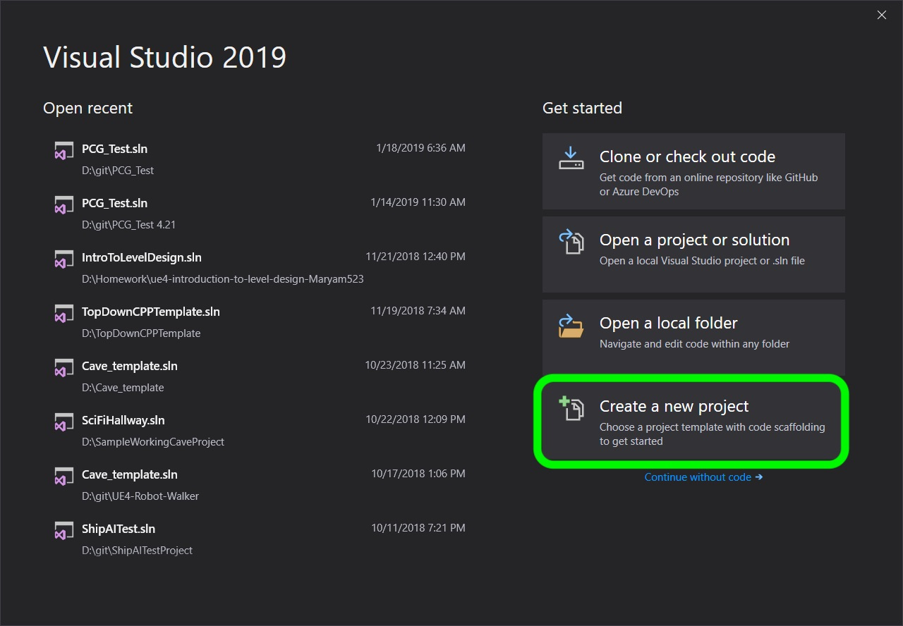  

_____ 


{:start="{{ num }}"}
{{ num }}. Select a **Console App** as we will only be working withing the console.

  

_____ 


{:start="{{ num }}"}
{{ num }}. Name the project and select a location to save it in and press the **Create** button.

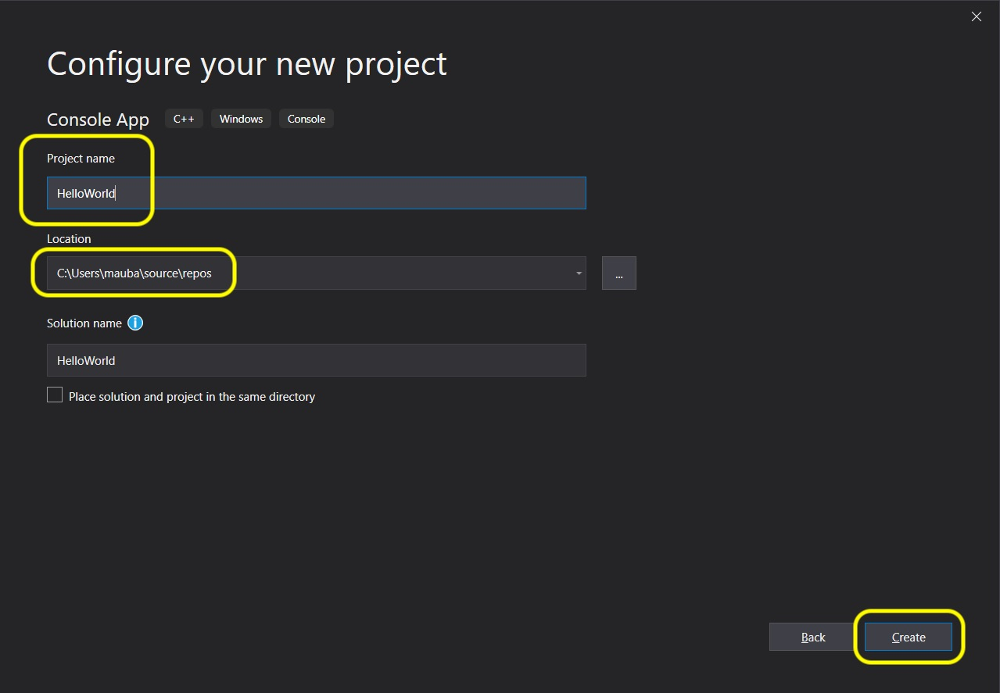  

_____ 


{:start="{{ num }}"}
{{ num }}. You should get a stubbed in project that prints "Hello World" to console.  First lets look at the elements.  We include the `<iostream>` libraries.  This includes the global object `std::cout` that controls the output stream buffer.  This allows us to access the stream that eventually gets sent to the console.   `std` is the namespace that represents the word \'standard\' which are built in **C++** libraries available on all platforms including **Windows** which we are working on now.  `"Hello World\n"` is a string with a new line (`\n`) which gets stored as a single character.  All lines that begin with `//` are comments and are not compiled into the final project.  These are here for you to read and explain to yourself and other developers the intent of what you are trying to do.

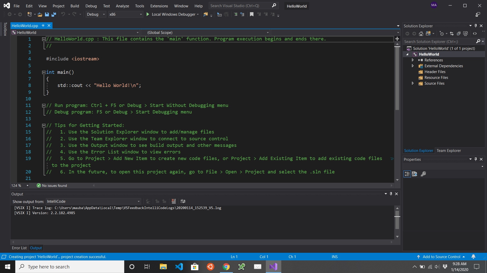  

_____ 



{:start="{{ num }}"}
{{ num }}. Now clean up the comments (everything with a `//` before it).  Now run the game by selecting the run button with `Local Windows Debugger` selected or just press the `F5` button.

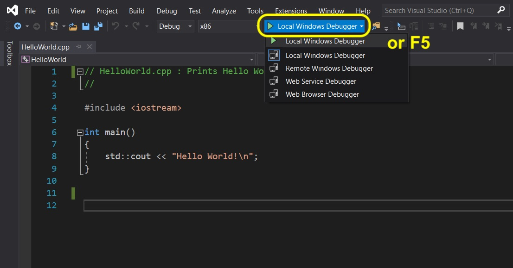  

_____ 



{:start="{{ num }}"}
{{ num }}. So the end result is in the console should look something like:

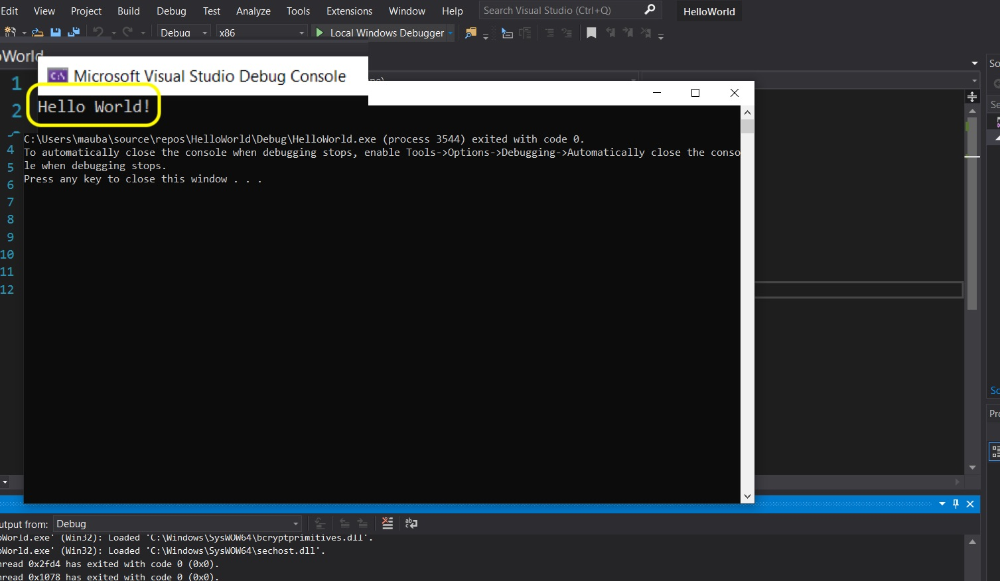  

_____ 



{:start="{{ num }}"}
{{ num }}. There are always more than one way to skin a cat, so we can also call a function called `printf` and pass it the "Hello World" string as a parameter. Run it by pressing the green run button or `F5` and notice that it should have the same end result. Notice that this is in global name space and we did not need to include `std::`.

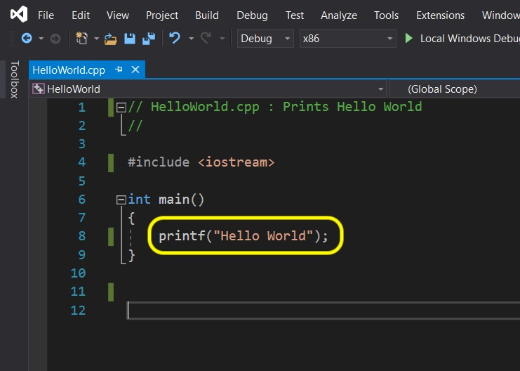 in c++14">  

_____ 



{:start="{{ num }}"}
{{ num }}. Go to a web browser and click on the [link](http://www.cplusplus.com/reference/cstdio/printf/). Notice that it includes a **function** called `printf` (we will explain functions in a future lesson). Without libraries and built in functions, the language is fairly limited.  Anytime we need to do anything specialized for a specific OS and system, we probably need to load a set of libraries.

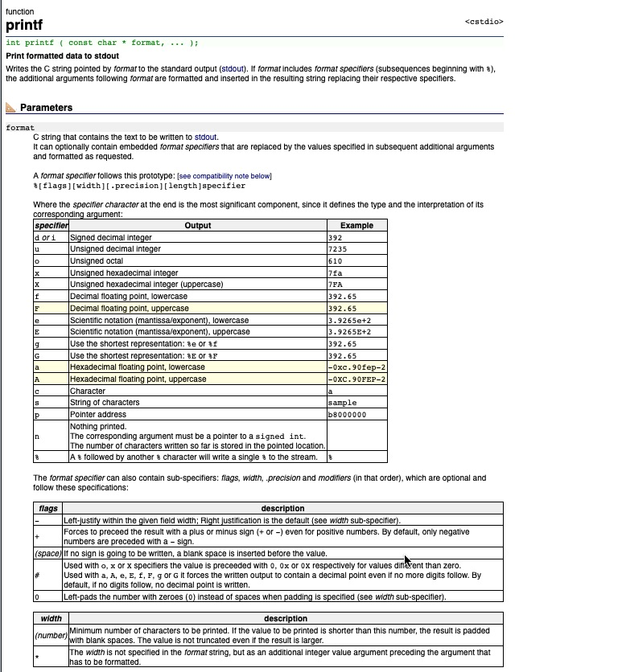  

_____ 



{:start="{{ num }}"}
{{ num }}. Every C++ program starts by calling a function called **main**.  We know if is a function as it is a name followed by **()** parenthesis.  It then runs everything between the following curly braces `{....}`. It executes them in order line by line, 13 through 15 in my case.

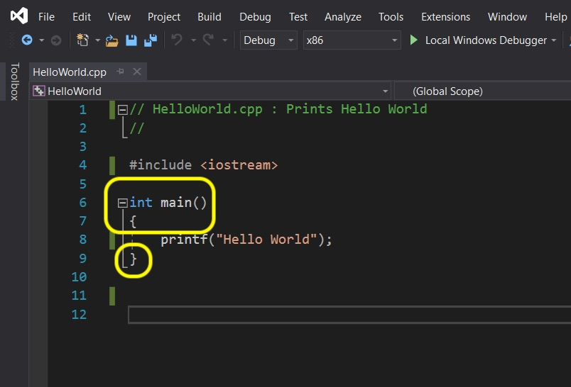  

_____ 



{:start="{{ num }}"}
{{ num }}. So the first thing the program does in **main()** is to run the function `printf` and passes a string parameter of **"Hello World"**. We will get into this more shortly when we dive into strings.

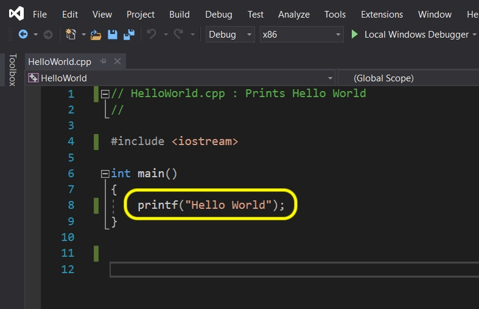  

_____ 



{:start="{{ num }}"}
{{ num }}. What this line does is print the string passed to it to the console.  In this case it prints **Hello World**.

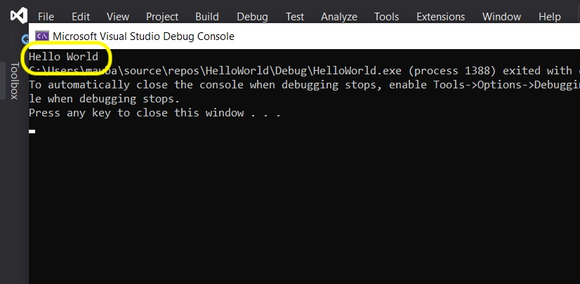  

_____ 



{:start="{{ num }}"}
{{ num }}. It is customary to add `return 0` to the end but should work without it on most platforms.  This function returns to its caller (we don't call it) a 0.  So if the program runs and doesn't crash it should finish with an exit code of 0. Look at the second line of the **Debug Console** window and you will see `exited with code 0`.  This means the program completed without crashing.

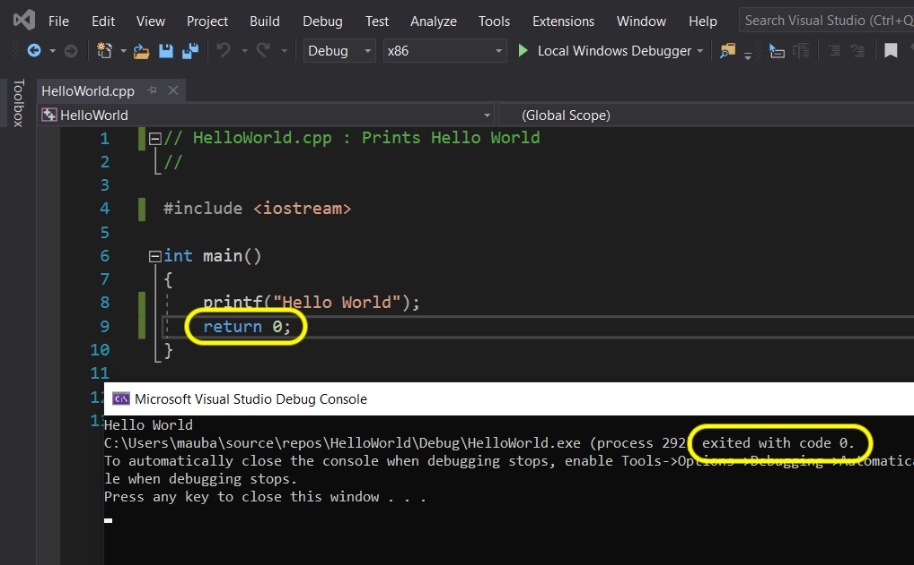  

_____ 



{:start="{{ num }}"}
{{ num }}. When you press run the program is compiled.  What does this mean?  This is the process of going from a human readable form script and creates object code that forms an executable (an .exe on a PC).  So the compiler turns it from words into zeros and ones (machine code).

  

_____ 



{:start="{{ num }}"}
{{ num }}. In Unreal we will be using c style printing like we do here.  But lets go back to printing with `std::cout`. Lets look at the iostream libraries that includes 4 other libraries and gets us access to an **Object** called **std::cout** (standard output). We will be getting into objects later on. But we can call the **Object** `cout` and pipe it into an output stream.

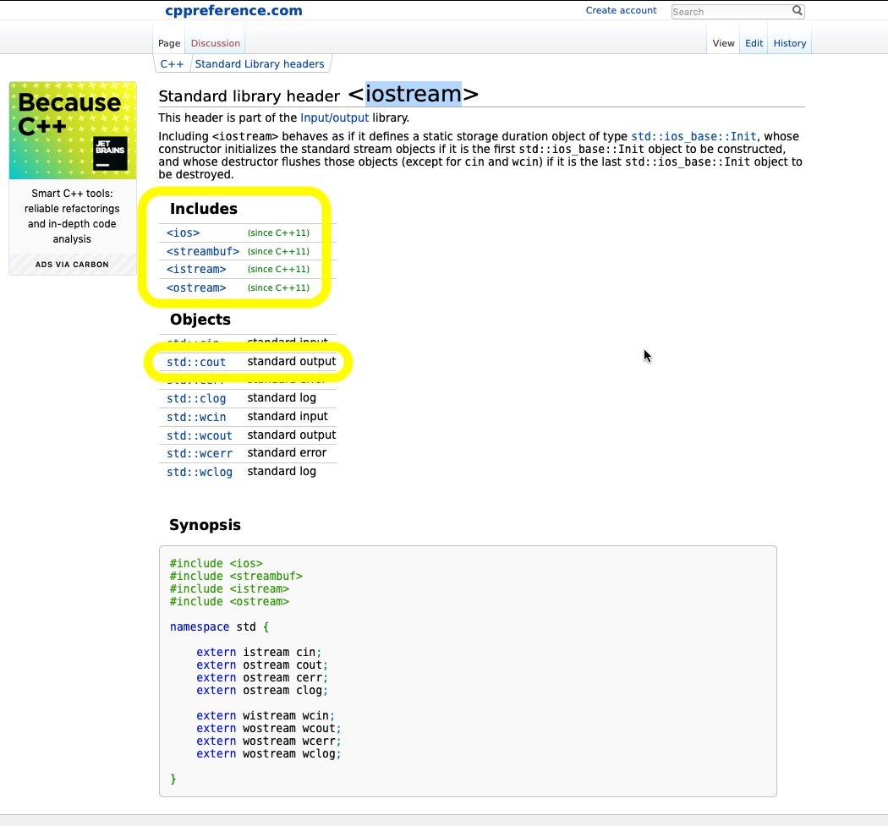">  

_____ 



{:start="{{ num }}"}
{{ num }}. We do this by adding the line `cout << "My name is Marc!";` replacing the call to the **printf()** function.  Press the **Run** button.  One of the thing the compiler does is sends an error intead of running the program. This means it did not compile and create a new executable.  In this case, it shows an error that cout is not in scope and is **undefined**.

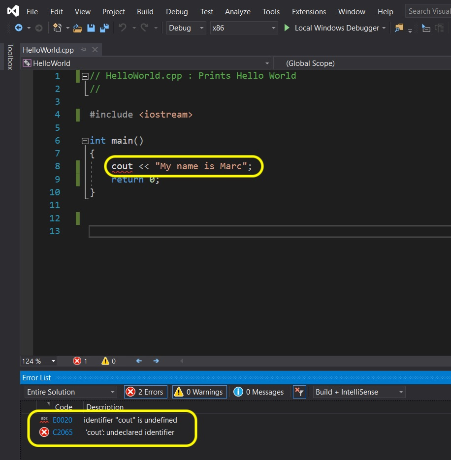  

_____ 



{:start="{{ num }}"}
{{ num }}. Now lets add `std::` before the `cout` so that it will be in scope.  We will go into more detail later on describing this.  Press run and you should see it print the new message we typed. cout is an abbreviation for **character output stream**. Notice that we end the line with a `;` semicolon. Every line is a **statement** and has to be terminated by a semicolon. The compiler needs to know where one statement ends and the next begins.  Now the `<<` operator inserts the data that follows it into an [output stream](http://www.cplusplus.com/doc/tutorial/basic_io/) (which in our case will be the console displayed on the monitor).

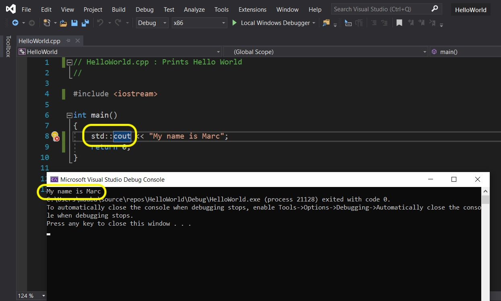  

_____ 



{:start="{{ num }}"}
{{ num }}. If we remove the semi-colon and try and run the program the compiler will give us an error when we press run (when we run it, the program is compiled and it tries to run it).  Try this and read the error.  Sometimes the error messages are clear and sometimes they are hard to read and understand. This is a compiler error.  In a script any spelling mistake or typing error will result in a program error of some sort.

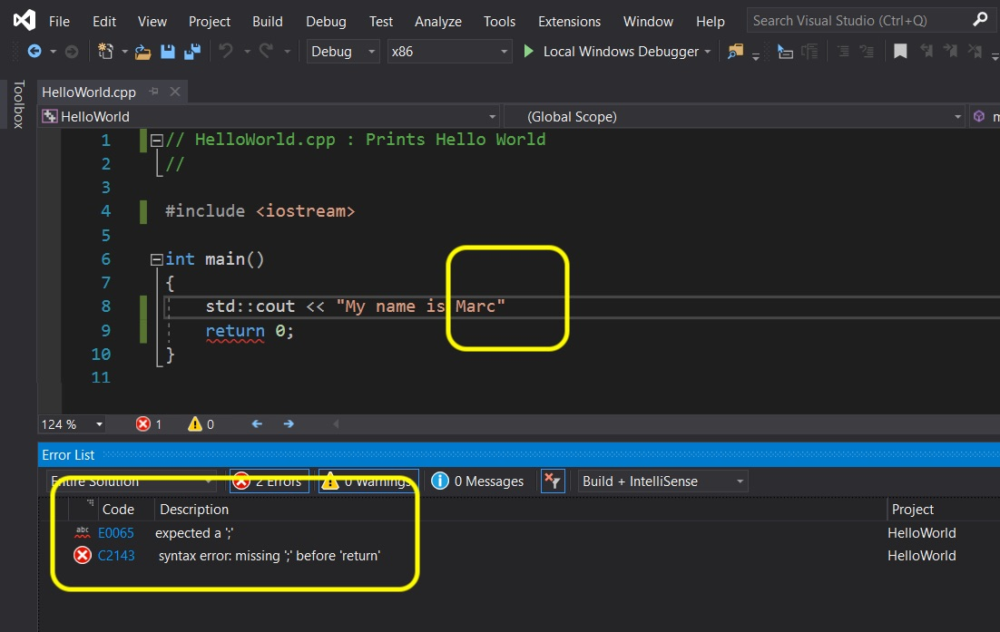  

_____ 



{:start="{{ num }}"}
{{ num }}. Put the semi-colon back and now mispell the file we are including.  This will generate another error saying it can't find the file. It also puts a red squiggly line under the errors.  Notice that since it can't load the libraries `<iostream>` it no longer knows what `std::cout` means and throws a second error.

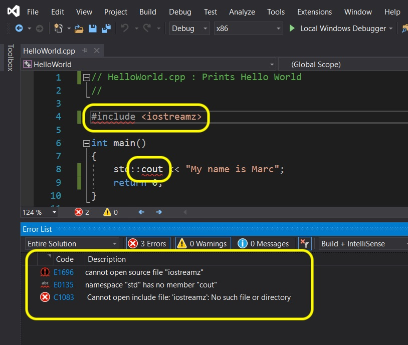  

_____ 



{:start="{{ num }}"}
{{ num }}. Spell `<iostream>` correctly and remove one of the parenthesis from the stream and press run.  Look at the error printed.

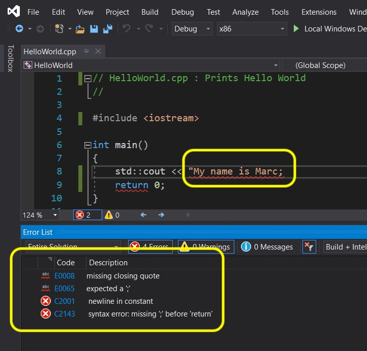  

_____ 



{:start="{{ num }}"}
{{ num }}. Put the parenthesis back and mispell the return type before the funciont `int main()` to `interest main()`.  We will get into functions later on.  This `int` is a data type and we will get into this more on the next page.  Fix the spelling and get the program to compile and run again.

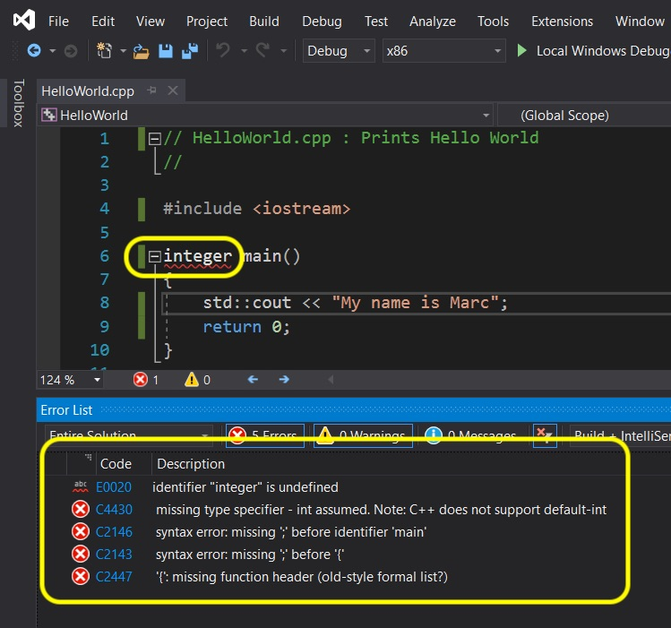  

_____ 

  

[Home](../index.html)&nbsp;&nbsp;&nbsp; [Continue ->](CPP-Overview-2.html)
   
   
   

