# C++ Overview - Page 2
_____ 

## Index
_____ 

* Part I - Streams, variables and integer data type
1. [Hello World](CPP-Overview-1.html#hello-world)
2. [Primitive Data Types](CPP-Overview-2.html#primitive-data-types)
3. [Integer](CPP-Overview-2.html#integer)
4. [Variable](CPP-Overview-2.html#variable)
5. [Operators](CPP-Overview-2.html#operators)
6. [Advanced Operators](CPP-Overview-3.html#advanced-operators)

* Part II - Fractional number data types
1. [Double Data Type](CPP-Overview-3.html#double-data-type)
2. [Float Data Type](CPP-Overview-3.html#float-data-type)

* Part III - Character, String and Boolean types
1. [Char Data Type](CPP-Overview-4.html#char-data-type)
2. [String Data Type](CPP-Overview-4.html#string-data-type)
1. [Boolean Data Type](CPP-Overview-4.html#boolean-data-type)

* Part IV - Digging a little deeper
1. [Assignment Versus Initializing](CPP-Overview-4.html#assignment-versus-initializing)
2. [Type Safety](CPP-Overview-5.html#type-safety)
3. [Order of Operations](CPP-Overview-5.html#order-of-operations)

* Part V - Selection
1. [If Statements](CPP-Overview-6.html#if-statements)
2. [Switch Statements](CPP-Overview-6.html#switch-statements)

* Part VI - Loops (Iteration)
1. [While Loops](CPP-Overview-7.html#while-loops)
2. [For Loops](CPP-Overview-7.html#for-loops)

* Part VII - Scope
1. [Scope](CPP-Overview-7.html#scope)
_____ 


## Primitive Data Types

Information can be read and written from computer memory, that we see as RAM (Random Access Memory).  It needs to read from somewhere in memory.  It reads from a **place** called an **object** which is a region of memory of a specific size that holds information of a data type.

There are [primitive data types](https://www.geeksforgeeks.org/c-data-types/) that can be used natively in C++ without loading other libraries.  Let's look at a few of them.


_____ 


### Integer

[Integers](https://www.mathsisfun.com/whole-numbers.html) are whole numbers without a fractional component.  This can include both negative and positive numbers. How do we read and write to this data type?  We name this object space with a **variable** then assign the variable with the assignment operator `=` a value (such as `2019`).  In a statement, this would look like `year = 2019;`.  We have a varible called `year` and it stores the **integer** `2019`.

How is `42` represented in a computer.  It is represented as a [binary](https://www.computerhope.com/jargon/b/binary.htm) value.  The system we use day to day is the decimal system which is base 10.  We start at 0, got 9 then add a digit 1 then start at 0 again (1, 2, 3, 4, 5, 6, 7, 8, 9, 10 etc..)

Binary is base 2 so it starts at 0 then goes to 1 then adds a digit 1 then goes back to 0.  


| Decimal &nbsp; &nbsp;| Binary &nbsp; &nbsp; &nbsp; &nbsp;|
| ----------| -------------|
| 0 | 0 |
| 1 | 1 | 
| 2 | 10 |
| 3 | 11 |
| 4 | 100 |
| 5 | 101 |

_____ 


<div class = "row">
<div class="col-12 col-lg-4 col align-self-center">
<div markdown = "1">
{:start="{{ num }}"}
{{ num }}. Select **File \| New \| Project**.  Select **Console App** then press the **Next** button.
</div>
</div>
<div class="col-12 col-lg-8">
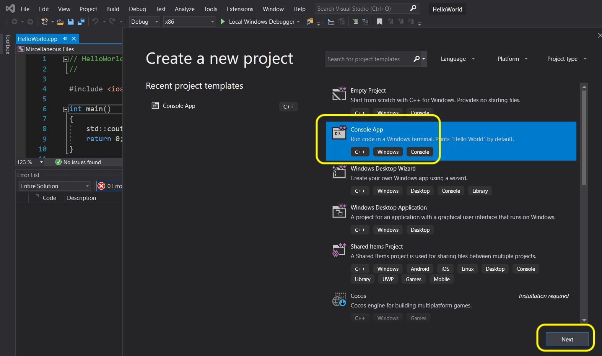  
</div>
</div>
_____ 

<div class = "row">
<div class="col-12 col-lg-4 col align-self-center">
<div markdown = "1">
{:start="{{ num }}"}
{{ num }}. Name the project `PrimitiveDataTypes` and select a location to save it in and press the **Create** button.
</div>
</div>
<div class="col-12 col-lg-8">
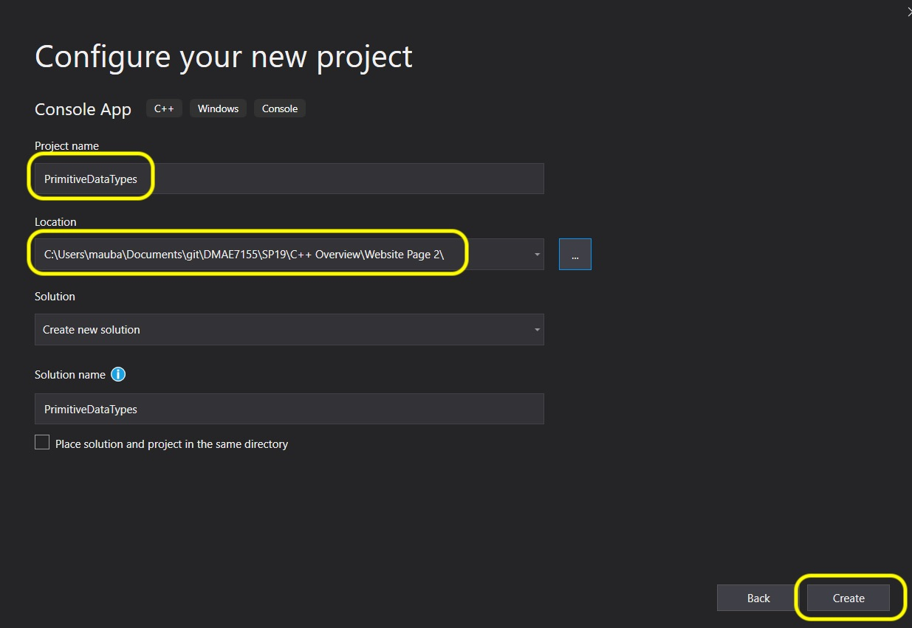  
</div>
</div>
_____ 

<div class = "row">
<div class="col-12 col align-self-center">
<div markdown = "1">
{:start="{{ num }}"}
{{ num }}. Lets add an integer and assign it a number.  Go back to [onlinegdb](https://www.onlinegdb.com) and select **C++ 14**.  Delete all text and type in:

```cpp
/***************************************

Demontrate Primitive Data types

****************************************/


/***************************************

Integer

****************************************/
#include <iostream>

using std::cout;

int main()
{
    // Primitive data type integer;
    int year = 2019;
    cout << year;

    return 0;
}
```
</div>
</div>
</div>

_____ 


<div class = "row">
<div class="col-12 col-lg-4 col align-self-center">
<div markdown = "1">
{:start="{{ num }}"}
{{ num }}. Let's look at this.  We have added a new keyword called `using` on line 8. This allows us to not have to type the namespace of the library we have included (`<iostream>`) with `std::`.  Since we know we will be using ``std::cout`` by stating `using std::cout` allows us to used `cout` without having to type `std::` each time.
<br><br>Then in line 12 we declare the object data type `int` which is short for **integer** and the variable name `year`.  We then assign this a value of `2019` (which is 11111100011 in binary!).
<br><br>We then add to the output stream the contents of this integer in cout (just like we did the string).  `cout` is able to translate the contents of this memory from binary back to the decimal system.  Press run and you should see the interger we set being output to the monitor:
</div>
</div>
<div class="col-12 col-lg-8">
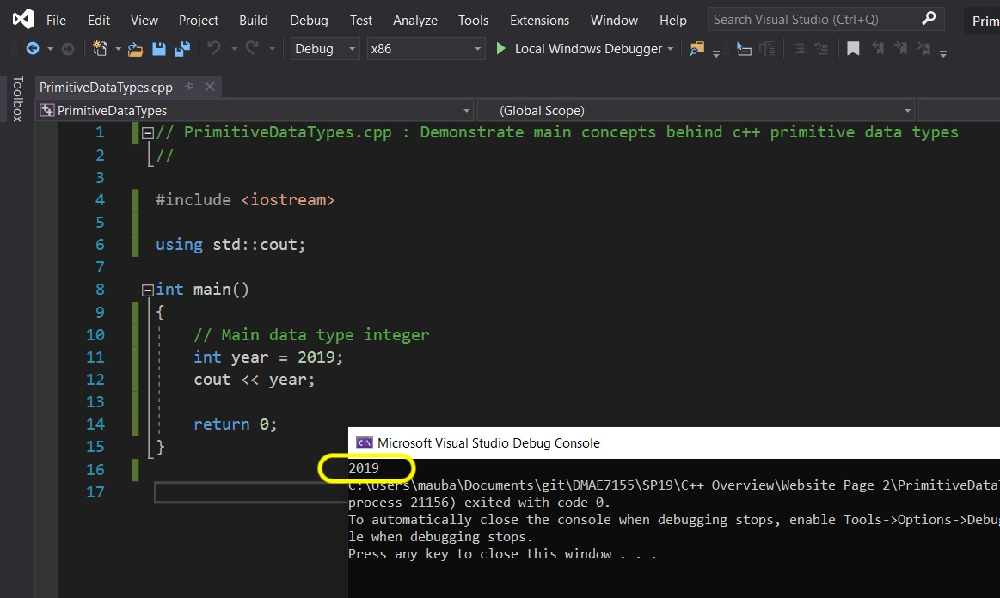  
</div>
</div>

_____ 


### Variable
[Variable](https://mathbits.com/MathBits/CompSci/DataBasics/naming.htm) names in C++ must use the following rules:

* A variable cannot have spaces (but you can use underscore).
* The name cannot start with a number
* It can be up to 255 characters long
* It is caps sensitive, so `a` is different from `A`

Now each team uses a coding style so that makes it easier to work as a group.  In Unreal their [coding standards](https://docs.unrealengine.com/en-us/Programming/Development/CodingStandard) say:

> The first letter of each word in a name (such as type name or variable name) is capitalized, and there is usually no underscore between words. For example, Health and UPrimitiveComponent are correct, but not lastMouseCoordinates or delta_coordinates. - [Unreal Manual](https://docs.unrealengine.com/en-us/Programming/Development/CodingStandard#namingconventions)

_____ 

<div class = "row">
<div class="col-12 col-lg-4 col align-self-center">
<div markdown = "1">
{:start="{{ num }}"}
{{ num }}. Lets change the program we have to match their coding standards. Press run and we notice that there is an error.
</div>
</div>
<div class="col-12 col-lg-8">
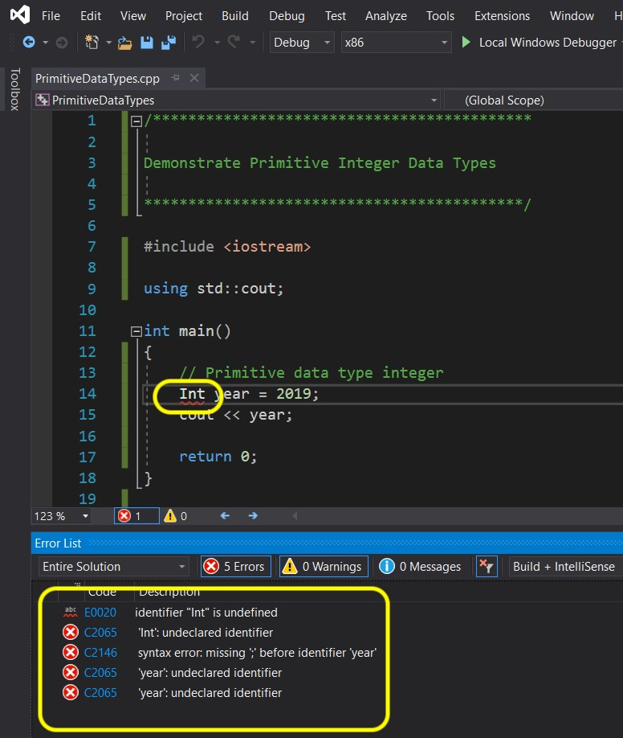  
</div>
</div>

_____ 


<div class = "row">
<div class="col-12 col-lg-4 col align-self-center">
<div markdown = "1">
{:start="{{ num }}"}
{{ num }}. The compiler doesn't let us capitalize the data type.  You will see when we start programming in Unreal that they have declared their own data types.  Their data types start with capital letters.
<br><br>So change `Int` to `int` and it should run just like before. We will look at `Int` when we move to programming in **Unreal**.
</div>
</div>
<div class="col-12 col-lg-8">
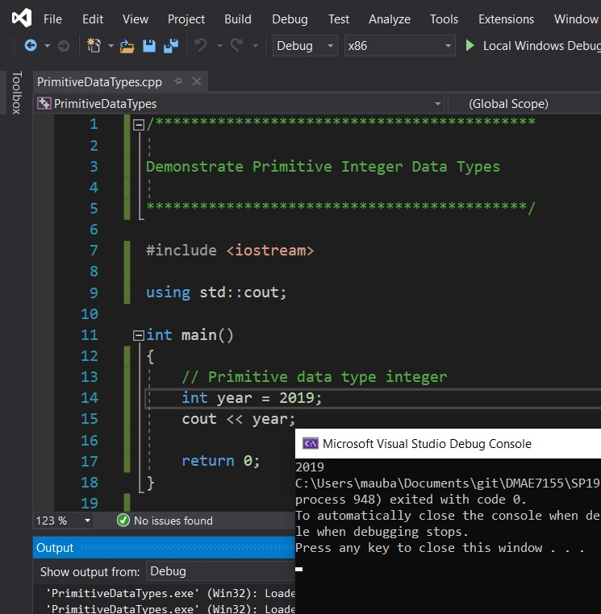  
</div>
</div>

_____ 


<div class = "row">
<div class="col-12 col-lg-4 col align-self-center">
<div markdown = "1">
{:start="{{ num }}"}
{{ num }}. What happens if we try and assign a fractional number to an integer?  Does it compile.  Add a faction and press run and see what happens?
</div>
</div>
<div class="col-12 col-lg-8">
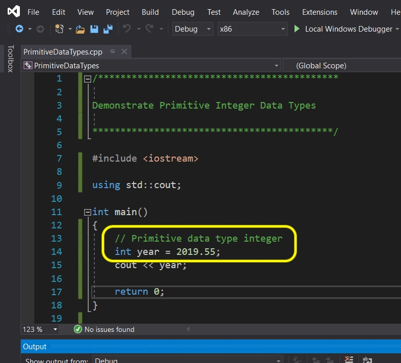  
</div>
</div>

_____ 


<div class = "row">
<div class="col-12 col align-self-center">
<div markdown = "1">
{:start="{{ num }}"}
{{ num }}. <button class="btn btn-primary" type="button" data-toggle="collapse" data-target="#collapse-console" aria-expanded="false" aria-controls="collapse-console">
    See Console Solution
  </button>
<div class="collapse" id="collapse-console">
  <div class="card card-body">
    The compiler casts the fractional double (double floating point number) to an integer and ignores the fractional portion.  Be careful, because if that fractional value is important an integer is the wrong data type to store it in.  This data will be lost.  We will look at doubles and floats, that are used to store fractional numbers, shortly.<br><br>
    <div class="col-12 col-lg-8">
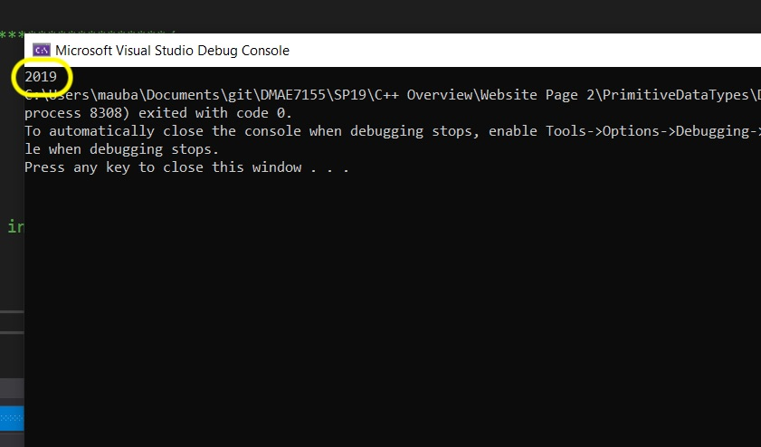  
</div>
  </div>
</div>

</div>
</div>
</div>

_____ 
### Operators

We can also use [operators](https://www.geeksforgeeks.org/operators-c-c/) to affect these numbers.  The most common are `+`, `-`, `*` (multiply), `/` (divide).  So lets change the code to:

```cpp
/***************************************

Demontrate Primitive Data types

****************************************/


/***************************************

Integer

****************************************/

#include <iostream>

using std::cout;

int main()
{
    // Operator +
    int Year = 2019 + 1;
    cout << "Next year is: ";
    cout << Year;
    

    return 0;
}

```


<div class = "row">
<div class="col-12 col-lg-4 col align-self-center">
<div markdown = "1">
{:start="{{ num }}"}
{{ num }}. Run the game and you should now see that it adds **1** to **2019** and we should output **2020**.  Now we have output a **string literal** (a data type that holds letters) and then output the contents of the `Year` variable.  It concatonates the string and the integer into a single line.  
</div>
</div>
<div class="col-12 col-lg-8">
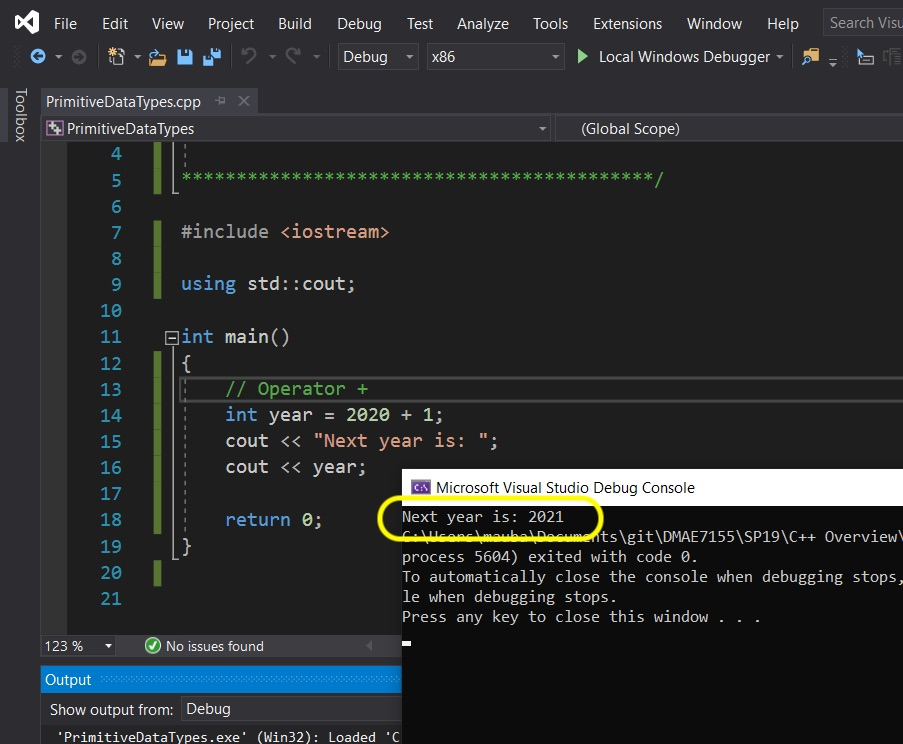  
</div>
</div>

_____ 


<div class = "row">
<div class="col-12 col align-self-center">
<div markdown = "1">
{:start="{{ num }}"}
{{ num }}. OK, now lets also add a subtraction and make a few changes.  Alter the contents of `main()` to:

```cpp
    // Year holds the a 4 digit calendar year
    int Year = 2019 + 1;
    
    // Operator +
    cout << "Next year is: " << Year;
    
    // Output 10 years ago
    Year = 2020 - 10;
    cout << "10 years ago the year was: " << Year;
```
</div>
</div>
</div>

_____ 


<div class = "row">
<div class="col-12 col-lg-4 col align-self-center">
<div markdown = "1">
{:start="{{ num }}"}
{{ num }}. Lets look at line **12**.  We added a comment using `//` before we declared the variable.  It is best practice to describe what the variable does and holds outside of its literal english meaning.  Here I describe what the integer represents in our program.  
<br><br>Also on line 16 you see that I changed two `cout` lines into one. You can chain the output operator `<<` and have as many as you need in a single **statement**.

```cpp
cout << "Next year is: " ;
cout << Year;
```
is changed to:

```cpp
cout <<"Next year is: " << Year;
```

We also subtracted `10` from the year and printed a second message.  When you press the **Run** button, you will notice that it prints it all on one line.
</div>
</div>
<div class="col-12 col-lg-8">
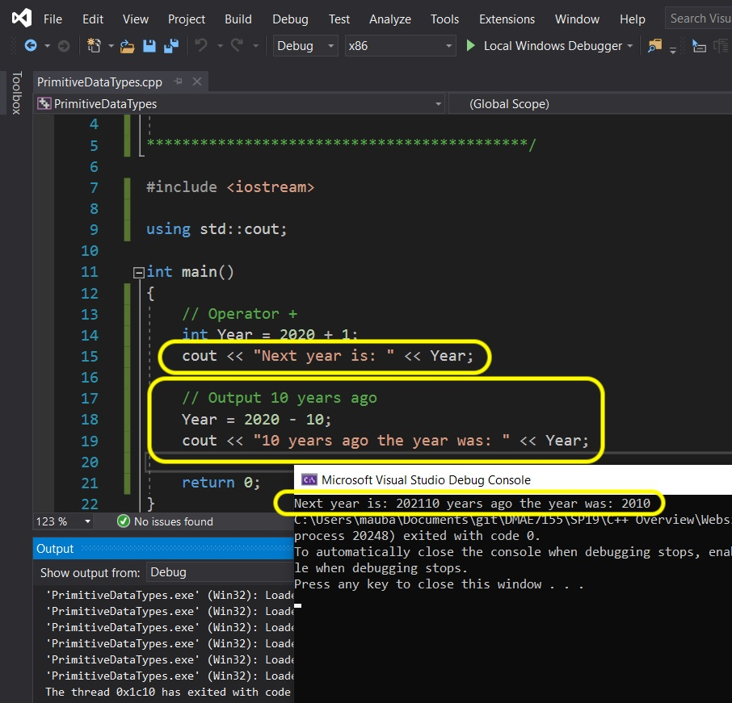  
</div>
</div>

_____ 


<div class = "row">
<div class="col-12 col-lg-4 col align-self-center">
<div markdown = "1">
{:start="{{ num }}"}
{{ num }}. So we would like to print these sentences on two lines.  We need a line break.  There is are special **[escape sequences](https://en.cppreference.com/w/cpp/language/escape)**.  We will be using `\n` (with a backlash NOT a forward slash) which will add a newline to output stream.  This will not print but will add a carriage return.  Try changing **line 16** and add to the stream a `"\n"` to put a carriage return between the two sentences.<br><br> Press the run button and now you can see that it is easier to read and more what I intended to show.


</div>
</div>
<div class="col-12 col-lg-8">
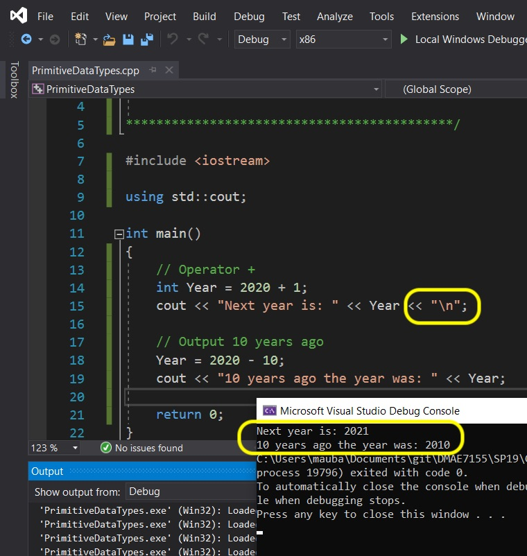  
</div>
</div>

_____ 


<div class = "row">
<div class="col-12 col align-self-center">
<div markdown = "1">
{:start="{{ num }}"}
{{ num }}. Change and add the following:

```cpp
    // Output year 10 years ago
    Year = 2020 - 10;
    cout << "10 years ago the year was: " << Year << "\n";
    
    // Output half of this Year
    Year = 2020 / 2;
    cout << "Half of this year is: " << Year << "\n";
    
    // Output twice this Year
    Year = 2020 * 2;
    cout << "Twice times this year is: " << Year << "\n";
    
```
</div>
</div>
</div>

_____ 


<div class = "row">
<div class="col-12 col-lg-4 col align-self-center">
<div markdown = "1">
{:start="{{ num }}"}
{{ num }}. Press the **Play** button and look at the output.  Fix any errors you might have.  Notice that the divide by two drops the fraction (**2019** divided by **2** would be **1009.5**).  Again, the **integer** variable is ignoring the fractional part of the arithmatic.<br><br>Next up more advanced operators.
</div>
</div>
<div class="col-12 col-lg-8">
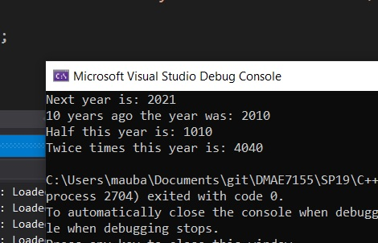  
</div>
</div>

_____ 

<br><br>

[<- Previous](CPP-Overview-1.html)&nbsp;&nbsp;&nbsp;[Home](../index.html)&nbsp;&nbsp;&nbsp; [Continue ->](CPP-Overview-3.html)
<br />  
<br />  
<br />  

