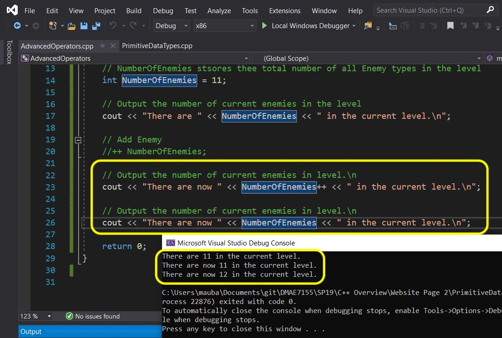
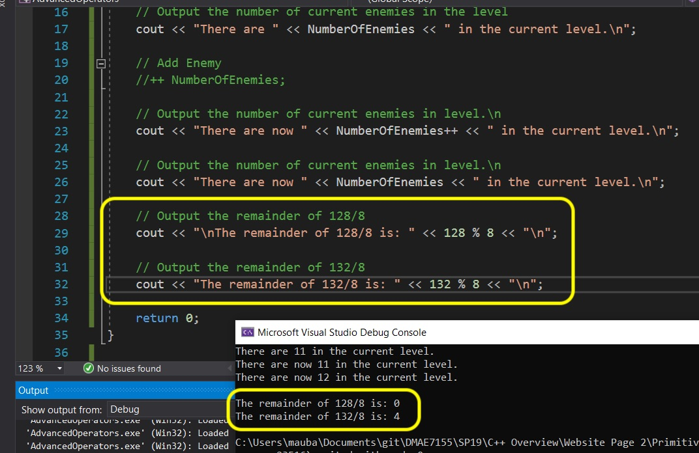

# C++ Overview - Page 3
_____ 

## Index
_____ 

* Part I - Streams, variables and integer data type
1. [Hello World](CPP-Overview-1.html#hello-world)
2. [Primitive Data Types](CPP-Overview-2.html#primitive-data-types)
3. [Integer](CPP-Overview-2.html#integer)
4. [Variable](CPP-Overview-2.html#variable)
5. [Operators](CPP-Overview-2.html#operators)
6. [Advanced Operators](CPP-Overview-3.html#advanced-operators)

* Part II - Fractional number data types
1. [Double Data Type](CPP-Overview-3.html#double-data-type)
2. [Float Data Type](CPP-Overview-3.html#float-data-type)

* Part III - Character, String and Boolean types
1. [Char Data Type](CPP-Overview-4.html#char-data-type)
2. [String Data Type](CPP-Overview-4.html#string-data-type)
1. [Boolean Data Type](CPP-Overview-4.html#boolean-data-type)

* Part IV - Digging a little deeper
1. [Assignment Versus Initializing](CPP-Overview-4.html#assignment-versus-initializing)
2. [Type Safety](CPP-Overview-5.html#type-safety)
3. [Order of Operations](CPP-Overview-5.html#order-of-operations)

* Part V - Selection
1. [If Statements](CPP-Overview-6.html#if-statements)
2. [Switch Statements](CPP-Overview-6.html#switch-statements)

* Part VI - Loops (Iteration)
1. [While Loops](CPP-Overview-7.html#while-loops)
2. [For Loops](CPP-Overview-7.html#for-loops)

* Part VII - Scope
1. [Scope](CPP-Overview-7.html#scope)

_____ 

## Advanced Operators
We will look at some more [operators](https://www.geeksforgeeks.org/operators-c-c/) that are commonly used with `++` and `--` incrementers.  We will also look at `+=`, `*=`, `/=` and `-=` that takes the existing value and performs the operation on its existing value.  We will then finally look at remainder `%` which carries the remainder of a division.

_____ 


<div class = "row">
<div class="col-12 col-lg-4 col align-self-center">
<div markdown = "1">
{:start="{{ num }}"}
{{ num }}. Now lets start a new project but we want to stay in the same solution.  We can have multiple projects in a single solution and switch between them.  Right lick on the upper most file in the **Solution Explorer** and select **Add \| New Project**:
</div>
</div>
<div class="col-12 col-lg-8">
  
</div>
</div>
_____ 


<div class = "row">
<div class="col-12 col-lg-4 col align-self-center">
<div markdown = "1">
{:start="{{ num }}"}
{{ num }}. Select **Console App** and press the **Next** button.
</div>
</div>
<div class="col-12 col-lg-8">
  
</div>
</div>
_____ 


<div class = "row">
<div class="col-12 col-lg-4 col align-self-center">
<div markdown = "1">
{:start="{{ num }}"}
{{ num }}. Name the project `AdvancedOperators` and leave the **Location** the same.  Press the **Create** button:
</div>
</div>
<div class="col-12 col-lg-8">
  
</div>
</div>
_____ 


<div class = "row">
<div class="col-12 col-lg-4 col align-self-center">
<div markdown = "1">
{:start="{{ num }}"}
{{ num }}. You should now have a seperate project folder with a seperate `main()` function in the new `AdvancedOperators.cpp` file.  Select it in the **Solution Explorer** window like so:
</div>
</div>
<div class="col-12 col-lg-8">
  
</div>
</div>
_____ 


<div class = "row">
<div class="col-12 col align-self-center">
<div markdown = "1">
{:start="{{ num }}"}
{{ num }}. One of the more common uses for integers in games is to store the the number of of game objects (like number of ork enemies).  We often need to decriment or increment by 1.  So lets look at creating a variable called `NumberOfEnemies` that we will use to track enemies and initialize this variable to `11`.  
<br><br>We then want to add `1` to it.  The easiest way is to add one to the existing value.  We would do it this way.   Add to the new project the following code:

```cpp
/******************************************************************************

Demontrate Advanced Operators

*******************************************************************************/
#include <iostream>

using std::cout;

int main()
{
    // NumberOfEnemies stores the total number of all enemy types in a level
    int NumberOfEnemies = 11;
    
    // Output the number of current enemies in level
    cout << "There are " << NumberOfEnemies << " in the current level.\n";
    
    // Add enemy
    NumberOfEnemies = NumberOfEnemies + 1;

    // Output the number of current enemies in level
    cout << "There are now " << NumberOfEnemies << " in the current level.\n";
    
    return 0;
}
```
</div>
</div>
</div>

_____ 

<div class = "row">
<div class="col-12 col-lg-4 col align-self-center">
<div markdown = "1">
{:start="{{ num }}"}
{{ num }}. Press the run button and you will see the result.  Now the problem is that it is running our old project.  It is not running the new one as you can see.
</div>
</div>
<div class="col-12 col-lg-8">
  
</div>
</div>

____ 

<div class = "row">
<div class="col-12 col-lg-4 col align-self-center">
<div markdown = "1">
{:start="{{ num }}"}
{{ num }}. Right click on the **Soution Explorer** the **Advanced Operators** folder and select `Set as StartUp Project`:
</div>
</div>
<div class="col-12 col-lg-8">
  
</div>
</div>

____ 


<div class = "row">
<div class="col-12 col-lg-4 col align-self-center">
<div markdown = "1">
{:start="{{ num }}"}
{{ num }}. Press the run button and you will see the result now running this second project inside the same solution.  The number of enemies gets incremented by 1.  If you do not have the same result fix any issues with your script.
</div>
</div>
<div class="col-12 col-lg-8">
  
</div>
</div>

____ 


<div class = "row">
<div class="col-12 col-lg-4 col align-self-center">
<div markdown = "1">
{:start="{{ num }}"}
{{ num }}. Now we can accomplish the same result in a more compact for with the `+=` assignment operator.  Change line 19 from `NumberOfEnemies = NumberOfEnemies + 1;` to `NumberOfEnemies += 1;`.

> “+=”:This operator is combination of ‘+’ and ‘=’ operators. This operator first adds the current value of the variable on left to the value on right and then assigns the result to the variable on the left. - [geeksforgeeks.org](https://www.geeksforgeeks.org/assignment-operators-in-c-c/)

Press the run button and you will notice that this produces the exact same result in a terser form.

</div>
</div>
<div class="col-12 col-lg-8">
  
</div>
</div>

_____ 


<div class = "row">
<div class="col-12 col-lg-4 col align-self-center">
<div markdown = "1">
{:start="{{ num }}"}
{{ num }}. Now since we are incrementing by 1 we have an even quicker way of representing this increment. We can use the unary operator `++` or `--` which will increment by or decriment by 1 (cannot adjust this, it can only be by one, mostly for used for counters). Change `NumberOfEnemies += 1;` to `NumberOfEnemies++`  

> Unary Operators: Operators that operates or works with a single operand are unary operators. - [geeksforgeeks.org](https://www.geeksforgeeks.org/assignment-operators-in-c-c/)

Press the **Run** button and again, no difference, but another way of reprenting the same logic in its most terse form:<br><br>

</div>
</div>
<div class="col-12 col-lg-8">
  
</div>
</div>

_____ 


<div class = "row">
<div class="col-12 col-lg-4 col align-self-center">
<div markdown = "1">
{:start="{{ num }}"}
{{ num }}. Now C++ can be tricky. And one of the tricky things about this unary operator is that it can also be placed before the variable name.  Change `NumberOfEnemies++` to `++NumberOfEnemies`. Press run and notice if there is any difference.
</div>
</div>
<div class="col-12 col-lg-8">
  
</div>
</div>

_____ 


<div class = "row">
<div class="col-12 col-lg-4 col align-self-center">
<div markdown = "1">
{:start="{{ num }}"}
{{ num }}. So it looks the same, and in the above arrangement it looks like it doing exaclty the same thing.  There is a difference though.  When `++` is placed before the variable name it is a **pre-increment unary operator** and if placed after is a **post-increment unary operator**.  <br><br>Let's comment out **line 20** (adding **1** to the enemy) and change the `cout` to increment in place in the stream: `cout << "There are " << NumberOfEnemies++ << " in the current level.\n";`<br><br>Now press the **Run** button.  Look at the console and you will notice that it doesn't update the `NumberOfEnemies` variables in the output stream.
</div>
</div>
<div class="col-12 col-lg-8">
  
</div>
</div>

_____ 


<div class = "row">
<div class="col-12 col-lg-4 col align-self-center">
<div markdown = "1">
{:start="{{ num }}"}
{{ num }}. Change line 19 to a **pre-increment unary operator** changing it to `cout << "There are " << ++NumberOfEnemies << " in the current level.\n";`.<br><br>Press the **Run** button and now you will see that it shows the increment.
</div>
</div>
<div class="col-12 col-lg-8">
  
</div>
</div>

_____ 


<div class = "row">
<div class="col-12 col-lg-4 col align-self-center">
<div markdown = "1">
{:start="{{ num }}"}
{{ num }}. So what is going on?<br><br>We saw that before adding `++` at the end of a variable name did increment it.  The difference is that `++NumberOfEnemies` increments the variable right away **within the statement** and `NumberOfEnemies++` increments it at the **end** of the statement.  <br><br>Lets prove this.  Change it back to a post-increment operator then print the same variable again on a new line after it has finished the statement. <br><br>In this case when you press run the first time it shows the old value of `11` but the next line (after the semi-colon) in increments by one.
</div>
</div>
<div class="col-12 col-lg-8">
  
</div>
</div>

_____ 


<div class = "row">
<div class="col-12 col-lg-4 col align-self-center">
<div markdown = "1">
{:start="{{ num }}"}
{{ num }}. Now lets finally take a look at one more advance operator.  This is the `%` remainder value.  Lets say we divide `128 / 8`.  Eight goes into one hundred and twenty eight **16** times with a remainder of **0**.  If we look at `132 / 8`.  Eight goes into one hundred and twenty eight **16** times with a remainder of **4**.  The % times gives us the remainder of the division.  Lets see it in action.  

</div>
</div>
<div class="col-12 col-lg-8">
  
</div>
</div>

_____ 

## Double Data Type
We are going to introduce a new data type called [double](https://www.geeksforgeeks.org/c-data-types/).
> Double Floating Point: Double Floating Point data type is used for storing double precision floating point values or decimal values. Keyword used for double floating point data type is double. Double variables typically requires 8 bytes of memory space. - [geeksforgeeks.org](https://www.geeksforgeeks.org/c-data-types/)

Notice that it says **typically**.  It is very important to understand that different platforms may have different sizes for the same named data types.  Always make sure you test your assumptions on ALL platforms you want to support.

What does 8 bytes mean?  A **byte** is 8 **bits**.  A bit is a single binary value (can be either `0` or `1`).  So if we have one **byte** it can store 8 **bits**.  So what does this mean in decimals?  We need to look at 2 to the power of 8 (2 ^ 8 or 2\*2\*2\*2\*2\*2\*2\*2).  Type `2 ^ 8` in a calculator and you will see that is **256**.  So a byte can hold an **integer** value of a number with **256** discrete values.  Now since 0 counts as a number a byte can hold any integer from `0` to `255`.  Why **255**?  Because 0 counts as a value.  We we have 256 discrete values.

So a double uses one bit for the sign (positive or negative), 11 bits for the exponent and 52 bits for the value (8 bytes =  8 \* 8 bits = 64 bits ).  Add a new project to the existing solution, call it `DoubleType` and add the following code to it:

```
/******************************************************************************

Demontrate Double Type

*******************************************************************************/
#include <iostream>

using std::cout;

int main()
{
    // Chance of rain on a given day with a double precision float ranging from 0 to 100
    double PercentChanceOfRain = 33.89998899;
    
    // Output the chance of rain today
    cout << "There is a " << PercentChanceOfRain << "% chance of rain today.\n";
    
    return 0;
}
```

_____ 


<div class = "row">
<div class="col-12 col-lg-4 col align-self-center">
<div markdown = "1">
{:start="{{ num }}"}
{{ num }}. Press the **run** button and check the result.  It has rounded up our double when it sent it to the output stream. Notice that it is rounding up the number to a single decimal point.  
</div>
</div>
<div class="col-12 col-lg-8">
  
</div>
</div>

_____ 


<div class = "row">
<div class="col-12 col-lg-4 col align-self-center">
<div markdown = "1">
{:start="{{ num }}"}
{{ num }}. Now based on the size of the double on my computer how many decimal places can it store and how do I display the entire number?<br><br>  It can store only so many digits in front and after the decimal point.  We can include the `<limits>` library to see how many total **base 10** digits this can hold.  Add to the after the first `include` `#include <limits>` then add `cout << "A double has a precision of " << std::numeric_limits< double >::max_digits10 << " digits.";` to the bottom of the script before the `return` statement.<br><br>Notice that it says it can store 17 digits (this includes what is before and after the decimal point).
</div>
</div>
<div class="col-12 col-lg-8">
 class to show how many digits a double can store in a C++14 program">  
</div>
</div>

_____ 


<div class = "row">
<div class="col-12 col-lg-4 col align-self-center">
<div markdown = "1">
{:start="{{ num }}"}
{{ num }}. So we can now set the precision of cout as this class (we will get into classes later) has a function (we will also cover functions later) called `precision`.  We can pass it the integer `17`.  This sets the display to showing us 17 digits in base 10.  Add before we do anything add `cout.precision(17);` with an appropriate comment.  Then change the value to contain 17 digits. I used `12.345678911234567` so I could easily keep track of the number of total digits.<br><br>Now run the program and you will notice that it now shows all 17 digits and there is a precision error on the final digit on my computer showing a 5 instead of a 7.  It is important to remember that floating point numbers will have some precision errors near the end based on how it is stored in memory. These precision errors might be platform specific and be different on different targets.
</div>
</div>
<div class="col-12 col-lg-8">
  
</div>
</div>

_____ 


<div class = "row">
<div class="col-12 col-lg-4 col align-self-center">
<div markdown = "1">
{:start="{{ num }}"}
{{ num }}. Lets confirm that the double on your computer is only using 8 bytes.  We can use the function `sizeof()` to get the size in **bytes** of the **data type**.  Add to the bottom `cout << "Size of double : " << sizeof(double)  << " bytes" << "\n"; ` press start and see what you get?
</div>
</div>
<div class="col-12 col-lg-8">
  
</div>
</div>

_____ 

## Float Data Type
We are going to introduce a new data type called [float](https://www.geeksforgeeks.org/c-data-types/).
> Floating Point: Floating Point data type is used for storing single precision floating point values or decimal values. Keyword used for floating point data type is float. Float variables typically requires 4 byte of memory space. - [geeksforgeeks.org](https://www.geeksforgeeks.org/c-data-types/)

Notice that it says **typically**.  It is very important to understand that different platforms may have different sizes for the same named data types.  

Now when do we use floats and when do we use doubles?  In games audio samples tend to use floats and in 3-D our points are usually stored in floats as well in **x, y, z Space** as there are so many of them.  The increase in precision is not offset by the huge size increase in RAM.  So floats are used when possible in games.

Lets give it a shot.  Add another project to this solution called `Float` and set it as your target. Add the following: 

```cpp
/******************************************************************************

Demontrate Float Type

*******************************************************************************/
#include <iostream>
#include <limits>

using std::cout;


int main()
{
    // Set precision of cout for floats
    cout.precision(9);
    
    // Chance of rain on a given day with a float ranging from 0 to 100
    float X = 12.3456789f;
    
    // Output the chance of rain today
    cout << "The object's x value is: " << X << "\n";
    
    cout << "A float has a precision of " 
         << std::numeric_limits<float>::max_digits10 << " digits.\n";
    
    cout << "Size of float: " << sizeof(float)  << " bytes" << "\n"; 
       
    return 0;
}
```

_____ 


<div class = "row">
<div class="col-12 col-lg-4 col align-self-center">
<div markdown = "1">
{:start="{{ num }}"}
{{ num }}. Notice that for **integers** we just enter a whole number (it ignores the fractional portion).  For **doubles** we enter a frational number.  For **floats** we need to tell the compiler that we want to use a **float** and not convert from a **double** to a **float**.  To do this, type `f` at the end of the number to indicate that this is a float.  Notice that the precision is **9** digits for a **4** byte float.  See if it is the same on your computer? See if the precision error is different on your computer?

</div>
</div>
<div class="col-12 col-lg-8">
  
</div>
</div>

_____ 


<div class = "row">
<div class="col-12 col align-self-center">
<div markdown = "1">
{:start="{{ num }}"}
{{ num }}. Be very careful when entering numbers.  Try to use whole numbers for integers, decimals for doubles (so `2.0` instead of `2`) and decimals with an `f` at the end for float (so `2.0f` instead of `2` or `2.0`).  Here is why.  Lets set a **float** to divide a number that should return a fractional result.  

```cpp
    cout << "A float has a precision of " 
         << std::numeric_limits<float>::max_digits10 << " digits.\n";
    
    cout << "Size of float: " << sizeof(float)  << " bytes" << "\n"; 

    // Float errors
	float F = 9/2;
	cout << "\n9/2 is: " << F << "\n\n";
       
    return 0;
}
```

</div>
</div>
</div>

_____ 


<div class = "row">
<div class="col-12 col-lg-4 col align-self-center">
<div markdown = "1">
{:start="{{ num }}"}
{{ num }}. Now since the variable `F` is of type float we would think that dividing `9 / 2` would return `4.5`.  But it doesn't.<br><br>The compiler reads this as setting `float F` to the result of dividing **integer** `9` by **integer** `2` which is **4**.

</div>
</div>
<div class="col-12 col-lg-8">
  
</div>
</div>

_____ 


<div class = "row">
<div class="col-12 col-lg-4 col align-self-center">
<div markdown = "1">
{:start="{{ num }}"}
{{ num }}. All we need to do is change one value to a **float** and it gives us the answer we expect. Please note that `9.0f` and `9.f` are the same thing to the compiler. Typing `9f` will give you a compile error (try it!). <br><br>Next up we will look at characters and strings.

</div>
</div>
<div class="col-12 col-lg-8">
  
</div>
</div>

_____ 


<br><br>

[<- Previous](CPP-Overview-2.html)&nbsp;&nbsp;&nbsp;[Home](../index.html)&nbsp;&nbsp;&nbsp; [Continue ->](CPP-Overview-4.html)
<br />  
<br />  
<br />  

