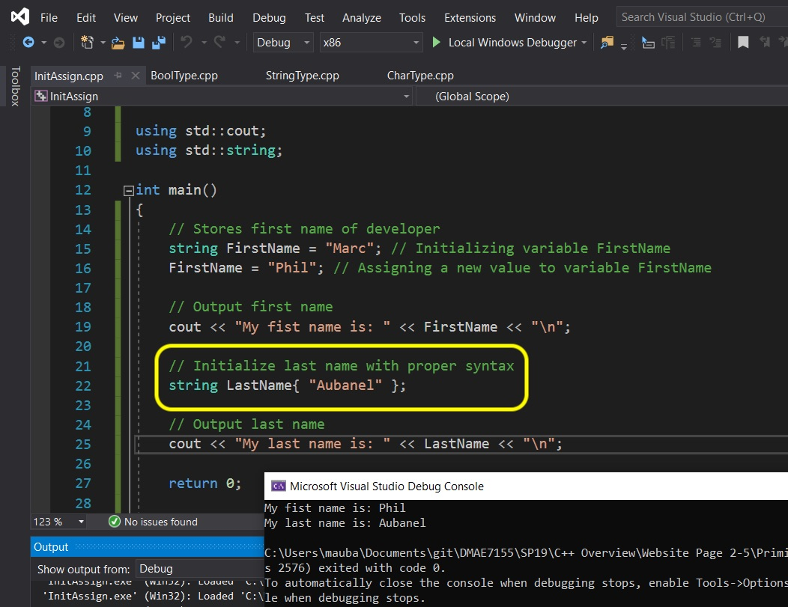
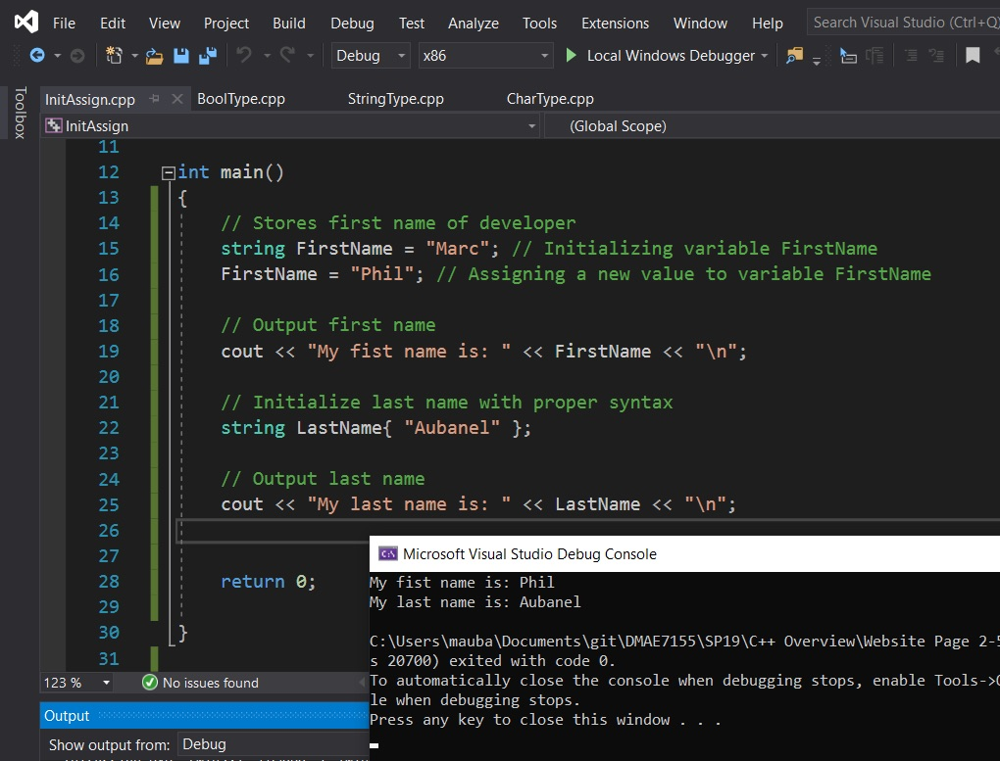

# C++ Overview - Page 4
_____ 

## Index
_____ 

* Part I - Streams, variables and integer data type
1. [Hello World](CPP-Overview-1.html#hello-world)
2. [Primitive Data Types](CPP-Overview-2.html#primitive-data-types)
3. [Integer](CPP-Overview-2.html#integer)
4. [Variable](CPP-Overview-2.html#variable)
5. [Operators](CPP-Overview-2.html#operators)
6. [Advanced Operators](CPP-Overview-3.html#advanced-operators)

* Part II - Fractional number data types
1. [Double Data Type](CPP-Overview-3.html#double-data-type)
2. [Float Data Type](CPP-Overview-3.html#float-data-type)

* Part III - Character, String and Boolean types
1. [Char Data Type](CPP-Overview-4.html#char-data-type)
2. [String Data Type](CPP-Overview-4.html#string-data-type)
1. [Boolean Data Type](CPP-Overview-4.html#boolean-data-type)

* Part IV - Digging a little deeper
1. [Assignment Versus Initializing](CPP-Overview-4.html#assignment-versus-initializing)
2. [Type Safety](CPP-Overview-5.html#type-safety)
3. [Order of Operations](CPP-Overview-5.html#order-of-operations)

* Part V - Selection
1. [If Statements](CPP-Overview-6.html#if-statements)
2. [Switch Statements](CPP-Overview-6.html#switch-statements)

* Part VI - Loops (Iteration)
1. [While Loops](CPP-Overview-7.html#while-loops)
2. [For Loops](CPP-Overview-7.html#for-loops)

* Part VII - Scope
1. [Scope](CPP-Overview-7.html#scope)


_____ 

## Char Data Type
Now lets look at the character data type called [char](https://www.geeksforgeeks.org/c-data-types/). 

> Character: Character data type is used for storing characters. Keyword used for character data type is char. Characters typically requires 1 byte of memory space and ranges from -128 to 127 or 0 to 255. - [geeksforgeeks.org](https://www.geeksforgeeks.org/c-data-types/)

Now why are there two ranges.  I didn't tell you about integers that we can have **signed** and **unsigned** integers.  An `int` is by default unsigned.  A `uint` is unsigned which means it is only positive number `0` through `255`.  A regular **signed** `int` goes from `-128` to `127` with the same number of 256 distinct values (including `0`).

Also note that a `char` character is a single letter not a series of them.  So how do we know if it is a char or a string?  A char is surrounded by single quotes `'c'` and a string is surrounded by double quotation marks, `"c"`.

Right click on the solution file and select **Add \| New Project**.  Then select a **Console App** and press **Next**.  Call it `CharType` then press the **Create** button.  Right click on the new **CharType** project and select `Set as StartUp Project`.  
```cpp
/******************************************************************************

Demontrate Char Type

*******************************************************************************/
#include <iostream>

using std::cout;


int main()
{
    // stores single character of middle initial
    char MiddleInitial = 'A';
    
    // Output my middle initial
    cout << "My middle initial is: " << MiddleInitial << "\n";
    
    cout << "Size of char: " << sizeof(char)  << " byte(s)\n"; 
       
    return 0;
}
```

_____ 

<div class = "row">
<div class="col-12 col-lg-4 col align-self-center">
<div markdown = "1">
{:start="{{ num }}"}
{{ num }}. Now you can see that it runs the program and prints the single character as we expected.  On my machine it is 1 byte.
</div>
</div>
<div class="col-12 col-lg-8">
  
</div>
</div>

_____ 


<div class = "row">
<div class="col-12 col-lg-4 col align-self-center">
<div markdown = "1">
{:start="{{ num }}"}
{{ num }}. What happens if we try and set a char with a string literal such as `"A"`. Try it?  Now this is a case where the error message may seem foreign to you.  A string is a set of char pointers but we will get into that at another point in time. For now, if you want a single char you use single quotation marks.
</div>
</div>
<div class="col-12 col-lg-8">
  
</div>
</div>

_____ 
## String Data Type
Now lets look at the character data type called [string](https://www.geeksforgeeks.org/c-string-class-and-its-applications/). 
> C++ string class internally uses char array to store character but all memory management, allocation and null termination is handled by string class itself that is why it is easy to use. The length of c++ string can be changed at runtime because of dynamic allocation of memory similar to vectors. - [geeksforgeeks.org](https://www.geeksforgeeks.org/c-data-types/)

Now this is not a primitive data type and is a class (we will get into classes later).  Unreal will give us their own string class but for now we will use the one that comes with the standard template libraries (by including the `<string>` class).  <br>Right click on the solution file and select **Add \| New Project**.  Then select a **Console App** and press **Next**.  Call it `StringType` then press the **Create** button.  Right click on the new **StringType** project and select `Set as StartUp Project`.  

```cpp
/******************************************************************************

Demontrate String Type

*******************************************************************************/
#include <iostream>
#include <string>

using std::cout;
using std::string;


int main()
{
    // stores entire middle name
    string MiddleName = "Alix Andreus";
    
    // Output my middle initial
    cout << "My middle initial is: " << MiddleName << "\n";
    
    cout << "Size of string MiddleName: " << MiddleName.size()  << " byte(s)" << "\n"; 
       
    return 0;
}
```
_____ 

<div class = "row">
<div class="col-12 col-lg-4 col align-self-center">
<div markdown = "1">
{:start="{{ num }}"}
{{ num }}. Now lets go through this. Since a `string` is a class we need to `#include` it.<br><br>On **line 7** we include the **string** class into our program (growing the size of our executable).  We want to use type std::string frequently so lets create a shortcut by adding `using std::string` which allows us in this program to just type `string`. Now this class comes with a `size()` function which returns the size of the data structure.  Notice that each character is 1 byte including spaces. C++ does not ignore spaces, if I put 5 of them, they will all be reflected on screen (unlike HTML that ignores the second space and all spaces after).
</div>
</div>
<div class="col-12 col-lg-8">
  
</div>
</div>
_____ 


<div class = "row">
<div class="col-12 col-lg-4 col align-self-center">
<div markdown = "1">
{:start="{{ num }}"}
{{ num }}. **Strings** allow the use of a `+` operator as well.  This concatonates two strings into one longer string.
</div>
</div>
<div class="col-12 col-lg-8">
  
</div>
</div>
_____ 

## Boolean Data Type
Now lets look at the character data type called [bool](https://www.geeksforgeeks.org/c-data-types/). 
> Boolean: Boolean data type is used for storing boolean or logical values. A boolean variable can store either true or false. Keyword used for boolean data type is bool.- [geeksforgeeks.org](https://www.geeksforgeeks.org/c-data-types/)

Now we can use the value `true` and `false` and a single bit is needed so we have `0` for `false` and `1` for true (or any non 0 value);

The Unreal 4 coding standards say:
> Boolean variables must be prefixed by b (for example, bPendingDestruction, or bHasFadedIn).  - [Unreal Manual](https://docs.unrealengine.com/en-us/Programming/Development/CodingStandard)

Note, that even if a boolean is a single bit the smallest amount of memory we can access is a byte.  So a bool takes a byte which wastes 7 bits.  There are ways of masking other types to be more efficient and we will show you that in Unreal later.

Right click on the solution file and select **Add \| New Project**.  Then select a **Console App** and press **Next**.  Call it `BoolType` then press the **Create** button.  Right click on the new **BoolType** project and select `Set as StartUp Project`.  

```cpp
/******************************************************************************

Boolean Data Type

*******************************************************************************/
#include <iostream>

using std::cout;


int main()
{
    // bIsGood determines if milk is spoiled or not
    bool bIsGood = true; 

    // Outputs the temperature
    cout << "The milk is spoiled: " << bIsGood << "\n";

    cout << "Size of bool: " << sizeof(bool) << " byte(s)\n";
       
    return 0;
}
```
_____ 


<div class = "row">
<div class="col-12 col-lg-4 col align-self-center">
<div markdown = "1">
{:start="{{ num }}"}
{{ num }}. Run the program and notice that it doesn't show the `true` keyword but the boolean `1`. Notice that even though a bool takes a single bit that the smallest amount the operating system can reserve is a byte (8 bits).
</div>
</div>
<div class="col-12 col-lg-8">
  
</div>
</div>
_____ 

<div class = "row">
<div class="col-12 col-lg-4 col align-self-center">
<div markdown = "1">
{:start="{{ num }}"}
{{ num }}. Now invert it and set the Run the program and notice that it doesn't show the `false` value but the boolean `0`.<br><br>In fact any non `0` number will be considered `true` by the c++ compiler.<br><br>
</div>
</div>
<div class="col-12 col-lg-8">
  
</div>
</div>
_____ 


<div class = "row">
<div class="col-12 col-lg-4 col align-self-center">
<div markdown = "1">
{:start="{{ num }}"}
{{ num }}. Lets test this out by changing `false` to an integer of `-10`. Notice that is still true or in the computer a `1`.
</div>
</div>
<div class="col-12 col-lg-8">
  
</div>
</div>
_____ 
## Assignment versus Initializing
When we use the `=` operator we are assigning a value.  But there is a difference between the first time we set a value - **initializing** and changing a set value - **assigning**. 

Right click on the solution file and select **Add \| New Project**.  Then select a **Console App** and press **Next**.  Call it `InitAssign` then press the **Create** button.  Right click on the new **InitAssign** project and select `Set as StartUp Project`.  

```cpp
Initializing and Assignment

*******************************************************************************/
#include <iostream>
#include <string>

using std::cout;
using std::string;


int main()
{
    // Stores first name of developer
    string FirstName = "Marc"; // Initializing variable FirstName
    FirstName = "Phil"; // Assigning a new value to variable FirstName
    
    // Output first name
    cout << "My first name is: " << FirstName << "\n";
       
    return 0;
}
```
_____ 


<div class = "row">
<div class="col-12 col-lg-4 col align-self-center">
<div markdown = "1">
{:start="{{ num }}"}
{{ num }}. Now run the program and see that we use the same `=` operator to both inialize and to assign a new value.
</div>
</div>
<div class="col-12 col-lg-8">
  
</div>
</div>
_____ 


<div class = "row">
<div class="col-12 col-lg-4 col align-self-center">
<div markdown = "1">
{:start="{{ num }}"}
{{ num }}. Now since the computer is doing a different operation when initializing versus assignment there is a different way of assigning a variable. You drop the `=` sign and use `{}` instead.  Type in an example where we use modern C++ initializing for the initial `LastName` variable.
</div>
</div>
<div class="col-12 col-lg-8">
  
</div>
</div>
_____ 


<div class = "row">
<div class="col-12 col-lg-4 col align-self-center">
<div markdown = "1">
{:start="{{ num }}"}
{{ num }}. Notice that this is just for iniitializing.  If we try and assign with this syntax we get an error.
</div>
</div>
<div class="col-12 col-lg-8">
  
</div>
</div>



<div class = "row">
<div class="col-12 col-lg-4 col align-self-center">
<div markdown = "1">
{:start="{{ num }}"}
{{ num }}. Remove this compile error and press save.<br><br>Next up we will look at an issue with type safety in C++.
</div>
</div>
<div class="col-12 col-lg-8">
  
</div>
</div>

_____ 


<br><br>

[<- Previous](CPP-Overview-3.html)&nbsp;&nbsp;&nbsp;[Home](../index.html)&nbsp;&nbsp;&nbsp; [Continue ->](CPP-Overview-5.html)
<br />  
<br />  
<br />  

