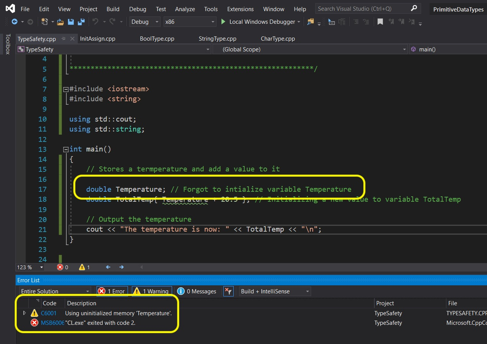
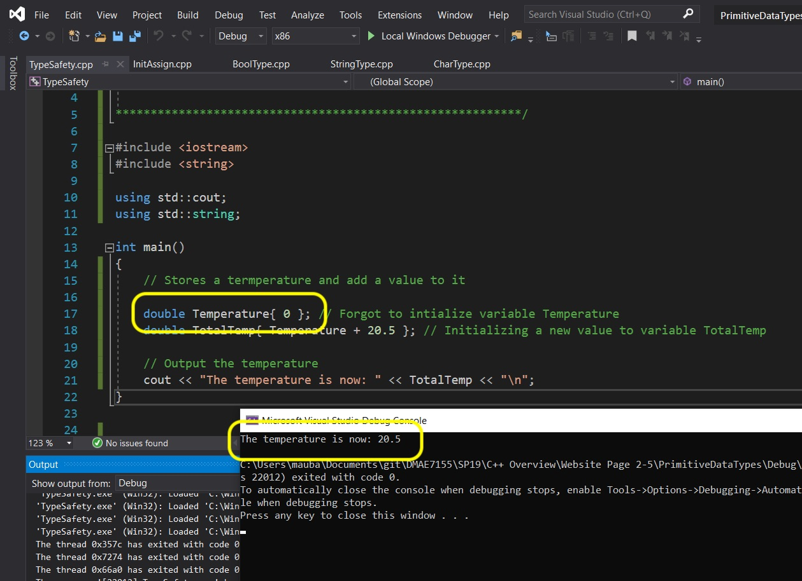
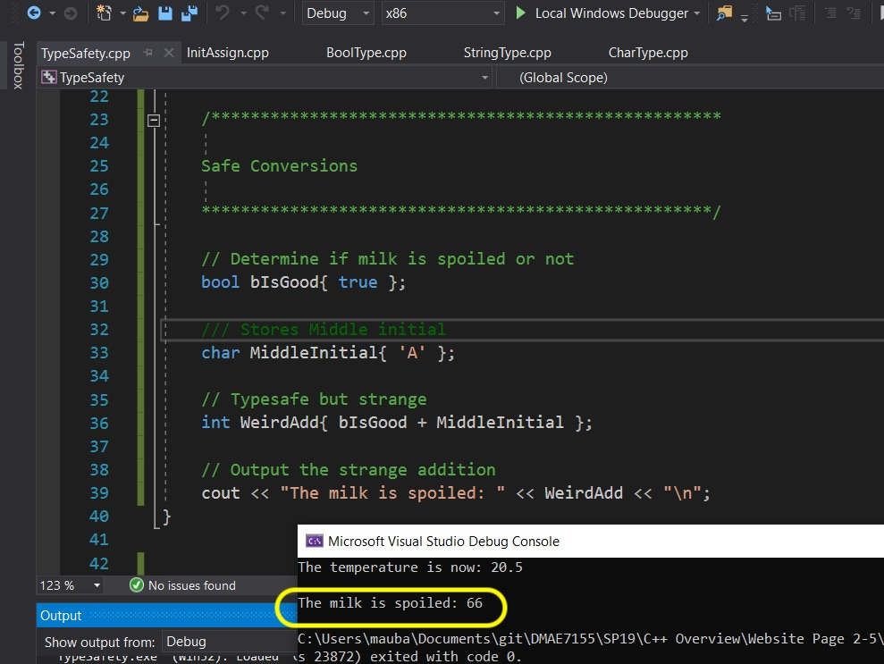
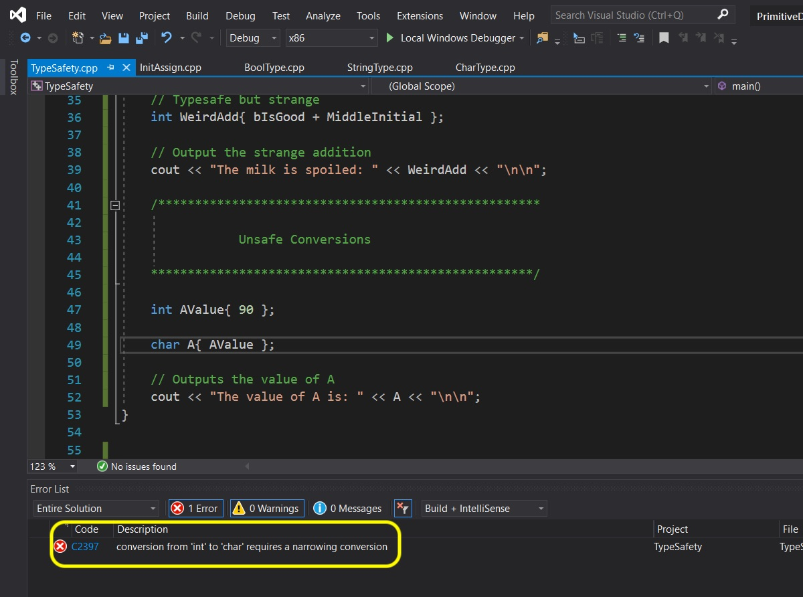
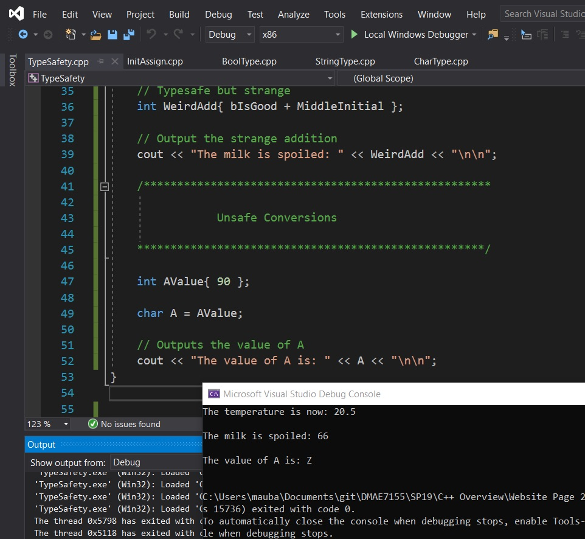
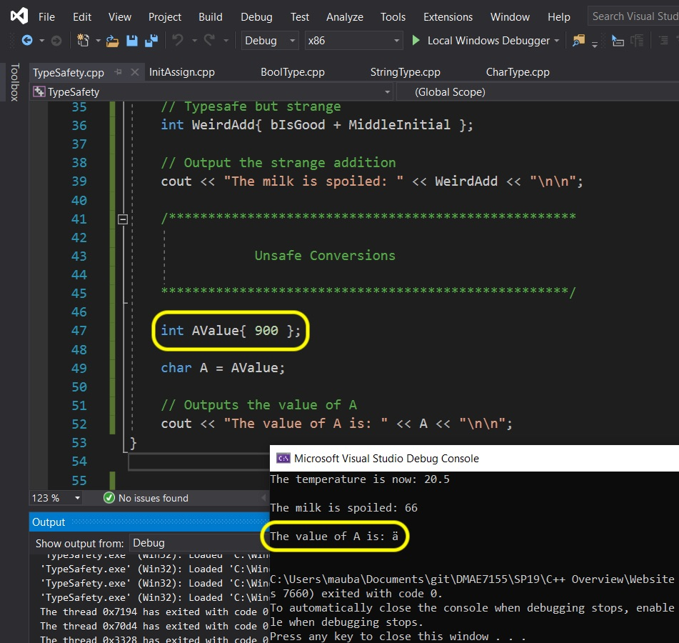
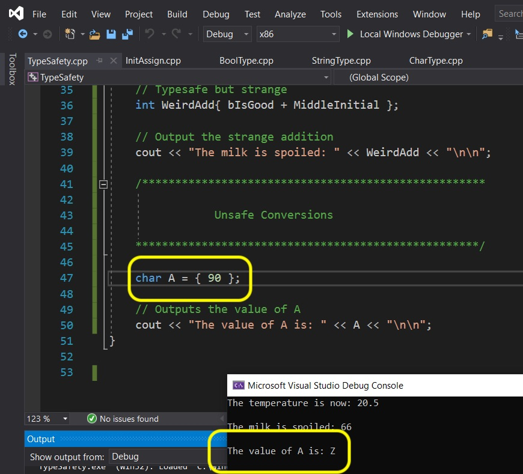
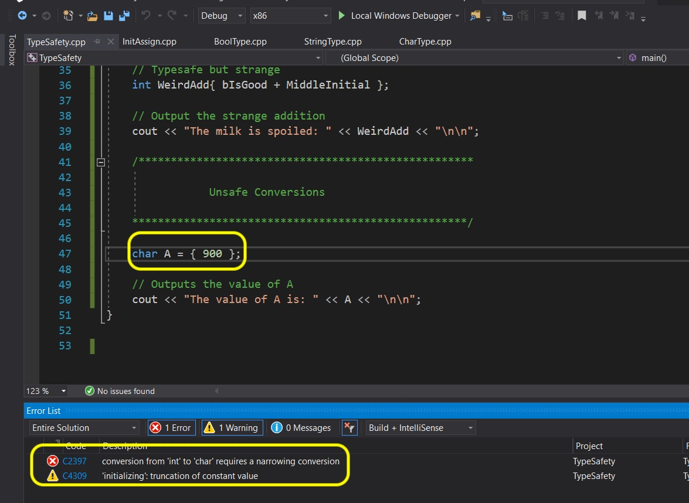
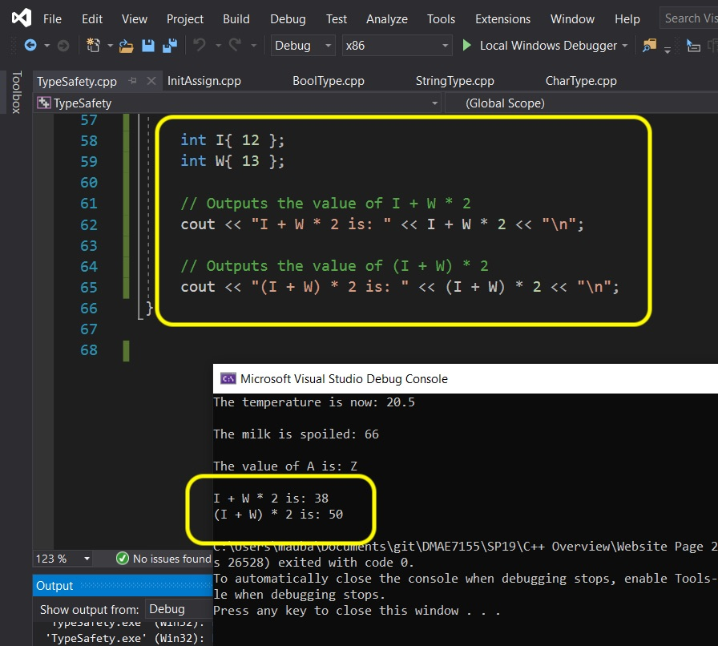

# C++ Overview - Page 5
_____ 

## Index
_____ 

* Part I - Streams, variables and integer data type
1. [Hello World](CPP-Overview-1.html#hello-world)
2. [Primitive Data Types](CPP-Overview-2.html#primitive-data-types)
3. [Integer](CPP-Overview-2.html#integer)
4. [Variable](CPP-Overview-2.html#variable)
5. [Operators](CPP-Overview-2.html#operators)
6. [Advanced Operators](CPP-Overview-3.html#advanced-operators)

* Part II - Fractional number data types
1. [Double Data Type](CPP-Overview-3.html#double-data-type)
2. [Float Data Type](CPP-Overview-3.html#float-data-type)

* Part III - Character, String and Boolean types
1. [Char Data Type](CPP-Overview-4.html#char-data-type)
2. [String Data Type](CPP-Overview-4.html#string-data-type)
1. [Boolean Data Type](CPP-Overview-4.html#boolean-data-type)

* Part IV - Digging a little deeper
1. [Assignment Versus Initializing](CPP-Overview-4.html#assignment-versus-initializing)
2. [Type Safety](CPP-Overview-5.html#type-safety)
3. [Order of Operations](CPP-Overview-5.html#order-of-operations)

* Part V - Selection
1. [If Statements](CPP-Overview-6.html#if-statements)
2. [Switch Statements](CPP-Overview-6.html#switch-statements)

* Part VI - Loops (Iteration)
1. [While Loops](CPP-Overview-7.html#while-loops)
2. [For Loops](CPP-Overview-7.html#for-loops)

* Part VII - Scope
1. [Scope](CPP-Overview-7.html#scope)

## Type Safety
The C++ compiler does not enforce type safety.  So it is up to us to make sure that that when we are initializing and assigning values between types, that we are doing it safely. 

Right click on the solution file and select **Add \| New Project**.  Then select a **Console App** and press **Next**.  Call it `TypeSafety` then press the **Create** button.  Right click on the new **TypeSafety** project and select `Set as StartUp Project`.  
```cpp
/******************************************************************************

Type Safety

*******************************************************************************/
#include <iostream>
#include <string>

using std::cout;
using std::string;


int main()
{
    // Stores a temperature and adds a value to it
    double Temperature; // Forgot to initialize variable Temperature
    double TotalTemp { Temperature + 20.5 }; // Assigning a new value to variable TotalTemp
    
    // Outputs the temperature
    cout << "The temperature is now: " << TotalTemp << "\n";
       
    return 0;
}
```
_____ 

<div class = "row">
<div class="col-12 col-lg-4 col align-self-center">
<div markdown = "1">
{:start="{{ num }}"}
{{ num }}. Now we have a problem here.  Even though we included `double Temperature;`, we never initilialized it.  So when we go to use it the compiler does not have a value.  So it throws an error saying the memory allocated for the **double** is uninitialized.
</div>
</div>
<div class="col-12 col-lg-8">
  
</div>
</div>

_____ 



<div class = "row">
<div class="col-12 col-lg-4 col align-self-center">
<div markdown = "1">
{:start="{{ num }}"}
{{ num }}. On some platforms this might compile and run. Different platforms might give different results. Sometimes it will turn whatever content that is in memory into the data type provided giving a random value.<br><br>So now lets initialize `Temperature` with `0` and run it:
</div>
</div>
<div class="col-12 col-lg-8">
  
</div>
</div>


_____ 


<div class = "row">
<div class="col-12 col-lg-4 col align-self-center">
<div markdown = "1">
{:start="{{ num }}"}
{{ num }}. Why are these conversions safe?

* bool to char 
* bool to int 
* bool to double 
* bool to float
* char to int 
* char to double 
* int to double

If the value is always converted to an equal or greater amount of memory (how many bytes) then it is a safe conversion.  So bool is either `0` or `1` which is represented in all forms of `char`, `int`, `uint`, `double` or `floats`. Also the largest `int` is not greater than 17 digits so it can be represented by a double. But as you noticed for very large integers it is possible that there could be a loss of precision on some computers - this is something we need to be aware of.
</div>
</div>
<div class="col-12 col-lg-8 col">
  
</div>
</div>

_____ 


<div class = "row">
<div class="col-12 col align-self-center">
<div markdown = "1">
{:start="{{ num }}"}
{{ num }}. Here is an example of a safe conversion.  Add to your cpp:

```cpp
    // Outputs the temperature
    cout << "The temperature is now: " << TotalTemp << "\n\n";

    /*************************************

    Safe Conversions

    **************************************/

    // Determines if milk is spoiled or not
    bool bIsGood{ true }; 
    
    // Stores middle initial
    char MiddleInitial{ 'A' };
    
    //Typesafe, yet sort of strange
    int WeirdAdd{ bIsGood + MiddleInitial};

    // Outputs the strange addition
    cout << "The milk is spoiled: " << WeirdAdd << "\n";
       
    return 0;
}
```
</div>
</div>
</div>

_____ 


<div class = "row">
<div class="col-12 col-lg-4 col align-self-center">
<div markdown = "1">
{:start="{{ num }}"}
{{ num }}. Now press the **Run** button to execute the program and you will notice that it can convert the addition of a bool and a char to an integer.  This shows that on my computer "A" is stored with the integer `65` (as we add `1` to it with the boolean set to `true`(`1`) . 

</div>
</div>
<div class="col-12 col-lg-8">
  
</div>
</div>

_____ 


<div class = "row">
<div class="col-12 col-lg-4 col align-self-center">
<div markdown = "1">
{:start="{{ num }}"}
{{ num }}. Why are these conversions unsafe?

* double to int 
* double to char 
* double to bool 
* int to char 
* int to bool 
* char to bool

Essentially we are trying to fit a gallon of liquid inside a cup.  The data type conversion is going from a larger container (number digits stored) to a smaller one.

</div>
</div>
<div class="col-12 col-lg-8">
  
</div>
</div>
_____ 


<div class = "row">
<div class="col-12 col align-self-center">
<div markdown = "1">
{:start="{{ num }}"}
{{ num }}. Sometimes this narrowing conversion can work and other times not. Lets look at int to char. Now we will do an unsafe conversion with a safe value.  We know that a char is either `0` through `255` or `-128` to `127` so `90` should always work. Go to [onlinegdb](https://www.onlinegdb.com)(and select C++14 as your language) and type:

```cpp
/******************************************************************************

Unsafe Conversions

*******************************************************************************/
#include <iostream>

using std::cout;


int main()
{

    int AValue{ 90 }; 
    
    char A { AValue };

    // Outputs the value of A 
    cout << "The value is: " << A << "\n";
       
    return 0;
}
```

</div>
</div>
</div>

_____ 


<div class = "row">
<div class="col-12 col-lg-4 col align-self-center">
<div markdown = "1">
{:start="{{ num }}"}
{{ num }}. Since you are using the new C++ initialization syntax the compiler will bark at you and say that this is a narrowing conversion and will not compile and run.  This is why this is the best way to initalize a variable;

</div>
</div>
<div class="col-12 col-lg-8">
  
</div>
</div>

_____ 


<div class = "row">
<div class="col-12 col-lg-4 col align-self-center">
<div markdown = "1">
{:start="{{ num }}"}
{{ num }}. Now if we use the assignment method the compiler will do a narrowing conversion without outputing an error.

</div>
</div>
<div class="col-12 col-lg-8">
  
</div>
</div>

_____ 


<div class = "row">
<div class="col-12 col-lg-4 col align-self-center">
<div markdown = "1">
{:start="{{ num }}"}
{{ num }}. Now change that value to `900` which is not within any parameter of any computer's `char`.  It compiles and runs but we get an error in the display as it displays a nonsense character:

</div>
</div>
<div class="col-12 col-lg-8">
  
</div>
</div>

_____ 


<div class = "row">
<div class="col-12 col-lg-4 col align-self-center">
<div markdown = "1">
{:start="{{ num }}"}
{{ num }}. Since C++ 11 (we are using C++ 14) they introduced a narrowing conversion that won't convert a narrowing type change. So instead of initializing a variable with the `=` operator, we use brackets to initialize the variable.  An example is `char A{ 90 }`.  Now since we are directly initializing the char it will run as the compiler knows that it is not narrowing (the integer is not larger of smaller than what a char can hold). 

</div>
</div>
<div class="col-12 col-lg-8">
  
</div>
</div>

_____ 


<div class = "row">
<div class="col-12 col-lg-4 col align-self-center">
<div markdown = "1">
{:start="{{ num }}"}
{{ num }}. Now if we try and add the line `char B{900}` and press the **run** button it won't compile as it recognizes that the narrowing conversion will not convert properly:

</div>
</div>
<div class="col-12 col-lg-8">
  
</div>
</div>
_____ 

## Order of Operations
The C++ compiler will perform mathematical operations in the [correct order](https://en.cppreference.com/w/cpp/language/operator_precedence).  Look at the link to get a full description of what order of operations C++ uses on non-mathematical operations.


Create a program with an `int I = 12;` and an `int W = 13`.  
Look at the difference in output of `I + W * 2` versus `(I + W) * 2`

This should look exactly like you would expect based on what you learned in grade school math.


_____ 

<div class = "row">
<div class="col-12 col-lg-4 col align-self-center">
<div markdown = "1">
{:start="{{ num }}"}
{{ num }}. It might look something like this.<br><br>Next up we will look at statements.
</div>
</div>
<div class="col-12 col-lg-8">
  
</div>
</div>
_____ 

<br><br>

[<- Previous](CPP-Overview-4.html)&nbsp;&nbsp;&nbsp;[Home](../index.html)&nbsp;&nbsp;&nbsp; [Continue ->](CPP-Overview-6.html)
<br />  
<br />  
<br />  

