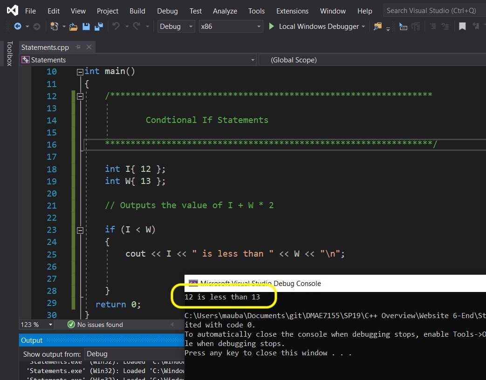
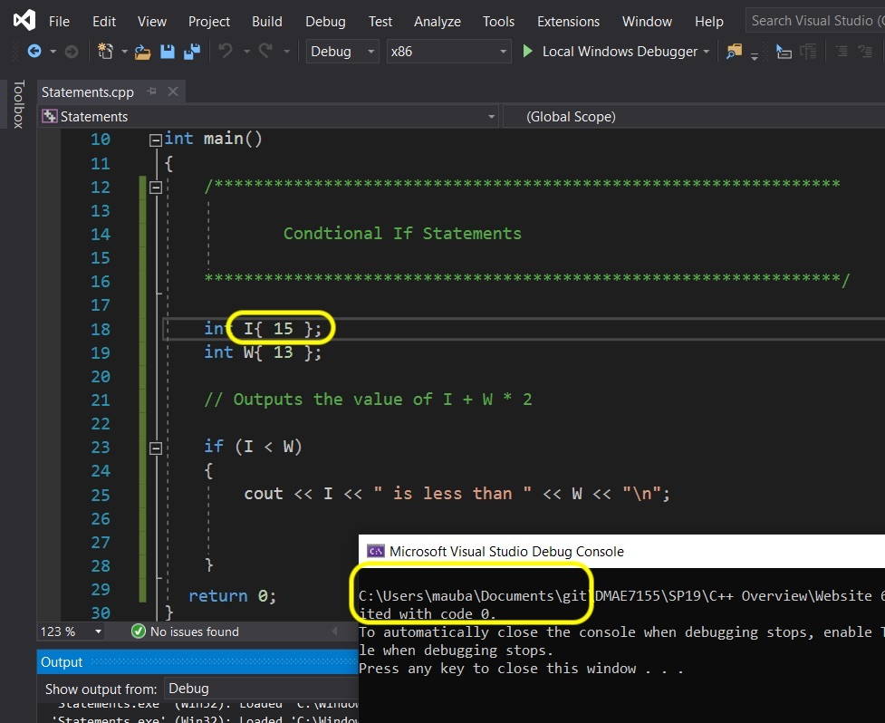
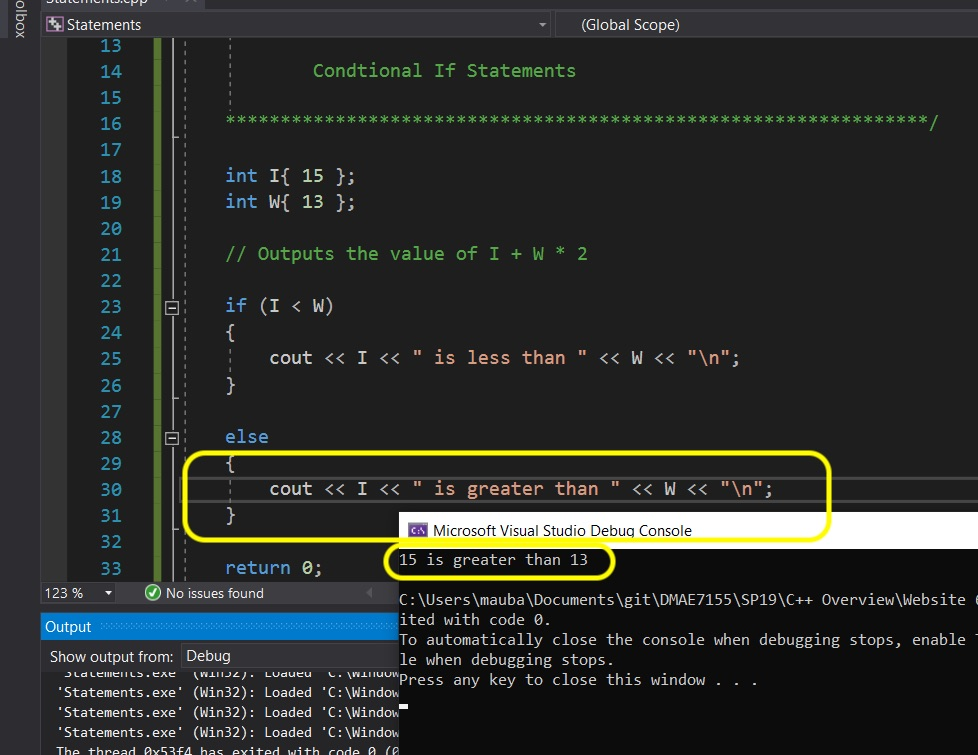
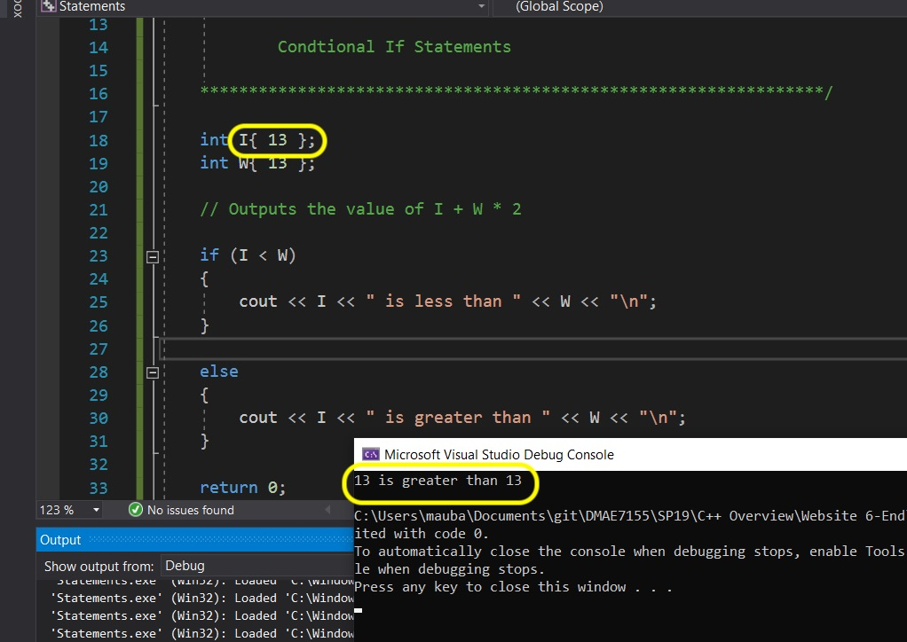
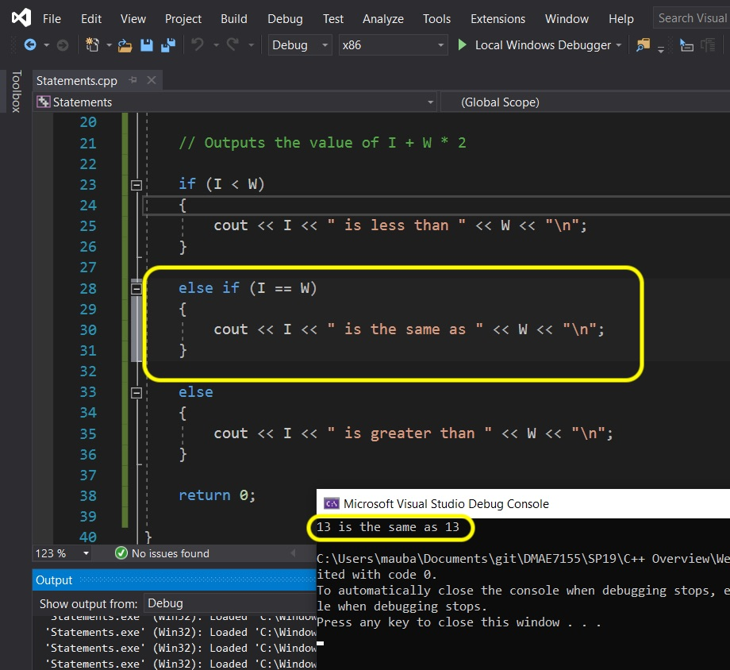
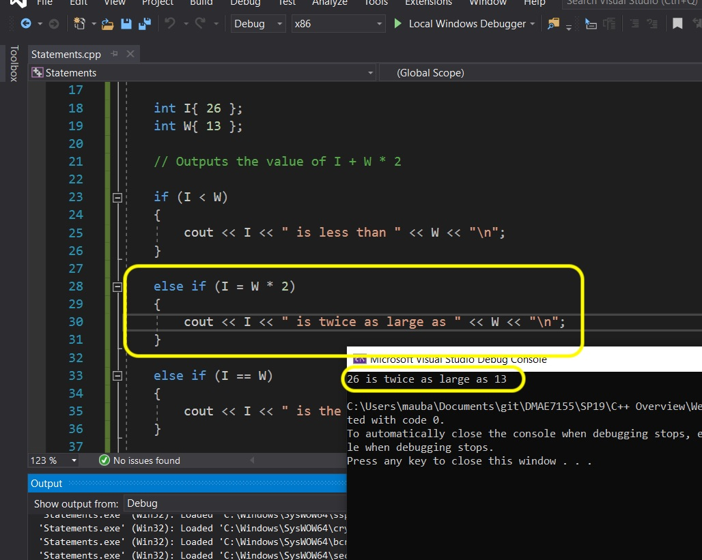
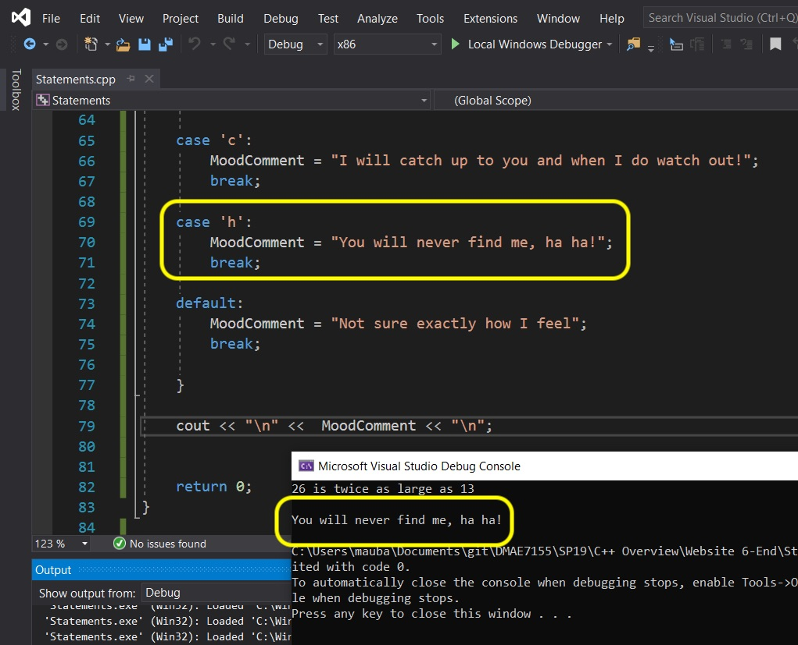
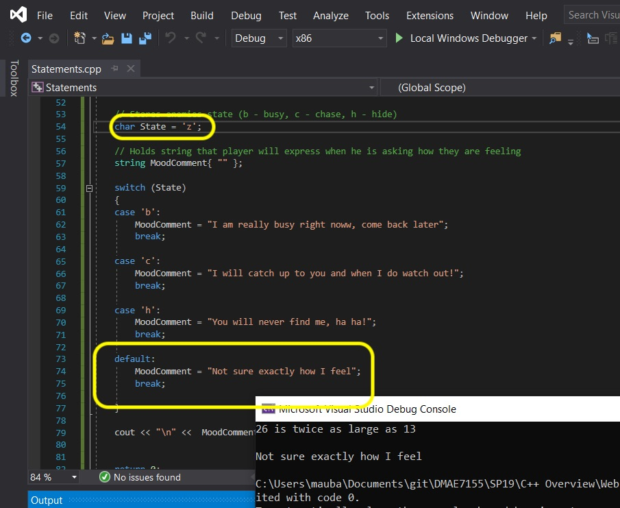

# C++ Overview - Page 6
_____ 

## Index
_____ 

* Part I - Streams, variables and integer data type
1. [Hello World](CPP-Overview-1.html#hello-world)
2. [Primitive Data Types](CPP-Overview-2.html#primitive-data-types)
3. [Integer](CPP-Overview-2.html#integer)
4. [Variable](CPP-Overview-2.html#variable)
5. [Operators](CPP-Overview-2.html#operators)
6. [Advanced Operators](CPP-Overview-3.html#advanced-operators)

* Part II - Fractional number data types
1. [Double Data Type](CPP-Overview-3.html#double-data-type)
2. [Float Data Type](CPP-Overview-3.html#float-data-type)

* Part III - Character, String and Boolean types
1. [Char Data Type](CPP-Overview-4.html#char-data-type)
2. [String Data Type](CPP-Overview-4.html#string-data-type)
1. [Boolean Data Type](CPP-Overview-4.html#boolean-data-type)

* Part IV - Digging a little deeper
1. [Assignment Versus Initializing](CPP-Overview-4.html#assignment-versus-initializing)
2. [Type Safety](CPP-Overview-5.html#type-safety)
3. [Order of Operations](CPP-Overview-5.html#order-of-operations)

* Part V - Selection
1. [If Statements](CPP-Overview-6.html#if-statements)
2. [Switch Statements](CPP-Overview-6.html#switch-statements)

* Part VI - Loops (Iteration)
1. [While Loops](CPP-Overview-7.html#while-loops)
2. [For Loops](CPP-Overview-7.html#for-loops)

* Part VII - Scope
1. [Scope](CPP-Overview-7.html#scope)


_____ 

## If Statements

The `if` [statement](https://www.cprogramming.com/tutorial/lesson2.html) is common in many programming languages including C++. An `if(statement)` is refered to as a **conditional statement**. It follows the following principle:

```
if (ConditionIsTrue)
{
  ...Add logic to run if variable ConditionIsTrue is true
}
```

So it first checks to see whether the condition in brackets is true or false, if true it runs what id between the brackets.

Start a brand new **Console App** project and solution in Visual Studio 19. Call it `Statements`.

```cpp
/******************************************************************************

          STATEMENTS

*******************************************************************************/
#include <iostream>

using std::cout;


int main()
{

  /******************************************************************************

  Conditional If Statements

  *******************************************************************************/

    
    int I {12};
    int W {13};

    // Outputs the value of I + W * 2
    if (I < W)
    {
    cout << I << " is less than " << W << "\n";
    }
       
    return 0;
}
```
_____ 


<div class = "row">
<div class="col-12 col-lg-4 col align-self-center">
<div markdown = "1">
{:start="{{ num }}"}
{{ num }}. We used a new operator `<`.  This looks to see if the value on the left of it is less than the value on the right of it (less than). It will return a boolean `true` or `false`.  So our expression is if `I < W` (if **variable** `I` is less than **variable** `W`) is true it will return true and the if statement will run what follows between the brackets. Now run the program and you should see that `12` is in fact less than `13`.
</div>
</div>
<div class="col-12 col-lg-8">
  
</div>
</div>

_____ 


<div class = "row">
<div class="col-12 col-lg-4 col align-self-center">
<div markdown = "1">
{:start="{{ num }}"}
{{ num }}. Now set `I` so that is larger than `W` and run the program.  You notice that it doesn't run what is inside the brackets after the conditional `if` statement.
</div>
</div>
<div class="col-12 col-lg-8">
  
</div>
</div>

_____ 


<div class = "row">
<div class="col-12 col align-self-center">
<div markdown = "1">
{:start="{{ num }}"}
{{ num }}. How do we run some code if the **if** statement returns `false`?  We can to the following: we can add an `else` statement that will run if the `if` condition is `false`.  So we can add to our program after the if statement:

```cpp
  else
  {
      cout << I << " is greater than " << W << "\n";
  }
```
</div>
</div>
</div>

_____ 


<div class = "row">
<div class="col-12 col-lg-4 col align-self-center">
<div markdown = "1">
{:start="{{ num }}"}
{{ num }}. **Run** the program and now it prints the else statement.
</div>
</div>
<div class="col-12 col-lg-8">
  
</div>
</div>

_____ 


<div class = "row">
<div class="col-12 col-lg-4 col align-self-center">
<div markdown = "1">
{:start="{{ num }}"}
{{ num }}. We now have a potential bug with this logic.  What is I and W are the same value?  Then it is not larger or smaller.  Make them the same and run the program.<br><br>You will notice that it failes the first `if` as `I` is not less than `W` so it runs the `else`.  The problem is that it runs fine but it is still a run-time error or bug.  We run the game and it is not correct. The program is correct but what we are printing is wrong (a bug!).
</div>
</div>
<div class="col-12 col-lg-8">
  
</div>
</div>

_____ 


<div class = "row">
<div class="col-12 col align-self-center">
<div markdown = "1">
{:start="{{ num }}"}
{{ num }}. We can fix it by adding a third condition in between.  Between the `if` and the `else` we can have as many `if else` statements as we need.  Here we will use one for now. Inbetween add the following statement:

```cpp
    else if (I == W)
    {
        cout << I << " is the same as " << W << "\n";
    }
```
</div>
</div>
</div>

_____ 


<div class = "row">
<div class="col-12 col-lg-4 col align-self-center">
<div markdown = "1">
{:start="{{ num }}"}
{{ num }}. Now run the program.  You will notice that we are using a new operator `==`.  This is NOT the same as a single assignment operator`=`.  The double `==` is called a **comparison operator** and returns true if the value on the left is identical to the value on the right hand side.  So if there are the same this `else if` will run and the `else` will not.
</div>
</div>
<div class="col-12 col-lg-8">
  
</div>
</div>

_____ 


<div class = "row">
<div class="col-12 col-lg-4 col align-self-center">
<div markdown = "1">
{:start="{{ num }}"}
{{ num }}. Now we can string after an `if` statement as many `else if` statements as we need.  But we can only have one `else` and it is only after an `if` or after the last `else if` has run.  So we can add another `else if` to check if `I` is twice the size of `W` and if so print a special message. Fool around with changing I and W to different values and see if it works correctly. Now don't forget once a condition is true it stops running and breaks out of the entire **if - else if - else** chain.
</div>
</div>
<div class="col-12 col-lg-8">
  
</div>
</div>

_____ 

## Switch Statements

The **[switch](https://en.cppreference.com/w/cpp/language/switch)** statement is used a lot in video games especially for a **[finite state machines](https://en.wikipedia.org/wiki/Finite-state_machine)** for objects.  A switch statement always has a variable that is passed in the parenthisis 

```
switch (Variable)
{
  case 'A':
    //do something....
    break;

  case 'B':
    //do something
    break;

  case 'C':
    // do something
    break;

  default:
    //do something if none of the above cases are true
    break;
}
```

In the above case we have a variable.  It is checked to see if it matches each case (Variable == \'A\' for example).  If it is true it will run what comes after the colon and before the break (no brackets required).  The most common error in switch statements is forgetting the break, where it will fall through a case (and run two cases) and could cause errors. In rare cases this can be intentional. The default case means that if all the other cases are false, then it will set the string no matter what to the default setting (like an **else** at the end of an **if** statement).

Add your existing project at the bottom


```cpp

#include <iostream>
#include <string>

using std::cout;
using std::string;

int main()
{
  // Previous Code From IF ABOVE
  /******************************************************************************

  Switch Statement

  *******************************************************************************/
    // Stores enemies State (b - busy, c - chase, h - hide)
    char State = 'h';
    
    // Holds string that player will express when he is asked how they are feeling
    string MoodComment = "";
    
    switch (State)
    {
        case 'b':
            MoodComment = "I am really busy right now, come back later...";
            break;
        
        case 'c':
            MoodComment = "I will catch up to you and when I do, watch out!";
            break;
        
        case 'h':
            MoodComment = "You will never find me, ha ha!";
            break;
        
        default:
            MoodComment = "Not sure exaclty how I feel";
            break;
        
    }
    
    //Output mood of enemies
    cout << "\n" << MoodComment << "\n";

    return 0;
}
```
_____ 


<div class = "row">
<div class="col-12 col-lg-4 col align-self-center">
<div markdown = "1">
{:start="{{ num }}"}
{{ num }}. Run the game.  Since we made `State` equal to char `h` it set's `MoodComment` to that case setting it to `"You will never find me, ha ha!"`.<br><br>We cannot switch on a string as it is not a built in C++ type.  Normally we switch on an **[enumerator](https://en.cppreference.com/w/cpp/language/enum)** or an **integer**, which we will get in a later lesson.
</div>
</div>
<div class="col-12 col-lg-8">
  
</div>
</div>

_____ 


<div class = "row">
<div class="col-12 col-lg-4 col align-self-center">
<div markdown = "1">
{:start="{{ num }}"}
{{ num }}. Play around with different characters in the `State` variable and **Run** the program.  Notice that no matter what you put in there it will at least set the **default** switch allowing to ensure that the `MoodComment` variable will always have text.<br><br>Next up we will look at loops.
</div>
</div>
<div class="col-12 col-lg-8">
  
</div>
</div>


_____ 

<br><br>

[<- Previous](CPP-Overview-5.html)&nbsp;&nbsp;&nbsp;[Home](../index.html)&nbsp;&nbsp;&nbsp; [Continue ->](CPP-Overview-7.html)
<br />  
<br />  
<br />  

