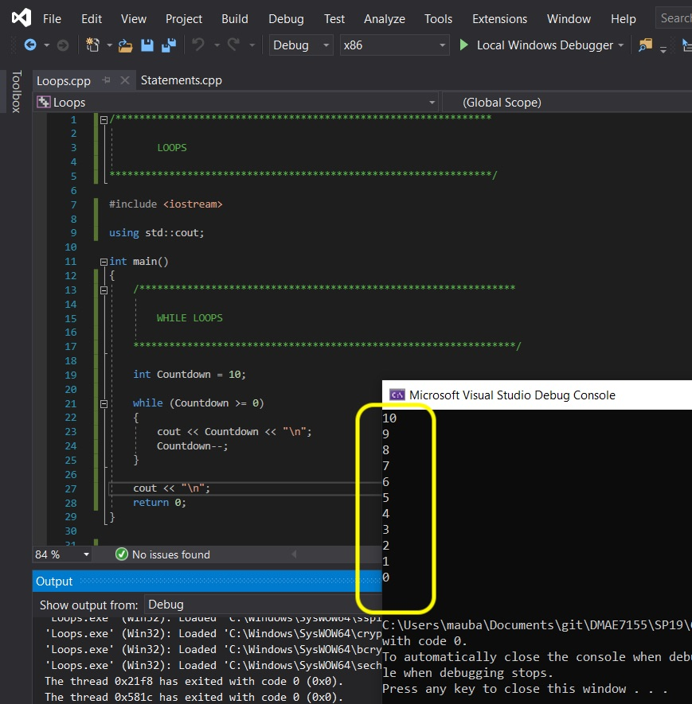
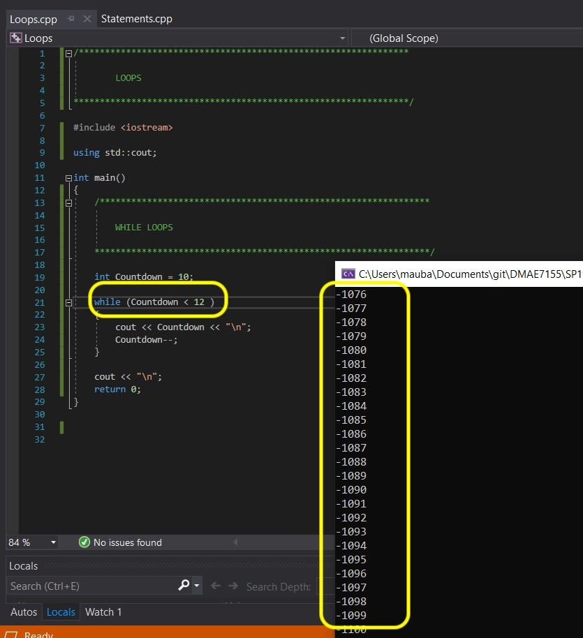
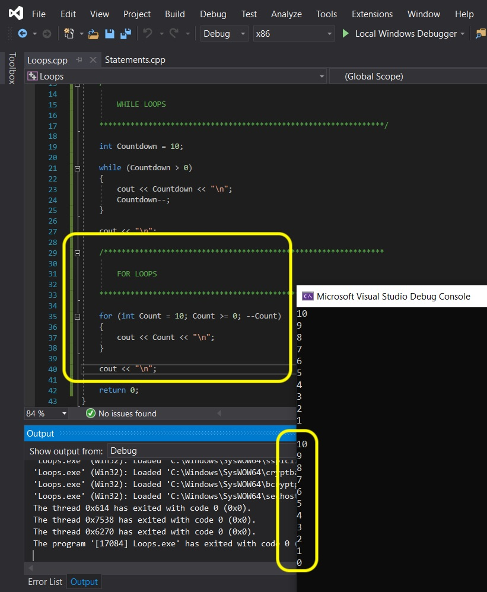
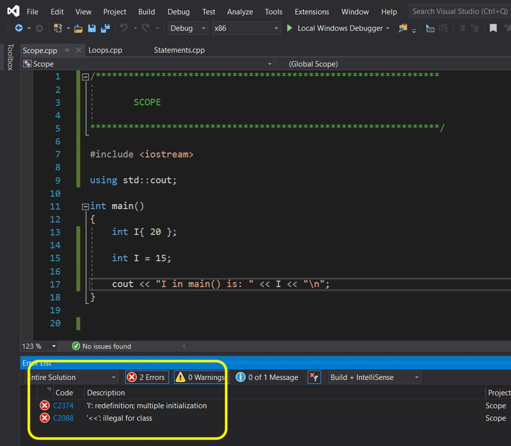
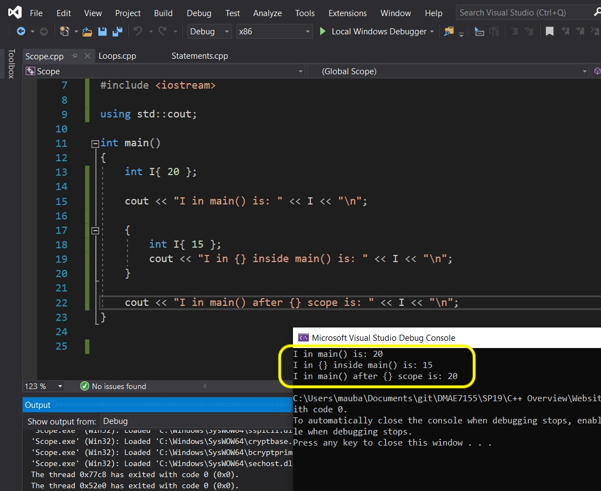
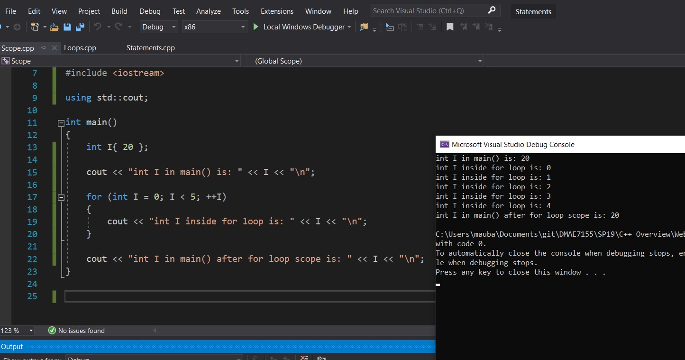
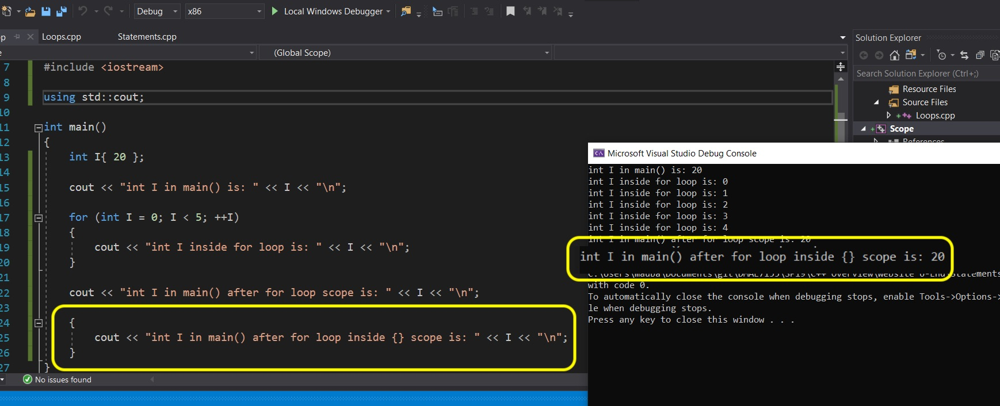
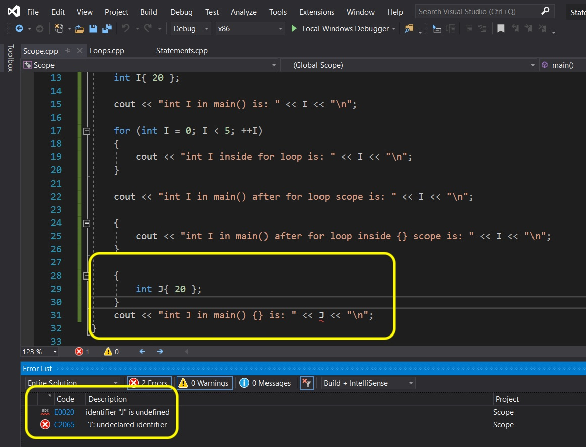

# C++ Overview - Page 7
_____ 

## Index
_____ 

* Part I - Streams, variables and integer data type
1. [Hello World](CPP-Overview-1.html#hello-world)
2. [Primitive Data Types](CPP-Overview-2.html#primitive-data-types)
3. [Integer](CPP-Overview-2.html#integer)
4. [Variable](CPP-Overview-2.html#variable)
5. [Operators](CPP-Overview-2.html#operators)
6. [Advanced Operators](CPP-Overview-3.html#advanced-operators)

* Part II - Fractional number data types
1. [Double Data Type](CPP-Overview-3.html#double-data-type)
2. [Float Data Type](CPP-Overview-3.html#float-data-type)

* Part III - Character, String and Boolean types
1. [Char Data Type](CPP-Overview-4.html#char-data-type)
2. [String Data Type](CPP-Overview-4.html#string-data-type)
1. [Boolean Data Type](CPP-Overview-4.html#boolean-data-type)

* Part IV - Digging a little deeper
1. [Assignment Versus Initializing](CPP-Overview-4.html#assignment-versus-initializing)
2. [Type Safety](CPP-Overview-5.html#type-safety)
3. [Order of Operations](CPP-Overview-5.html#order-of-operations)

* Part V - Selection
1. [If Statements](CPP-Overview-6.html#if-statements)
2. [Switch Statements](CPP-Overview-6.html#switch-statements)

* Part VI - Loops (Iteration)
1. [While Loops](CPP-Overview-7.html#while-loops)
2. [For Loops](CPP-Overview-7.html#for-loops)

* Part VII - Scope
1. [Scope](CPP-Overview-7.html#scope)

_____ 

## While Loops
A [while loop](https://www.tutorialspoint.com/cplusplus/cpp_while_loop.htm) Allows us to do something over and over again until an exit condition is met.

> A while loop statement repeatedly executes a target statement as long as a given condition is true. - [tutorialspoint.com](https://www.tutorialspoint.com/cplusplus/cpp_while_loop.htm)

In pseudo code this looks like:

```
while (condition)
{
  // Do something while condition is true

}

```

So in the above example it will keep running what is in the brackets over and over until the condition is false then it will stop. A while loop es effective when we don't know how many times to 

Right click on the solution file and select **Add \| New Project**.  Then select a **Console App** and press **Next**.  Call it `Loops` then press the **Create** button.  Right click on the new **Loops** project and select `Set as StartUp Project`.  

```cpp
/******************************************************************************

                    LOOPS

*******************************************************************************/
#include <iostream>

using std::cout;

int main()
{
    /******************************************************************************

                        While LOOPS

    *******************************************************************************/
   int Countdown = 10;
   
   while (Countdown >= 0)
   {
       cout << Countdown << "\n";
       Countdown--;
   }

    cout << "\n";

    return 0;
}
```
_____ 


<div class = "row">
<div class="col-12 col-lg-4 col align-self-center">
<div markdown = "1">
{:start="{{ num }}"}
{{ num }}. Press the **Run** button and look at the result.  Notice that it keep running the `cout` and decrimenting `Countdown` by 1.  So it starts at `10` then when it gets to printing `0` it decriments `Countdown` to -1. It goes to the `while` condition and -1 is not greater or equal to 0 so it exits the loop. <br><br>Be aware, if you do not have an exit condition your computer will hang (and probably quickly run out of memory) as it will keep running the while loop and never exiting.
</div>
</div>
<div class="col-12 col-lg-8">
  
</div>
</div>

_____ 


<div class = "row">
<div class="col-12 col-lg-4 col align-self-center">
<div markdown = "1">
{:start="{{ num }}"}
{{ num }}. So you can create a condition that never has and exit and after running will see that you cannot recover from this error. You might have to close the browser and reopen it or just close the tab. In the example shown, the condition will NEVER be false as the number only gets smaller.<br><br>If you do this inside a game it will hang (still run but the gameplay thread will never go to the next frame).<br><br>Fix the endless while loop to the way it was before so it runs properly.
</div>
</div>
<div class="col-12 col-lg-8">
  
</div>
</div>
_____ 

## For Loops
A [for loop](https://www.tutorialspoint.com/cplusplus/cpp_for_loop.htm) Allows us to do something over and over again. It has a starting point, an exit condition, and an increment/decriment statement.

> A for loop is a repetition control structure that allows you to efficiently write a loop that needs to execute a specific number of times. - [tutorialpoint.com](https://www.tutorialspoint.com/cplusplus/cpp_for_loop.htm) 

In pseudo code it would look like:
```
for (initial; condition; increment)
{
  // do something until condition is false
}
```

So lets restructure the exact same countdown from 10 to 0 as for loop instead of a while loop.  Add to the project:
```cpp
    /******************************************************************************

    For Loop

    *******************************************************************************/
   
   for (int Countdown = 10; Countdown >= 0; --Countdown)
   {
       cout << Countdown << "\n";
   }

    cout << "\n";

    return 0;
}
```
_____ 


<div class = "row">
<div class="col-12 col-lg-4 col align-self-center">
<div markdown = "1">
{:start="{{ num }}"}
{{ num }}. Press the **Run** button and essentially we have the same result as the `while` loop.  This is a better condition to use as we know that it is a countdown and that it ends at 0 regardless of where we start from. <br><br>In the above example we declare a new variable called `int Countdown` and itialize it inside the loop.  Then it checks to see if we are valid.  If it is it is decrimenting that variable by 1 each time through the loop (until it reaches `-1`)
</div>
</div>
<div class="col-12 col-lg-8">
  
</div>
</div>
_____ 

## Scope
If you look at the above I wanted to talk about scope.  What is scope?

> The potential scope of a variable introduced by a declaration in a block (compound statement) begins at the point of declaration and ends at the end of the block. Actual scope is the same as potential scope unless there is a nested block with a declaration that introduces identical name (in which case, the entire potential scope of the nested declaration is excluded from the scope of the outer declaration) - [cppreference](https://en.cppreference.com/w/cpp/language/scope)

OK, what does this mean?  C++ allows us to use the same variable name again as long as it is in its own block.  A block is any code that is within  curly braces.  So we can't use the same variable name within the same scope.

Right click on the solution file and select **Add \| New Project**.  Then select a **Console App** and press **Next**.  Call it `Scope` then press the **Create** button.  Right click on the new **Scope** project and select `Set as StartUp Project`.  

```cpp
/******************************************************************************

Scope

*******************************************************************************/
#include <iostream>

using std::cout;

int main()
{
   int I { 20 };
   cout << "int I in main() is: " << I << "\n";
   
   int I = 15;

    return 0;
}
```

_____ 


<div class = "row">
<div class="col-12 col-lg-4 col align-self-center">
<div markdown = "1">
{:start="{{ num }}"}
{{ num }}. Press the **Run** button and observe that it doesn't compile.  We get an error saying we are redeclaring this variable. 

</div>
</div>
<div class="col-12 col-lg-8">
  
</div>
</div>

_____ 


<div class = "row">
<div class="col-12 col align-self-center">
<div markdown = "1">
{:start="{{ num }}"}
{{ num }}.  Now let's place the variable in a separate block like so. 


```cpp
/******************************************************************************

Scope

*******************************************************************************/
#include <iostream>

using std::cout;

int main()
{
   int I { 20 };
   cout << "int I in main() is: " << I << "\n";
   

   {
       int I { 15 };
       cout << "int I in {} inside main {} is: " << I << "\n";
   }
   
      cout << "int in main() after {} scope is: " << I << "\n";

    return 0;
}
```
</div>
</div>
</div>

_____ 


<div class = "row">
<div class="col-12 col-lg-4 col align-self-center">
<div markdown = "1">
{:start="{{ num }}"}
{{ num }}. But if we place it in another block we can reuse the same name.  Notice that `i` is a different variable in a different part of memory but accessed with the same name (but in a different **block**). <br><br>Notice that when we leave the nested **block** that `i` returns to the `main {}` **block** value of `20`.
</div>
</div>
<div class="col-12 col-lg-8">
  
</div>
</div>

_____ 


<div class = "row">
<div class="col-12 col align-self-center">
<div markdown = "1">
{:start="{{ num }}"}
{{ num }}. A more practical example will be declaring a variable within a **for** loop.  

```cpp
/******************************************************************************

Scope

*******************************************************************************/
#include <iostream>

using std::cout;

int main()
{
   int I { 20 };
   cout << "int I in main{} is: " << I << "\n";
   
   for (int I = 0; I < 5; ++I)
   {
       cout << "int I inside for loop is: " << I << "\n";
   }
   
      cout << "int I in main() after for loop scope is: " << I << "\n";

    return 0;
}
```
</div>
</div>
</div>

_____ 


<div class = "row">
<div class="col-12 col-lg-4 col align-self-center">
<div markdown = "1">
{:start="{{ num }}"}
{{ num }}. Press the **Run** button and notice that the scope of `i` is in a different block with the for loop nested within the main {} program. So `i` is accessing a different variable based on the block it is in.  We reconfirm by placing a print after the `for` block to ensure that the `i` within the main block is the same (which it is).
</div>
</div>
<div class="col-12 col-lg-8">
  
</div>
</div>

_____ 


<div class = "row">
<div class="col-12 col align-self-center">
<div markdown = "1">
{:start="{{ num }}"}
{{ num }}. Now scope only works in one direction.  The compiler will look for a variable in that block, if it doesn't find one it sees if the block above contains it (or any of the #include libraries).  Add to the project

```

   {
       cout << "int I in main() after for loop inside {} is: " << I << "\n";
   }

    return 0;
}
```

The compiler will check first to see if it can find an `i` in its current **block**.  If not (which there is none), it goes one **block** up (you can nest this as much as you like).  It then finds it and it runs as expected.
</div>
</div>
</div>

_____ 


<div class = "row">
<div class="col-12 col-lg-4 col align-self-center">
<div markdown = "1">
{:start="{{ num }}"}
{{ num }}. Press the **Run** button and check out that it can still find `i` in it's parent's block:
</div>
</div>
<div class="col-12 col-lg-8">
  
</div>
</div>

_____ 


<div class = "row">
<div class="col-12 col align-self-center">
<div markdown = "1">
{:start="{{ num }}"}
{{ num }}. **Scope** does not trickle down.  So if you declare a variable in a **child block** the **parent block** will not see it. 

```cpp
    {
        int J { 20 };
    }

    cout << "int J in main() {} is: " << J << "\n";
    
    return 0;
}
```

</div>
</div>
</div>

_____ 


<div class = "row">
<div class="col-12 col-lg-4 col align-self-center">
<div markdown = "1">
{:start="{{ num }}"}
{{ num }}. Press the **Run** button and notice that it doesn't compile and can't find the variable in the block (or a parent block).  

</div>
</div>
<div class="col-12 col-lg-8">
  
</div>
</div>

_____ 


<div class = "row">
<div class="col-12 col-lg-4 col align-self-center">
<div markdown = "1">
{:start="{{ num }}"}
{{ num }}. Thanks for sticking around.  That's it for this lesson.  

</div>
</div>
</div>


_____ 

<br><br>

[<- Previous](CPP-Overview-6.html)&nbsp;&nbsp;&nbsp;[Home](../index.html)&nbsp;&nbsp;&nbsp; 
<br />  
<br />  
<br />  

