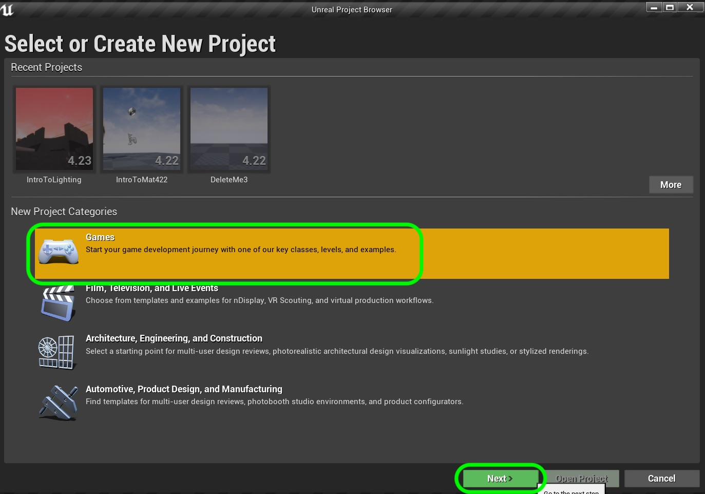

# UE4-BP-Overview Page 1
_____ 

## Index
_____ 

* Part I - Getting Up and Running with Unreal
3. [Setting Up Unreal](UE4-BP-Overview-1.html#setting-up-unreal)

* Part II - Types in UE4
1. [Alter Text in Blueprint](UE4-BP-Overview-2.html#alter-text-in-blueprint)
2. [Variable Initialization](UE4-BP-Overview-2.html#variable-initialization)
3. [Add Blueprint and Run Game](UE4-BP-Overview-2.html#add-blueprint-and-run-game)
4. [Convert Float to Text](UE4-BP-Overview-2.html#convert-float-to-text)

* User Input
1. [User Input Add to Float](UE4-BP-Overview-3.html#user-input-add-to-float)
2.  [Integer in Blueprints](UE4-BP-Overview-3.html#integer-in-blueprints)

* Part IV - Conditional If in Blueprints
1. [New Room Countdown Timer](UE4-BP-Overview-3.html#new-room-countdown-timer)
2. [New Room Countdown Timer Part II](UE4-BP-Overview-4.html#new-room-countdown-timer-part-ii)

* Part V - Switch Statement and Loops
1. [Switch Statement in UE4](UE4-BP-Overview-5.html#switch-statement-in-ue4)
2. [While and For Loops](UE4-BP-Overview-6.html#while-and-for-loops)

_____ 

## Setting Up Unreal

It is easiest to manage the various versions of Unreal using the **Epic Launcher**.  Thi allows you to install and run multiple versions of the engine.  Go to [https://www.epicgames.com/store/en-US/download](https://www.epicgames.com/store/en-US/download) and install the Epic Game Launcher.  From here we will manage our game assets and resources. 

_____ 



{:start="{{ num }}"}
{{ num }}. You will need to have an account with Epic games, but don't worry they are free to register for.  Unreal Engine 4 is freely available for students.

  

_____ 



{:start="{{ num }}"}
{{ num }}. Once you have installed the launcher run the program and select **Unreal Engine** on the side menu and **Library** on the top menu. Press the **+** button to add a new build (if needed) and select the latest version.  In my case it is `4.24.1`. Make sure it is of version `4.24.x` if you want to ensure that you are compatible with this walk through.

  

_____ 



{:start="{{ num }}"}
{{ num }}. Press the **Install** button and get yourself a cup off tea.  This could take from 15 minutes to an hour or more depending on the speed of your PC and the bandwidth of your internet connection.

  

_____ 



{:start="{{ num }}"}
{{ num }}. Now once it installs press the **Launch** button on the latest version of Unreal.

  

_____ 



{:start="{{ num }}"}
{{ num }}. Make sure you quit Visual Studio if it is still open. Select a new **Games** project then press the **Next** button.  

  

_____ 


{:start="{{ num }}"}
{{ num }}. This brings up the **Template** screen.  This allows you to select games with the key assets already implemented.  We will select a **Blank** project then press the **Next** button.  

  

_____ 


{:start="{{ num }}"}
{{ num }}. We will start with a **C++** project.  Leave the quality at **Maximum Quality**, **Raytracing** disabled, a target platform of **Desktop / Console** and we have **No Starter Content**.  Outside of changing Blueprint to C++, all other settings should be default.  Then select a folder and call the project `MyFirstProject`. Press the **Create Project** button.

  

_____ 



{:start="{{ num }}"}
{{ num }}. You should get to a project screen with an **Untitled** map with some elements already placed for you in the **World Outliner**.  You see an **Atmospheric Fog** which adds some fog to the scene (sometimes used to cut down draw calls for distant objects), a floor to move around on, a light source simulating the sun a **Player Start** object that decides where the player gets spawned when the level starts, a **Sky Sphere** that contains the sky and sun in a round ball that we are inside of, a **SkyLight** that imitates bounced lights so that the shadows are not as sharp and there is detail in parts of then scene that don't have direct sun and finally a **SpereReflector** object that handles reflecting objects in shiny surfaces.  We will just leave all of this alone, and you can hit the **Play** button and notice that nothing happens but you can move around the scene with the arrow buttons.

  

_____ 



{:start="{{ num }}"}
{{ num }}. You should also have a Visual Studio project that's all set up for you ready to go.  Currently we will not be using it, but you should have a VS window that looks like mine. Next up we will create our first map.

  

_____ 

  

[Home](../index.html)&nbsp;&nbsp;&nbsp; [Continue ->](UE4-BP-Overview-2.html)
   
   
   

