# UE4-BP-Overview Page 2
_____ 

## Index
_____ 

* Part I - Getting Up and Running with VS & Unreal
3. [Setting Up Unreal](UE4-BP-Overview-1.html#setting-up-unreal)

* Part II - Types in UE4
1. [Alter Text in Blueprint](UE4-BP-Overview-2.html#alter-text-in-blueprint)
2. [Variable Initialization](UE4-BP-Overview-2.html#variable-initialization)
3. [Add Blueprint and Run Game](UE4-BP-Overview-2.html#add-blueprint-and-run-game)
4. [Convert Float to Text](UE4-BP-Overview-2.html#convert-float-to-text)

* User Input
1. [User Input Add to Float](UE4-BP-Overview-3.html#user-input-add-to-float)
2.  [Integer in Blueprints](UE4-BP-Overview-3.html#integer-in-blueprints)

* Part IV - Conditional If in Blueprints
1. [New Room Countdown Timer](UE4-BP-Overview-3.html#new-room-countdown-timer)
2. [New Room Countdown Timer Part II](UE4-BP-Overview-4.html#new-room-countdown-timer-part-ii)

* Part V - Switch Statement and Loops
1. [Switch Statement in UE4](UE4-BP-Overview-5.html#switch-statement-in-ue4)
2. [While and For Loops](UE4-BP-Overview-6.html#while-and-for-loops)

_____ 

## Alter Text in Blueprint

_____ 



{:start="{{ num }}"}
{{ num }}. Go back to the game engine and we want to add two folders.  One to hold the blueprints (a visual scripting language in UE4) and another to hold our levels, or in UE4 refered to as **Maps**.  So press the green **Add New** button in the **Content Browser** and select **New Folder**:

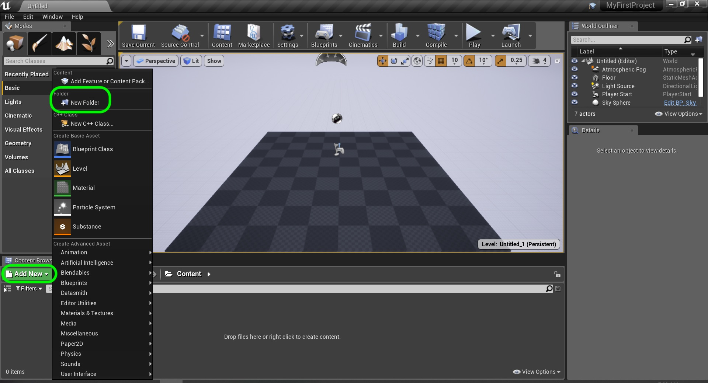  

_____ 



{:start="{{ num }}"}
{{ num }}. Call the folder `Maps` then repeat this process for a second folder called `Blueprints`. Now your **Content Browser** should look like:

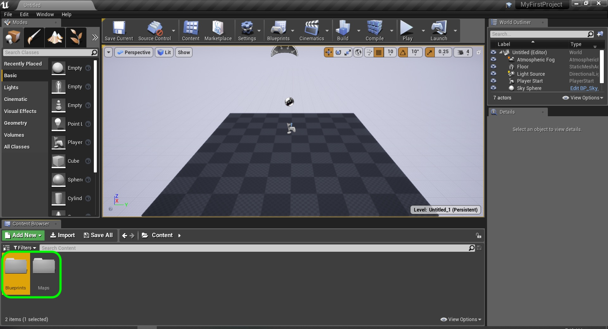  

_____ 



{:start="{{ num }}"}
{{ num }}. Let's add a **Blueprint** to the game that will hold some text.  Press the green **Add New** button agian and select **Blueprint Class**:

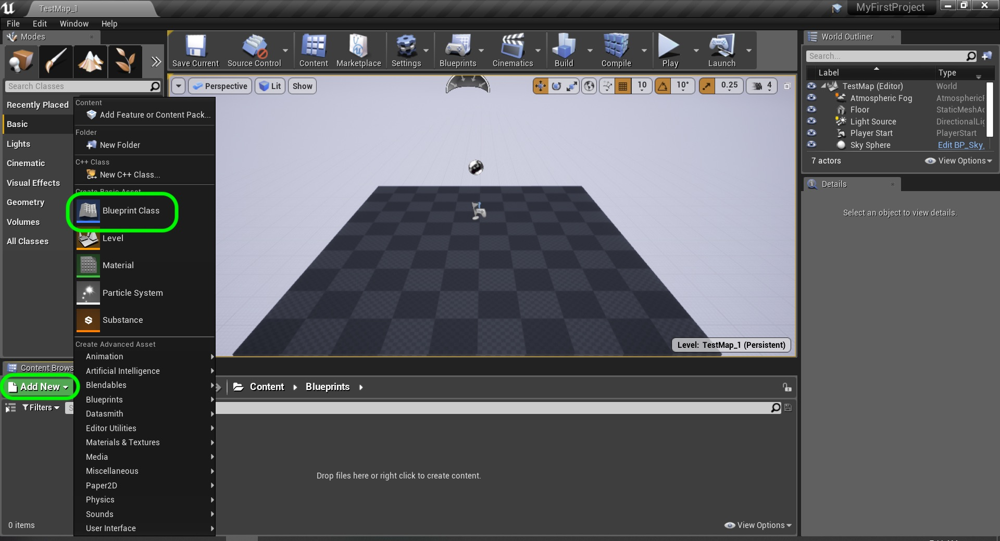  

_____ 



{:start="{{ num }}"}
{{ num }}. Select **Actor Class** (we will be getting into classes later).  This is the minimum class needed to be a game object in the world.  This comes with lots of functionality that we will explore as we go along.  The most important thing is that it allows us to attach geometry, text and apply physics to that object.

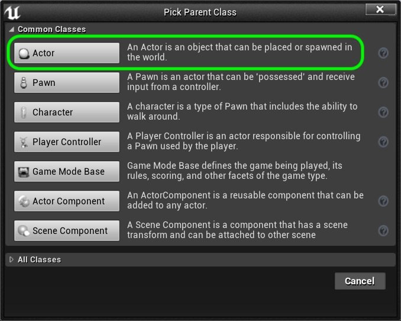  

_____ 



{:start="{{ num }}"}
{{ num }}. Name that Blueprint `BP_Float`.  We are using [Unreal's Wiki naming convention](https://wiki.unrealengine.com/Assets_Naming_Convention) for our projects.  They recommends that we preface blueprint names with `BP_`.

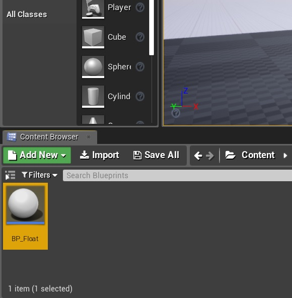  

_____ 



{:start="{{ num }}"}
{{ num }}. At the top left corner select the **File** menu item and then pick **Save Current**. 

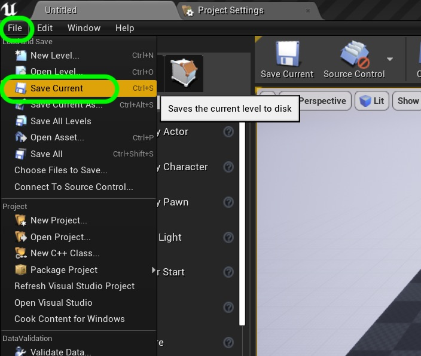  

_____ 


{:start="{{ num }}"}
{{ num }}. Call the map `TestMap_1` and save it in the **Maps** folder. Press the **Save** button.

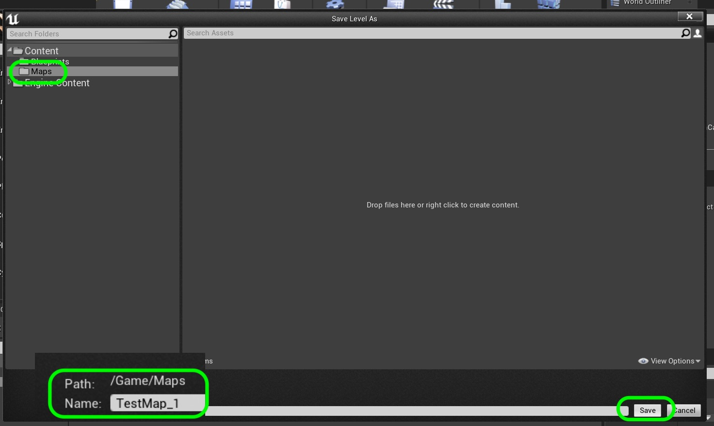  

_____ 


{:start="{{ num }}"}
{{ num }}. Now you should have a blueprint called `bp_float` in the `Blueprints` folder and `TestMap_1` in the `Maps` folder.

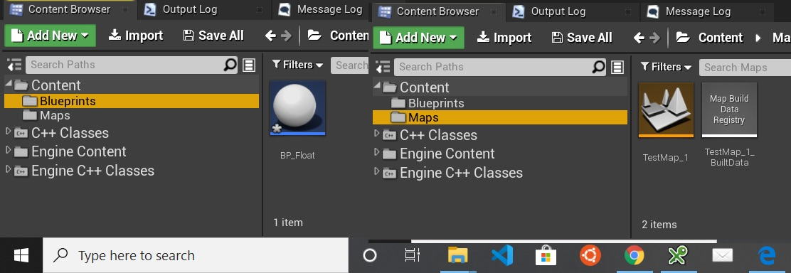  

_____ 


{:start="{{ num }}"}
{{ num }}. Go back to the **Blueprints** folder and double click on `BP_FLoat`.  I like to dock this separate tab as part of my main project so I can drag it next to my map and dock this tab.  I then select the **Viewport** so I can see what this object will contain.  Now we can add components to this object like a mesh or a skeleton.  In this case we will press the **Add Component** button and add a **TextRender** component.  Just start to enter the world `TextRender` and it should reduce hte options down to this one option.  This will render a 2-D font in the game view.

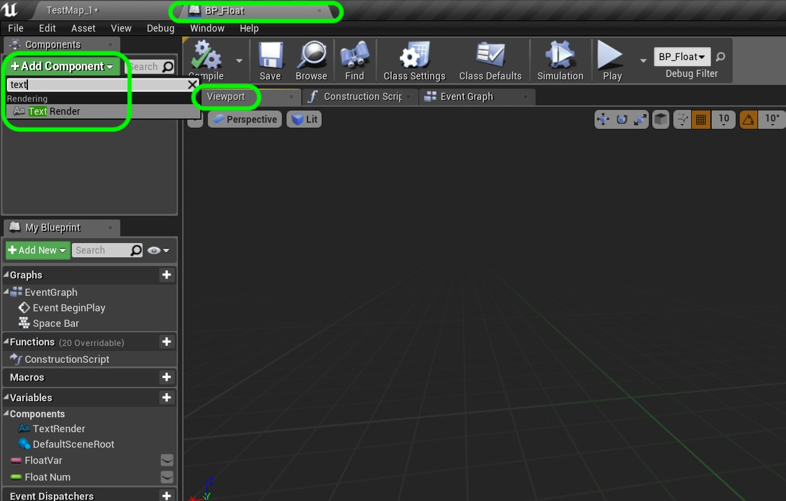  

_____ 



{:start="{{ num }}"}
{{ num }}. Click on the **Text Render** component and press the **F** key on your keyboard to focus on that object.  The camera should reposition to see the text. Change the default text to `Add Text Here`.

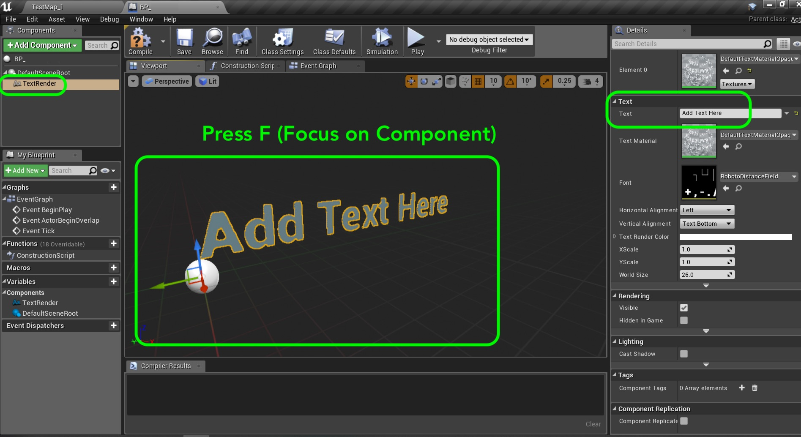  

_____ 



{:start="{{ num }}"}
{{ num }}. Pick a color that will contrast with white clouds and a blue sky.  I picked a gold color.

  

_____ 



{:start="{{ num }}"}
{{ num }}. Now click on the **Event Graph** tab and lets get started adjusting the text on this **Blueprint**.  Delete all nodes except for **Event BeginPlay**.  The **BeginPlay** event is triggered as soon as you start the game (press the play button).  We will dynamically chnage the text when the happens so we should never see the default text we set.

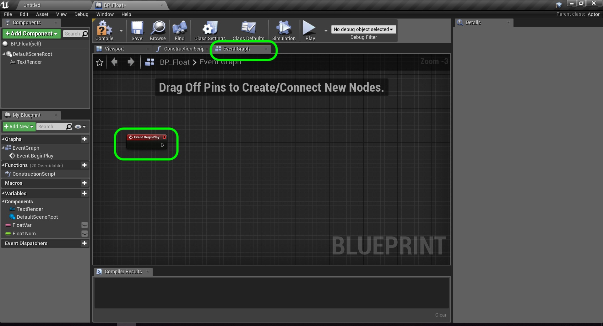  

_____ 



{:start="{{ num }}"}
{{ num }}. To adjust this **Text** component we need a reference to it in the editor.  Drag and drop the **TextRender** node to the open graph by dragging and dropping it with the left mouse button.

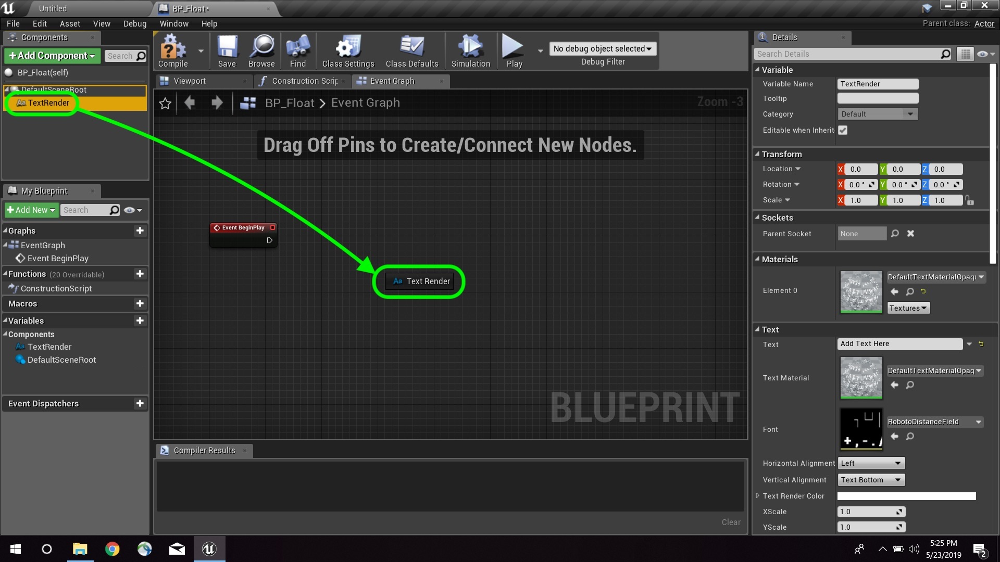  

_____ 



{:start="{{ num }}"}
{{ num }}. Now drag off of the output pin from the **TextRender** node with your left mouse button and an action menu pops up and you want the **Set Text** function.  Type this in and select this function node.

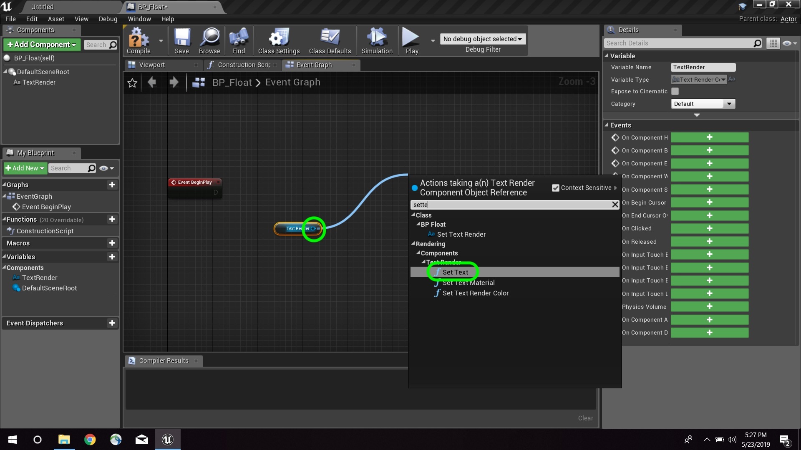  

_____ 


{:start="{{ num }}"}
{{ num }}. So what type is the **Value pin** need to take as input?  In Unreal each pin directs data of different types.  If you hover over the **Value pin** with your mouse the type of **Text** appears.  Now most game engines will not use the standard templates that are provided with C++ as they are not written for application in real time systems that have performance at the forefront as opposed to reliability and error proneness.    

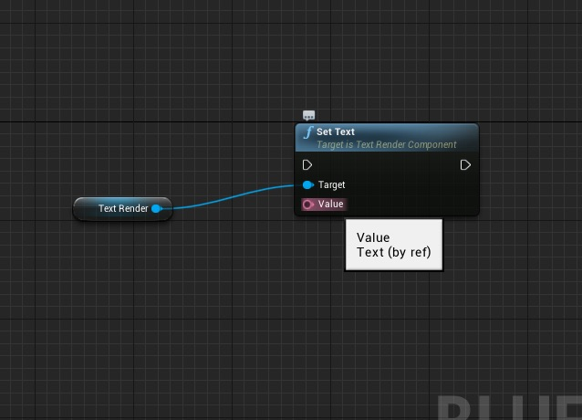  

_____ 



{:start="{{ num }}"}
{{ num }}. If you do not know about text types, it might be good to read the history of how we got here in [Unicode and Character Sets](https://www.joelonsoftware.com/2003/10/08/the-absolute-minimum-every-software-developer-absolutely-positively-must-know-about-unicode-and-character-sets-no-excuses/): In UE4 They have created three text templated types.  They are **FText**, **FName** and **FString**.  [FName](https://docs.unrealengine.com/en-us/Programming/UnrealArchitecture/StringHandling/FName) are used for names (non-customer facing) of items in the **Content Browser**. This format has 8 bytes per character.  [FString](https://docs.unrealengine.com/en-us/Programming/UnrealArchitecture/StringHandling/FString) is a 
16 byte format that allows dynamic modification as well as replace, search concatonate etc...  [FText](https://docs.unrealengine.com/en-us/Programming/UnrealArchitecture/StringHandling/FText) a 40 byte format is for all customer facing text that requires localization.  Please note that in **Blueprints** we do not have the built-in **char** type. You can use it in C++ only but won't work in a **Blueprint**.

_____ 



{:start="{{ num }}"}
{{ num }}. Since our text is customer facing in the game, this function requires using an **FText** data type.  Now we can promote this pin to a **Variable** (creates a new variable of **FText** data type). Right click on the **Value** pin in the **Set Text** node to and select **Promote to Variable**. 

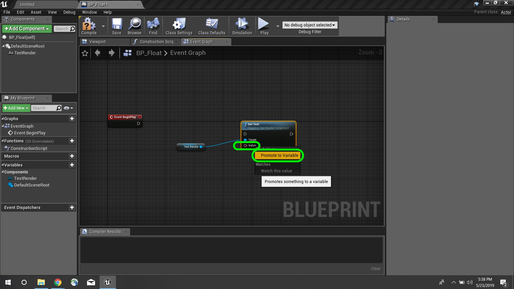  

_____ 


{:start="{{ num }}"}
{{ num }}. Click on the new Variable and call it `FloatVar`.

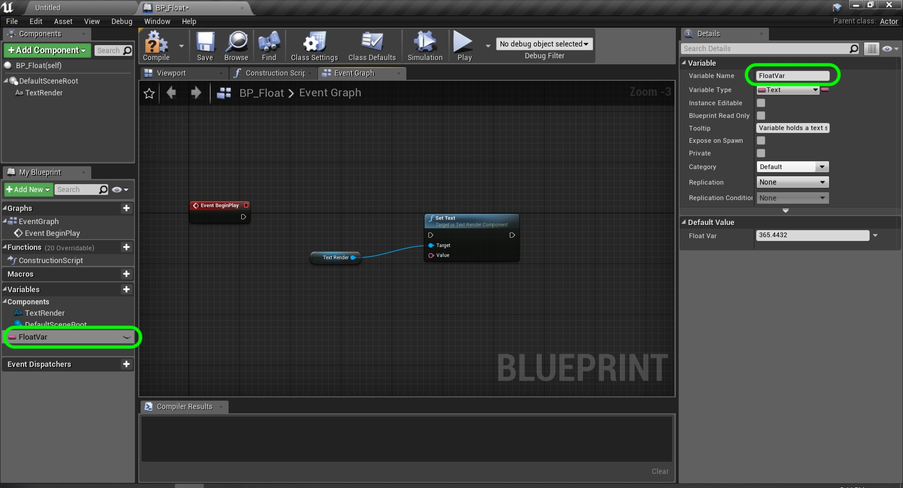  

_____ 


{:start="{{ num }}"}
{{ num }}. If you select the **Variable Type** drop down on the right hand side you can see that the three text types are available in Blueprints.  Notice that there is not type **Double** available (one of the built in C++ types).  You can still use doubles in your C++ code, but will not be able to use it in Blueprints as of this time.

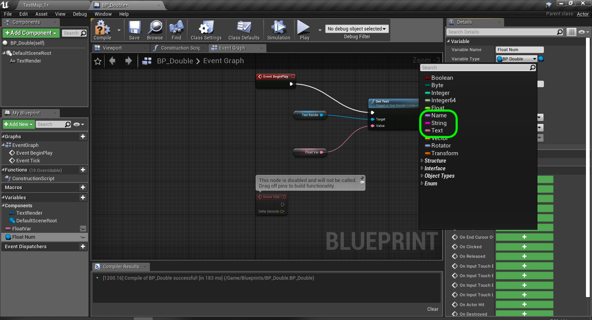  

_____ 

## Variable Initialization

_____ 



{:start="{{ num }}"}
{{ num }}. In C++ we initilize the variable when it is declared (if we can).  In **Blueprints** this is done by setting its default value in the **Details** panel of the variable.  Now **Blueprints** just like C++ needs to be compiled and you notice that it says you can't set the default until it is compiled.  There is a **Compile** button on top that displays a question mark that indicates that there are changes that need to be compiled before you can see the result in game.  Press the **Compile** button.

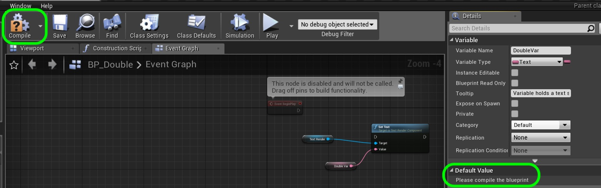  

_____ 


{:start="{{ num }}"}
{{ num }}. Now the **Compile** button has a green check mark indicating no errors.  Now a box appears that allows us to enter a default value.  We will be manipulating a **float** so lets enter a fractional number, I used `365.4432`.

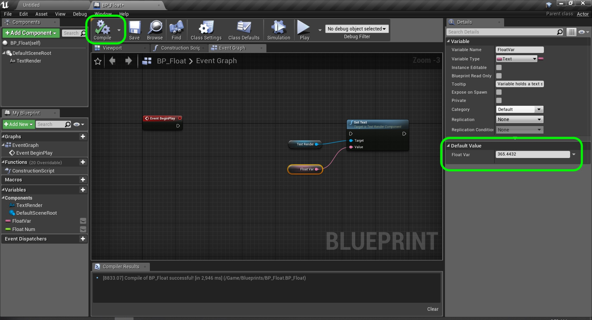  

_____ 

## Add Blueprint and Run Game
_____ 


{:start="{{ num }}"}
{{ num }}. Lets try this **Blueprint** that holds a text component in game.  Open the **Map** tab and go to the **Blueprints** folder.  Drag one instance of `BP_Float` into the scene then adjust the position by pulling on the arrows in the Blueprints in the scene.  Press the **Play** button and look around, you should see the text.  I lucked into the fact that my player was facing this text at the begining of the game.

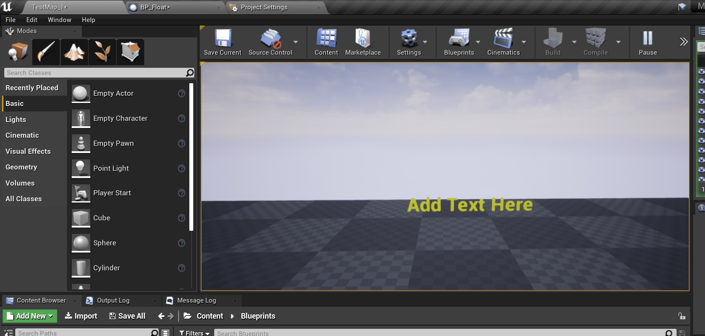  

_____ 


{:start="{{ num }}"}
{{ num }}. Now if you want to have the game start by looking at this text we need to adjust where the player is first launched.  Go to the game screen and click on the **Player Start** actor in the **World Outliner**.  The red, blue and green arrows are the X, Y, Z coordinate of the actor in the scene and the light blue arrow is the facing direction of the playe character that the game spawns.  Unreal automatically creates a default player unless you define your own and override it.   Now the tool defaults to displace the actor in 3D space.  You can also rotate it.  If you want to rotate the actor to face a different starting position press the rotation tool and you can now rotate on the **X**, **Y**, or **Z** axis.

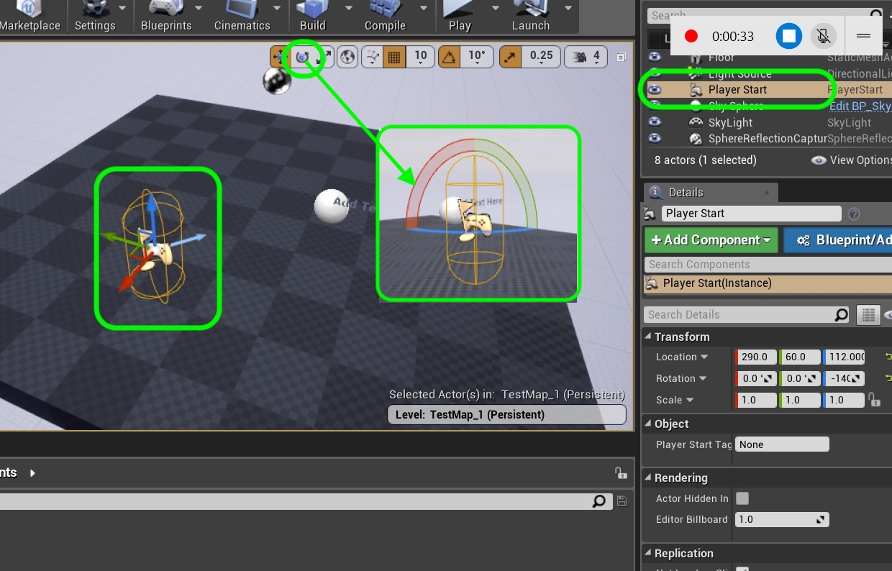  

_____ 


{:start="{{ num }}"}
{{ num }}. Notice that the text in game shows the default initialized text of **Add Text Here**. The blueprint didn't change the text to the numerical value we entered.  This is the most common error in blueprints.  Since this is a node based form of code the program needs to know what order to operate each node in.  There are execution pins (white) that you connect that determines what gets processed in what order.  Open `BP_Float` and connect the execution pin from **Event Begin Play** to the **Set Text** function node.

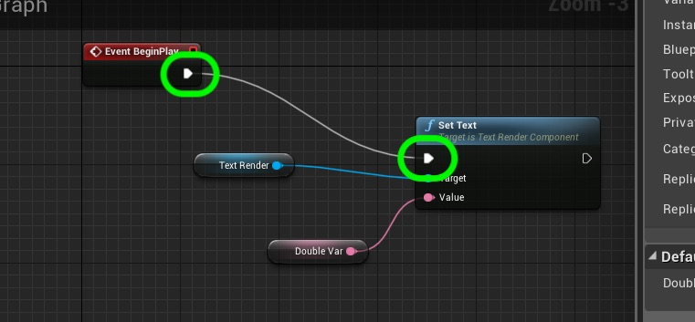  

_____ 


{:start="{{ num }}"}
{{ num }}. Now go back to the game and press play. Notice that it goes from **Add Text Here** before you run and as soon as you run the game it changes to **365.4432**.  This shows that the **Begin Play** event runs at the time that the game starts.

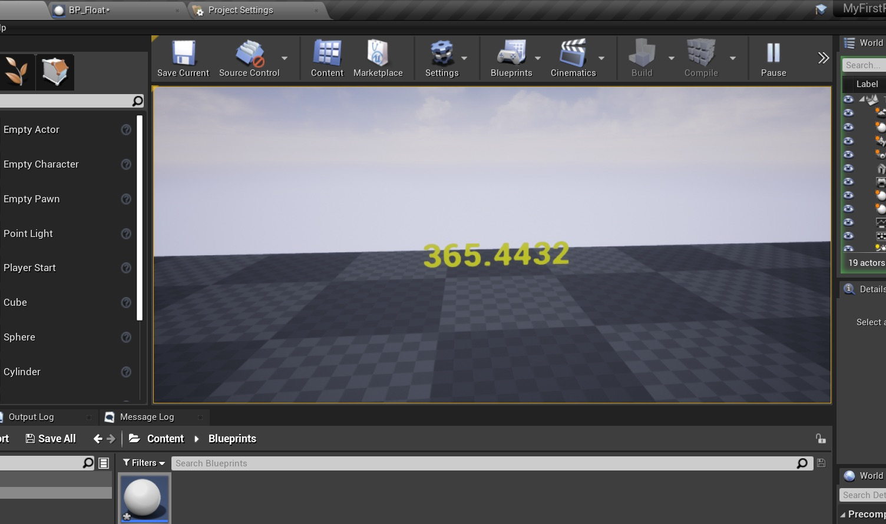  

_____

## Convert Float to Text

_____
 


{:start="{{ num }}"}
{{ num }}. Now if you look at the UE4 [Coding Standards](https://docs.unrealengine.com/en-us/Programming/Development/CodingStandard#portablealiasesforbasicc++types) you will see that it looks like for all their supported platforms that **Floats** are 4 bytes. Types like **bool** they state that you can NEVER assume the size of bool.  But with float and doubles it looks like the native type in C++ will work on all supported platforms.  Open `BP_Float` and lets add a variable of type **Float**. Now we can also create a new variable by press the **+** button in the **Variables** tab to add a new **Variable**.  Change the **Variable Type** in the **Details** panel to **Float** and change the name to `FloatNum`.

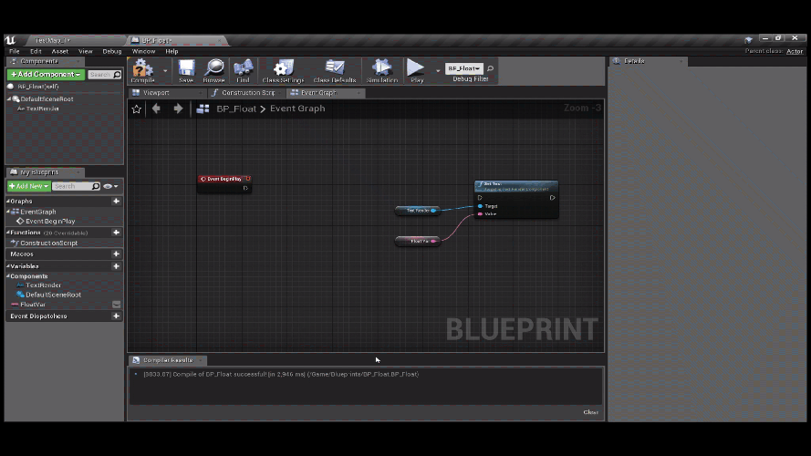  

_____ 


{:start="{{ num }}"}
{{ num }}. Now lets display an actual float as opposed to entering a number in an **FText** type.  This way we can do math and alter it.   Go to `BP_Float` and delete the `FloatVar` from the **Event Graph** (Don't delete the actual variable), then drag and drop a copy of the `FloatVar ` and select **Set Float Var** so you can set this value.  Then drag and drop `Float Num` and select **Get Float Num**.    Connect the output of **Float Num** to the input of **Set Float Var**. Also notice that it creates a new node and connects it for you that casts the **float** type to a **FText** type in the blueprint.  Connect the output of **Set Float Num** to the input **Value** of the **Set Text** node. Finally connect th eoutput of **EventBeginPlay** node execution pin to the **Set Float Var** input execution pin.  Send the output to the **SetText** input execution pin.

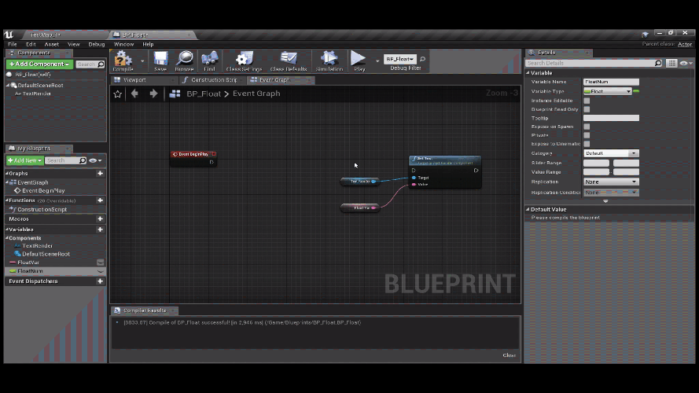  

_____ 


{:start="{{ num }}"}
{{ num }}. Now we need to inialize this new **float** variable.  Press the **Compile** button.  Then select the new **FloatNum** variable and in the **World Outliner** set the **Default Value** to a different number.  Then go to the game and try running it to see if this new value is now displayed!  Next up we will add a user input that will add to this value and change it dynamically.

  

_____ 

  

[<- Previous](UE4-BP-Overview-1.html)&nbsp;&nbsp;&nbsp;[Home](../index.html)&nbsp;&nbsp;&nbsp; [Continue ->](UE4-BP-Overview-3.html)
   
   
   

