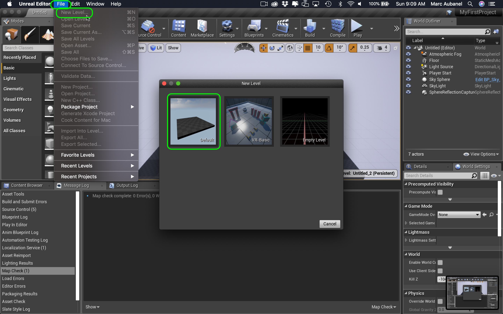
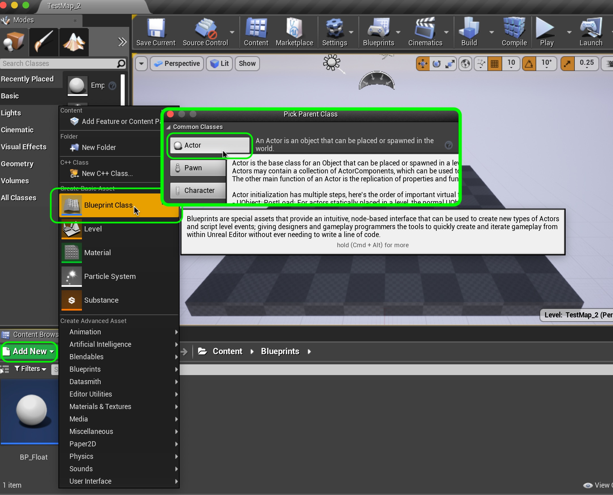

# UE4-BP-Overview Page 3
_____ 

## Index
_____ 

* Part I - Getting Up and Running with VS & Unreal
3. [Setting Up Unreal](UE4-BP-Overview-1.html#setting-up-unreal)

* Part II - Types in UE4
1. [Alter Text in Blueprint](UE4-BP-Overview-2.html#alter-text-in-blueprint)
2. [Variable Initialization](UE4-BP-Overview-2.html#variable-initialization)
3. [Add Blueprint and Run Game](UE4-BP-Overview-2.html#add-blueprint-and-run-game)
4. [Convert Float to Text](UE4-BP-Overview-2.html#convert-float-to-text)

* User Input
1. [User Input Add to Float](UE4-BP-Overview-3.html#user-input-add-to-float)
2.  [Integer in Blueprints](UE4-BP-Overview-3.html#integer-in-blueprints)

* Part IV - Conditional If in Blueprints
1. [New Room Countdown Timer](UE4-BP-Overview-3.html#new-room-countdown-timer)
2. [New Room Countdown Timer Part II](UE4-BP-Overview-4.html#new-room-countdown-timer-part-ii)

* Part V - Switch Statement and Loops
1. [Switch Statement in UE4](UE4-BP-Overview-5.html#switch-statement-in-ue4)
2. [While and For Loops](UE4-BP-Overview-6.html#while-and-for-loops)

_____ 

## User Input Add to Float

_____ 



{:start="{{ num }}"}
{{ num }}. Open up `BP_Float` and right click under the graphs.  Type in the search bar `Keyboard Events X` and you want to trigger an event when the **X** button is pressed by the object.

  

_____ 



{:start="{{ num }}"}
{{ num }}. Left click on `Float Num` and drag it to the graph and select `Get Float Num`.  Grab the output of this node with a left click, drag and select a **Float + Float** node.  Add a floating point number to the **Float + Float** node. I added `2.3333`.  Drag another copy of the `FloatNum` node but this time select **Set Float Num** in the pop up menu.  Connect the output of the **Float + Float** node to the input pin of the **Set** node.  Connect the **Pressed** execution pin to the execution input of the **Set** node. 

  

_____ 



{:start="{{ num }}"}
{{ num }}. Now we also need to up date the font in this object.  We need to re-cast the **float** to a **FText** variable. Take the output of **Set Num** execution pin for the keyboard event and send it to the input execution pin of the **Set FloatVar** node.  Note that you cannot take multiple pins from an execution output but can send multiple pins to an input.

  

_____ 



{:start="{{ num }}"}
{{ num }}. Press the **Play** button and press the **X** key on the keyboard.  Now nothing happens. So an **Actor** class in Unreal defaults to not reading input.  If you want an actor to read input you need to set which player/controller it will be.  Click on the `BP_Float` actor in the scene then in the **Details** panel scroll down to the **Auto Receive Input** tab and set it to `Player 0`.

  

_____ 



{:start="{{ num }}"}
{{ num }}. Now press play again and make sure you click in the scene file with your left mouse button so that you are playing the game (there should be no cursor).  Press the **X** key and you should see the number go up in the game.

  

_____ 

## Integer in Blueprints
Now integer's in blueprints are of a guaranteed size. The **Integer** is a 32 bit integer and **Integer64** is a 64 bit integer. These are not the same as a plain c++ int where the size is platform dependant.  These are types that are part of the UE4 SDK and not a native c++ type.

_____



{:start="{{ num }}"}
{{ num }}. Press the **+** button in the **Variables** tab and add a new variable.  Name it `IntNum` and set it to type **Integer** (not Integer64).  Press the **Compile** button.  Set a default value, I am using `1000`.  Press **Compile**again.

  

_____ 



{:start="{{ num }}"}
{{ num }}. Drag the newly created `IntNum` to the graph and select **Get Int Num**.  

  

_____ 



{:start="{{ num }}"}
{{ num }}. Now drag off of the output of the **IntNum** var and select a **ToText(integer)** node.

  

_____ 



{:start="{{ num }}"}
{{ num }}. Now you should have a **ToText** node.  Now how can we manipulate **FText**.  Unlike **strings** we can't manipulate them with the **+** operator.  We will need to use a special node.

  

_____ 



{:start="{{ num }}"}
{{ num }}. Right click on an empty portion of the graph and add a **Format Text** node to the graph.

  

_____ 



{:start="{{ num }}"}
{{ num }}. Now we want to add these two numbers with some characters in between.  We can add pins to the **Format Text** node by naming them in curly braces {}.  So type `{A} | {B}` and press enter.  Now this will add two pins names **A** and **B**.  It also will inject a space and a \| and another space to separate the two **FText** characters.  

  

_____ 



{:start="{{ num }}"}
{{ num }}. Connect the **Return Value** pin from the **To Text(Integer)** output node to the **B** pin of the **Format Text** node.  Highjack the **To Text(Float)** output pin and send it to the **A** pin of the **Format Text** node.  Send the output of the **Format Text** and send it to the input of the **Set FloatVar** node.  Take the output from the **Result** pin and send it to the **FloatVar** input pin in the **Set FloatVar node**

  

_____ 



{:start="{{ num }}"}
{{ num }}. Now play the game and you should see the **integer** concatonated with the **float** in a longer **FText** class. You can still press the **X** button to affect the **float** but the **integer** stays the same.

  

_____ 

## New Room Countdown Timer
Lets look at conditional statements in Unreal.  We will create a new room and have a blueprint that counts down in seconds from 50 to 0 then stop.  

_____ 



{:start="{{ num }}"}
{{ num }}. First lets see how to adjust what room UE4 loads up as default.  Go to **File \| Save All** to save your progress to date.  Then select **File \| Exit** to quit the game. Run the game again and you will find that it loads back to the **Untitled** room.

  

_____ 



{:start="{{ num }}"}
{{ num }}. We need to tell Unreal what room we want to start the game with.  In the top menu select **Edit \| Project Settings** and got to **Maps and Modes** under the **Project** heading on the left hand side menu.  You can select the default 1st map for the game as well as the map the editor boots up to (the latest map you are working on).

  

_____ 



{:start="{{ num }}"}
{{ num }}. Now lets add a room for the new level we will be building.  If you are not on an **Untitled** level you can press **File \| New Level** from the top level menu and then select the **Default** Level.

  

_____ 



{:start="{{ num }}"}
{{ num }}. Press **File \| Save Current** and call this new room `TestMap_2` and save it in the **Maps** folder.

  

_____ 



{:start="{{ num }}"}
{{ num }}. Go back to **Edit \| Project Settings** and got to **Maps and Modes** and change **Game Default Map** to `TestMap_1` and **Game Startup Map** to `TestMap_2`.   Now quit and reload the game and notice that it now boots up to the second map.

  

_____ 



{:start="{{ num }}"}
{{ num }}. Go to the **Blueprints** folder and press the green **Add New** button and select a new **Blueprint Class**.  This brings up the different classes available and now you can select the **Actor** class.

  

_____ 



{:start="{{ num }}"}
{{ num }}. Name this blueprint `BP_Countdown` and make sure you save it in the **Blueprints** folder.  Now press **File \| Save All** to save all levels and progress so far.

  

_____ 



{:start="{{ num }}"}
{{ num }}. Open `BP_Countdown` and press the green **Add Component** button and select a **Text Render** component.

  

_____ 



{:start="{{ num }}"}
{{ num }}. Now you can customize the name of the components.  Change the name in the **Components** tab to `CountdownText`.  Then also change the **Text** field to read `Countdown Text`.

  

_____ 



{:start="{{ num }}"}
{{ num }}. Open the **Event Graph** tab.  Delete all events except for the **Event Tick**. This event type is in the main game loop.  This means it runs as fast as it can and gets called each frame.  Make sure you only put items that need to be updated **EVERY** frame.  We want to keep track of time so we will be updating every frame in our case.  Left click and drag a reference to the **Countdown Text** node to the graph next to the event.

  

_____ 


{:start="{{ num }}"}
{{ num }}. Now drag the output from the **Countdown Text** pin select a **Set Text** node.

  

_____ 


{:start="{{ num }}"}
{{ num }}. Now we have a **Delta Seconds** pin.  This gives us the time in milliseconds since last frame.  Drag this pin into the **Value** input of the **Set Text** node and notice that it is converting **Float** to **Text**.  So we know that **Delta Seconds** is a float.

  

_____ 



{:start="{{ num }}"}
{{ num }}. Now this node does nothing unless its execution pin is connected.  Take the **Event Tick** execution pin to the input pin of the **Set Text** node.

  

_____ 



{:start="{{ num }}"}
{{ num }}. Go back to the map and drag an instance **BP_Countdown** into the game scene.  Position and rotate it so that it faces the **Player Start** arrow so that you start the game by looking at the text.

  

_____ 



{:start="{{ num }}"}
{{ num }}. Press the **Compile** button.  Then run the game.  In my case I can't read the text as it is white text on white clouds.  Open the **BP_Countdown** blueprint and go to the **Viewport** window and pick the **CountdownText** component.  Change the font color from **white** to a contrasting color.

  

_____ 



{:start="{{ num }}"}
{{ num }}. Now press the **Compile** button and press the **Play Button**.  You can see that it prints out the amount of time in milliseconds since last frame.  This framerate is pretty consistent as there is not a lot going on in the scene.

  

_____ 



{:start="{{ num }}"}
{{ num }}. That is not really what we wanted.  We want it to countdown and subtract the last frame time continually. Create a new variable by pressing the **+** button and calling it `GameTime`, select variable type **Float** and then press the **Compile** button. Set the **default** value to `100`.

  

_____ 



{:start="{{ num }}"}
{{ num }}. Now draw a reference of this variable into the graph and select **Get**.  Pull off the output pin and select a **Float - Float** node.

  

_____ 



{:start="{{ num }}"}
{{ num }}. Subtract **Delta Seconds** from the **GameTime** variable which defaults to a 100.  Add another copy of **GameTime** but this time we want to set the variable.  We want to save the subtraction of time in milliseconds since the last frame.

  

_____ 



{:start="{{ num }}"}
{{ num }}. Send the output of the **Set Game Time** variable to the input of **ToText**.  Then connect the execution pins to go through **Set Game Time**.

  

_____ 



{:start="{{ num }}"}
{{ num }}. Now press the **Compile** button and lets hit play.  Now the text should countdown from 100 but with a fractional output. On the next page we will look at truncating the countdown so it is only showing seconds.

  

_____ 

  

[<- Previous](UE4-BP-Overview-2.html)&nbsp;&nbsp;&nbsp;[Home](../index.html)&nbsp;&nbsp;&nbsp; [Continue ->](UE4-BP-Overview-4.html)
   
   
   

