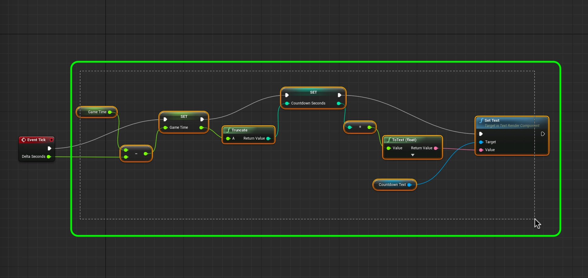
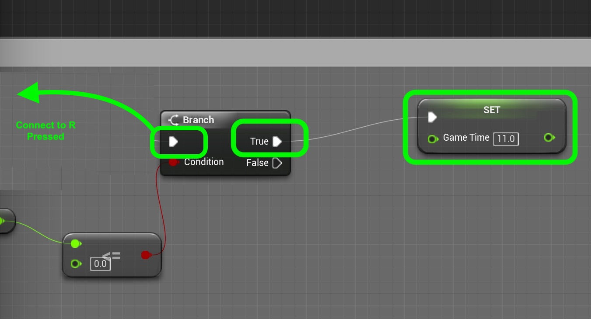

# UE4-BP-Overview Page 4
_____ 

## Index
_____ 

* Part I - Getting Up and Running with VS & Unreal
3. [Setting Up Unreal](UE4-BP-Overview-1.html#setting-up-unreal)

* Part II - Types in UE4
1. [Alter Text in Blueprint](UE4-BP-Overview-2.html#alter-text-in-blueprint)
2. [Variable Initialization](UE4-BP-Overview-2.html#variable-initialization)
3. [Add Blueprint and Run Game](UE4-BP-Overview-2.html#add-blueprint-and-run-game)
4. [Convert Float to Text](UE4-BP-Overview-2.html#convert-float-to-text)

* User Input
1. [User Input Add to Float](UE4-BP-Overview-3.html#user-input-add-to-float)
2.  [Integer in Blueprints](UE4-BP-Overview-3.html#integer-in-blueprints)

* Part IV - Conditional If in Blueprints
1. [New Room Countdown Timer](UE4-BP-Overview-3.html#new-room-countdown-timer)
2. [New Room Countdown Timer Part II](UE4-BP-Overview-4.html#new-room-countdown-timer-part-ii)

* Part V - Switch Statement and Loops
1. [Switch Statement in UE4](UE4-BP-Overview-5.html#switch-statement-in-ue4)
2. [While and For Loops](UE4-BP-Overview-6.html#while-and-for-loops)

_____ 

## New Room Countdown Timer Part II
Lets make the number non-fractional, stop at 0 and reset the timer back to a hundred with some conditional statements.

_____ 



{:start="{{ num }}"}
{{ num }}. This is not the most efficient way of solving this problem, but it will test whether blueprints behave like C++ when it comes from casting from float to integer. Add a new **Variable** called `CountdownSeconds` and make it type **Integer**.  Drag a setter to the graph and connect the output of **Set Game Time** to the input of **Set Countdown Seconds**.  Connect the output of **Set Countdown Seconds** to the input of **To Text**.  Connect the execution pins between.

  

_____ 



{:start="{{ num }}"}
{{ num }}. Take your time to clean up your graph. Make sure the nodes are evenly spaced and the flow makes sense (you can read it left to right or up to down).

  

_____ 



{:start="{{ num }}"}
{{ num }}. Left click and select all the nodes to the right of the **Tick** event node:

  

_____ 



{:start="{{ num }}"}
{{ num }}. Press the **C** key on the keyboard to add a comment box around them.  Write an appropriate comment:

  

_____ 



{:start="{{ num }}"}
{{ num }}. Now the nice thing is that you can drag the comment box around and all the nodes in it move with it:

  

_____ 



{:start="{{ num }}"}
{{ num }}. Press the **Compile** and **Run** button and now the countdown should only be the integer portion of the fractional number:

  

_____ 



{:start="{{ num }}"}
{{ num }}. Adjust the `GameTime` **Float** variable to default to `11`.  Compile and run and see that there are two problems.  It stays at 0 for 2 seconds.  It then counts down below zero.  Why is it that it stays at zero for two seconds?  How would you solve it if you could?  Lets fix this by not letting the variable go below zero.  Lets use a conditional statement for that.

  

  

_____ 



{:start="{{ num }}"}
{{ num }}. A conditional **if() else if() else() statement is a **Branch** node in blueprints.  So we are going to check to see if the value goes below zero.  Right click on the graph and add a **Branch** node (you can type if in the text box and it will select the branch node!)

  

_____ 



{:start="{{ num }}"}
{{ num }}. Make some room for it, so you can add some more nodes.

  

_____ 



{:start="{{ num }}"}
{{ num }}. Now lets add a **Float <=** node to the left of the brank.  Pipe the **-** (float - float) output to the top pin.  Leave the bottom value at zero.  Connect the output boolean to the input **Condition** of the **Branch** node.  Connect the false execution pin to the **Set Game Time** node.

  

_____ 



{:start="{{ num }}"}
{{ num }}. Add another **Set GameTime** node and connect it to the **True** execution output from the **Branch** node.  Leave the time at zero, this will clamp the value to 0 no matter how low it goes. Connect the output execution pin to the **Set Coundown Seconds** node.  Now we disconnect the node for input of **Countdown Seconds**.  We can't attach both set float outputs to it.  

  

_____ 



{:start="{{ num }}"}
{{ num }}. Attach the execution pin from the **Tick Event** node to the input of the **Branch** node.  This way the **GameTime** variable gets set either through the true or false path of the branch.  Add a **Game Time** GET node and connet it to the **Set CountdownSeconds** node.  

  

_____ 



{:start="{{ num }}"}
{{ num }}. Run the game and confirm that the countdown starts at 10 then stays at zero?

  

_____ 



{:start="{{ num }}"}
{{ num }}. Now lets add a text prompt for the user to press the **R** key to reset the timer.  It should only appear when the timer runs down to zero. Open up **BP_Countdown** and add a new **Text Component** and call it `RestartCounter`.

  

_____ 



{:start="{{ num }}"}
{{ num }}. Move the text above the countdown text and change the string to `Press R to Restart Countdown`. Change the color to a contrasting color with the sky, I picked yellow.

  

_____ 



{:start="{{ num }}"}
{{ num }}. Run the game and you will see that the message appears all the time.  Make any positioning adjustments that you need to and we will turn it off until the counter gets to zero.

  

_____ 



{:start="{{ num }}"}
{{ num }}. Go back to **BP_Countdown** and add an **Event Begin Play** node.  This runs once when the object is instantiated.

  

_____ 



{:start="{{ num }}"}
{{ num }}. Drag a reference to the **RestartCounter** component to the graph.  Pull off the output pin and select a **Set Hidden in Game** node and set **New Hidden** to `true`.  Drag the execution pin from the **Event Begin Play** node and connect it to the input of the **Set Hidden in Game** node.    Press run and you see that this text component is now hidden.

  

_____ 



{:start="{{ num }}"}
{{ num }}. Now we need to unhide this component when the timer gets to zero.  Copy and paste the **Restart Counter** and **Set Hidden in Game** node and set **New Hidden** to `false`.  Connect the execution pins between **Set GameTime** and **Set CountdownSeconds** nodes.

  

_____ 



{:start="{{ num }}"}
{{ num }}. Now run the game and this message should only appear when the timer gets to zero.

  

_____ 



{:start="{{ num }}"}
{{ num }}. OK, now we need to add the functionality to press R to restart the timer. Add a **R Keyboard** event node to the graph at the bottom:

  

_____ 



{:start="{{ num }}"}
{{ num }}. Drag a copy of the **GameTime** variable reference to the graph and select **Get Game Time**.

  

_____ 



{:start="{{ num }}"}
{{ num }}. Drag off of the output of the **GameTime** node and select a **Float <= Float** node.

  

_____ 



{:start="{{ num }}"}
{{ num }}. Pull from the output of the **<=** node and select a **Branch** node.

  

_____ 



{:start="{{ num }}"}
{{ num }}. Pull a reference to variable **GameTime** but this time we wnat to set it.  Change the value to `11` so that the timer starts again.  Connect the execution pin to the output of the **True Branch** node. Connect the execution pin ofr **R Pressed** to the input execution pin of the **Branch** node:

  

_____ 



{:start="{{ num }}"}
{{ num }}. Copy and paste from the **Begin Play** node the **Restart Counter** and **Set Hidden in Game** node.  Make sure that **NewHide** is set to `true`.  Connect the execution pin to the output of the **Set GameTime** node.

  

_____ 



{:start="{{ num }}"}
{{ num }}. We can't flag this blueprint to receive inp ut by going to the game window to the **World Outliner** and change the **Auto Receive Input** from `Disabled` to `Player0`.

  

_____ 



{:start="{{ num }}"}
{{ num }}. Run the game and press **R** when the countdown reset message appears and it should go back to counting down from 10.  Next up we will look at how blueprints handle switch statements.

  

_____ 

  

[<- Previous](UE4-BP-Overview-3.html)&nbsp;&nbsp;&nbsp;[Home](../index.html)&nbsp;&nbsp;&nbsp; [Continue ->](UE4-BP-Overview-5.html)
   
   
   

