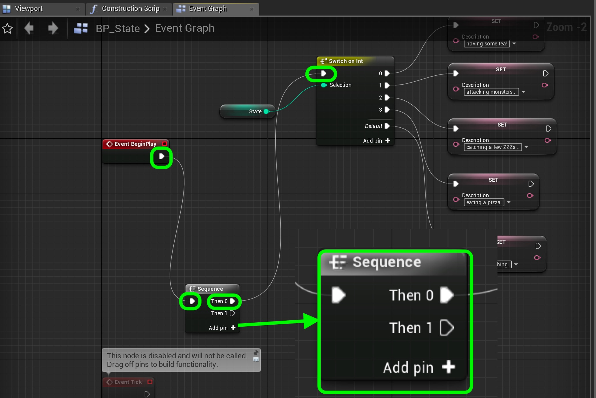

# UE4-BP-Overview Page 5
_____ 

## Index
_____ 

* Part I - Getting Up and Running with VS & Unreal
3. [Setting Up Unreal](UE4-BP-Overview-1.html#setting-up-unreal)

* Part II - Types in UE4
1. [Alter Text in Blueprint](UE4-BP-Overview-2.html#alter-text-in-blueprint)
2. [Variable Initialization](UE4-BP-Overview-2.html#variable-initialization)
3. [Add Blueprint and Run Game](UE4-BP-Overview-2.html#add-blueprint-and-run-game)
4. [Convert Float to Text](UE4-BP-Overview-2.html#convert-float-to-text)

* User Input
1. [User Input Add to Float](UE4-BP-Overview-3.html#user-input-add-to-float)
2.  [Integer in Blueprints](UE4-BP-Overview-3.html#integer-in-blueprints)

* Part IV - Conditional If in Blueprints
1. [New Room Countdown Timer](UE4-BP-Overview-3.html#new-room-countdown-timer)
2. [New Room Countdown Timer Part II](UE4-BP-Overview-4.html#new-room-countdown-timer-part-ii)

* Part V - Switch Statement and Loops
1. [Switch Statement in UE4](UE4-BP-Overview-5.html#switch-statement-in-ue4)
2. [While and For Loops](UE4-BP-Overview-6.html#while-and-for-loops)

_____ 

## Switch Statement in UE4
Lets add a stat to a game object and use a switch statement to change messages.

_____ 



{:start="{{ num }}"}
{{ num }}. Lets save our current level.  Select **File \| Save Current** to save the current level.  Lets create a new level.  Go to **File \| New Level**, and select the **Default** level.  Navigate to the **Content \/Maps** folder in the content browser then press **File \| Save Current**.

  

_____ 



{:start="{{ num }}"}
{{ num }}. Name the new level `TestMap_3` then press the **Save** button.

  

_____ 


{:start="{{ num }}"}
{{ num }}. Since we are working on this map and want to start in this level.  We can change the default map that **Unreal** boots up to. Select **Edit \| Project Settings** and then select **Maps and Modes** under the **Project** heading.  Go to **Editor Startup Map** and select `TestMap_3`.  Now every time you quit and restart it will boot up to this map first. This is not the same as the first level of a game which you can set as well which I have left as the first map.

  

_____ 


{:start="{{ num }}"}
{{ num }}. Lets create another actor class blueprint.  Navigate to the **Content \/Blueprints** folder and press the **Add New** button. Select an **Actor** class. 

  

_____ 


{:start="{{ num }}"}
{{ num }}. Name this class `BP_State`.

  

_____ 


{:start="{{ num }}"}
{{ num }}. Open up **BP_State** and press the **Add Component** button and select a **cube** mesh:

  

_____ 


{:start="{{ num }}"}
{{ num }}. Add a **TextRender** component and call it `StateDescription`.  Change the default text to `I am ` with a space at the end.  We will have the cube read off its state at the moment. Choose a color that contrasts with the sky and clouds.

  

_____ 


{:start="{{ num }}"}
{{ num }}. Now lets move to the **Event Graph** and press the **+** button in **Variables** and add an **Integer** called `State` and we want to edit it in the game window so select **Instance Editable**.

  

_____ 


{:start="{{ num }}"}
{{ num }}. Now create another variable but this time it is type **Text** and is called `Description`.

  

_____ 


{:start="{{ num }}"}
{{ num }}. Now add a **Get** reference for the **State** integer variable onto the event graph.

  

_____ 


{:start="{{ num }}"}
{{ num }}. Now lets add a switch statement in blueprints.  Select form the output pin of the **State** node and select a **Switch** statement.  Press the **Add Pin** button to get 4 pins (0 through 3) with a default pin (the end of the switch statement). Connect the execution pin to the **BeginPlay** node.

  

_____ 


{:start="{{ num }}"}
{{ num }}. We are going to make the first state.  Add a **Set** node for the **Description** variable. Make sure the execution pin from **0** on the **Switch** node goes to the **Set Description** node.  Add a message describing the state, I have `having some tea!`.

  

_____ 


{:start="{{ num }}"}
{{ num }}. Now copy this node and add a state message for each state available.  Here are mine:

  

_____ 


{:start="{{ num }}"}
{{ num }}. Now we want to concatonate the **I am** text render message with the current state.  Now I don't want to pull an execution pin off of each possilbe switch outcome, if there were dozens or hundreds, it would be a painful process. There is a way to control the flow to simplify the node chart.  Right click on the graph and add a **Sequence** node.  This will allow us to order which nodes get called in what order.  Take the output of the **Begin Play** node and route it to the input of the **Sequence** node.  Take the **Then 0** output from the **Sequence** node and send it to the input of the **Switch** node like so:

  

_____ 


{:start="{{ num }}"}
{{ num }}. Now lets concatonate the text. Drag a reference to **StateDescription** to the graph.  Pull off the pin and select **Get Text** as we want the underlying text message **I am**.  Drag a get reference to the **Description** text variable to the graph. Add a **Format Text** node and enter `{A} {B}` to concatonate the two strings (with a space between the two). Connecdt **Taget Text** to **A** and **Description** to **B**.

  

_____ 


{:start="{{ num }}"}
{{ num }}. Add another reference to **State Description** and then pull from the output pin and select **Set Text** node.  Connect the **Then 1** execution pin from the **Sequence** node to the input of the **Set Text** node.  Select the output of **Format Text** to the **Value** pin in the **Set Text** node like so:

  

_____ 


{:start="{{ num }}"}
{{ num }}. Press the **Compile** button in the blueprint then go back to your game window. Drag a copy of the **BP_State** actor into the scene.  Make sure it faces the player start actor.  Press play and change the **State** integer in the **Details** panel next to the game.  You should have all states changing each time you press play with the default message playing for an unrecognized integer (not between 0 and 3).

  

_____ 


{:start="{{ num }}"}
{{ num }}. Now lets have the state change every fgew seconds on its own.  Reopen the **BP_State** node and pull off the **Tick** execution pin and select a **Delay** node.  This allows us to not call the code every tick, but add a delay.  

  

_____ 


{:start="{{ num }}"}
{{ num }}. Now lets adjust the delay time to `2` seconds.

  

_____ 


{:start="{{ num }}"}
{{ num }}. Right click on the node graph and select a **Random Ingeter in Range** node.  This will allow us to randomize the state of the cube every 2 seconds.

  

_____ 


{:start="{{ num }}"}
{{ num }}. Set the minimum value to `0` and the maximum value to `3`.  This way we should bever have to see the default state, this is just there to create some text in case of an error.

  

_____ 


{:start="{{ num }}"}
{{ num }}. Lets put this new random integer into the **State** variable. Drag another copy to the event graph and select **Set State**:

  

_____ 


{:start="{{ num }}"}
{{ num }}. Right click on the graph and add another **Sequence** node.  Connect the output execution pin from the **Delay** node to the **Set State** input execution pin.  Send the output to the **Sequence** node.  Send the output execution pin **Return Value** from the **Random Integer in Range** node to the input **State** pin.

  

_____ 


{:start="{{ num }}"}
{{ num }}. Connect the **Then 0** from theis sequence node to the existing input execution pin of the **Switch** node.  Connect the ouput of the **Then 1** execution pin to the existing **Set Text** pin.

  

_____ 


{:start="{{ num }}"}
{{ num }}. Press the **Compile** button the go back to the game screen and run the game.  Woops we have a problem, we are continuing to make the sentence longer and longer.

  

_____ 


{:start="{{ num }}"}
{{ num }}. Lets fix that.  Lets start by resetting the **StateDescription** text back to `I am `.  Grab a reference to **StateDescription** component and drag it to the graph.  Pull off of the pin and select a **Set Text** node:

  

_____ 


{:start="{{ num }}"}
{{ num }}. Right click on input **Text** pin in the **Set Text** node and select **Promote to Vairable**:

  

_____ 


{:start="{{ num }}"}
{{ num }}. Set the new variable name to `IAm` and press the **Compile** button so you set the default value to `I am`.

  

_____ 


{:start="{{ num }}"}
{{ num }}. Now change the execution flow from **Then 1** on the **Sequence** execution pin to the input execution pin of the new **Set Text** node then to the old **Set Text** node like below:

  

_____ 


{:start="{{ num }}"}
{{ num }}. Press the **Compile** button then go back to the game and run it.  We should now have the state changing automitically like we want! Next up lets look at while and for loops.

  

  

[<- Previous](UE4-BP-Overview-4.html)&nbsp;&nbsp;&nbsp;[Home](../index.html)&nbsp;&nbsp;&nbsp; [Continue ->](UE4-BP-Overview-6.html)
   
   
   

