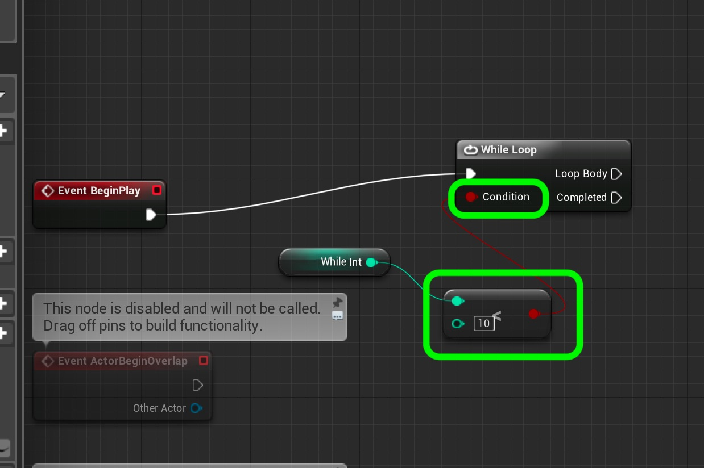

# UE4-BP-Overview Page 6
_____ 

## Index
_____ 

* Part I - Getting Up and Running with VS & Unreal
3. [Setting Up Unreal](UE4-BP-Overview-1.html#setting-up-unreal)

* Part II - Types in UE4
1. [Alter Text in Blueprint](UE4-BP-Overview-2.html#alter-text-in-blueprint)
2. [Variable Initialization](UE4-BP-Overview-2.html#variable-initialization)
3. [Add Blueprint and Run Game](UE4-BP-Overview-2.html#add-blueprint-and-run-game)
4. [Convert Float to Text](UE4-BP-Overview-2.html#convert-float-to-text)

* User Input
1. [User Input Add to Float](UE4-BP-Overview-3.html#user-input-add-to-float)
2.  [Integer in Blueprints](UE4-BP-Overview-3.html#integer-in-blueprints)

* Part IV - Conditional If in Blueprints
1. [New Room Countdown Timer](UE4-BP-Overview-3.html#new-room-countdown-timer)
2. [New Room Countdown Timer Part II](UE4-BP-Overview-4.html#new-room-countdown-timer-part-ii)

* Part V - Switch Statement and Loops
1. [Switch Statement in UE4](UE4-BP-Overview-5.html#switch-statement-in-ue4)
2. [While and For Loops](UE4-BP-Overview-6.html#while-and-for-loops)

_____ 

## While and For Loops
Lets add a while and for loop in blueprints.

_____ 



{:start="{{ num }}"}
{{ num }}. Let us create a new level.  First lets save our current level.  Press **File \| Save Current**.  Go to **File \| New Level** and select a **Default** level. 

  

_____ 



{:start="{{ num }}"}
{{ num }}. Select **File \| Save Current** and call the level `TestMap_4`.  Then go to **Edit \| Project Settings** and adjust the **Editor Startup Map** to **TestMap_4** in **Maps & Modes**:

  

_____ 


{:start="{{ num }}"}
{{ num }}. Now lets create a new **Blueprint Actor** class to demonstrate the while loop with.

  

_____ 


{:start="{{ num }}"}
{{ num }}. Name this new **Blueprint** `BP_Loops`.  Make sure it is in the **Bluprints** folder.

  

_____ 


{:start="{{ num }}"}
{{ num }}. Double click the blueprint you just created and add two **Text Render** components.  Call the first one `WhileLoopMessage` and the second `ForLoopMessage`.  Separate them on either side of center and pick two contrasting colors.

  

_____ 


{:start="{{ num }}"}
{{ num }}. Create a new **Variable** called `WhileInt` and make it type **integer**.

  

_____ 


{:start="{{ num }}"}
{{ num }}. Right click on the graph (in the **Event Graph** tab) and select a **While Loop** node.  Notice that it has an execution pin for the body of the loop, and one for when the loop completes.  There is also a boolean that triggers the exit condition for this while loop.

  

_____ 


{:start="{{ num }}"}
{{ num }}. Connect the execution pin from the **Begin Play** node to the **While Loop**. Add a **While Int** get value to check for the exit condition by dragging the variable to the graph and selecting **Get**.

  

_____ 


{:start="{{ num }}"}
{{ num }}. Add a **Int < Int** node and set the second value to `10`.  Connect the ouput of the **WhileInt** node to the input of the **<** node.   Connect the output of the **<** node to the input **Condition** pin in the while loop.

  

_____ 


{:start="{{ num }}"}
{{ num }}. Grab another **Get While Int** node:

  

_____ 


{:start="{{ num }}"}
{{ num }}. Add an **Integer + Integer** node so we can increment it while it is in the loop.

  

_____ 


{:start="{{ num }}"}
{{ num }}. Now connect the output of the **WhileInt** pin to the top side of the **Int + Int** node.  On the bottom enter `3`.  

  

_____ 


{:start="{{ num }}"}
{{ num }}. Add a **Set While Int** node and connect the output of the **+** node to the **While Int** input pin.  Connect the **Loop Body** execution pin to the **Set While Loop** node.

  

_____ 


{:start="{{ num }}"}
{{ num }}. Now highlight the three nodes inside the while loop and add press the **C** key and add a comment.  We want to highlight that this is within a loop.

  

_____ 


{:start="{{ num }}"}
{{ num }}. Now we want to set this new message to the **WhileLoopMessage** component.  Drag a reference to this to the graph.

  

_____ 


{:start="{{ num }}"}
{{ num }}. Pull the pin from the **WhileLoopMessage** node and select **Set Text**.  Connect the execution pin from the **Completed** pin in the **While Loop**.

  

_____ 


{:start="{{ num }}"}
{{ num }}. Finally add a **Get WhileInt** reference to the graph and connect it to the input **Value** pin in the **SetText** node.  This will prompt a conversion node from integer to text.

  

_____ 


{:start="{{ num }}"}
{{ num }}. Add the **BP_Loop** to the fourth level and position it within the player's view.  Press **Compile** then **Play** and we can see that it sets the value to 12 and it properly runs the while loop.

  

_____ 


{:start="{{ num }}"}
{{ num }}. Try and figure out the **For Loop** for yourself.  See if you can create a new variable and subtract 5 from the inital value of 0 ten times (showing -50).  Here is a reference of what it could look like:

  

_____ 


{:start="{{ num }}"}
{{ num }}. Press **Compile** and run the game. Now we should have both loops executing properly.

  

_____ 


{:start="{{ num }}"}
{{ num }}. That wraps up our look at variables, if statements and loops in blueprints!

_____ 
  

[<- Previous](UE4-BP-Overview-5.html)&nbsp;&nbsp;&nbsp;[Home](../index.html)&nbsp;&nbsp;&nbsp; 
   
   
   

