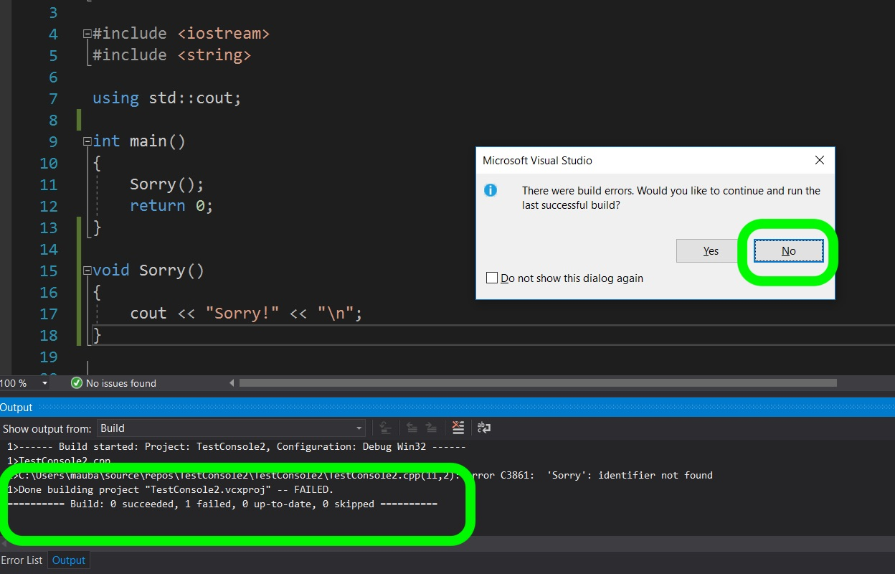
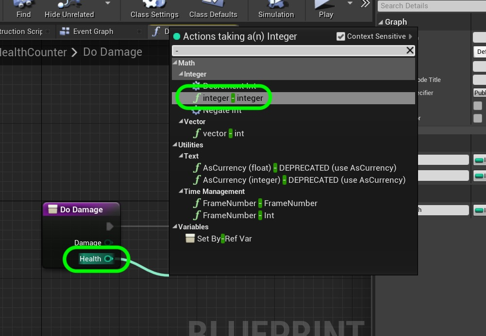

# CPP UE4 Functions Templates & Classes Page 1
_____ 

## Index
_____ 

* Part I - Functions
1. [Simple Function in CPP](CPP-UE4-Functions-Templates-Classes-1.html#simple-functions-in-cpp)
2. [Function in CPP](CPP-UE4-Functions-Templates-Classes-1.html#function-in-cpp)
3. [Function in Unreal Blueprints](CPP-UE4-Functions-Templates-Classes-1.html#function-in-unreal-blueprints)
4. [Fixing Edge Case](CPP-UE4-Functions-Templates-Classes-2.html#fixing-edge-case)
5. [Function in CPP in UE4](CPP-UE4-Functions-Templates-Classes-2.html#function-in-cpp-in-ue4)
6. [Function in CPP & Blueprint](CPP-UE4-Functions-Templates-Classes-3.html#function-in-cpp-&-blueprint)

* Part II - Macros, Constants
1. [Macros](CPP-UE4-Functions-Templates-Classes-4.html#macros)

* Part III - Arrays & Containers
1.  [Arrays](CPP-UE4-Functions-Templates-Classes-4.html#arrays)
2. [Containers](CPP-UE4-Functions-Templates-Classes-5.html#containers)
3. [TArray](CPP-UE4-Functions-Templates-Classes-5.html#tarray)

* Part IV - Classes
1. [Card Class](CPP-UE4-Functions-Templates-Classes-7.html#card-class)
2. [Refactor Card Class](CPP-UE4-Functions-Templates-Classes-8.html#refactor-card-class)
3. [Class Inheritance](CPP-UE4-Functions-Templates-Classes-8.html#class-inheritance-&-casting)

_____ 

## Simple Function in CPP
Lets look at how functions work in C++ and in Unreal Blueprints.  Then lets create a function in C++ that works within blueprints. 

There are user defined functions as well as supplied functions by the language we are using or a library we are including. It is a block of code that performs a task.  We can pass it parameters (various variables)and the function can return a single type or none at all (void).  Let's write a simple function:

_____ 


{:start="{{ num }}"}
{{ num }}. Open up [Visual Studio 19 Community](https://visualstudio.microsoft.com/downloads/) and you should be able to login with your LSU credentials. You should see a screen like this.  Click on the **Create a New Project** button:

  

_____ 


{:start="{{ num }}"}
{{ num }}. Select a **Console App** as we will only be working withing the console.

  

_____ 


{:start="{{ num }}"}
{{ num }}. Name the solution `FunctionTemplatesClasses` and select a location on your hard drive to save it in.

  

_____ 


{:start="{{ num }}"}
{{ num }}. A function has three components.  We start with `ReturnType` then we have the name of the function `FunctionName` and then in parenthesis we can pass it parameters (or not) separated by commas like `(Param1, Param2)`.  So for example we can have a function that just prints a message that returns no value nor does it take any parameters that can read `void Sorry()`.  This is a function that returns nothing and takes no parameters.  Let's give this a shot.

_____ 


{:start="{{ num }}"}
{{ num }}. Lets now create a function. Now we have used functions before `main()` is a function that visual studio runs first by default.  We can also define a new function.  In this case we defined a new function that returns no value (it is void).  Next run the game to see what happens.

  

_____ 


{:start="{{ num }}"}
{{ num }}. Run the game and `Main()` runs and calls the function.  The function just prints **Sorry!** to the console.

  

_____ 


{:start="{{ num }}"}
{{ num }}. Now what happens if the `Sorry()` function is placed AFTER the `Main()` function?  Try it and press the **Run** button:

  

_____ 


{:start="{{ num }}"}
{{ num }}. Now the build won't compile or run.  If you look at the bottom you should see an **Output** tab that has 0 succeeded builds and 1 file that failed to compile.  You get an error message asking if you want to run the previous build.  Press the **No** button.

  

_____ 


{:start="{{ num }}"}
{{ num }}. Now you can see in the bottom tab an error list where it can't find the identifier on line 11 in the FunctionTemplatesClasses.cpp file.  The compiler does not kow that the function exists when it gets to it and we need to declare it first (even before it is defined).

  

_____ 


{:start="{{ num }}"}
{{ num }}. What we can do is tell the compiler before the function definition that there is a declaration (stating the the definition is somewhere in the file).  As long as the declaration is before the definition, it will compile and run as before.  In the above case it would look like:

  

_____ 


{:start="{{ num }}"}
{{ num }}. It is good practice to build before you run, if you can.  You can do this by selecting **Build \| Build NAMEOFPROJECT** or by pressing **control b** on the keyboard. You will notice that it now builds and runs as it did previously. Check this on your end.

  

_____ 


{:start="{{ num }}"}
{{ num }}. Notice that our program is located in a `.cpp` file called **FunctionTemplatesClasses.cpp**.  This is usually where we keep our definitions.  Our declarations are usually held in a `.h` file.  Lets move this to a `.h` file.  Right click on the **Solution Explorer \| HeaderFiles** folder and select **Add \| New Item**:

  

_____ 


{:start="{{ num }}"}
{{ num }}. Select the file type **Header File (.h)** and it is customary to name the file that holds the declarations with the same name as the one with the definitions.  So I called it `FunctionTemplatesClasses.h` then pressed the **Add** button:

  

_____ 


{:start="{{ num }}"}
{{ num }}. Now remove the declaration from the `.cpp` file and add it under the provide line `#pragma once`.  What does [#pragma once](https://en.wikipedia.org/wiki/Pragma_once) do? It is a non-standard but widely supported preprocessor directive that tells the compiler to only include this file in the final program once.  Now a game can be made up of hundreds if not thousands of files, and a header file could be used in many places.  This ensures that no many how many times it is used it is just included one time in the final program.

  

_____ 


{:start="{{ num }}"}
{{ num }}. Now if we try and run it, this will not work.  The `.cpp` file does not know to look for this declaration.  So go back to the *cpp* file and add an `#include` with the `"FunctionTemplatesClasses.h` file like so:

  

_____ 


{:start="{{ num }}"}
{{ num }}. Next, run the game again it should find the definition by including the `.h` file.  Looks no different than before.

  

_____ 

##  Function in CPP
Now lets create a function with a return value and is passed multiple parameters.

_____ 


{:start="{{ num }}"}
{{ num }}. Add to our header file **FunctionTemplatesClasses.h** a new function declaration that does damage to player's health.  We pass it the damage amount, the current health and it will return the new value.

  

_____ 


{:start="{{ num }}"}
{{ num }}. Now open the cpp file **FunctionTemplatesClasses.cpp** and add a definition.  It is the simplest function you can imagine and subtracts damage from score.  The difference is that this function returns an **integer**.  So we need a `return` statement to be made in the function so that it returns a value in all possible ways (in this case it is a single statement return).  Then in the `main()` function declare a **Health** variable and set update the **Health** with a damage of `10` units.  Then print out the current score with the texed indented by a tab:

  

_____ 


{:start="{{ num }}"}
{{ num }}. Build (cntrl B) and run (F5) the program.  Notice that the score reflects the return value that the function provided (we passed it `10` and a `100` and it returned 100-10).  We added a new special character `\t` which tabs the location in the console. So you can see that the `cout` starts tabulated in the console window.

  

_____ 

##  Function in Unreal Blueprints
Now lets see how to create a function in Blueprints.

_____ 


{:start="{{ num }}"}
{{ num }}. Open up the **Epic Games Launcher** program and to to the **Unreal Engine \| Library** tab.  Press on the version **4.24.1 Launch** button to start a new project.

  

_____ 


{:start="{{ num }}"}
{{ num }}. Select **Games** from the menu then press the **Next** button.

  

_____ 


{:start="{{ num }}"}
{{ num }}. Select the **Blank** template and press **Next**.

  

_____ 



{:start="{{ num }}"}
{{ num }}. Select the **C++** type game in the top left tab.  The project needs no starter content, set the quality to whatever is best for your computer and the target should be **Desktop / Console**.  Select a directory and call the project `TestFunctions`.

  

_____ 


{:start="{{ num }}"}
{{ num }}. In the content browser press the **Add New** button and create two new folders, one called `Maps` and the other called `Blueprints`.

  

_____ 


{:start="{{ num }}"}
{{ num }}. Navigate to the maps folder and press **File \| Save Current** to save the current map and call it `HealthDisplayLevel`.

  

_____ 


{:start="{{ num }}"}
{{ num }}. Navigae to the **Blueprints** folder. In the **Content Browser** select **Add New \| Blueprint Class** and pick the **Actor** class as we have done previously.  Call this new blueprint `BP_HealthCounter`.

  

_____ 


{:start="{{ num }}"}
{{ num }}. Now open this newly created Blueprint and press the **+ Add Component** button and select a **Text Render** component.

  

_____ 


{:start="{{ num }}"}
{{ num }}. Name this component `HealthText` and change the **Text** to `100`.  Set the **Text Render Color** to a contrasting color with the sky.

  

_____ 


{:start="{{ num }}"}
{{ num }}. Let's create the same function we just did in C++ in a blueprint.  Press the **+ Function** button to create a new function and name this new function `DoDamage`.

  

_____ 


{:start="{{ num }}"}
{{ num }}. This creates a new tab called **Do Damage** and notice that there is a node with the name of the function and an execution pin.  When it is called the execution pin will run.  Now the parameters we pass to the function are called **Inputs** and the return type is called **Outputs**.  Please note that in C++ you can only return one value but in blueprints we can return multiple values.

  

_____ 


{:start="{{ num }}"}
{{ num }}. Add an output of type **Integer** with the name of `New Health`.  Add two inputs called `Damage` and `Health` each of type **Integer**.  Notice that a **Return** node is added when you added an **Output** to the function.

  

_____ 


{:start="{{ num }}"}
{{ num }}. Now pull off of the **Health** output pin and select an **Integer - Integer** node.  Notice that it has a green **f** next to it which indicates that this is a function as well.  It is a built in function that comes with the engine.

  

_____ 


{:start="{{ num }}"}
{{ num }}. Connect the pins making sure that you are deducting **Damage** from **Score** then sending the outut to the **Return Node's New Score** input pin:

  

_____ 


{:start="{{ num }}"}
{{ num }}. Lets go back to the **Event Graph** and right click on the empty graph next to the **Event Tick** and add a **Delay** node:

  

_____ 


{:start="{{ num }}"}
{{ num }}. Change the duration to `2.0` and pull off the **Completed** execution pin and select the **Do Damage** function you just wrote.

  

_____ 


{:start="{{ num }}"}
{{ num }}. Create a new **Variable** and call it `Health` and make it type **Integer**.  Press the **Compile** button and change the **Default Value** to `100`.

  

_____ 


{:start="{{ num }}"}
{{ num }}. Drag a **Get Health** reference to the graph and connect it to the **Health** input pin in the **DoDamage** function.  Add a **Random Integer in Rage** node and set the **Min** to `1` and the **Max** to `5`. Send the **Return Value** to the **Damage** parameter in **Do Damage**.

  

_____ 


{:start="{{ num }}"}
{{ num }}. Add a **Set Health** reference node and connect its execution pin to **Do Damage** and pipe the **New Health** return value to it's input **Health** pin.

  

_____ 


{:start="{{ num }}"}
{{ num }}. Drag a copy of the **Health Text** component to the graph and pull off of its pin to select a **Set Text** node.

  

_____ 


{:start="{{ num }}"}
{{ num }}. Connect execution pin from **Set Score** to **Set Text**.  Your node chart should now look like this:

  

_____ 



{:start="{{ num }}"}
{{ num }}. Go to the game and add the **BP_ScoreCounter** to the scene in front of the player.  Press the **Compile** button and run the game. Notice that if you keep running the game it will go below zero.  Lets fix that up on the next page.

  

_____ 
  

[Home](../index.html)&nbsp;&nbsp;&nbsp; [Continue ->](CPP-UE4-Functions-Templates-Classes-2.html)
   
   
   

