# CPP UE4 Functions Templates & Classes Page 2
_____ 

## Index
_____ 

* Part I - Functions
1. [Simple Function in CPP](CPP-UE4-Functions-Templates-Classes-1.html#simple-functions-in-cpp)
2. [Function in CPP](CPP-UE4-Functions-Templates-Classes-1.html#function-in-cpp)
3. [Function in Unreal Blueprints](CPP-UE4-Functions-Templates-Classes-1.html#function-in-unreal-blueprints)
4. [Fixing Edge Case](CPP-UE4-Functions-Templates-Classes-2.html#fixing-edge-case)
5. [Function in CPP in UE4](CPP-UE4-Functions-Templates-Classes-2.html#function-in-cpp-in-ue4)
6. [Function in CPP & Blueprint](CPP-UE4-Functions-Templates-Classes-3.html#function-in-cpp-&-blueprint)

* Part II - Macros, Constants
1. [Macros](CPP-UE4-Functions-Templates-Classes-4.html#macros)

* Part III - Arrays & Containers
1.  [Arrays](CPP-UE4-Functions-Templates-Classes-4.html#arrays)
2. [Containers](CPP-UE4-Functions-Templates-Classes-5.html#containers)
3. [TArray](CPP-UE4-Functions-Templates-Classes-5.html#tarray)

* Part IV - Classes
1. [Card Class](CPP-UE4-Functions-Templates-Classes-7.html#card-class)
2. [Refactor Card Class](CPP-UE4-Functions-Templates-Classes-8.html#refactor-card-class)
3. [Class Inheritance](CPP-UE4-Functions-Templates-Classes-8.html#class-inheritance-&-casting)

_____ 

## Fixing Edge Case
It is never good to leave an edge case even in a silly example like this.  Lets stop the score from getting negative and display a message instead.  This is NOT the most efficient solution as it still subtracts on the delay when it is no longer necessary. Since this is an incomplete problem, we will just leave it as is.

_____ 


{:start="{{ num }}"}
{{ num }}. Now I will let you complete the final step.  Before setting the text component we need to verify that the score is still above 0.  If it is not, set the text to display a death message.  Create a new **Text** variable called `DeadText` and set this default value to `You Are Dead!`.  Add it to your graph and check to see if it agove 0 and branch if it is, do what you did previously if not then set the text to this new **DeadText** variable. Your node chart should look something like this:

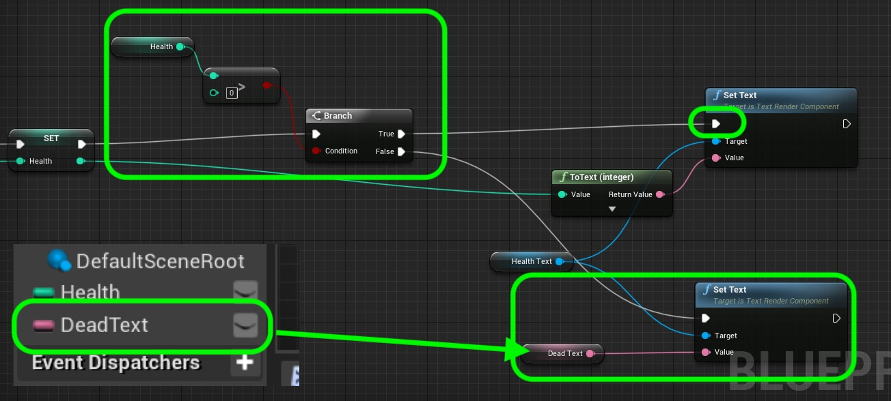  

_____ 


{:start="{{ num }}"}
{{ num }}. Compile and run the game and wait for the health to get to 0.  Now you should see a **You are Dead!** text.  This is not the most optimal fix as it still continues to run the text subtracting it needlessly (but not displaying it).  If this was for a specific use case we would do a more permanent fix that would stop subtracting health.  I assume we would do other things like kill the player etc...

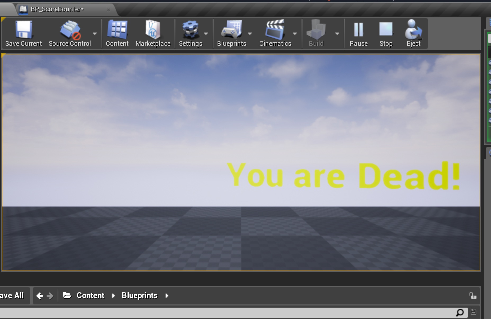  

_____ 

## Function in CPP in UE4
Lets take a stab at combining what we have done in C++ and what we have done in blueprints.  Lets create an **Actor** C++ class and duplicate the functionality we just wrote in the blueprint as a C++ class instead.

We will not be able to make a complete mirror as there is not a **Delay** function that can be called in the **Tick** event.  Instead we will use **Timers** and call a new function recursively from the **Begin Play** event.

_____ 


{:start="{{ num }}"}
{{ num }}. We are going to add our first C++ class inside of Unreal.  Press the **Add New** button and select **New C++ Class**.  

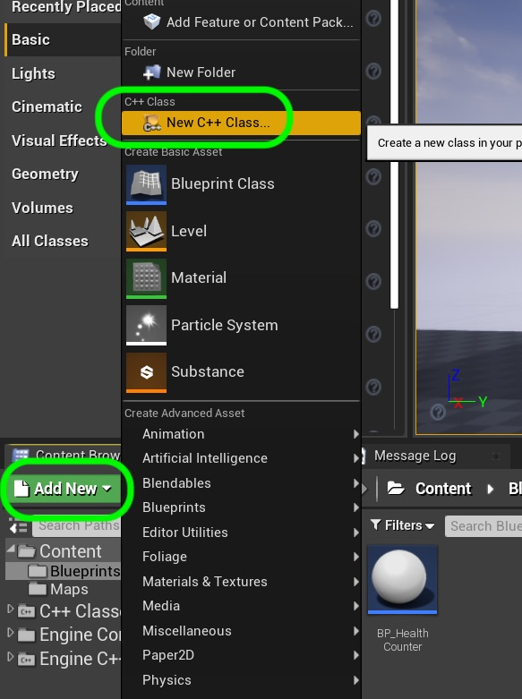  

_____ 


{:start="{{ num }}"}
{{ num }}. Now we select the same class as we do in a Blueprint.  We will not get into classes yet but will cover it later on.  Select **Actor**.

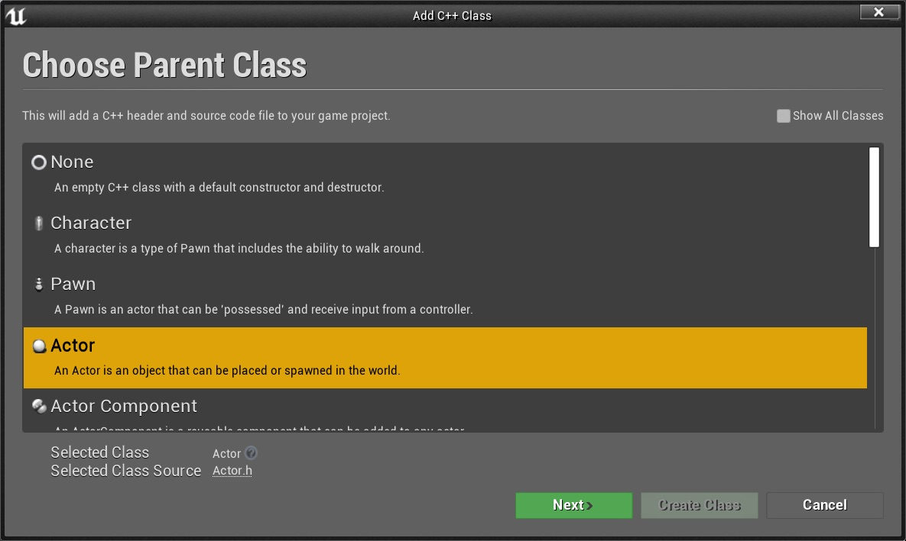  

_____ 


{:start="{{ num }}"}
{{ num }}. Enter the name `HealthCounter_CPP` and press the **Create Class** button.

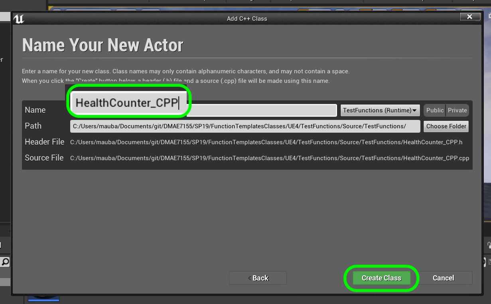  

_____ 


{:start="{{ num }}"}
{{ num }}. This will open up Visual Studio (if it is not already open) and you can see that it creates a `.cpp` and `.h` file for you with a standard boiler starter for this class type.

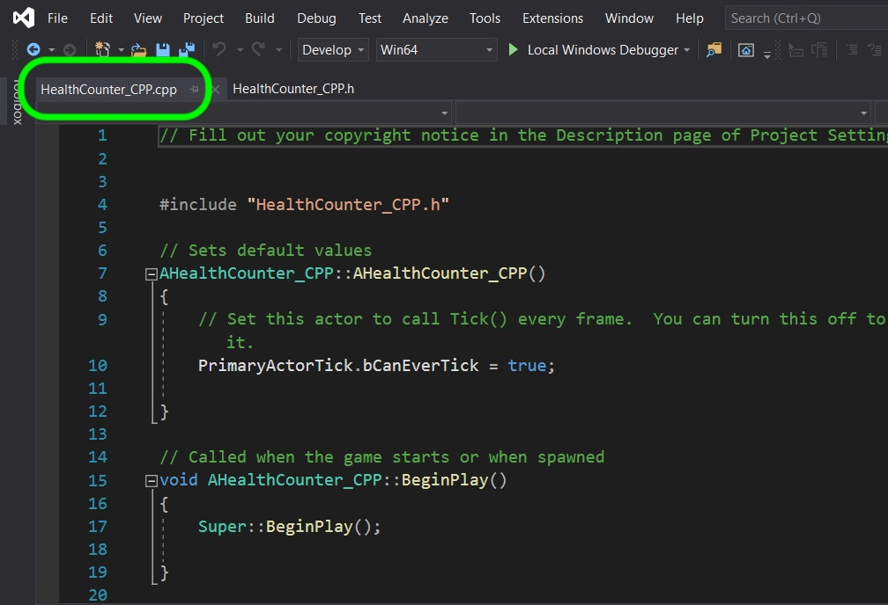  
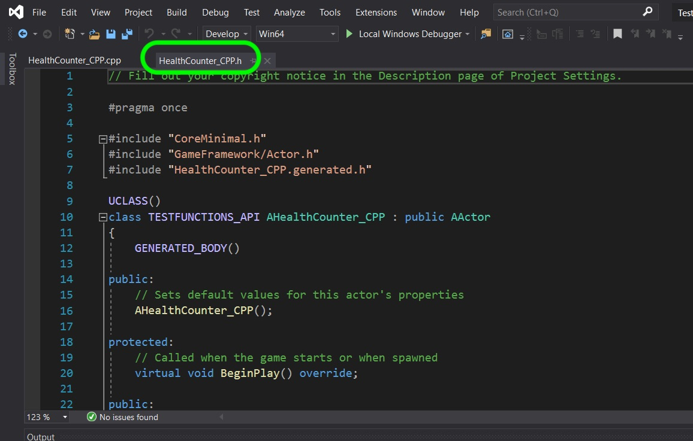 

_____ 


{:start="{{ num }}"}
{{ num }}. If Visual Studio does not boot up, or you just want to open the class from the menu this can be done. Press the arrow button next to **Filters** in the **Content Browser** and you will see the parent diretory to **Contents**.  Then you will see a directory called C++ Classes. If you do not you will need to click on **View Options** and make sure that **Show C++ Classes** is selected.  Please note that you need to think carefully about what folder to include the class in and its name.  It is quite a chore to change the C++ location or adjust its class name in UE4.

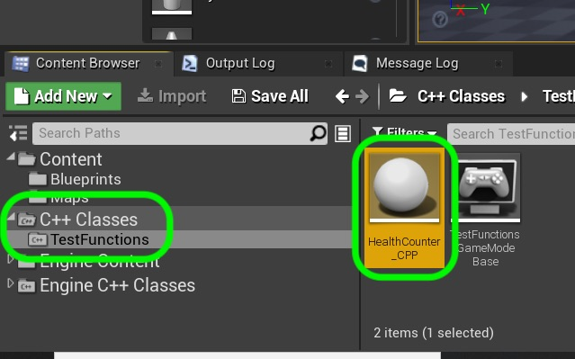  

_____ 



{:start="{{ num }}"}
{{ num }}. So now lets open the **ScoreCounter_CPP.h** and add in the `protected` section under `virtual void BeginPlay() override;` (which is the function we override to run at the begining of the game just like the execution pin in the Begin Play event in a blueprint).  We need to add the TextRenderComponent.  This is a `UTextRenderComponent` and we need a pointer to it (we will get into pointers later on) which is what the asterix indicates.  Call this pointer `ScoreText`.    Next up we need an `int64 Health` variable and an `FText DeadText` variable. We do not have a **Delay** function analogous to the one in blueprints, so we will create our own using Unreal's timers.  Create a `FTimerHandle Delay` varaible.  We will need two functions that we will have to define.  The first is `void PlayerIsHit()` that will cause the damage and update the text and an `int32 DoDamage(int32 Damage)` that is analogous to the one we created in the blueprint but DO NOT need to pass the health variable as it is acccessible by any member function of this class. Please note that we do not define or set any of the variables in the `.h` file.

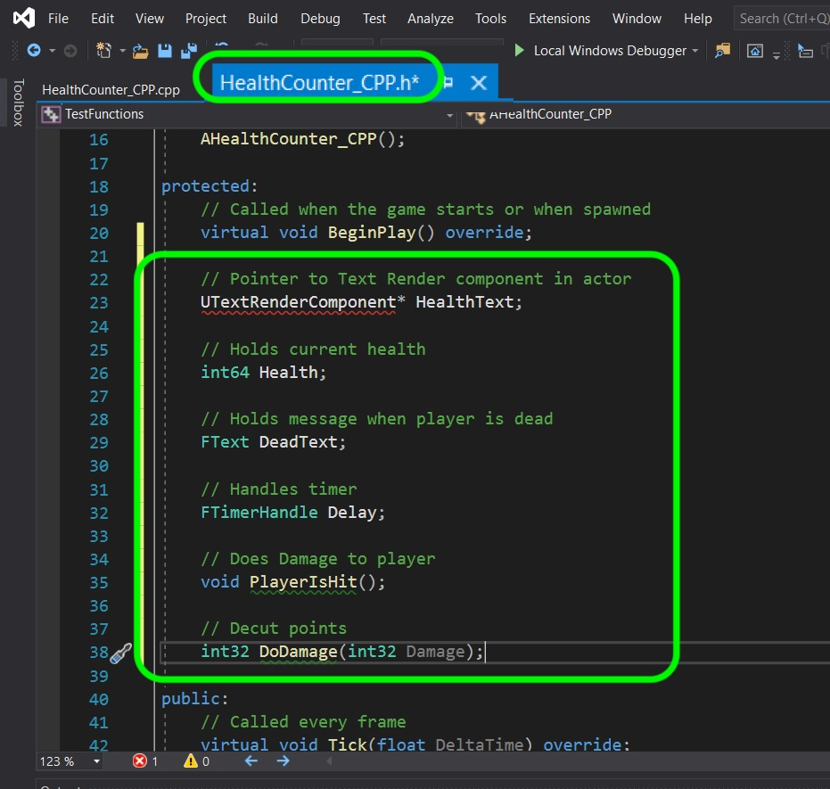  

_____ 



{:start="{{ num }}"}
{{ num }}. If you try compiling, there is an error regarding the UTextRender component.  Now in blueprints we have access to the entire library of variables, functions and more.  In C++ we need to include what we are using.  The `.h` file includes a `CoreMinimal.h` that gives us basic access to very commonly used engine functions and classes, `Actor.h` which is the class we derived from (when we selected **Actor** class when it was created).  It always ends with a verision of itself with `.generated.h`. This is a header file that is created in all UCLASS, USTRUCT, UPROPERTY and UFUNCTION macros.  This is so that blueprints can be easilyt integrated in the editor.  Please note that the final header **HAS** to be the `.generated.h` file or the game will not compile.    So we need to add a header for the UTextRenderComponent and the easiest way is to look at the manual for this class. We can find it in their [manual](http://api.unrealengine.com/INT/API/Runtime/Engine/Components/UTextRenderComponent/) under **References** at the bottom and you should see the appropriate header. We will add this to our header file so that the program can find this component and the project should compile/build (control B).

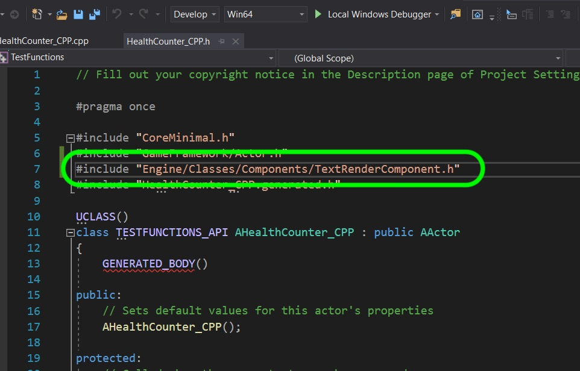  

_____ 


{:start="{{ num }}"}
{{ num }}. If we try and build in inside Visual Studio (**Cntrl B**) then we can still get errors.  Press save to ensure that the source code is actually saved to disk. To be sure if the game compiles you have to go back to the game engine press the **Compile** button and if you get a **Compile Complete** message then the source code still compiles regardless of what error messages there are in Visual Studio.

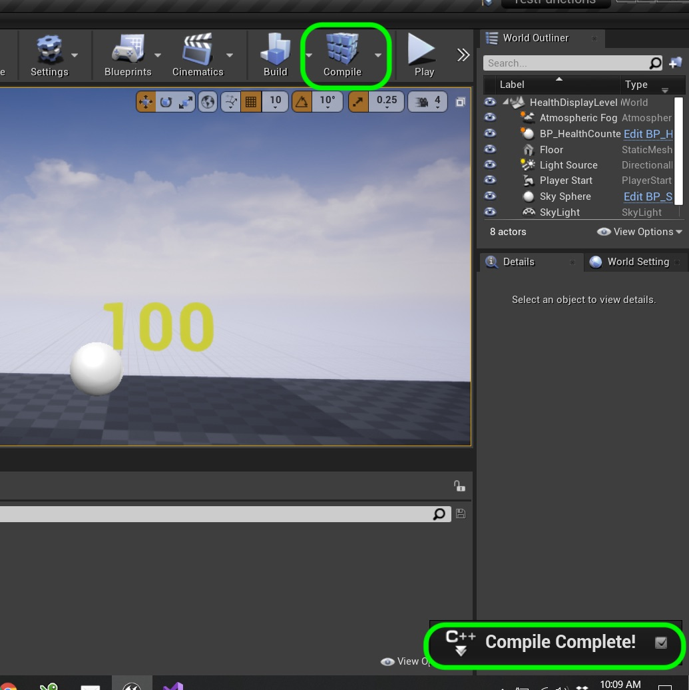  

_____ 


{:start="{{ num }}"}
{{ num }}. In a class we have a function with the same name as the class.  This is a special function and is called the **constructor**.  We will get into this more when we dive into classes but for now, lets just understand that this runs when the editor is booted up with this class in its window.  So editing the constructor class will cause us to leave and re-enter the level so that it runs again.  Lets take a look at what this might look like.   Lets start by creating a new level for our new C++ class by pressing **File \| New Level** then pick **Default** and save it as `CPP_HealthDisplay`.  Drag a copy of the C++ class into the level just like you did the Blueprint class (as long as it is class that is derived from a UOBJECT then it can be added to the game).  We cannot see anything yet for this classand cannot position it in the level. This is because we have not given it a component to use.  We just declared it but now need to assign it.

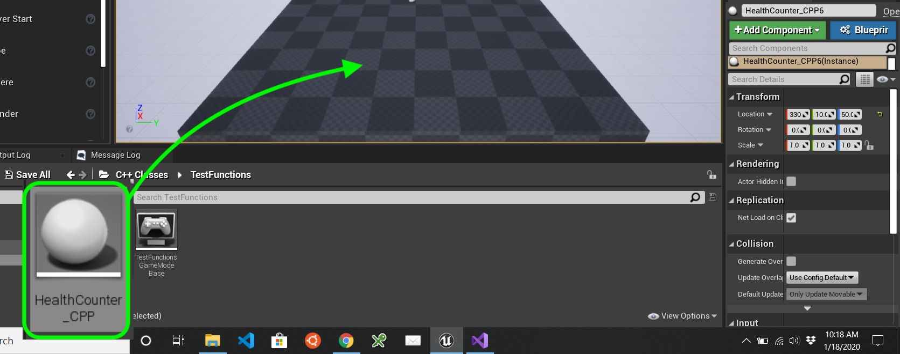  

_____ 


{:start="{{ num }}"}
{{ num }}. First lets comment out the Function declarations as we will define them a bit later. 

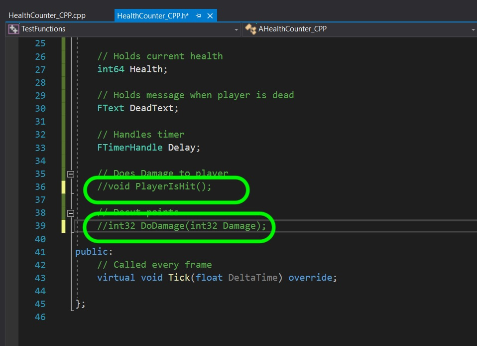  

_____ 


{:start="{{ num }}"}
{{ num }}. In the game you cannot move the dropped game object.  This is because we have not actually created the text component so there is nothing to display with this game object so we cannot move it in the scene.  Now lets go to the constructor as we need this object to have data to run when it is in the editor.  The constructor is the function with the same name as the class.  In our case it is `AHealthCounter_CPP::AHealthCounter_CPP()`.  In a class you have to begin with the class name then `::` then the function name.  We will call the method [CreateDefaultSuboject](http://api.unrealengine.com/INT/API/Runtime/CoreUObject/UObject/FObjectInitializer/CreateDefaultSubobject/1/index.html).  We need to add a template after the call to make sure it retuns a `<UTextRenderComponent>`.  We then pass it the parameter of the name we want to appear in the editor and we will use the same one we used in the blueprint `HealthText`. After you type this line in press **control b** and build the game.  Once you get no errors move to the next step.

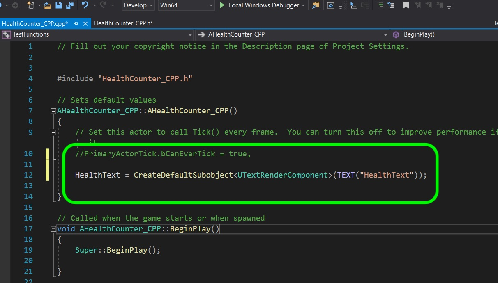  

_____ 


{:start="{{ num }}"}
{{ num }}. Now since the constructor has already run this change we just made above will not be reflected in game.  Instead of restarting the game it is quicker to delete the old version and drag in a new one.  Make sure you compiled your C++ above **first**.  Now you should get the component and have the handles to move it around.  Position it in front of the **Player Start** object so you can see it when running the game.

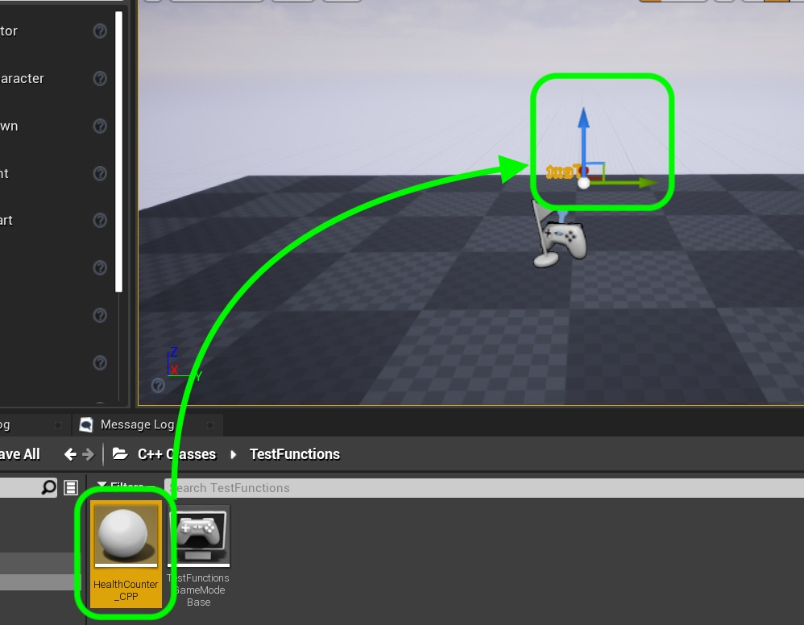  

_____ 


{:start="{{ num }}"}
{{ num }}. How else can we tell that the component was executed correctly?  We can see by selecting **HealthCounter_CPP4** in the **World Outliner** then expanding the tab beneath **+ Add Coomponent** and you will see the component we added that we called `HealthText`. It also defaults to **Text** which is the default value for the text in this component.

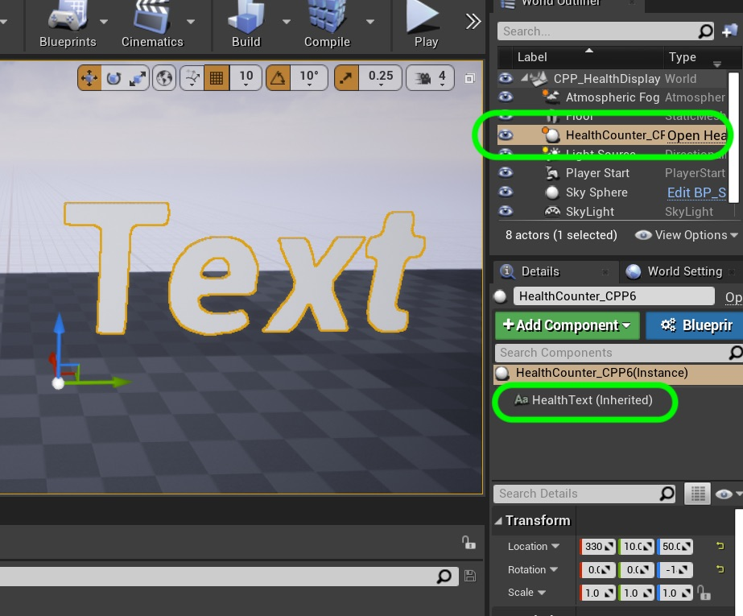  

_____ 


{:start="{{ num }}"}
{{ num }}. Lets now set our **Health** variable to a value, that is usable and in this case we will set it to `100`.  In a blueprint we set the text based on the instancer of the component.  In CPP we access the method from the pointer to this component (we access the method with `->`).  We call the method `SetText` then cast the **Integer** to a **String** to a **Text** format.

  

_____ 


{:start="{{ num }}"}
{{ num }}. Now lets press **control b** and recompile the code.  When it is done go back to the game and delete the old actor and drag a new one in.  You should now see it defaulting to `100`:

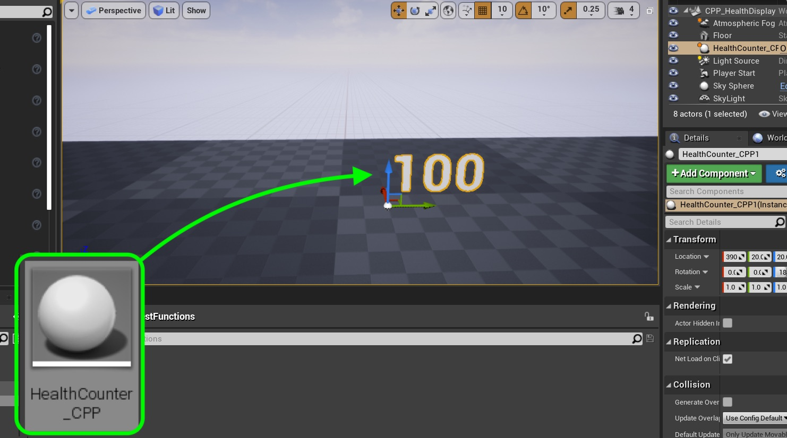  

_____ 


{:start="{{ num }}"}
{{ num }}. Now we will add our final change to the consructor of this object.  Lets change the color so that it constrasts with the sky.  If there is a value in the editor there is most likely a function call that can change that value.  In this case the method is called `SetTextRenderColor` and we call it through the pointer `->` and pass it a parameter of the color we want in this case a shade of **Yellow**.

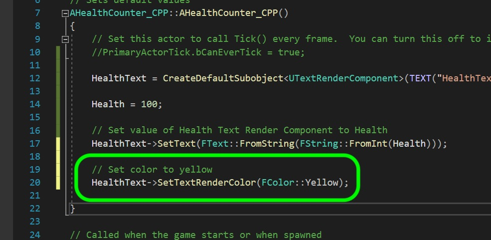  

_____ 


{:start="{{ num }}"}
{{ num }}. Now we need to delete the object in the scene and drag a new copy so the constructor is run again.  Now you will notice that the **100** text component is now yellow.  Back to where we were with the BP!

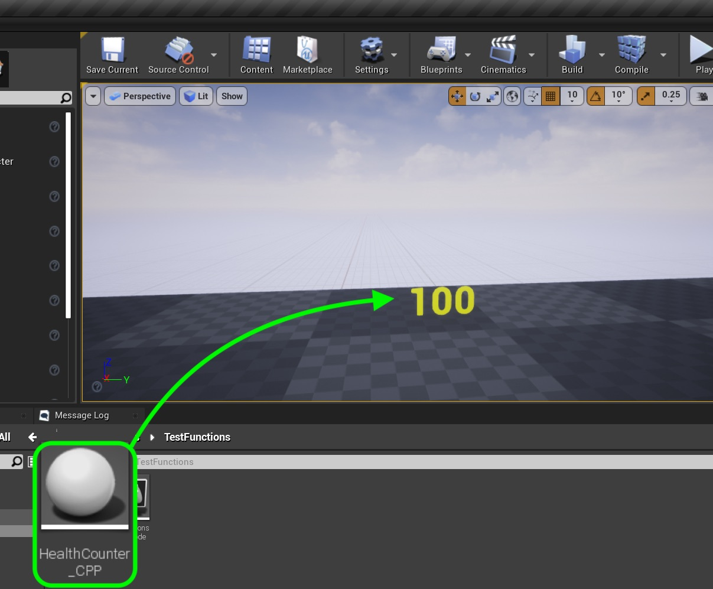  

_____ 


{:start="{{ num }}"}
{{ num }}. Lets write our first function for Unreal.  Go back to **ScoreCounter_CPP.h** and uncomment out the **DoDamage** declaration.

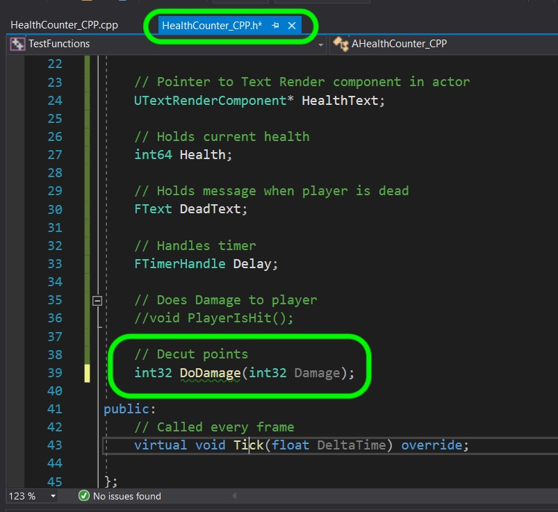  

_____ 


{:start="{{ num }}"}
{{ num }}. Now open the **HealthCounter_CPP.cpp** and add at the bottom the **Do Damage** function.  Don't forget to include the return type first, the name of the class followed by `::` then the name of the function and it's paramters.  In this case we will be returning `Health - Damage`.

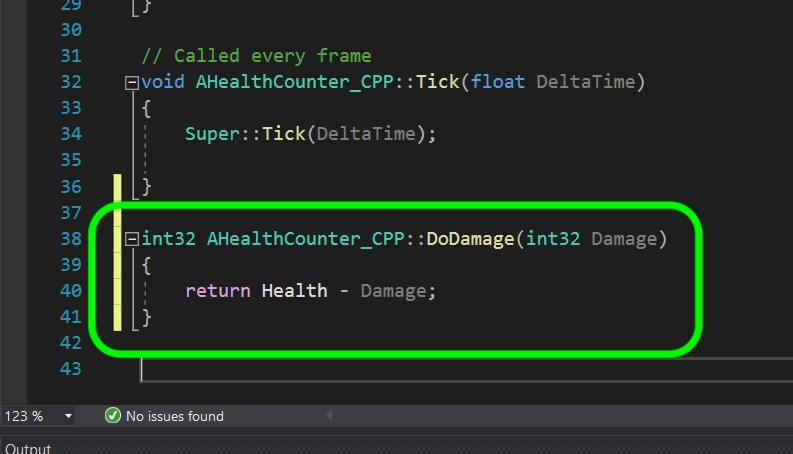  

_____ 


{:start="{{ num }}"}
{{ num }}. To test that this function does what we want we can add another **SetText** call in the **Begin Play()**.  We will try and give damage of 10 points.  Press **control b** after you have finished this and make sure there are no compile errors.

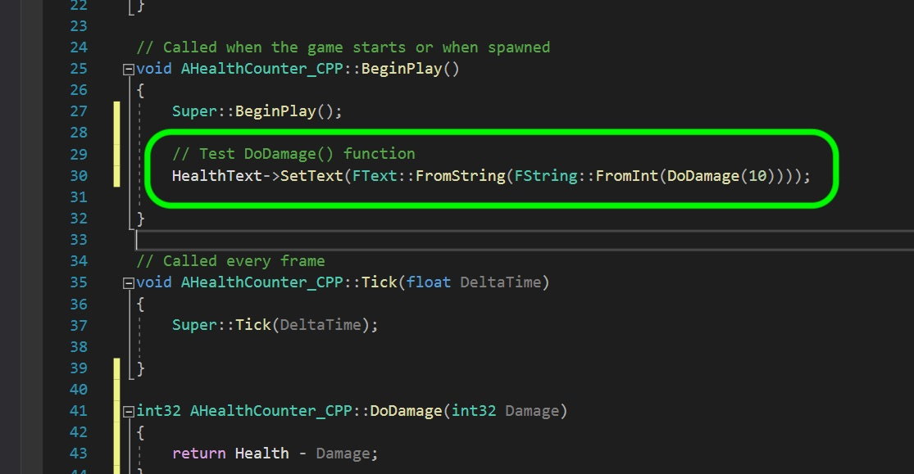  

_____ 


{:start="{{ num }}"}
{{ num }}. Now in the editor this is 100 but when you play the game and it runs the **Begin Play** call, it gets set to **90**.  This is how we wanted so our function to work.  

  

_____ 


{:start="{{ num }}"}
{{ num }}. Comment out this test and lets define our second function. Go back to the `.h`. file and uncomment out the **PlayerIsHit** declaration:

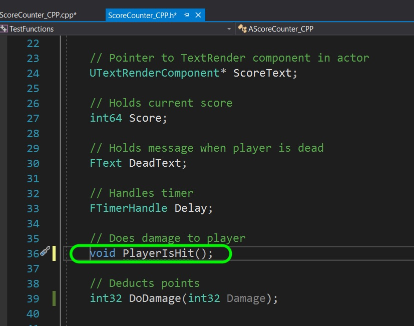  

_____ 


{:start="{{ num }}"}
{{ num }}. Then open up the `.cpp` and add a definition for **PlayerIsHit()**.  This is a function that returns `void` and has no parameters.  First we assign a variable number in a range and then update the score text with through calling DoDamage);

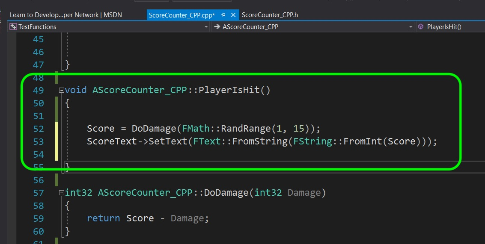  

_____ 


{:start="{{ num }}"}
{{ num }}. Lets call this new function in the **Begin Play()** function.  Simply call it once and we will do random damage. Press **control b** and make sure you have no compile errors and it builds.

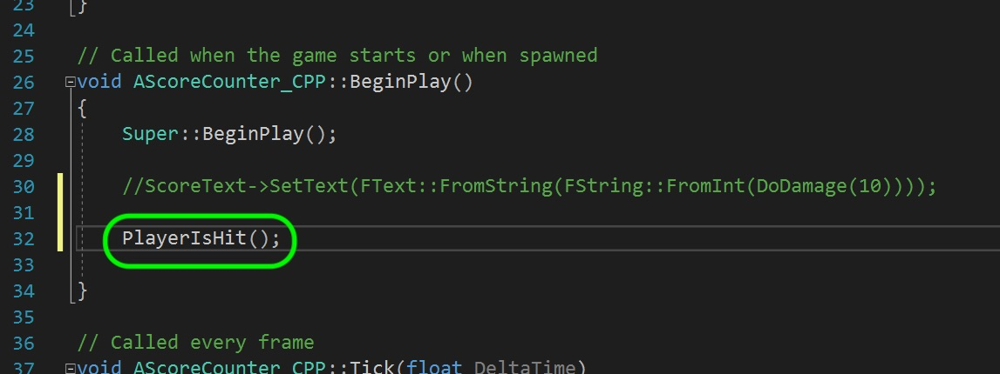  

_____ 


{:start="{{ num }}"}
{{ num }}. Run the game and you should have some random number subtracted between 1 and 15.  Mine subtracted 14 this time when I ran it.

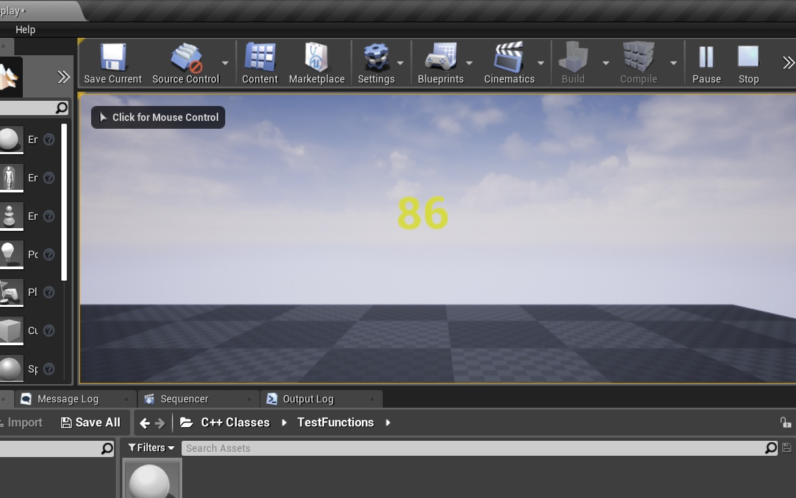  

_____ 


{:start="{{ num }}"}
{{ num }}. Lets try and replicate what the **Delay** node did in the blueprint.  We will call the function with a timer in the **Begin Play** then recursively call timers and call ourselve constantly doing damage.  Remember in our declarations in the `.h` file we had a variable called **Delay** that was a **FTimerHandle**.  This allows us to scehdule function calls in the future. 

  

_____ 


{:start="{{ num }}"}
{{ num }}. So go back to **HealthCounter_CPP.cpp** and comment out the call to **PlayerIsHit()**.  Instead call a timer set for `2.0f` seconds in the future.  Don't worry about the syntax and the meaning of this for now and you can ignore the fact that Visual Studio doesn't recognized **GetWorld()**.  This will compile.  

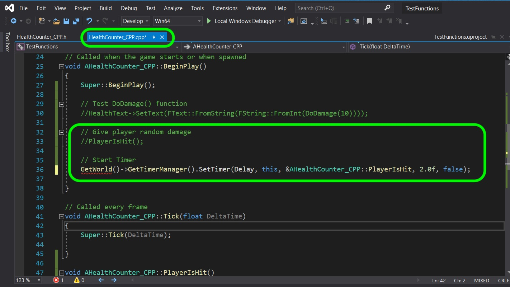  

_____ 


{:start="{{ num }}"}
{{ num }}. Now go to the definition of **PlayerIsHit()** and add a recursive call to the same function effectively calling it every two seconds (mimicking what we were doing in the blueprint). Press **control b** and make sure you have no compile errors.

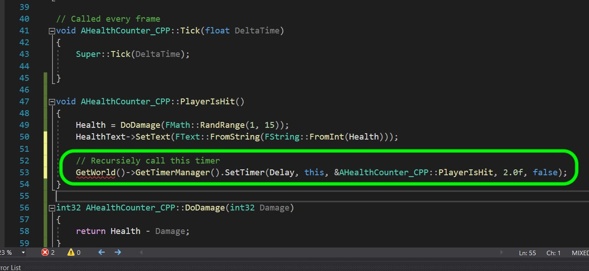  

_____ 


{:start="{{ num }}"}
{{ num }}. Play the game and it should do damage every 2 seconds and go into negative space like our blueprint initially did.  

  

_____ 


{:start="{{ num }}"}
{{ num }}. Lets assign the variable **Dead Text** with its default value.  I don't think there are any advantages of doign this inside the constructor so we can assign it in the **Begin Play**.  We will give it the same message we gave the blueprint version.

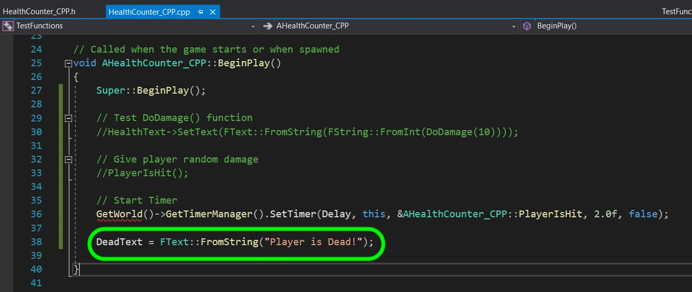  

_____ 



{:start="{{ num }}"}
{{ num }}. OK, now lets fix the issue with the Score going into negative space.  We can add a check to see that the **Score** is less than **0** before we add damage.  We can then check again to make sure the Score is still above 0 before we set the text.  Then we call ourselves recursively.  When the Score is no longer zero we will set the **ScoreText** to the **DeadText** instead of the Score. Press **control B** to build and make sure you have no error messages.

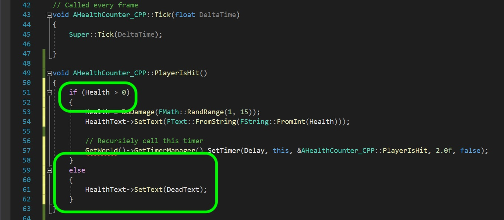  

_____ 



{:start="{{ num }}"}
{{ num }}. Play the game and when it gets to a value below zero the message should change to the dead text.

  

_____ 



{:start="{{ num }}"}
{{ num }}. Next up we will be looking at altering this class so that it can be used inside a blueprint and expose its variables and functions!

_____ 
  

[<- Previous](CPP-UE4-Functions-Templates-Classes-1.html)&nbsp;&nbsp;&nbsp;[Home](../index.html)&nbsp;&nbsp;&nbsp; [Continue ->](CPP-UE4-Functions-Templates-Classes-3.html)
   
   
   

