# CPP UE4 Functions Templates & Classes Page 3
_____ 

## Index
_____ 

* Part I - Functions
1. [Simple Function in CPP](CPP-UE4-Functions-Templates-Classes-1.html#simple-functions-in-cpp)
2. [Function in CPP](CPP-UE4-Functions-Templates-Classes-1.html#function-in-cpp)
3. [Function in Unreal Blueprints](CPP-UE4-Functions-Templates-Classes-1.html#function-in-unreal-blueprints)
4. [Fixing Edge Case](CPP-UE4-Functions-Templates-Classes-2.html#fixing-edge-case)
5. [Function in CPP in UE4](CPP-UE4-Functions-Templates-Classes-2.html#function-in-cpp-in-ue4)
6. [Function in CPP & Blueprint](CPP-UE4-Functions-Templates-Classes-3.html#function-in-cpp-&-blueprint)

* Part II - Macros, Constants
1. [Macros](CPP-UE4-Functions-Templates-Classes-4.html#macros)

* Part III - Arrays & Containers
1.  [Arrays](CPP-UE4-Functions-Templates-Classes-4.html#arrays)
2. [Containers](CPP-UE4-Functions-Templates-Classes-5.html#containers)
3. [TArray](CPP-UE4-Functions-Templates-Classes-5.html#tarray)

* Part IV - Classes
1. [Card Class](CPP-UE4-Functions-Templates-Classes-7.html#card-class)
2. [Refactor Card Class](CPP-UE4-Functions-Templates-Classes-8.html#refactor-card-class)
3. [Class Inheritance](CPP-UE4-Functions-Templates-Classes-8.html#class-inheritance-&-casting)

_____ 

## Function in CPP & Blueprint
The power in Unreal is to allow programmers to expose elements that can be accessed and viewed and/or changes in blueprints.  This is a powerful feature that allows programmers the ability to give designers and others the power to implement custom features made specifically for the game they are working on. 

_____ 


{:start="{{ num }}"}
{{ num }}. We have the ability to harness the power of Blueprints in our C++ classes in Unreal.  Any UACTOR or UOBJECT can have a blueprint version of that class.  Go to your **HealthCounter_CPP** file in Unreal and right click it.  Select **Create Blueprint class based on HealthCounter_CPP**:

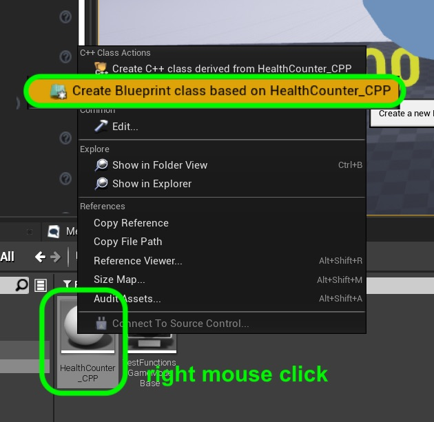  

_____ 


{:start="{{ num }}"}
{{ num }}. Select the **Blueprints** folder and name it `BP_MyHealthCounter_CPP`.

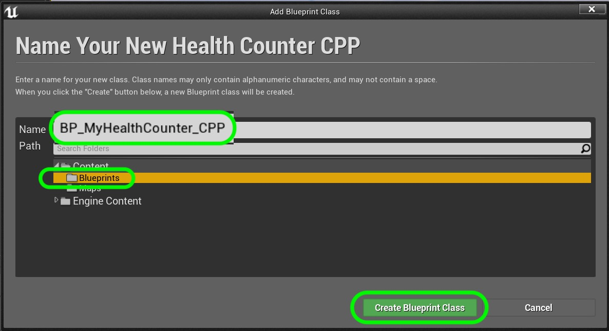  

_____ 


{:start="{{ num }}"}
{{ num }}. Double click and open `BP_MyHealthCounter_CPP`. Now sometimes the blueprint editor window looks different and there is no graph to add logic.  If you ever get this screen you can press the link `Open Full Bueprint Editor`.

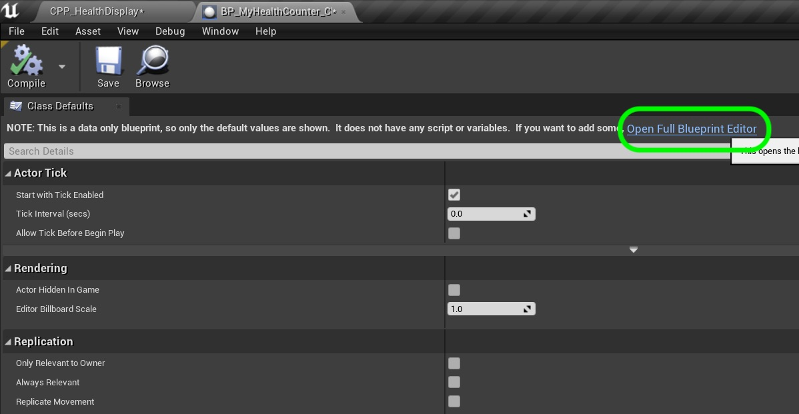  

_____ 



{:start="{{ num }}"}
{{ num }}. Unreal for its existing blueprints does not expose the parents members and functions in the **My Blueprint** menu by default.  You need to click on the **Eyeball** button and select **Show Inherited Variables** like so:

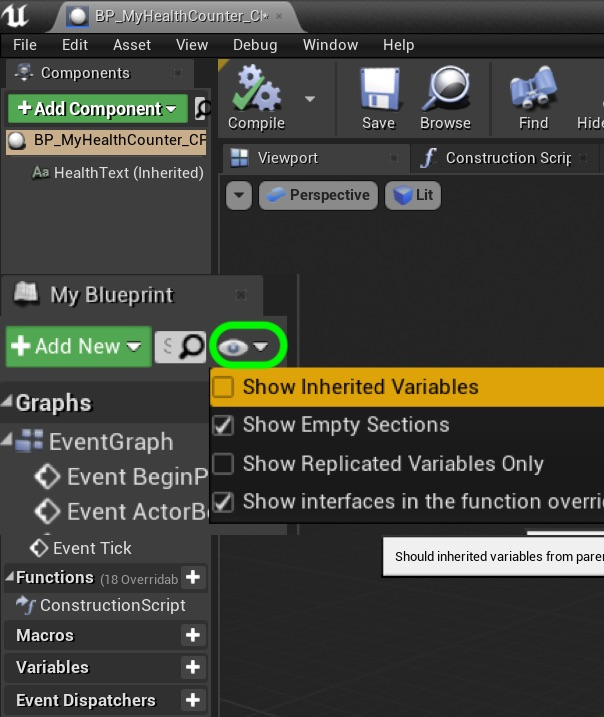  

_____ 


{:start="{{ num }}"}
{{ num }}. Click on the **Arrow** that appears next **Variables**. Look for the variables we created.  They are not there.  We see other variables that are part of the original UACTOR class that we created this from. We need to include a UE4 MACRO with UPROPERTY spedifiers. 

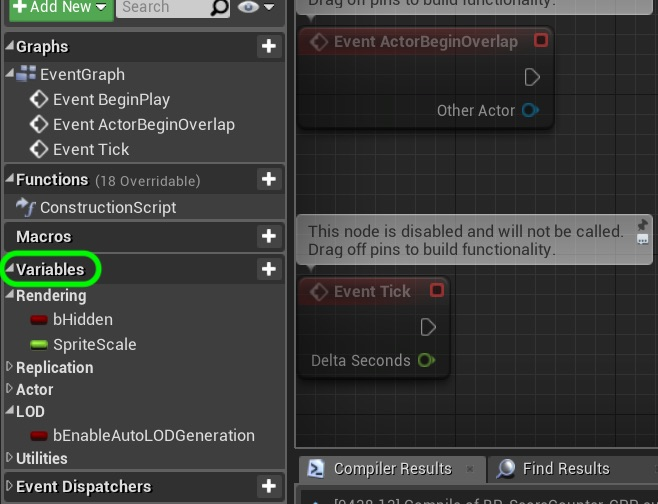  

_____ 


{:start="{{ num }}"}
{{ num }}. So open **HealthCounter_CPP.h** and add a UPROPERTY macro with some specifiers.  A full list of property specifiers can be found on [UE4's website](https://docs.unrealengine.com/en-US/Programming/UnrealArchitecture/Reference/Properties/Specifiers/index.html).  Lets look at the specifiers.  The **EditAnywhere** specifier allows the user  of the blueprint to edit the value in the property window on any instance of this bluerpint. **BlueprintReadWrite** allows the blueprint to read or write to this variable.  The final specifier **Category** allows us to group variables in folders/groups. Press **control b** to build.

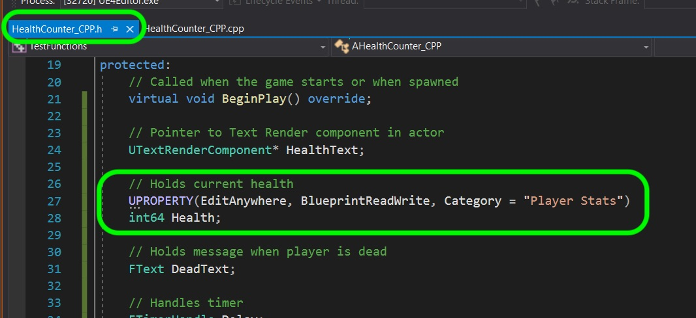  

_____ 


{:start="{{ num }}"}
{{ num }}. Now go back to the blueprint and check out the variables. We should now see the **Health** variable in the folder called **Player Stats** with the default set in the constructor to `100`:

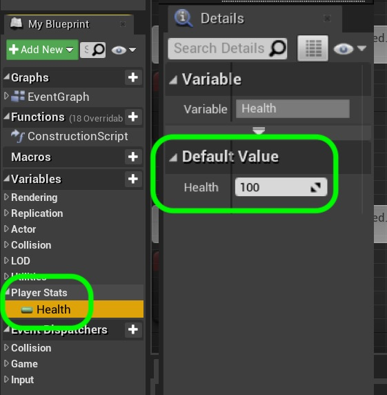  

_____ 


{:start="{{ num }}"}
{{ num }}. In the blueprint change the **Score** default value to `200` and press compile.

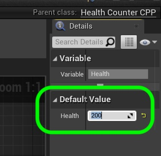  

_____ 


{:start="{{ num }}"}
{{ num }}. Create a new room and call it `BP_CPP_ScoreDisplay`.  Add the **BP_ScoreCounter_CPP** blueprint to the level and press run.  We notice a small problem, the value of the text gets set in the C++ constructor to 100 then gets set after the alarm is called.  So we start at 100 and then subtract from 200 when the first alarm is called.

  

_____ 


{:start="{{ num }}"}
{{ num }}. That's an easy fix, open up **HealthCounter_CPP.cpp** and add an update to the Text in the **Begin Play** function like so.  Press **control b** to build.

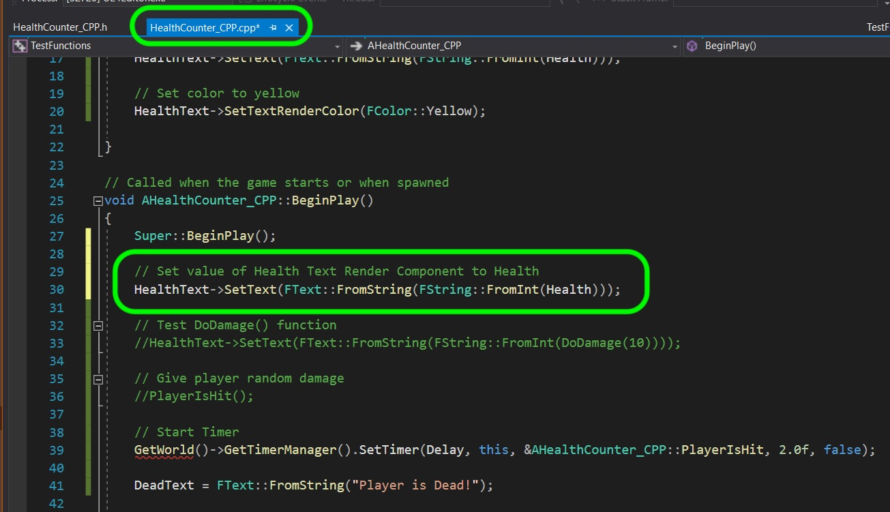  

_____ 



{:start="{{ num }}"}
{{ num }}. Now run the game and it should start counting down from 200.

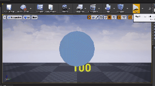  

_____ 


{:start="{{ num }}"}
{{ num }}. So another variable that is ripe to expose for others to edit is the **DeadText** variable.  Open up **ScoreCounter_CPP.h** and add a **UPROPERTY** macro with the same specifiers as we used previously.

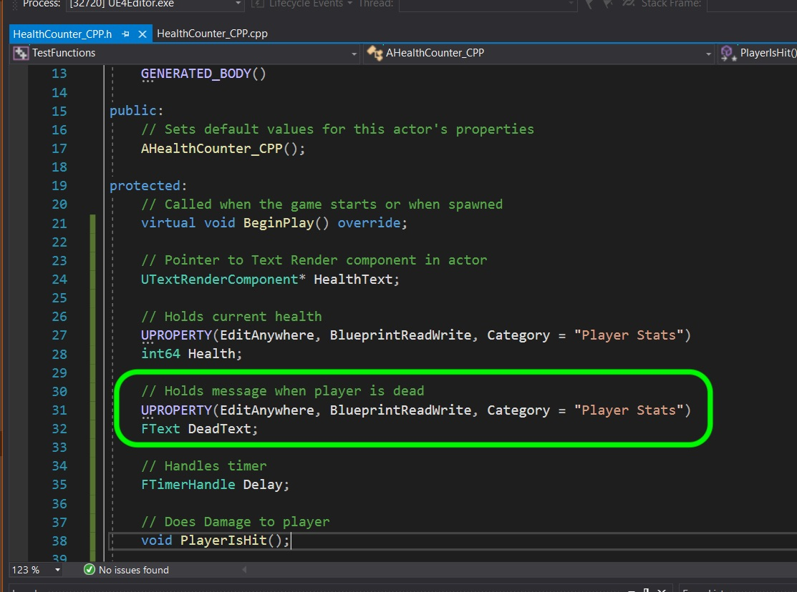  

_____ 


{:start="{{ num }}"}
{{ num }}. Now the way we have currently written this class we set this variable in **Begin Play** in the CPP.  Maybe it is better left to the editor.  Lets comment out this assignment in **ScoreCounter_CPP.cpp**. Now build the game with **control b**.

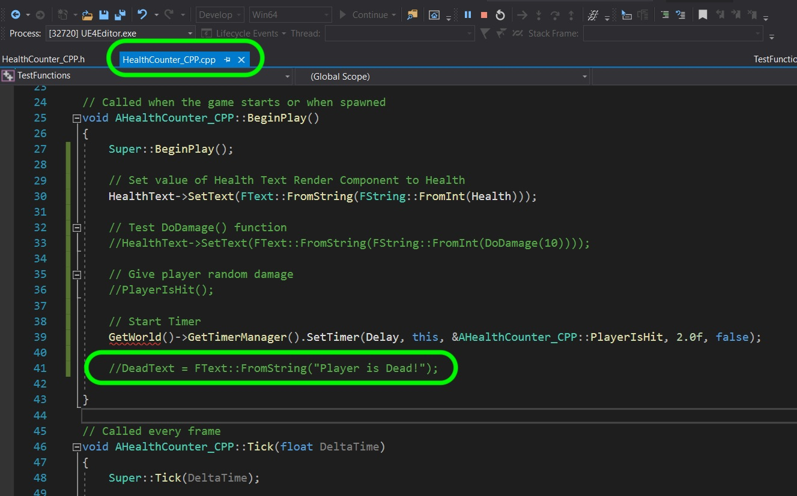  

_____ 


{:start="{{ num }}"}
{{ num }}. Go back to the blueprint and set the default value to **DeadText** to something different. Press compile.

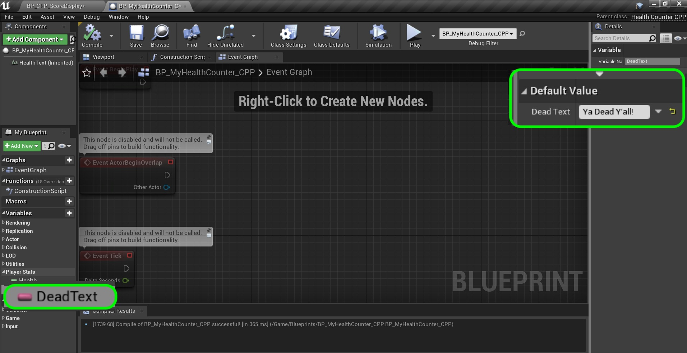  

_____ 


{:start="{{ num }}"}
{{ num }}. Now the message appears in the game window when you run and the score gets to below 0.

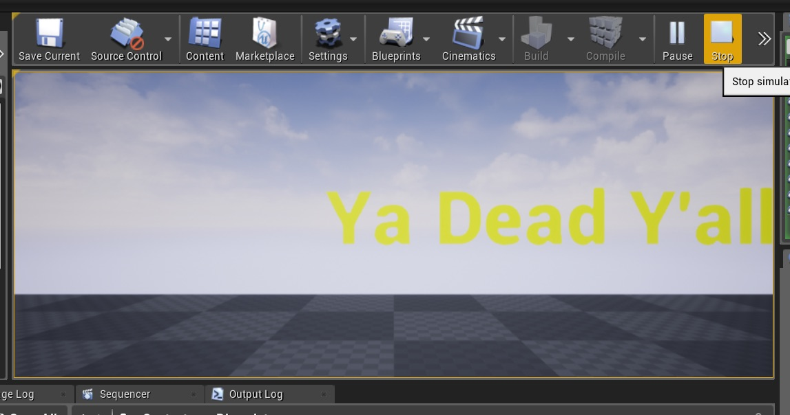  

_____ 


{:start="{{ num }}"}
{{ num }}. Just note that it is best practice to make all variables UPROPERTIES but in some rare cases you will not be able to.  You can control its access through the specifiers.  This helps with garbage collection and freeing up memory in your game.  Now we can do the same thing with functions. 

_____ 


{:start="{{ num }}"}
{{ num }}. Now go to the blueprint and right click on the graph and look for the **DoDamage** function.  Nothing appears.  We need a UFUNCTION marco with specifiers to access functions in blueprints.

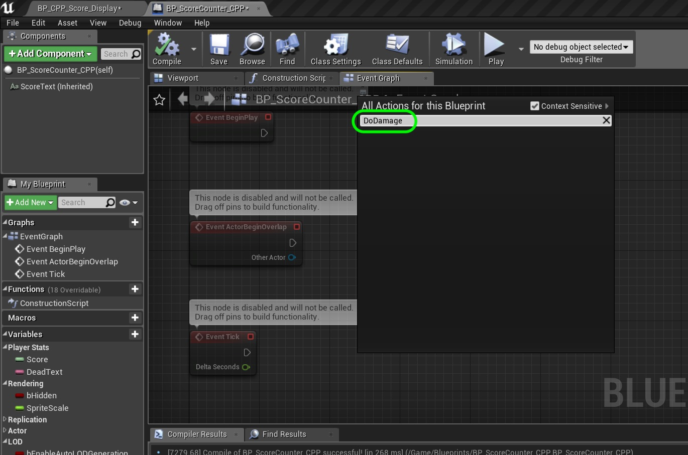  

_____ 


{:start="{{ num }}"}
{{ num }}. Use the UFUNCTION macro and the specifier **BlueprintCallable** which allows us to access the function in a blueprint.  We can also set teh Category.  For a full list take a look at UE4's [UFUNCTION specifiers](https://docs.unrealengine.com/en-US/Programming/UnrealArchitecture/Reference/Properties/Specifiers/index.html). Add it to your `.h` file and build the project.

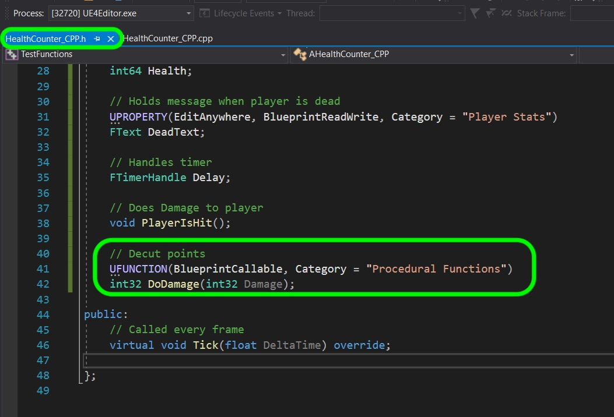  

_____ 


{:start="{{ num }}"}
{{ num }}. Now go back to the blueprint and right click on the graph and try and add **DoDamage**.  Notice that it shows up in the menu:

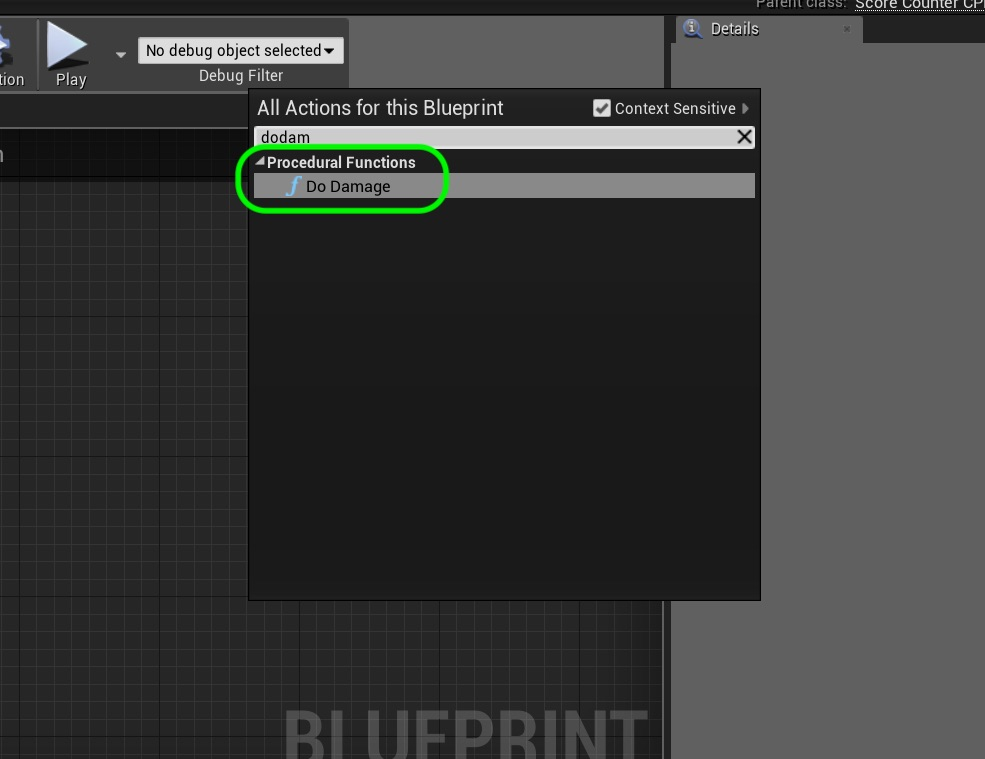  

_____ 


{:start="{{ num }}"}
{{ num }}. Notice that **DoDamage** node has two input pins (parameters) and a return value.  **Target** always shows up so that you can assign the function to antoher object or class.  It defaults to self which means that this object is calling the function. OK, next up - lets take a look at **Macros** in C++.

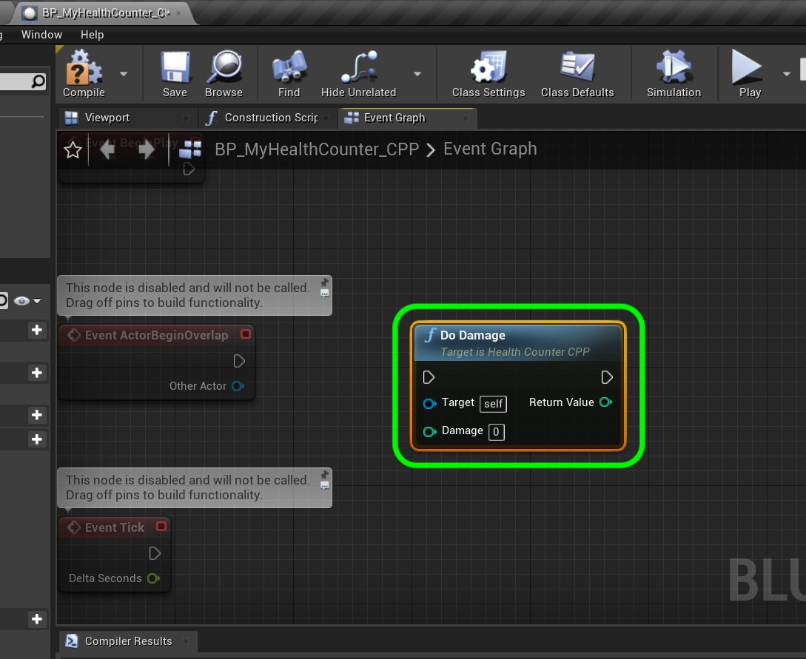  

_____ 
  

[<- Previous](CPP-UE4-Functions-Templates-Classes-2.html)&nbsp;&nbsp;&nbsp;[Home](../index.html)&nbsp;&nbsp;&nbsp; [Continue ->](CPP-UE4-Functions-Templates-Classes-4.html)
   
   
   

