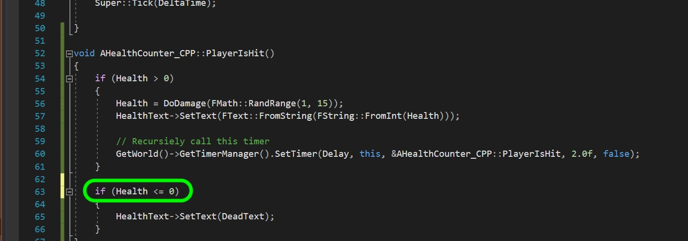

# CPP UE4 Functions Templates & Classes Page 4
_____ 

## Index
_____ 

* Part I - Functions
1. [Simple Function in CPP](CPP-UE4-Functions-Templates-Classes-1.html#simple-functions-in-cpp)
2. [Function in CPP](CPP-UE4-Functions-Templates-Classes-1.html#function-in-cpp)
3. [Function in Unreal Blueprints](CPP-UE4-Functions-Templates-Classes-1.html#function-in-unreal-blueprints)
4. [Fixing Edge Case](CPP-UE4-Functions-Templates-Classes-2.html#fixing-edge-case)
5. [Function in CPP in UE4](CPP-UE4-Functions-Templates-Classes-2.html#function-in-cpp-in-ue4)
6. [Function in CPP & Blueprint](CPP-UE4-Functions-Templates-Classes-3.html#function-in-cpp-&-blueprint)

* Part II - Macros, Constants
1. [Macros](CPP-UE4-Functions-Templates-Classes-4.html#macros)

* Part III - Arrays & Containers
1.  [Arrays](CPP-UE4-Functions-Templates-Classes-4.html#arrays)
2. [Containers](CPP-UE4-Functions-Templates-Classes-5.html#containers)
3. [TArray](CPP-UE4-Functions-Templates-Classes-5.html#tarray)

* Part IV - Classes
1. [Card Class](CPP-UE4-Functions-Templates-Classes-7.html#card-class)
2. [Refactor Card Class](CPP-UE4-Functions-Templates-Classes-8.html#refactor-card-class)
3. [Class Inheritance](CPP-UE4-Functions-Templates-Classes-8.html#class-inheritance-&-casting)

_____ 

## Macros
Macros in C++ are different than Macros in blueprints.  We will cover blueprint Macros later.  But since we were using macros for UPROPERTY and UFUNCTION it would be good to explain what these are. 

A [macro](http://www.cplusplus.com/doc/tutorial/preprocessor/) is a preprocessor directive that is preceded by a hash sign `#`.  These lines are resolved by the pre processor before the compilation begins.  

Lets add a restart so that when the health gets to 0 it resets to a new value (just for testing) `400`.  We will do this initially by using Macros.

_____ 


{:start="{{ num }}"}
{{ num }}. A macro just replaces the text you provide with another value. Go back to the TestFunctions Unreal project and open up **HealthCounter_CPP.h** and add `#define RESETHEALTH 400`.  Notice that it is very similar to the preprocessor directive to include other header files.  It starts with a `#` pound sign and then it is customary to name all macros with ALLCAPS.  The preprocessor will replace the RESETHEALTH with the number 400.

  

_____ 


{:start="{{ num }}"}
{{ num }}. Lets declare a new function `void ResetHealth()` where we will reset the score to a desired constant value. Lets also make it accessible in blueprints by including the UFUNCTION macro.

  

_____ 


{:start="{{ num }}"}
{{ num }}. Now go to the `.ccp` file and add a function definition setting the Health to the macro constant.  Then update the display text. Make sure you build the project and make sure there are no compile errors.

  

_____ 



{:start="{{ num }}"}
{{ num }}. Now to restart the game we want to call **PlayerIsHit** in a blueprint after the player's health gets to 0.  Go back to the `.h` file and add the required macro:

  

_____ 



{:start="{{ num }}"}
{{ num }}. Now open up **BP_HealthCounter_CPP** and add the following logic:  When Health is less or equal to zero then wait 5 seconds, run the **ResetHealth** function, wait another 2 seconds, then run **PlayerIsHit** to start the recursive function again.

  

_____ 


{:start="{{ num }}"}
{{ num }}. We have a bug in our logic.  Open up the definition for **PlayerIsHit()** and change the `else` to `if (Health <= 0)`.  This is because the previous if catches Health when it is above `0` but then subtracts a random amount.  We need to check AGAIN if **Health** is now less than zero.

  

_____ 



{:start="{{ num }}"}
{{ num }}. Compile the blueprint then run the game.  It should start at the value you set in the editor then goes to `400` which is what the MACRO replacement peforms once the score gets to 0.

  

_____ 

Macros in C++

_____ 



{:start="{{ num }}"}
{{ num }}. Quit Unreal and reopen the **FunctionTemplayClasses** solution file we created previously.  Lets first look at `?` conditional operator.  First lets type in an `if` - `else` conditional statement.

  

_____ 



{:start="{{ num }}"}
{{ num }}. We can replace this multipline if else statement with a single line.  We can define a string and we put a `?` after the conditional statement then if the condition is true what is on the right hand of the `?` is used and if false then what is on the right hand side of `:`.  So the keyword `if` is replaced with `?` (but placed after the condition) and `else` is replaced with `:`.  This allows us to save space and express the condition more concisely.

  

_____ 


{:start="{{ num }}"}
{{ num }}. Press **F5** to compile and run and you should get the same result as the multiline if else statement.

  

_____ 



{:start="{{ num }}"}
{{ num }}. Lets get back to Macros.  Now we can **also** have one line Macro functions. Here is one that returns the larger value of the two passed to it.

  

_____ 



{:start="{{ num }}"}
{{ num }}. Lets call this new macro function.

  

_____ 



{:start="{{ num }}"}
{{ num }}. When you build and run it you should see it select `7` as the larger number.

  

_____ 



{:start="{{ num }}"}
{{ num }}.  Lets do the same thing but pass it two variables instead.

  

_____ 



{:start="{{ num }}"}
{{ num }}. Now build and run it and it works as expected returning an `8`.

  

_____ 



{:start="{{ num }}"}
{{ num }}. Many issues can arise with macros as it can unexpected behaviors. For example if you pass an argument with another effect to a Macro you can get unexpected results.  Look at the following. 

  

_____ 



{:start="{{ num }}"}
{{ num }}. Build and run and you expected to see the number `9` didn't you?

  

_____ 



{:start="{{ num }}"}
{{ num }}. Why did this happen?  It took `MAXVAL(++j, ++i)` expands to if `(++j) > (++i) : (++j) : (++i)`.  Notice that it runs **++j** anbd **++y** twice with the text replacement.  Now Macros are used a lot and certainly used in UE4 but you should avoid using them unless they are necessary.  Here are some of the downfalls:  1.  There is no scope in namesapce for #define macros.  So any file that includes this header will inherit this macro.  If it is a common name then it will pick the macro over the local implementation of that variable or function.  2. It is not type safe.  So there are no safeguards for using the wrong type.  3.  Macros cannot be debugged as they are run by the preprocessor. You can't see what the macro translates to.  4. Macros can have expansion issues like the one we just experienced.

_____ 

## Const
Const in C++ cannot be altered by the program and the compiler will give an error if this variable is changed.  

Lets open up our previous UE4 project **TestFunctions.sh** in Visual Studio.

_____ 


{:start="{{ num }}"}
{{ num }}. A better solution for the Macro we used for than a Macro for a const which IS scope controlled. So open up our Unreal project again and lets make a small change.  Comment out the macro:

  

_____ 



{:start="{{ num }}"}
{{ num }}. Create a new variable called `ResetValue` and initialize it to `6000`.  Add a `const` keyword that tells the compiler that this value is a constant and cannot be changed.

  

_____ 


{:start="{{ num }}"}
{{ num }}. Now open the `.cpp` and change the definition of **ResetHealth** and set **Health** to the new constant **Reset Value**.

  

_____ 


{:start="{{ num }}"}
{{ num }}. Compile and run the game and you see that it resets the score to **6000** now when the countdown ends.

  

_____ 


{:start="{{ num }}"}
{{ num }}. Now if you try and change the const variable the compiler will exit with an error.

  

_____ 

## Arrays

Lets quickly look at static arrays in C++.  A [static array](http://www.cplusplus.com/doc/tutorial/arrays/) size is fixed and decided at compile time. Please note that we cannot use static arrays within blueprints.  We will get to a dynamic array container that comes with Unreal next. 

"_A static array is a pre-defined series of elements of the same type placed in contiguous memory locations that can be individually referenced by adding an index to a unique identifier._" - cplusplus.com

_____ 



{:start="{{ num }}"}
{{ num }}. Create a new C++ class and make it inherit from the **Actor** class.  Call it `ArrayCounterActor`.  We add a new static array and need to give it a type and a number elements it will contain.  This is not dynamic we need to determine the size of the array at compile time. Go to the `.h` file and create an array called `Cards` that contains the face value of 4 playing cards `Cards[4]`. An array keeps a list of items of the same type of **FText**.   We also need a TextRender component to demonstrate our working array.  

  

_____ 


{:start="{{ num }}"}
{{ num }}. Open up the `.cpp` file and instantiate the text renderer component and create an array with the text of the four ace playing cards.  Then we will set the array to the first entry and change the color to green.  Notice that our first array item **ALWAYS** starts with `0`.

  

_____ 


{:start="{{ num }}"}
{{ num }}. Press the compile button in the game engine.  Now go back to the editor and create a new level called `ArraysVectorLevel` based on the default template.  Add an instance into the level of `ArrayContainerActor`. Notice that all our work is in the constructor so we immediately see it pick our first entry **Ace of Spades**.

  

_____ 


{:start="{{ num }}"}
{{ num }}. So Blueprints don't support static arrays, but lets see what happens if we add a `UPROPERTY` and expose it to blueprints.  

  

_____ 


{:start="{{ num }}"}
{{ num }}. Press compile and see if it works?  It is best to compile in the Unreal engine as you will get better error messages.  Unreal states that you can't expose an array to Blueprints.

  

_____ 



{:start="{{ num }}"}
{{ num }}. We can still expose it to the editor and edit the values.  Set the **UPPROPERTY** to **EditAnywhere**.

  

_____ 


{:start="{{ num }}"}
{{ num }}. Now compile in the game engine and select the game item in the **World Outliner**.  Then look at the variables and you can still edit the content of the **Cards** aray.

  

_____ 



{:start="{{ num }}"}
{{ num }}. Now we can work around this by creating an integer that we CAN edit in Unreal and use this to access the card index.  Open up the `.h` and add a variable called `CardIndex` and give it a valid UPROPERTY and make it editable and read writable.

  

_____ 


{:start="{{ num }}"}
{{ num }}. Open up **ArrayContainerActor.cpp** and in the **BeginPlay** event change the card to a selected index based on this new variable we just created.  Also, reset teh **CardText** to this potentially new value.

  

_____ 


{:start="{{ num }}"}
{{ num }}. Quit Unreal as we want to run the game from Visual Studio.  We are going to force a hard crash on purpose.  If we run it from VS then we will get added error information, if we run it just by launching it normally it will just shut down and we will get no information about why the game crashes.  Press the green triangle called **Local Windows Debugger** and it will launch Unreal.and position the new C++ actor in front of where the player spawns. Now you can run a different card each time by changing the value in the **World Outliner** by changing the value of **Card Index**.  Now what happens if you try and access an array item that is outside of the memory we allocated (say the 5th non existant array).

  

_____ 


{:start="{{ num }}"}
{{ num }}. So it crashes to Visual Studio.  We get an error saying that we have anb access violation.  We will explore the debugger more in the future.

  

_____ 


{:start="{{ num }}"}
{{ num }}. Now we want non-programmers to use the game engine and tune variables we expose to them.  There is a way to prevent an accidental crash.  In the UPROPERTY we can restrict the minimum and maximum range the user can enter in the game engine.  This will stop them from setting a number that goes out of range.  We need to clamp both a value the player enters with the keyboard as well as one that they enter when using the slider.  We use this meta command to retrict both. `UIMin` and `UIMax` restict the slider and `ClampMin` and `ClampMax` clamps any value entered with the keyboard.

  

_____ 


{:start="{{ num }}"}
{{ num }}. Again, run the game from **Visual Studio** and try dragging the value with the mouse and using the slider as well as entering an invalid number.  Notice how we have solved this potential problem! Remember that we want to minimize the chances of crashes that slows the entire team down.  If there is a range that should be applied setting it for the editor is a good way to proceed.

  

_____ 


{:start="{{ num }}"}
{{ num }}. Next up we will look at containers.

_____ 

  

[<- Previous](CPP-UE4-Functions-Templates-Classes-3.html)&nbsp;&nbsp;&nbsp;[Home](../index.html)&nbsp;&nbsp;&nbsp; [Continue ->](CPP-UE4-Functions-Templates-Classes-5.html)
   
   
   

