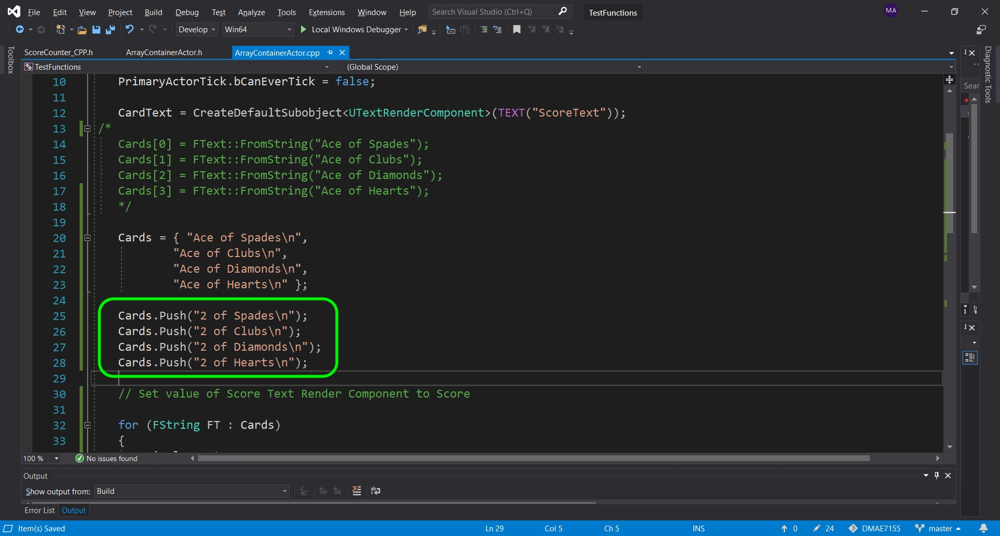

# CPP UE4 Functions Templates & Classes Page 5
_____ 

## Index
_____ 

* Part I - Functions
1. [Simple Function in CPP](CPP-UE4-Functions-Templates-Classes-1.html#simple-functions-in-cpp)
2. [Function in CPP](CPP-UE4-Functions-Templates-Classes-1.html#function-in-cpp)
3. [Function in Unreal Blueprints](CPP-UE4-Functions-Templates-Classes-1.html#function-in-unreal-blueprints)
4. [Fixing Edge Case](CPP-UE4-Functions-Templates-Classes-2.html#fixing-edge-case)
5. [Function in CPP in UE4](CPP-UE4-Functions-Templates-Classes-2.html#function-in-cpp-in-ue4)
6. [Function in CPP & Blueprint](CPP-UE4-Functions-Templates-Classes-3.html#function-in-cpp-&-blueprint)

* Part II - Macros, Constants
1. [Macros](CPP-UE4-Functions-Templates-Classes-4.html#macros)

* Part III - Arrays & Containers
1.  [Arrays](CPP-UE4-Functions-Templates-Classes-4.html#arrays)
2. [Containers](CPP-UE4-Functions-Templates-Classes-5.html#containers)
3. [TArray](CPP-UE4-Functions-Templates-Classes-5.html#tarray)

* Part IV - Classes
1. [Card Class](CPP-UE4-Functions-Templates-Classes-7.html#card-class)
2. [Refactor Card Class](CPP-UE4-Functions-Templates-Classes-8.html#refactor-card-class)
3. [Class Inheritance](CPP-UE4-Functions-Templates-Classes-8.html#class-inheritance-&-casting)

_____ 

## Containers
A [container](http://www.cplusplus.com/reference/stl/) is a holder object that contains a collection of objects like an array does but with greater functionality and safety.  There is a performance hit for using a container, but for a lot of applications it is safer to use.  In C++ the most common are available in the **Standard Template Library** or **STL**.  Lets open up the previous C++ solution **FunctionTemplateClasses**.  

_____ 


{:start="{{ num }}"}
{{ num }}. Include in  a `<vector>` header file and to save typing include a using `std::vector` and `std::string`. 

  

_____ 


{:start="{{ num }}"}
{{ num }}. You can initialize this container in a similar way to an array.  You can call a `vector`, then pass in angle brackets it type, in our case `<string>`, name the structure and pass it the number of elements that we are including.  These 4 strings in this container need to be asigned (they default to an empty string). We assign them the same way we do a regular static array.  Remember for an container size of `4` we access them with `0` through `3` like so:

  

_____ 



{:start="{{ num }}"}
{{ num }}. Another way of assigning this container is with assigning a list of the type between brackets `{}` separated with commas.  So this is the same as the previous way of doing it.  Comment out the first set of assignments and add the following:

  

_____ 



{:start="{{ num }}"}
{{ num }}. So we will send the first card and print it out in the output stream.  We do it in the same we we do with an array.

  

_____ 


{:start="{{ num }}"}
{{ num }}. We should see our first card being the Ace of Spades when we compile and run it!

  

_____ 


{:start="{{ num }}"}
{{ num }}. Now lets try and access a non-existant index in this container. I am looking for the 50th entry:

  

_____ 


{:start="{{ num }}"}
{{ num }}. We get an assertion and the program stops to run.  In my case it says the **vector subscript out of range**.  The program can't point to this memory as this does not contain anything at this moment. You can press abort and we will continue.

  

_____ 


{:start="{{ num }}"}
{{ num }}. Return the first card array to `0` so it can continue to run without crashing.  The vector is a template class so it comes with many functions that an array doesn't that can help us.  One is a function called `size()`.  This returns the number of elements inside the vector. We access the function by `.` referencing it from the class (we will get into this some more shortly).  So `Card.size()` will return the number of cards in this vector as an integer.

  

_____ 


{:start="{{ num }}"}
{{ num }}. Run the game and you should now see that the `size()` function returned `4` which we expected.

  

_____ 



{:start="{{ num }}"}
{{ num }}. Lets loop through and print out all 4 cards. We can use the `size()` function to make sure we don't go passed the end of the structure.

  

_____ 


{:start="{{ num }}"}
{{ num }}. Now you will see that it lists the cards in the order you entered them in.

  

_____ 


{:start="{{ num }}"}
{{ num }}. There is an easier way to access all elements in a vector.  We can use  **range-for-loop**.  We access it by getting all individual **strings** in a vector of **\<string\>**.  We access it with `for (string I: VectorName)`.  This goes in order through the vector and places each one in the loop in the variable and type defined before the `:`. 

  

_____ 


{:start="{{ num }}"}
{{ num }}. Run and compile the program and you get the same result as the for loop.

  

_____ 


{:start="{{ num }}"}
{{ num }}. Lets shuffle this vector.  We need to include another standard function that is included in the `<algorithm>` set of functions.  Lets include this in our header file:

  

_____ 


{:start="{{ num }}"}
{{ num }}. Now we will call a template class that is included with algorithm.  It is called **[std::random_shuffle](https://en.cppreference.com/w/cpp/algorithm/random_shuffle)**.  Since we are not passing it a random number generator it will use `rand()` by default.  This template reorders the lements within the given range `(first, last)` with equal probability.

  

_____ 


{:start="{{ num }}"}
{{ num }}. Compile and run the program.  In my case it swapped hearts and diamonds (it might be different in yours).  The key is that if I run it 100 times I will get the same result.  Even though I am shuffling it, it will give the same shuffle every time.

  

_____ 


{:start="{{ num }}"}
{{ num }}. We need to alter the random seed fed to the random number generator.  We can do this by calling `srand()` (`<cstdlib>`) and pass it the current `time()` (`<ctime>`).  This sets the seed of the random number generator to the current time (which is always a different number).  Update the `.h` file to add the two required headers:

 

_____ 


{:start="{{ num }}"}
{{ num }}. Call **[srand](http://www.cplusplus.com/reference/cstdlib/srand/)** and pass it the current time.  This changes the seed everytime the game is run.

  

_____ 


{:start="{{ num }}"}
{{ num }}. Run and compile and you will be passing a different seed each time, so your shuffle should be different each time.

  

_____ 


{:start="{{ num }}"}
{{ num }}. Run and compile the game to see that the value changes each time which sets a different seed and gets a different result.

  

_____ 


{:start="{{ num }}"}
{{ num }}. One of the advantages of using a container is that we can add dynamically to the array during run-time and don't need to know in advance how many items this data structure should hold.  We use the `vector::push_back` function to add a string to the end of the vector.  Lets add the second card to the deck:

  

_____ 


{:start="{{ num }}"}
{{ num }}. Compile and run the game.  Now shuffling happens after we add the second card so the entire deck is now shuffled.

  

_____ 
## TArray
Since the standard template functions are not optimized to run at maximum efficiency in run-time systems Unreal has written their own  **std::vector** counterpart.  It is of type `TArray` (T stands for template).  This is a dynamic array created for a run-time system. This allows you to add elements at run-time. There are other game ready implementations you could use including [EA STL](https://github.com/electronicarts/EASTL/tree/master/include/EASTL).

_____ 


{:start="{{ num }}"}
{{ num }}. Open up **TestFunctions.uproj** and go to the **ArrayVectorLevel**.  Open up **ArrayCounterActor.h** and change the **Cards** type to a TArray with **FString** type in the template. Lets also add another **FString** called `DisplayText` to concatonate the various cards.

  

_____ 


{:start="{{ num }}"}
{{ num }}. Open the `.cpp` file and change the assignment of cards to a single statement.  Then use a for each loop and concatonate the various cards. Then we display this new concatonated text string by setting the text in the constructor.

  

_____ 


{:start="{{ num }}"}
{{ num }}. Now go to **BeginPlay** and update the variable we set the text to where we change a **String** to a **Text** format.

  

_____ 


{:start="{{ num }}"}
{{ num }}. Now launch the editor from the compiler again (close it if it is currently running).  Go into the game and see if the constructor is showing all 4 cards. If it is showing the previous version you can delete the actor in the scene and drag a new one in the scene. 

  

_____ 


{:start="{{ num }}"}
{{ num }}. Now run the game and you will see it change colors when running the **BeginPlay** function:

  

_____ 


{:start="{{ num }}"}
{{ num }}. Since this is a dynamic array we can make changes to the size of the **TArray**.  We do this by pushing new elements to the end of the array. Use the function in the **TArray** template called `Push()` and pass it another set of cards like so:

  

_____ 


{:start="{{ num }}"}
{{ num }}. Now save your work, go to the game and press the compile button (you can't compile in Visual Studio if you are running the game from it).  This will compile the C++ code if you saved it! Move the object in the scene to kick the constructor to re-run. Now you should see 8 items like so when run:

  

_____ 


{:start="{{ num }}"}
{{ num }}. Now there is a shuffle blueprint node but not an equivalent C++ class.  We can come back to this and write our own later on.  For now we will leave the UE4 dynamic array implentation here.  Lets move on and look at classes.

_____ 

  

[<- Previous](CPP-UE4-Functions-Templates-Classes-4.html)&nbsp;&nbsp;&nbsp;[Home](../index.html)&nbsp;&nbsp;&nbsp; [Continue ->](CPP-UE4-Functions-Templates-Classes-6.html)
   
   
   

