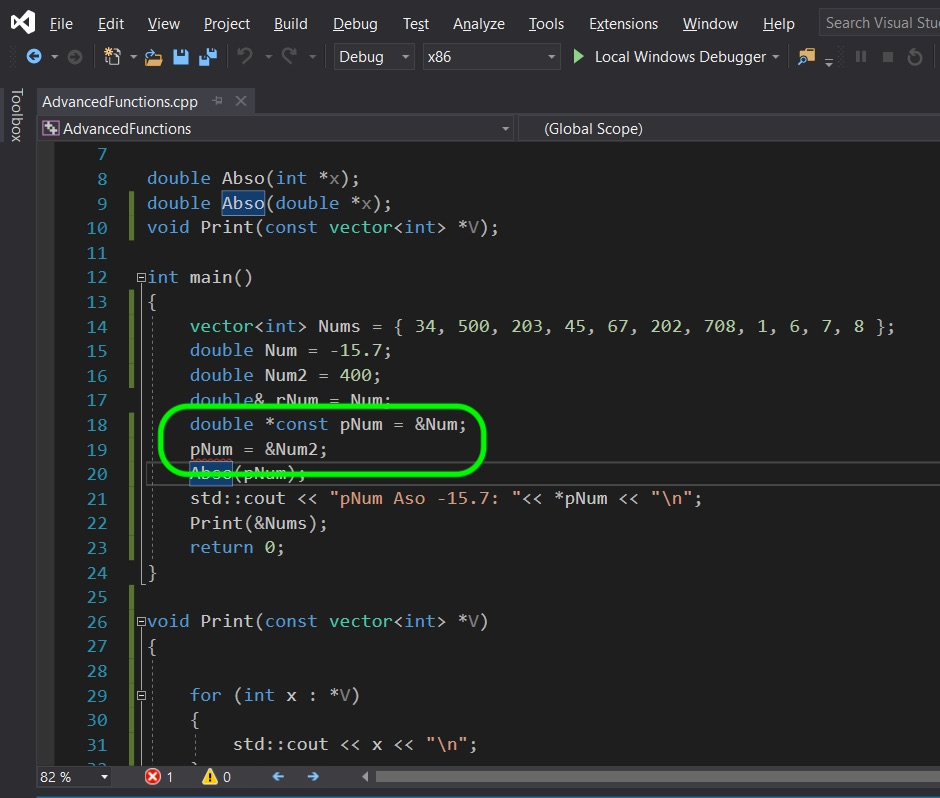

# CPP UE4 Functions Templates & Classes Page 6
_____ 

## Index
_____ 

* Part I - Functions
1. [Simple Function in CPP](CPP-UE4-Functions-Templates-Classes-1.html#simple-functions-in-cpp)
2. [Function in CPP](CPP-UE4-Functions-Templates-Classes-1.html#function-in-cpp)
3. [Function in Unreal Blueprints](CPP-UE4-Functions-Templates-Classes-1.html#function-in-unreal-blueprints)
4. [Fixing Edge Case](CPP-UE4-Functions-Templates-Classes-2.html#fixing-edge-case)
5. [Function in CPP in UE4](CPP-UE4-Functions-Templates-Classes-2.html#function-in-cpp-in-ue4)
6. [Function in CPP & Blueprint](CPP-UE4-Functions-Templates-Classes-3.html#function-in-cpp-&-blueprint)

* Part II - Macros, Constants
1. [Macros](CPP-UE4-Functions-Templates-Classes-4.html#macros)

* Part III - Arrays & Containers
1.  [Arrays](CPP-UE4-Functions-Templates-Classes-4.html#arrays)
2. [Containers](CPP-UE4-Functions-Templates-Classes-5.html#containers)
3. [TArray](CPP-UE4-Functions-Templates-Classes-5.html#tarray)

* Part IV - More Functions Details
1. [Overloaded Functions](CPP-UE4-Functions-Templates-Classes-6.html#overloaded-functions))
2. [Pass By Value](CPP-UE4-Functions-Templates-Classes-6.html#pass-by-value)
3. [Reference](CPP-UE4-Functions-Templates-Classes-6.html#reference)
4. [Pass by Reference](CPP-UE4-Functions-Templates-Classes-6.html#pass-by-reference)
5. [Pointer](CPP-UE4-Functions-Templates-Classes-6.html#pointer)
6. [Pass by Pointer](CPP-UE4-Functions-Templates-Classes-6.html#pass-by-pointer)
7. [Const Vector and Pointer](CPP-UE4-Functions-Templates-Classes-6.html#const-vector-and-pointer)

* Part IV - Classes
1. [Card Class](CPP-UE4-Functions-Templates-Classes-7.html#card-class)
2. [Refactor Card Class](CPP-UE4-Functions-Templates-Classes-7.html#refactor-card-class)
3. [Class Inheritance](CPP-UE4-Functions-Templates-Classes-8.html#class-inheritance-&-casting)

_____ 

## Overloaded Functions
Now in C++ we can overload functions.  What does this mean?  This means that we can use the same function return type and name with different parameters.  This allows you to call a function and pass it different parameters and get results that make sense to the caller.  Lets take a look.

_____ 


{:start="{{ num }}"}
{{ num }}. Reopen the **FunctionTemplateClasses** solution.  Right click on the solution and select **Add \| New Project...**. 

  

_____ 


{:start="{{ num }}"}
{{ num }}. Create a new **Console App** template then press the **Next** button. 

  

_____ 


{:start="{{ num }}"}
{{ num }}. Call this new project `AdvancedFunctions` then press the **Create** button.

  

_____ 



{:start="{{ num }}"}
{{ num }}. Right click on this new project and select **Set As StartUp Project**.

  

_____ 



{:start="{{ num }}"}
{{ num }}. Now lets create a new function called `double Abso(int x)`.  This function will return a double and take as a parameter the **integer x**. This function will return the same number but remove the negative sign.  So a number of -10 will return 10 and a positive number will just return the same number.

  

_____ 



{:start="{{ num }}"}
{{ num }}. Compile and run to see the negative number passed return in its absolute form:

  

_____ 


{:start="{{ num }}"}
{{ num }}. So lets see why we would to have the function take different types.  What if we call the same name and pass it a **double** with a fractional value like so:

  

_____ 


{:start="{{ num }}"}
{{ num }}. Now when you run it the value is cast to an integer when it gets sent to the function.  This is because the parameter passed is an integer so it gets converted when sent to the function. So we get an integer back even if the return type is double.  

  

_____ 


{:start="{{ num }}"}
{{ num }}. Now we can only override a function with the same name if the return type is the same.  If we change the return type, we need to change the name. So lets override this function with a parameter of double.

  

_____ 


{:start="{{ num }}"}
{{ num }}. Compile and run and you now get a double back that is not truncated.  This override works nicely as the caller doesn't have to worry about what type they send.  If they feel that it is negative number they will always get a double back with a value that makes sense.

  

_____ 

## Pass By Value
Now we need to look at how data is moved around when calling functions in C++.  Lets look at what happens to the parameters and their scope when we send them to a function.

_____ 


{:start="{{ num }}"}
{{ num }}. So what happens when I pass a variable as a parameter to another function.  Is the function reading the memory from the same variable?  If so then if we call this function the parameter we pass should be changed.  Lets try it out:

  

_____ 


{:start="{{ num }}"}
{{ num }}. When we run it notice that the parameter is not affected it stays negative.  The program makes a copy of `Num` when it passes it to this function.  Now this isn't bad, but what if this was a data structure with all the points in a 3-D model that is 100 megabytes?  It would have to take an extra 100 megabytes of memory when it is passed to the function.  This would be slow and ineficient. 

  

_____ 

## Reference
There are two solutions to passing around larger data structures.  We can use **references** or **pointers**. Lets start by looking at a **[reference](https://en.cppreference.com/w/cpp/language/reference)** declaration.  This creates a reference to a built in or created type. This creates an alias that points to the same object/variable regardless of where it is located in memory.

_____ 



{:start="{{ num }}"}
{{ num }}. We declare a variable to be a reference by putting an `&` after the type when a variable or object is initialized. This reference is identical to using the original variable.  

  

_____ 


{:start="{{ num }}"}
{{ num }}. When we run the program the exact same thing happens. So we can use `Num` and `rNum` interchangably and they will affect the same data in exactly the same way.

  

_____ 

## Pass by Reference
So one of the things we can do with a reference, is pass this reference to a function and it can then change the underlying variable.  It doesn't make a copy but instead affects the original variable that the alias points to.  We do this by including an `&` after the type in the parameter we send.

_____ 



{:start="{{ num }}"}
{{ num }}. So lets alter the declaration and definition otionf the functions we are using.  Add an `&` after the type in the parameters we pass.  Now when the function is called, it will alter the original `Num` variable that `rNum` is referring to.

  

_____ 


{:start="{{ num }}"}
{{ num }}. Now when we run it, notice that the original value changes (try outputing `rNum` and `Num`, you should get the same result). So instead of duplicating this value it sends an alias.  Be warned, this means the fucntion can change those parameters. This is not a good example of why we would use a rerence and is just an example.

  

_____ 

## Pointer
Now the other way we can pass information around is with a **[pointer](http://www.cplusplus.com/doc/tutorial/pointers/)**.  This stores the memory location for where the information is located.  Unlike a reference which isd always linked to its reference, we can change the location of the memory it is pointing to and change which object/variable it is pointing to.  A pointer is declared by placing `*` after the type in the variable declaration.  

_____ 



{:start="{{ num }}"}
{{ num }}. So lets declare a pointer like we did the reference.  Create a new variable called `pNum` and set it to point to the memory location of `Num`.  Press compile.  Notice a series of errors.  One to pay attention to as we will see a lot of it in Unreal is **cannot convert from double to double*. 

  

_____ 


{:start="{{ num }}"}
{{ num }}.  We also need to add an `&` before a variable name to get the memory address of where it is located and passes it to the pointer. Lets also print the output of `rNum` and see if it is the same as `Num`.

  

_____ 


{:start="{{ num }}"}
{{ num }}.  Now compile and run. Woops instead of seeing the double we see `005DF85C`.  Now it will most likely be different in your computer as this is pointing to memory on my computer.  Memory addresses are stored in **[hexadecimal](https://en.wikipedia.org/wiki/Hexadecimal)** values. Now please be aware that this memory location will not always contain this value. When using pointers we need to be VERY careful.

  

_____ 


{:start="{{ num }}"}
{{ num }}. So how can we see the original value of what this memory is pointing to?  There is a way to change that pointer to display the contents of the memory.  It is called **dereferencing**.  So any variable that holdw a pointer can show its content by putting an `*` before the name.

  

_____ 


{:start="{{ num }}"}
{{ num }}. Now compile and run and notice that we no longer see what ther variable actually holds (a memory address) but we see the underlying data that is inside that memory location.

  

_____ 

## Pass by Pointer
Now we can also pass a pointer to a function and it will allow the function to access and change that memory location that is sent.

_____ 


{:start="{{ num }}"}
{{ num }}. Alter the `Abso()` params from a reference (`&`) to a pointer (`*`).  Also in the definition you will need to dereference ths parameter each time you want to affect its underlying value.

  

_____ 


{:start="{{ num }}"}
{{ num }}. Compile and run, and you should see that the underlying value was changed by the dereferenced point!

  

_____ 

## Const Vector and Pointer
Now what if I want to pass a large file and not have it changed by the function I am passing the value to.  How do I do this with using pass by refeerence and pass by pointer?  This is where `const` comes in handy.  We can define a parameter as `const` so that the function we are passing it to can't change the value.

_____ 



{:start="{{ num }}"}
{{ num }}. If you start your reference or pointer parameter with `const` the original variable that it is referencing or pointing to can not be changed.  Add `const` to the parameters and lets create a new function called `Print()` to test this out on.

  

_____ 


{:start="{{ num }}"}
{{ num }}. Compile and run the application and you see that it prints out the vector from by passing by **const reference**.

  

_____ 


{:start="{{ num }}"}
{{ num }}. Now lets test whether `const` works.  Try to add an element at the end of the array and press compile iside the `Print()` function.  Try it and see the compile error:

  

_____ 


{:start="{{ num }}"}
{{ num }}. Remove `const` from the `Print()` function and it now compiles and allows you to change the vector passes by reference.

  

_____ 


{:start="{{ num }}"}
{{ num }}. We can do exactly the same thing with pointers.  Change the `Print()` to pass by pointer.  You will need to pass it the address of the vector (the name with the address `&` symbol before).  You will also need to dereference the pointer in the for loop.  Lets start by not setting it as `const`. Now to dereference the pointer and select `push_back` is pretty complex looking.  We need to dereference the pointer to dot instance into the function.s

  

_____ 


{:start="{{ num }}"}
{{ num }}. There is an easier shortcut to represent exactly the same thing.  To dererence a pointer and access its members can be done simply by instead using `->`.  Now change it to:

.jpg"  class= "img-fluid"  alt="Screenshot of Microsoft's Visual Studio Community website page demonstrating community version that is needed download">  

_____ 


{:start="{{ num }}"}
{{ num }}. Run the project and you should now see a `2` added to the end of the TArray.

  

_____ 


{:start="{{ num }}"}
{{ num }}. Now change the pointers to `const` and it will no longer compile.

  

_____ 


{:start="{{ num }}"}
{{ num }}. Pointers are tricky as you can also put the `const` after the pointer.  This means that you still can alter the value it is pointing to, but you can't change the memory address that the pointer is pointing to.  Line 19 would be legal and valid if you didn't have `const` after the pointer.  Be aware and pay attention on where the pointer is located. Next up we will look at classes.

  

_____ 
  

[<- Previous](CPP-UE4-Functions-Templates-Classes-5.html)&nbsp;&nbsp;&nbsp;[Home](../index.html)&nbsp;&nbsp;&nbsp; [Continue ->](CPP-UE4-Functions-Templates-Classes-7.html)
   
   
   

