# CPP UE4 Functions Templates & Classes Page 7
_____ 

## Index
_____ 

* Part I - Functions
1. [Simple Function in CPP](CPP-UE4-Functions-Templates-Classes-1.html#simple-functions-in-cpp)
2. [Function in CPP](CPP-UE4-Functions-Templates-Classes-1.html#function-in-cpp)
3. [Function in Unreal Blueprints](CPP-UE4-Functions-Templates-Classes-1.html#function-in-unreal-blueprints)
4. [Fixing Edge Case](CPP-UE4-Functions-Templates-Classes-2.html#fixing-edge-case)
5. [Function in CPP in UE4](CPP-UE4-Functions-Templates-Classes-2.html#function-in-cpp-in-ue4)
6. [Function in CPP & Blueprint](CPP-UE4-Functions-Templates-Classes-3.html#function-in-cpp-&-blueprint)

* Part II - Macros, Constants
1. [Macros](CPP-UE4-Functions-Templates-Classes-4.html#macros)

* Part III - Arrays & Containers
1.  [Arrays](CPP-UE4-Functions-Templates-Classes-4.html#arrays)
2. [Containers](CPP-UE4-Functions-Templates-Classes-5.html#containers)
3. [TArray](CPP-UE4-Functions-Templates-Classes-5.html#tarray)

* Part IV - More Functions Details
1. [Overloaded Functions](CPP-UE4-Functions-Templates-Classes-6.html#overloaded-functions))

* Part IV - Classes
1. [Card Class](CPP-UE4-Functions-Templates-Classes-7.html#card-class)
2. [Refactor Card Class](CPP-UE4-Functions-Templates-Classes-8.html#refactor-card-class)
3. [Class Inheritance](CPP-UE4-Functions-Templates-Classes-8.html#class-inheritance-&-casting)

_____ 

## Card Class
A class is a user defined type.  It contains members (variables and functions in a class) and we access members with a `object.member` notation.  Lets add a new project by right clicking on the solution file and select **Add \| New Project...**.  Select a **Console App** template and call this new project `BasicClass`. Right click on this new project and select **Set as StartUp Project**.

_____ 


{:start="{{ num }}"}
{{ num }}. Lets create a **Card** type.  We will give it two member variables one for the number and the other for the suit.  We declare the class with a name (notice that the curly braces at the end of a class ends with a semi-colon `};`).  Now add two public member variables one of type **int** and one of type **string**. In Main create a new variable of type **Card** and assign a number and assign a suit.  

  

_____ 


{:start="{{ num }}"}
{{ num }}. Notice that we access members of the class through dot notation.  We use the name of the variable that holds an instance of this object and then with `.` access its members.  Compile and run and see that it outputs to two public members of the card:

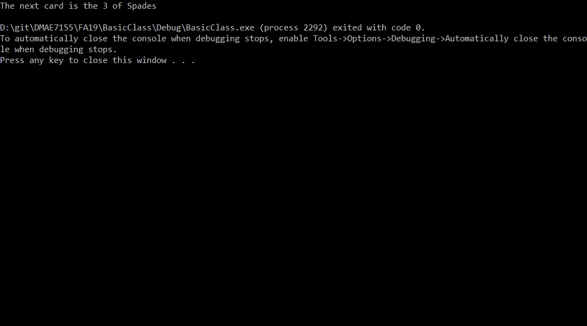  

_____ 



{:start="{{ num }}"}
{{ num }}. What is the problem here?  The caller can make the suit anything, on top of spades, hearts, diamonds and clubs.  Also, they can make a card `-20` or `3000`.  We want the private implementation handle the limitations of the class as a card has a fixed set of rules.  Now we control the access to the members through the label `public` and `private`.  The public implementation is the interface and accessible by other objects and the `private` implementation is only accessible through the public interface.  So lets move `Number` and `Suit` into a `private: ` implementation.  Add two getters a `GetNumber()` and `GetSuit()` inside a public interface.    Notice that we also have the definition inside the declaration and don't have a separate implementation.  This is common for simple functions like this that run [inline](https://www.geeksforgeeks.org/inline-functions-cpp/).  Now the person calling this class cannot directly alter this class.  So how are we going to set the value?  This is where the class constructor comes into play.  This is a special function that runs when the class is instantiated.  In this case we will have the caller pass an integer and a float for the card and suit.

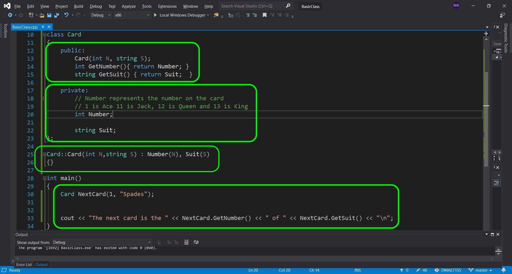  

_____ 


{:start="{{ num }}"}
{{ num }}. Compile and run and you will notice that we pass the card we want to construct when we create an instance of this class.  

  

_____ 


{:start="{{ num }}"}
{{ num }}. There is a better way of representing both the cards and the suits.  In many games the value of Jack, Queen and King are all 10 with Ace being 1 or 11.  This means that an integer value for the value is not necessarilly a good way of separating a 10 card from a king card.  This is where [enumerators](https://en.cppreference.com/w/cpp/language/enum) come into play.  It allows us to have a constant value of a distinct type that resticts us to a range of values.  This allows us to use words to represent the meaning of a value in a list. We have a scoped `enum call Card Number` that by default would set the first value to `0`. Since Ace can be worth 1, it makes sense to start the enumerator at `1` instead of its default.  It then sets `Two` to `1`, `Three` to `2` etc...  We also need to update `GetNumber()` return type from `int` to `CardNumber`.  We also need to change the variable `Number`'s type to `CardNumber`.

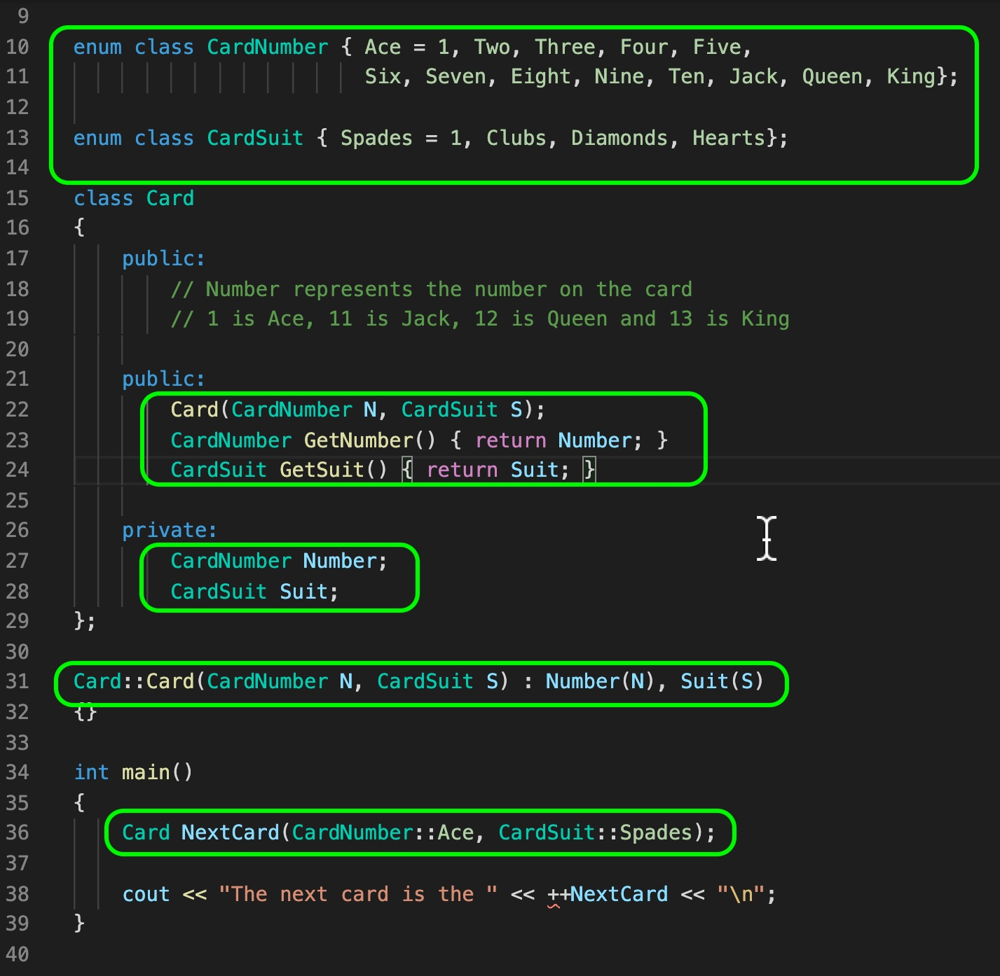  

_____ 


{:start="{{ num }}"}
{{ num }}. Now press compile.  Notice that you get an error when you try and use `cout <<` on `GetNumber()`.  It doesn't recognize the type so it doesn't know what to print.  

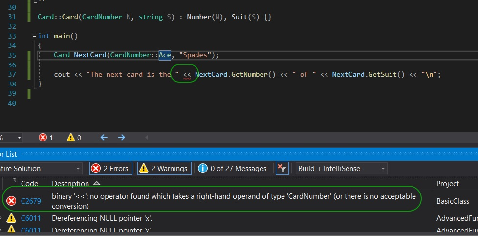  

_____ 


{:start="{{ num }}"}
{{ num }}. We need to create an operator override before the main() function that defines how to output this type. Any function can be overridden to accept different types of parameters.  This also extends to CPP operators. This allows us to tell the program how the operator should work.  There is nothing restricting our definitions but it is best to keep up with the intent of the operator.  So CardNumber++ should move to the next card and maybe we don't want to override `*` as I am not aware of games where cards multiply two cards for a result (but if it does this is an acceptable override).

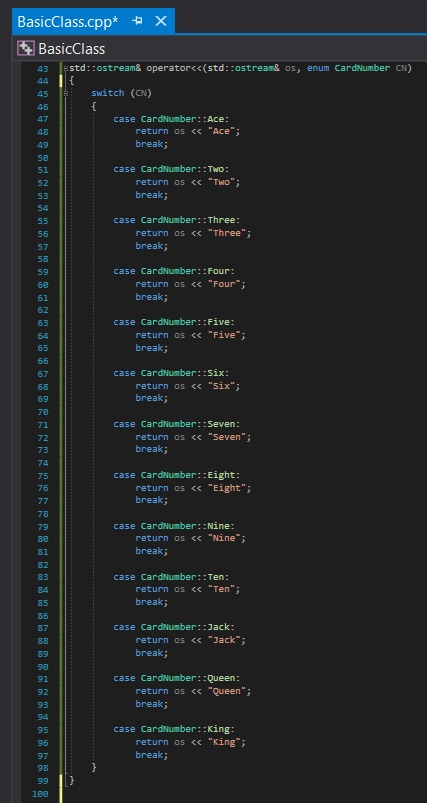  

_____ 


{:start="{{ num }}"}
{{ num }}. Press compile and run and you should see the card.

  

_____ 


{:start="{{ num }}"}
{{ num }}. Now how does this help us with a person who puts in an invalid value when instantiating a **Card** class?  It doesn't.  Lets enter an illegal value like so:

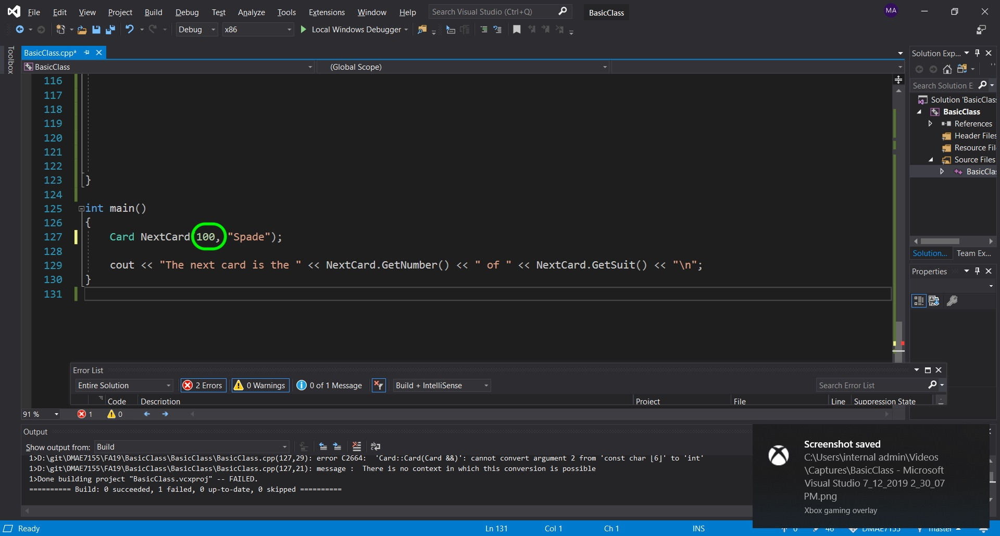  

_____ 


{:start="{{ num }}"}
{{ num }}. Compile and woops we get an error. We are crashing in OS and it is not a value that is recognized.  

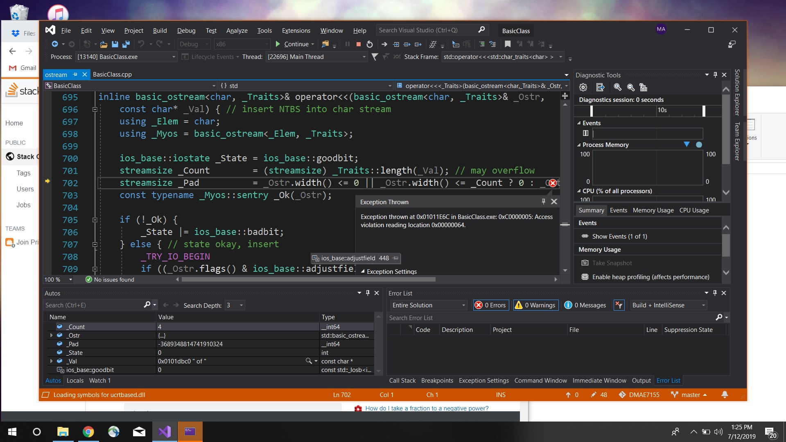  

_____ 


{:start="{{ num }}"}
{{ num }}. Now we can check for the error in the Card class itself.  Or we can say, hey lets not crash and keep running but make the value clear to the user that is not a valid one.  Lets go with this.  So if the value is greater than **King** and less than **Ace** then it is an **Invalid Card**.

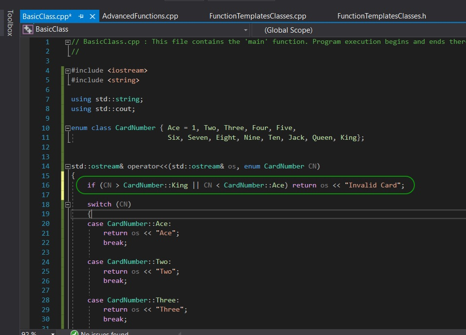  

_____ 


{:start="{{ num }}"}
{{ num }}. Now compile and run again, and the game would continue but the player would know that something is very wrong (not an elegant solution if this was a real card game). Is it better for the game to crash and assert, or communicate a message to the player?  This is something you need to decide.  We will cover error reporting in UE4 later on.

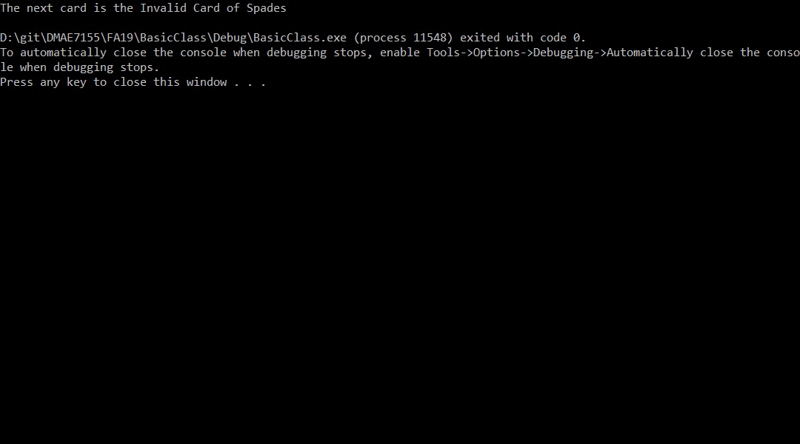  

_____ 


{:start="{{ num }}"}
{{ num }}. Lets do the same thing for the suit.  Lets turn it into a class enumerator. Again, because the number starts at `1` we will have the suit start at `1`.

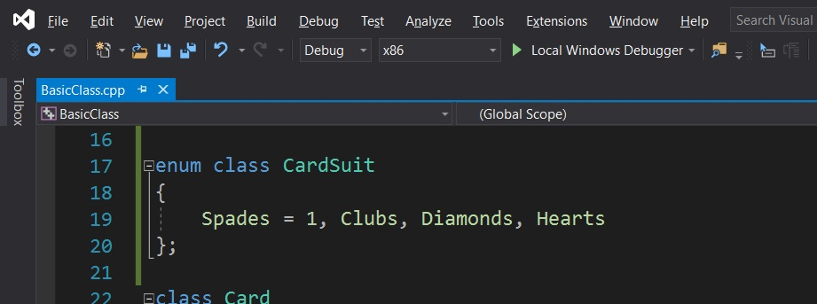  

_____ 


{:start="{{ num }}"}
{{ num }}. Now we need to change `Suit` to a **CardSuit** type as well as the return type for `GetSuit()`. We also set it in the class constructor.

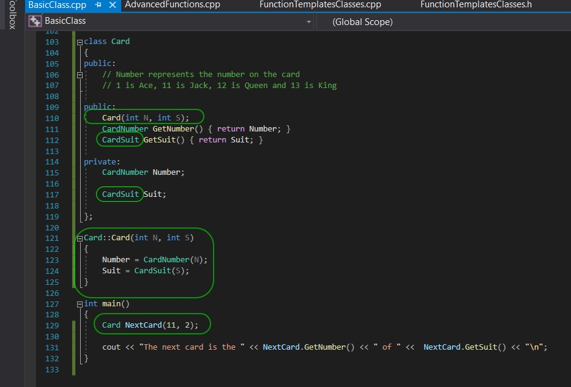  

_____ 


{:start="{{ num }}"}
{{ num }}. Now iet won't compile as `OS` doesn't know what to do with this type when fed into its output stream.  Just like the previous override we will have a message when the integer is out of range.  This will not crash but print an error message.

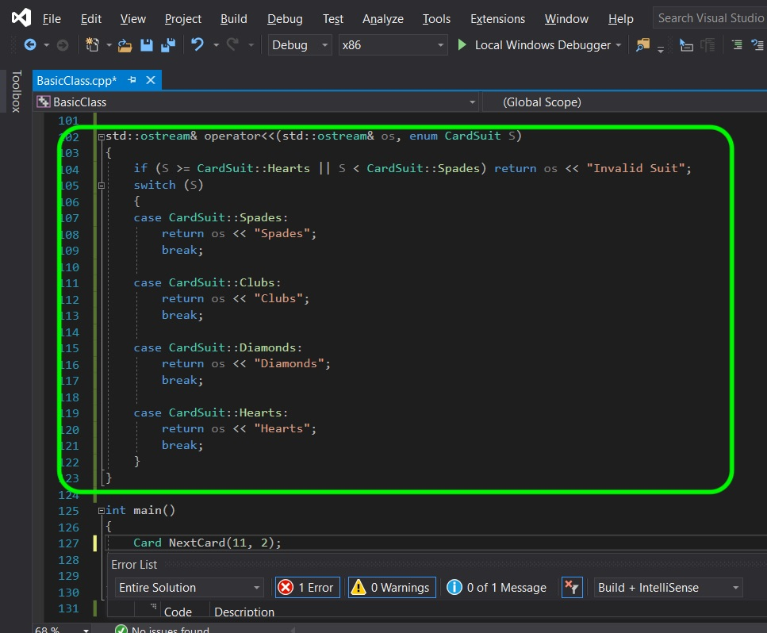  

_____ 


{:start="{{ num }}"}
{{ num }}. Now pass the appropriate type when instantiating the **Card** class:

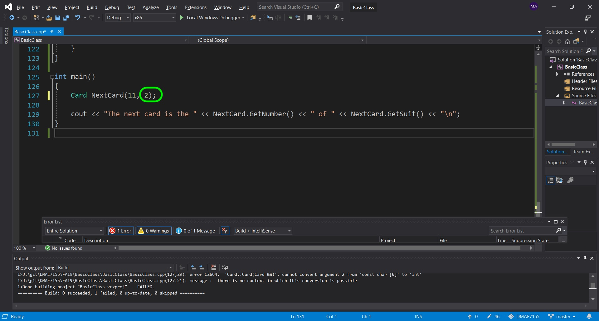  

_____ 



{:start="{{ num }}"}
{{ num }}. Now run and compile and you should get a valid card as the parameters passed are valid.

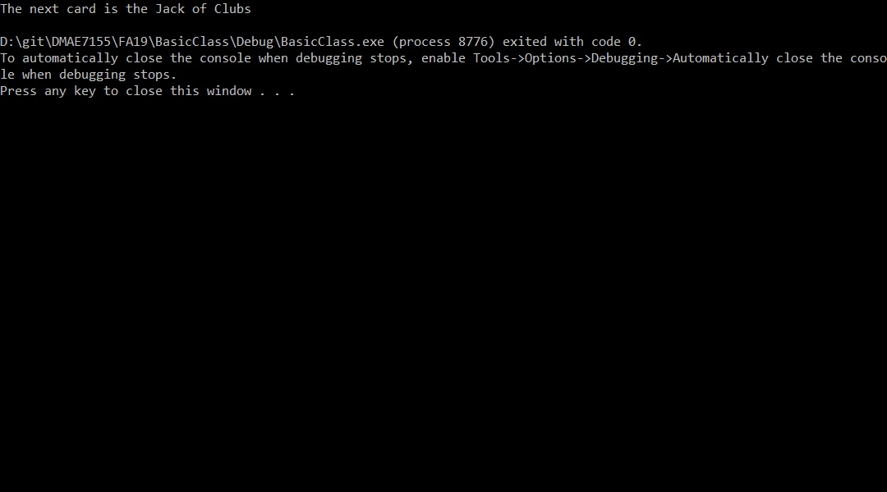  

_____ 



{:start="{{ num }}"}
{{ num }}. Now for card number an integer as a value passed makes sense, but I wouldn't know which suit 1 is.  This might not be the best way of instantiatijg this class.  What if the programmer already knows about the **CardSuit** enum.  Wouldn't it be nice to also allow a person to pass both values as enumerators like so:

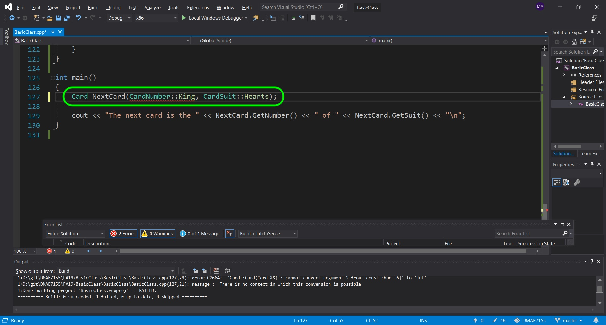  

_____ 



{:start="{{ num }}"}
{{ num }}. Well we can override any function including the class constructor.  This allows us to allow the programmer to instantiate the class in the way that works best for them. So we can add another consructor where we override the parameters to accept a **CardNumber** and **CartSuit** class enumerator as well.

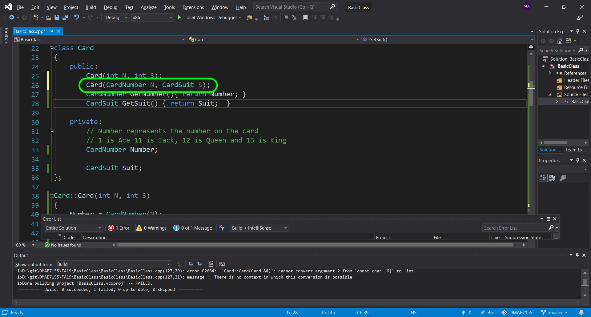  

_____ 


{:start="{{ num }}"}
{{ num }}. We define card and assign the variables passed to the class.

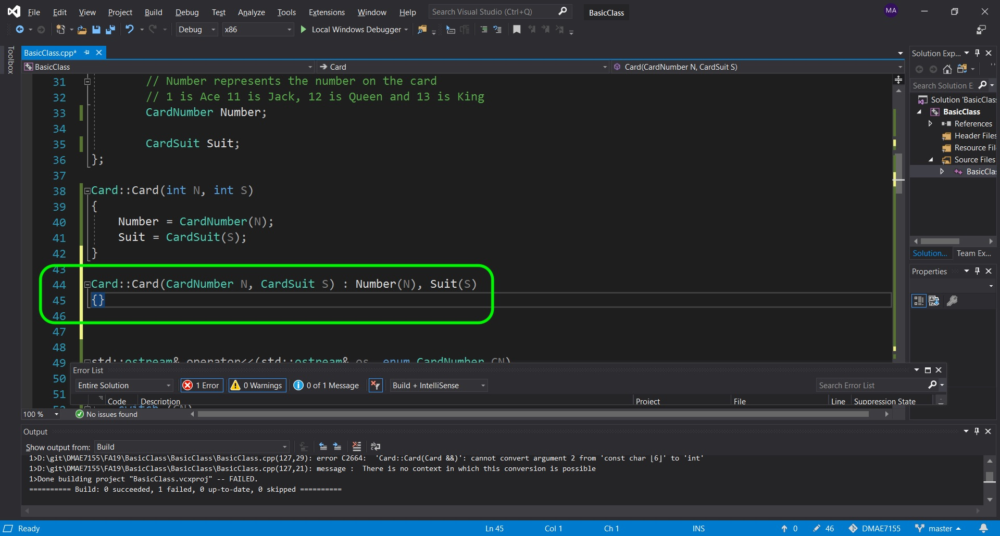  

_____ 


{:start="{{ num }}"}
{{ num }}. Now we can instantiate the **Card** class with either integers or the correct enumerators.  Try instantiating the **King** of **Hearts**.

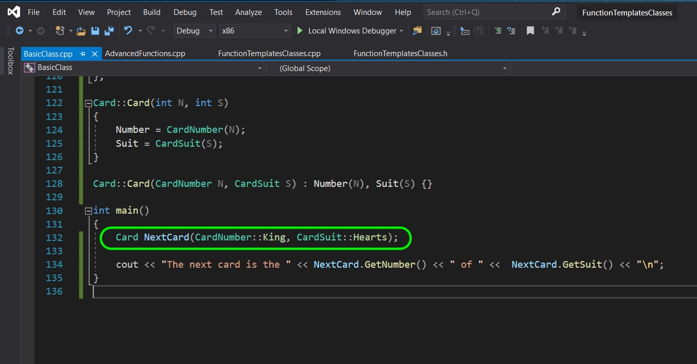  

_____ 


{:start="{{ num }}"}
{{ num }}. Run the game and you should see the **King of Hearts** as the instantiated card. 

  

_____ 


{:start="{{ num }}"}
{{ num }}. Now we should also consider the programmer that doesn't know about what parameters to pass.  What about setting the default card to **Ace of Hearts** if the player passes no parameters to the class?

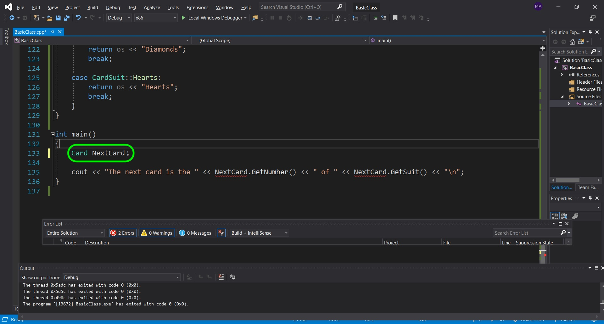  

_____ 


{:start="{{ num }}"}
{{ num }}. In the class add another constructor with no parameters being passed.

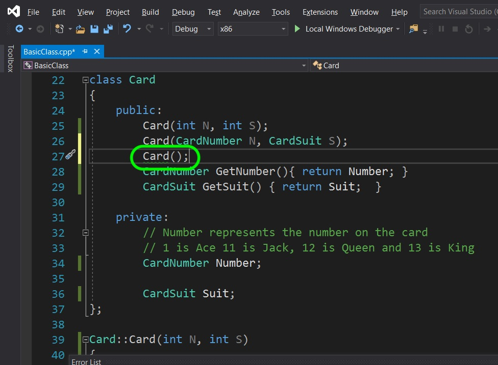  

_____ 


{:start="{{ num }}"}
{{ num }}. Define this function by overriding the card constructor with an Ace of Hearts.

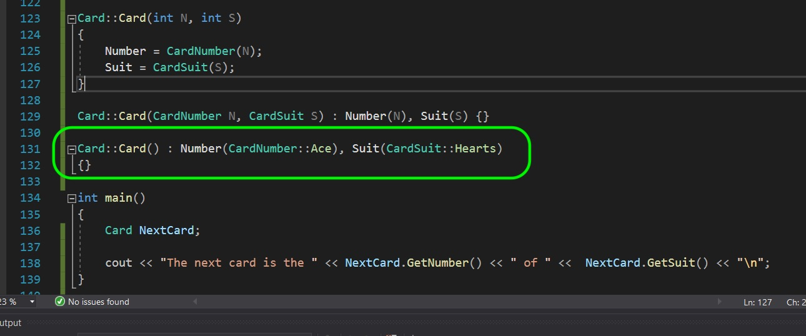  

_____ 


{:start="{{ num }}"}
{{ num }}. Run and compile the game and we now have a default card. Next up we will refactor a little bit.

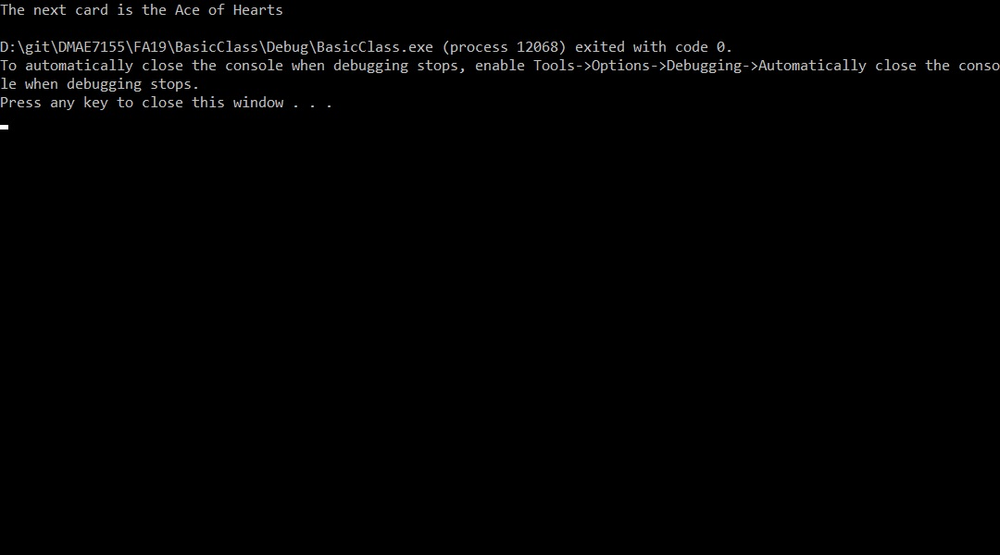  

_____ 

  

[<- Previous](CPP-UE4-Functions-Templates-Classes-6.html)&nbsp;&nbsp;&nbsp;[Home](../index.html)&nbsp;&nbsp;&nbsp; [Continue ->](CPP-UE4-Functions-Templates-Classes-8.html)
   
   
   

