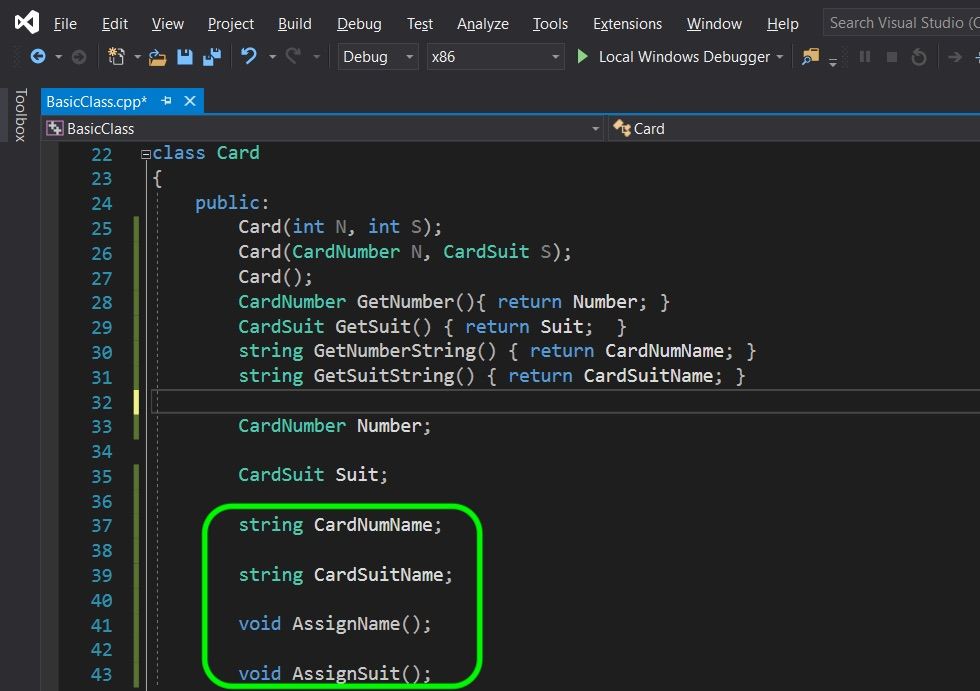
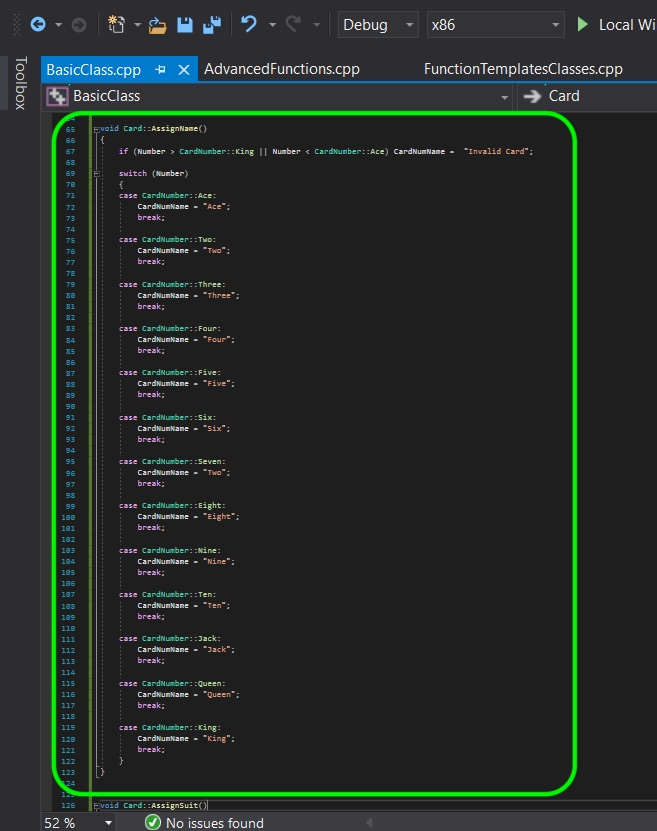
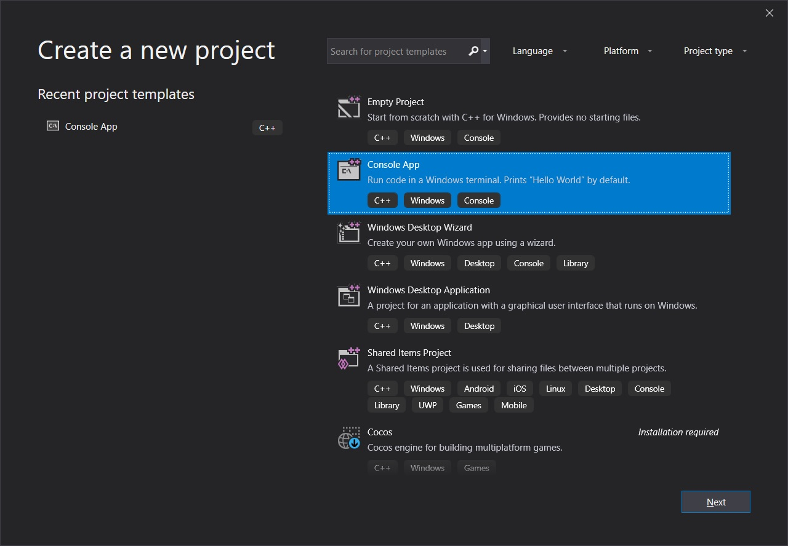

# CPP UE4 Functions Templates & Classes Page 8
_____ 

## Index
_____ 

* Part I - Functions
1. [Simple Function in CPP](CPP-UE4-Functions-Templates-Classes-1.html#simple-functions-in-cpp)
2. [Function in CPP](CPP-UE4-Functions-Templates-Classes-1.html#function-in-cpp)
3. [Function in Unreal Blueprints](CPP-UE4-Functions-Templates-Classes-1.html#function-in-unreal-blueprints)
4. [Fixing Edge Case](CPP-UE4-Functions-Templates-Classes-2.html#fixing-edge-case)
5. [Function in CPP in UE4](CPP-UE4-Functions-Templates-Classes-2.html#function-in-cpp-in-ue4)
6. [Function in CPP & Blueprint](CPP-UE4-Functions-Templates-Classes-3.html#function-in-cpp-&-blueprint)

* Part II - Macros, Constants
1. [Macros](CPP-UE4-Functions-Templates-Classes-4.html#macros)

* Part III - Arrays & Containers
1.  [Arrays](CPP-UE4-Functions-Templates-Classes-4.html#arrays)
2. [Containers](CPP-UE4-Functions-Templates-Classes-5.html#containers)
3. [TArray](CPP-UE4-Functions-Templates-Classes-5.html#tarray)

* Part IV - Classes
1. [Card Class](CPP-UE4-Functions-Templates-Classes-7.html#card-class)
2. [Refactor Card Class](CPP-UE4-Functions-Templates-Classes-8.html#refactor-card-class)
3. [Class Inheritance](CPP-UE4-Functions-Templates-Classes-8.html#class-inheritance-&-casting)

_____ 

## Refactor Card Class
Now I think it might be useful to keep a string with the card number and suit.  We can make it a string, then we don't need to override the OS operator.

_____ 


{:start="{{ num }}"}
{{ num }}. Open up **BaseClass.cpp** and add two private string variables for the card name and suit then two private void functions to set the name. We do not want the user to call it, but instead the constructor should call it so we have a card suit and number string when we need to use the object.

  

_____ 


{:start="{{ num }}"}
{{ num }}. Create two public getters to get the names of the variable.  We can do this inline as it is a simple return.  Notice that the user of this class can't set the name or number, but can only read it.

  

_____ 


{:start="{{ num }}"}
{{ num }}. OK, lets define our `AssignName()` function.  We will just add a `switch` statement and put the different name of card numbers.

  

_____ 


{:start="{{ num }}"}
{{ num }}. Do the same thing in the `AssignSuit` definition:

  

_____ 


{:start="{{ num }}"}
{{ num }}. Delete the `os << ` overrides.  You don't need these anymore as **string** type is already supported. Change the call in `cout` to `GetNumnberString()` and `GetSuitString`.  Then create a new `NextCard` with the 4th number and 3rd suit.

  

_____ 


{:start="{{ num }}"}
{{ num }}. Run the game and you should see a **4 of Diamonds**.

  

_____ 


{:start="{{ num }}"}
{{ num }}. Lets add an overload operator for ++ as a prefix and postfix operator. This will allow the card to go up by one card number.  Also if you go up from King it will go to Ace and wrap again. Lets also add back an overload operator for `os <<` for a **Card** class that will print both the number and suit with a space between it. Now we have an issue.  These overrided classes will need access to private members of this class (++ alters the actual card).  But they are not within the class so can't access private members.  What do we do?  We declare the override as a **[friend](https://en.cppreference.com/w/cpp/language/friend)** declaration.  This declaration gives this class access to your private members.

  

_____ 



{:start="{{ num }}"}
{{ num }}. Lets define the prefix and postfix `++` operator.  Remember that if it is a postfix it calls the prefix operator that wraps the ++ back to Ace from King or just advances to the next card.  A **static_cast** does an implicit conversion when casting from one type to another. It basically tells the compiler to cast the conversion between int and enum, then enum and class at compile time. It is more restrictie than a c style cast and will give errors when dangerous casts are made.

  

_____ 


{:start="{{ num }}"}
{{ num }}. Now add a definition for the `os <<` operator for the **Card** class.  We will include the name and suit with a space between them.

  

_____ 


{:start="{{ num }}"}
{{ num }}.  Nolets test the postfix operator.  So this should take place after the `cout` so there should be a difference of two cards between the two outputs.

  

_____ 


{:start="{{ num }}"}
{{ num }}. Run the game and test it.  Notice that the operator doen't increase until after the line it is run in which is correct.

  

_____ 


{:start="{{ num }}"}
{{ num }}. Now test the prefix operator where the card should be increased BEFORE it is output:

  

_____ 


{:start="{{ num }}"}
{{ num }}. Compile and run and notice that it updates before it hits the stream, so we have the operator overloads working properly.

  

_____ 

## Class Inheritance
Now classes are rarely used as just a plain class.  We normally create different types and inherit from other classes.  Lets look at enemies in a game.  What if we have 10 enemy types in the game.  They might all share some of the same features that they all have in common.  We can create an `Enemy` class with all the common elements.  Then we can create a specific enemy such as a `Bear` that inherits from the enemy class.  We can give it its unique parts that make up a bear that might be unique like claws, a head etc.  We might even have an intermediate class of `Mammals` or `Quadripeds` that again can define an enemy -> mammal -> bear.  This can allow us to check in the game for collisions with the enemy class, then downcast and find out what type of enemy it is.

_____ 


{:start="{{ num }}"}
{{ num }}. Open up the **FunctionTemplateClasses** solution you have been working on.  Lets add a new project by right clicking on the solution file and select **Add \| New Project...**.  Select a **Console App** template and call this new project `ClassInheritanceCasting`. Right click on this new project and select **Set as StartUp Project**.

  

_____ 


{:start="{{ num }}"}
{{ num }}. We have here a very simple example.  We have a parent class called `Enemy`.  All our enemies have one head, so we set this variable here.  There is no name for this enemy as it is meant to be derived, so the name of the monster is left blank. We have an `Aligator` and `Lion` derived class from `Enemy`.  In main we show that you can access members from both the derived (child class) and the parent class.

  

_____ 


{:start="{{ num }}"}
{{ num }}. Now compile and run and you can see that both members are accessible.

  

_____ 


{:start="{{ num }}"}
{{ num }}. We cast up to the base class from the derived class.  We need to use pointers to do this.  So we can cast from the derived class `Lion` to a pointer to the class it is derived from `Enemy`.  This is an implicit cast.  We can just point to one of its parent classes.

  

_____ 


{:start="{{ num }}"}
{{ num }}. Lets run and see what it prints for the name? Even though we set the **Name** member inside the derived class it was declared in the base class so this is where it is stored.  So  the pointer is looking at the base class there is no name.  So we still see the name we assigned above in **main()**.

  

_____ 


{:start="{{ num }}"}
{{ num }}. Lets add a public member to the derived classes and print both an **Aligator** and **Lion** class.

  

_____ 


{:start="{{ num }}"}
{{ num }}. Now run it and you can see that we can access this new member in the derived class.

  

_____ 


{:start="{{ num }}"}
{{ num }}. Now run it and you can see that we can access this new member in the derived class.

  

_____ 



{:start="{{ num }}"}
{{ num }}. Now run in the pointer to the base class you are not able to access the derived **Feature** member.  This is stored in the derived class only.  This is enough for all and we will explore class construction more later on.

  

_____ 

  

[<- Previous](CPP-UE4-Functions-Templates-Classes-7.html)&nbsp;&nbsp;&nbsp;[Home](../index.html)&nbsp;&nbsp;&nbsp; 
   
   
   

