# UE4 Deck of Cards Page 1
_____ 

## Index
_____ 

* Part I - Test in Blueprints
1. [Getting Set-Up](CPP-UE4-Deck-Of-Cards-1.html#getting-set-up)
2. [Add Test Blueprint](CPP-UE4-Deck-Of-Cards-1.html#add-test-blueprint)
3. [Configure Project](CPP-UE4-Deck-Of-Cards-1.html#configure-project)
4. [Make Camera Default](CPP-UE4-Deck-Of-Cards-1.html#make-camera-default)

_____ 

## Test in Blueprints
Now before we take some of what we learned about C++ and take it into Unreal, lets get set up.  Lets get a card, change the render view to 2-D for a deck of cards and get a mesh, material, and camera to all work.  We will adapt our style from an all C++ approach to one that makes the most sense within the confines of the UE4 engine.

_____ 

### Getting Set-Up
Lets start by getting a project and up and running.

_____



{:start="{{ num }}"}
{{ num }}. Create a new project in UE4 and pick type **Games** and press the **Next** button:

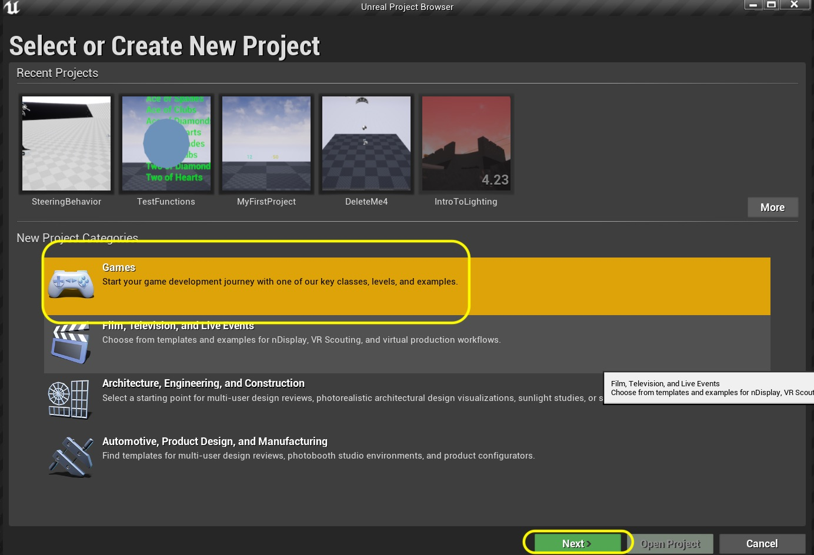  

_____



{:start="{{ num }}"}
{{ num }}. Select **Blank** and press the **Next** button:

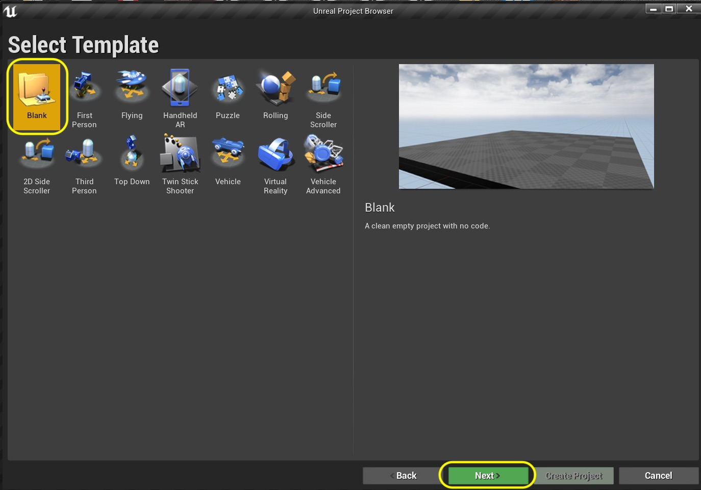  

_____



{:start="{{ num }}"}
{{ num }}. Select C++ Basic, no starter content project and pick a directory to save it in.  Call the project `DeckOfCardsI` then press the **Create Project** button.

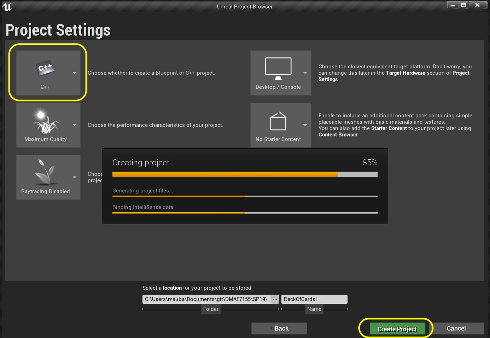  

_____ 


{:start="{{ num }}"}
{{ num }}. Press the **Add New** button and add 4 new folders called `Blueprints`, `Levels`, `Materials` and `Textures`.

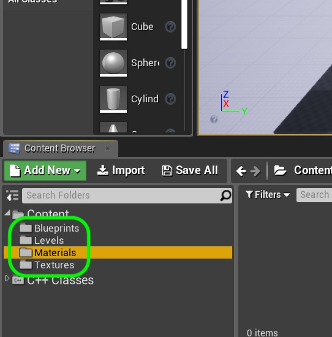  

_____ 



{:start="{{ num }}"}
{{ num }}. On Moodle you will find a zip folder with all the textures you need.  Download and **unzip** the **Playing Cards** folder.  Drag all the `.png` files into the **Textures** folder.  Take a moment to look at the names.  I have very consistent naming so that we can in a loop import the textures dynamically.

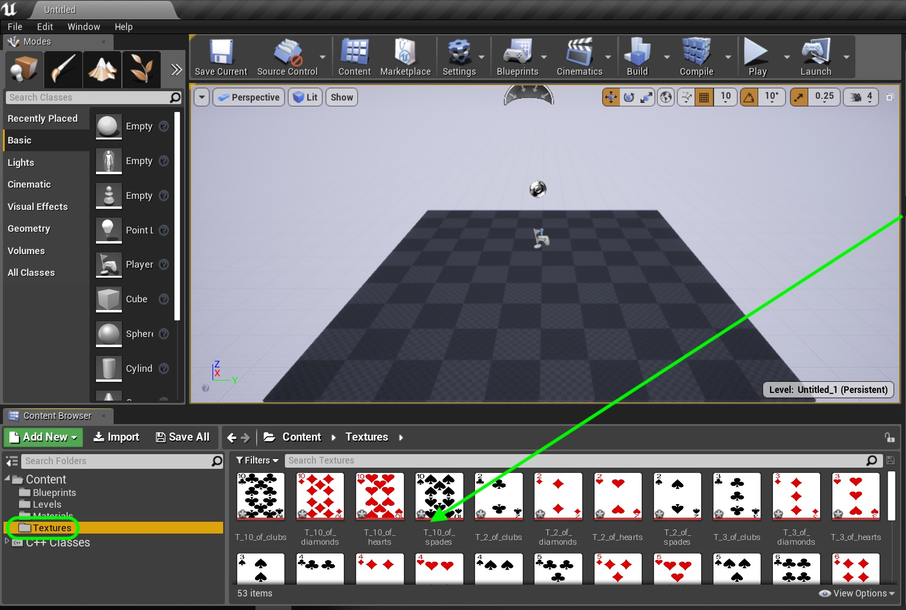  

_____ 


{:start="{{ num }}"}
{{ num }}. Now this is a 2-D game and we will not be lighting it conventionally like a 3-D game.  In fact we will have no lights in the scene.  Click on the **Add New** button and select **Material**:

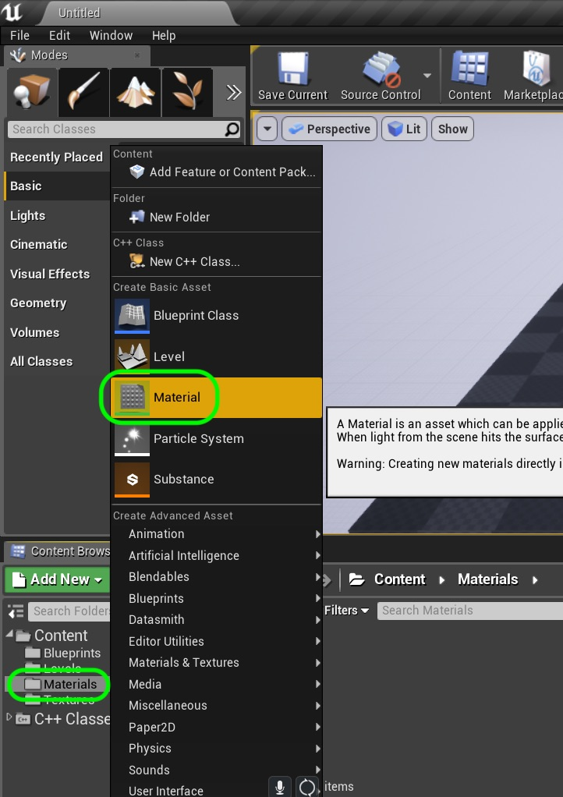  

_____ 


{:start="{{ num }}"}
{{ num }}. Name this material `M_Card` and double click it to enter the material editor.

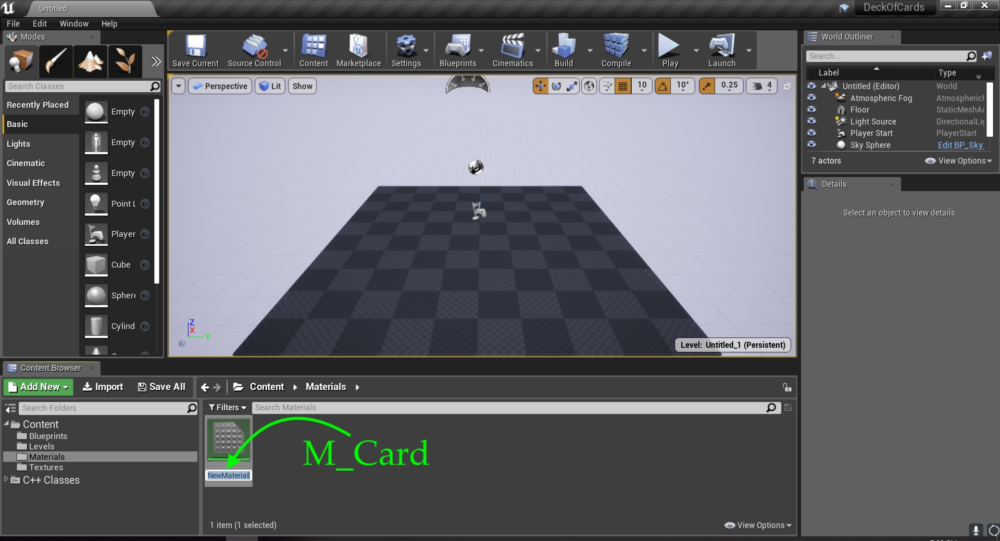  

_____ 


{:start="{{ num }}"}
{{ num }}. Now we right click on the graph and select a **Texture Sample** node.  Take the top **RGB** output pin and place it into the **Emissive Color** node in the M_Card node.  Since there are no lights this is a self lit texture (all will be lit with the same intensity).  Then select any of the card textures.  Look at the preview window and look at the texture on a flat plane. It is squished but we will be fixing that.

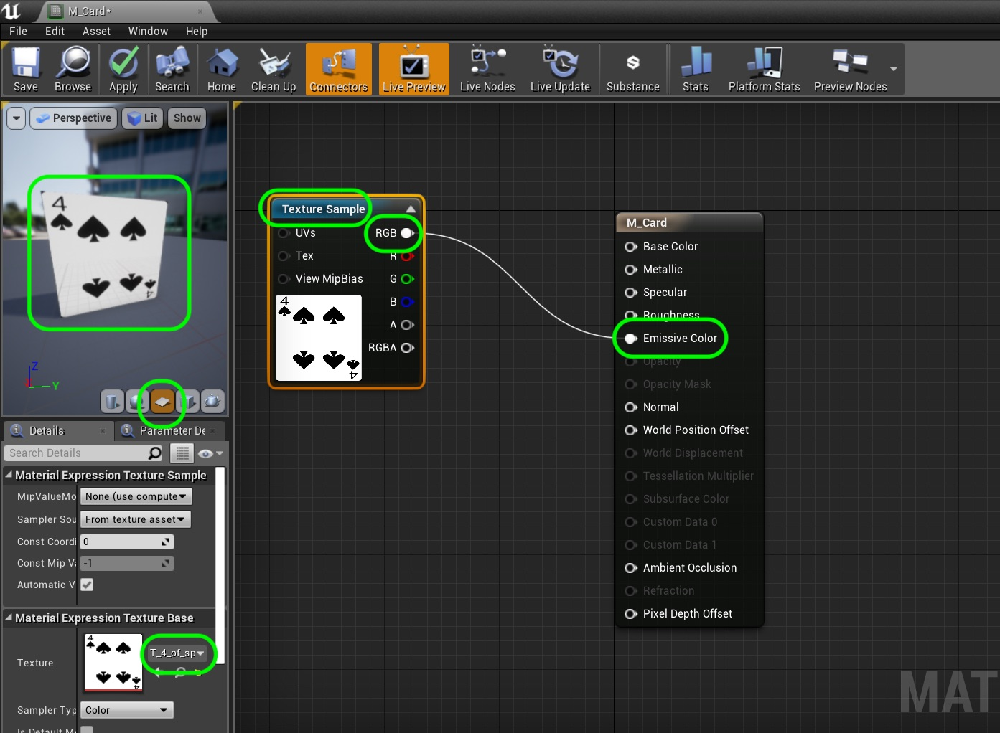  

_____ 


{:start="{{ num }}"}
{{ num }}. Now we want to be able to assign different card textures to different cards.  This means we need to manipulate this node.  We cannot unless we make it a parameter that we can edit. Right click on the **Texture Sample** node and select **Convert to Parameter** so we can edit it in a blueprint or in C++.

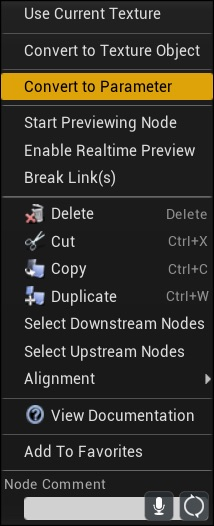  

_____ 


{:start="{{ num }}"}
{{ num }}. Now you can give this parameter a name and call it `Card_Texture`. When you finish a material you always have to press the **Apply** button so that the matelerial is rendered and usable otherwise it will not affect the actor.

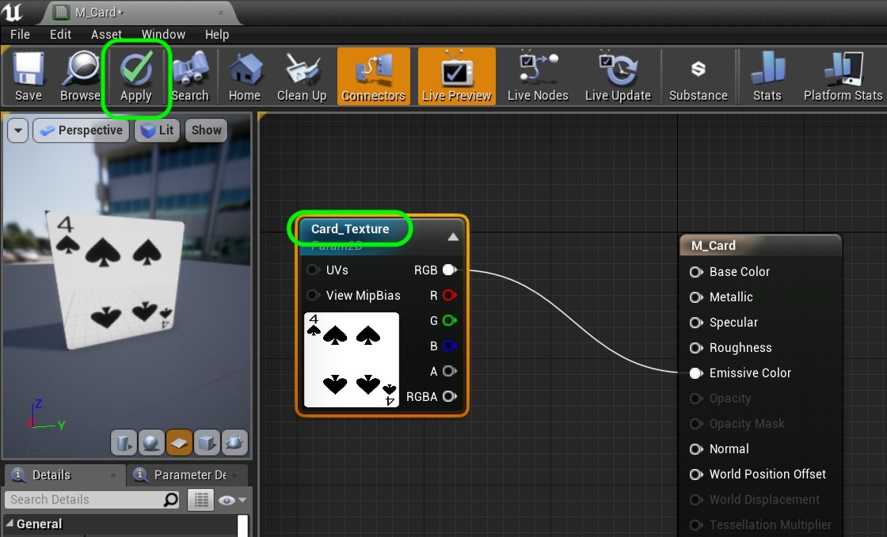  

_____ 


{:start="{{ num }}"}
{{ num }}. Start a new empty level with no objects in the scene.  Call it `L_Card_Table`.

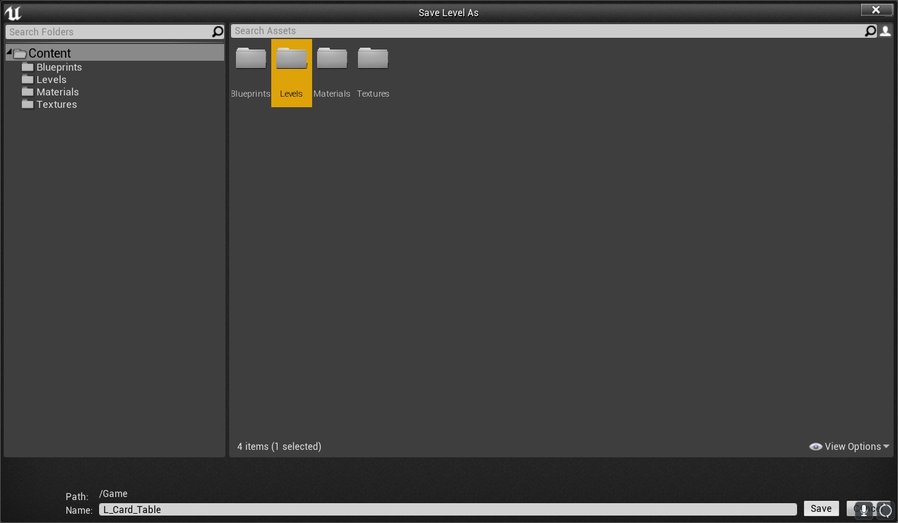  

_____ 


{:start="{{ num }}"}
{{ num }}. Now lets set this level as the default level.  Right click on **Edit \| Project Settings** and select **Maps & Modes** and change both the **Editor Startup Map** and **Game Default Map** to **L_Card_Table**.

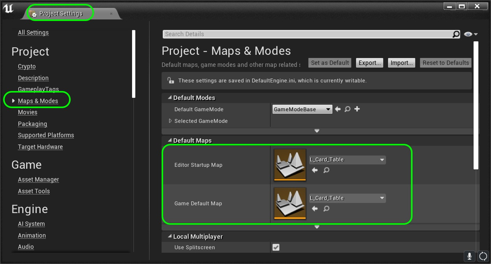  

_____ 


{:start="{{ num }}"}
{{ num }}. We need to add a camera to the scene.  Type **Camera** into the **Modes** tab and drag a camera into the scene.

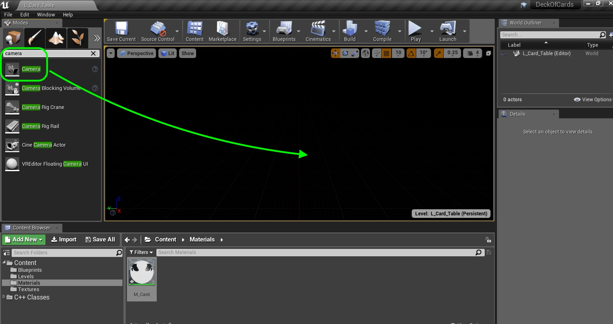  

_____ 


{:start="{{ num }}"}
{{ num }}. Press the yellow arrow next to Location and press it to reset the position to `0,0`, `0.0, 0.0`.

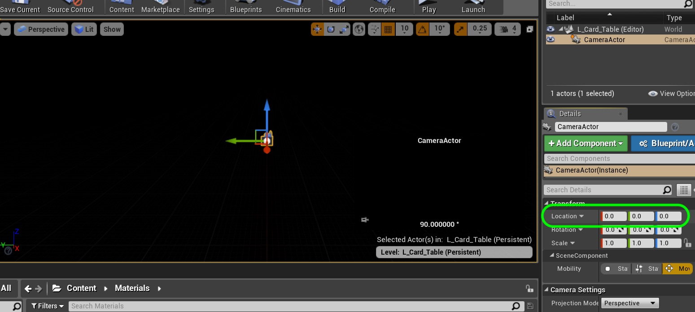  

_____ 


{:start="{{ num }}"}
{{ num }}. Now since Unreal is Z up, I want my 2-d level to be on the **X Y** plane. So move the camera up the **Z** axis, to around `310` and then rotate on the **Y** axis by `270` degrees to shoot downwards. 

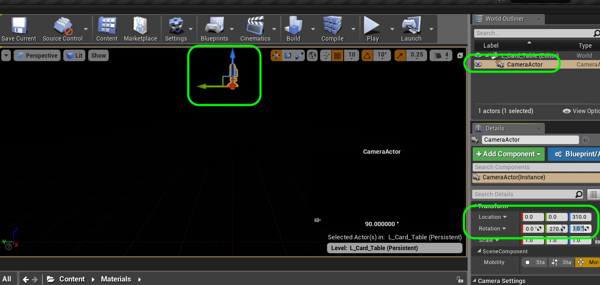  

_____ 


{:start="{{ num }}"}
{{ num }}. Since this is 2-D we don't want a perspective camera, we want an [orthographic](https://en.wikipedia.org/wiki/Orthographic_projection) one. This means that objects in front of the camera do not scale, they are always the same size.  So we can stack our cards in Z without affecting the scale of the cards.

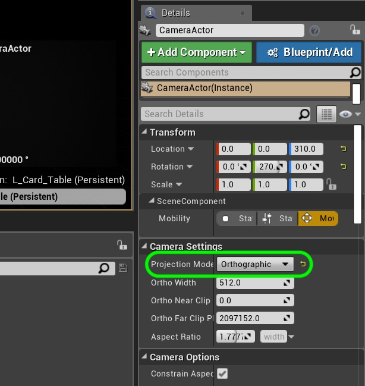  

_____ 

### Add Test Blueprint
So before we do anything in C++ lets look at what it looks like in a blueprint.  Normally we would import models in the blueprint editor.  Normally a piece of art is static.  If you place a rock, it stays a rock in the scene.  But with a playing card we want to dynamically change the card, turn it over etc...

_____ 


{:start="{{ num }}"}
{{ num }}. Create a new blueprint and select an `Actor` class.  call it `B_Test_Actor` and add **Plane** component.  Change the name to `Card`:

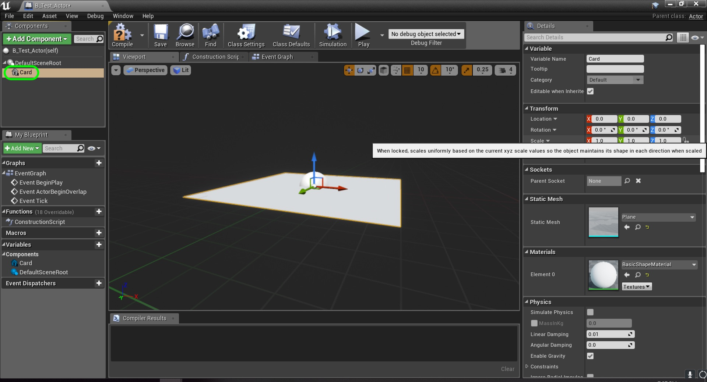  

_____ 


{:start="{{ num }}"}
{{ num }}.  Now a playing card is not square and we want a **1 : 1.4** ratio.  Change the **Y Scale** to `1.4`.  Select the **Materials** tab for the material we just made called **M_Card**.

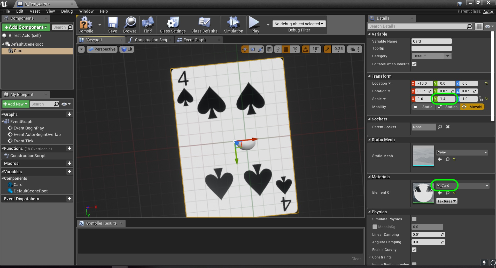  

_____ 


{:start="{{ num }}"}
{{ num }}. Drag the card in the scene. Set the transform to `0.0`, `0.0` and `0.0` on the **X Y Z** axis.  Now press run.  What another camera appears?  Oh, you can move a player around the scene with the arrows or WASD keys?  Why?

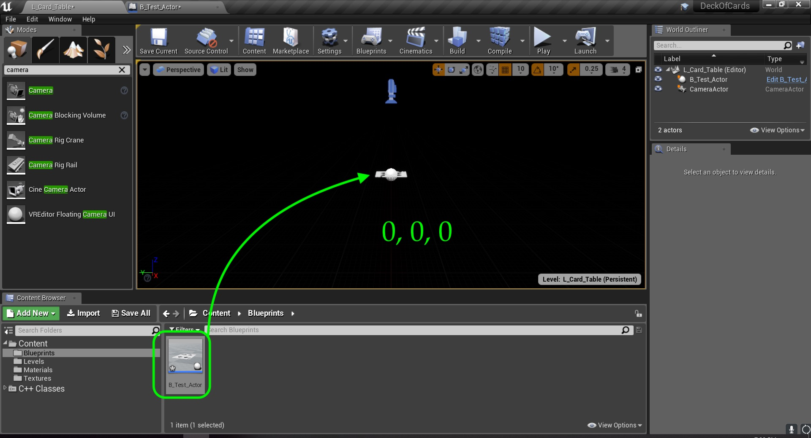  

_____ 


{:start="{{ num }}"}
{{ num }}. Look at the **World Outliner** while the game is running and see that when you press play it adds a whole bunch of classes to the scene.  Pay attention to the second camera as well as the Default Player Pawn.  Now we want to set up the scene to use our new camera.  This will take a couple of steps.

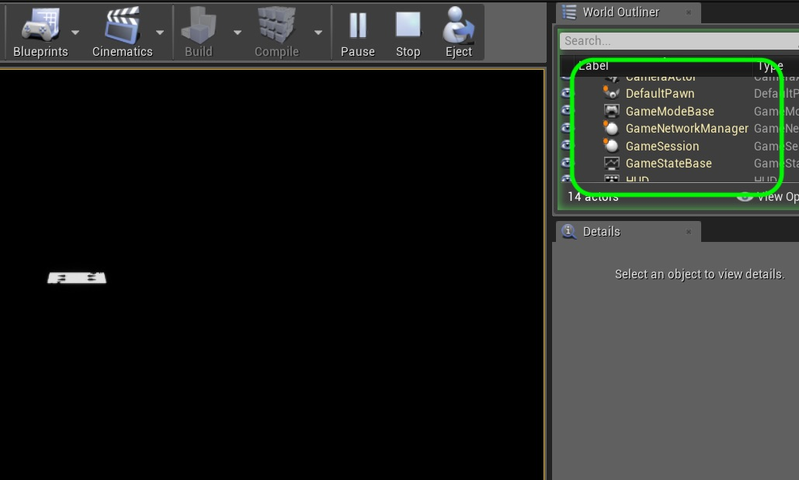  

_____ 

### Configure Project
Now we want to take out the extraneous object we don't need and set the default camera to the one we loaded into the scene.  We do this by adding some custom setup files that default ones are provided for us (and add all these files).

_____ 



{:start="{{ num }}"}
{{ num }}. Add a new **Blueprint** and this time select a **Player Controller** class.  We need to add a cursor and cursor events as we will be handling the cards with a mouse.

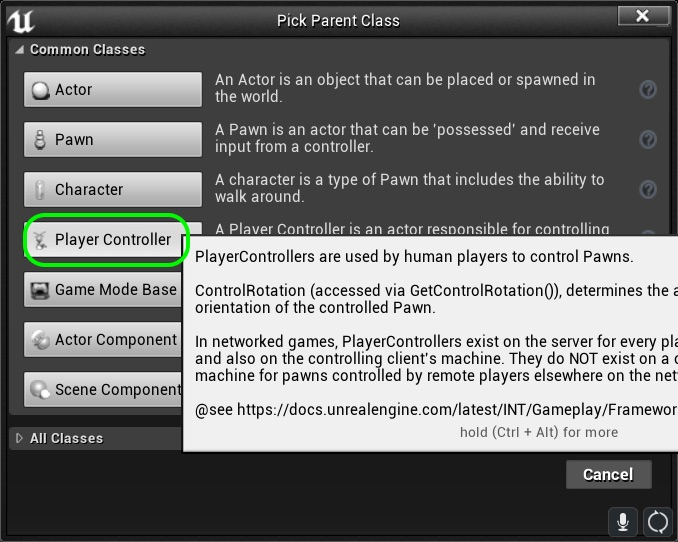  

_____ 


{:start="{{ num }}"}
{{ num }}. Now name the blueprint `BP_Card_PlayerController` and make sure that you enable **Show Mouse Cursor**, **Enable Click Events** and **Enable Mouse Over Events**.  We are not supporting mobile so you can leave the touch events disabled.

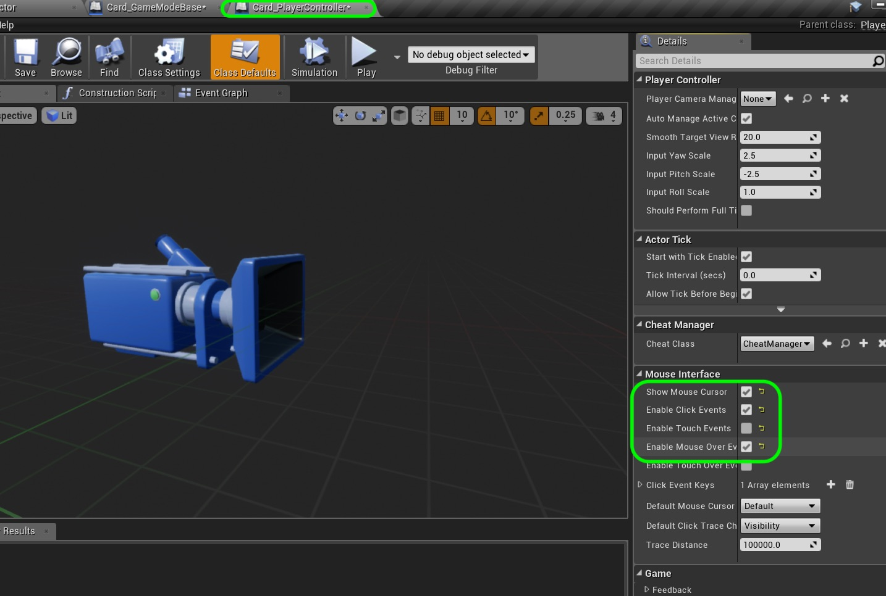  

_____ 


{:start="{{ num }}"}
{{ num }}. Now create a new **Blueprint** and select **Game Mode Base** as the base class.

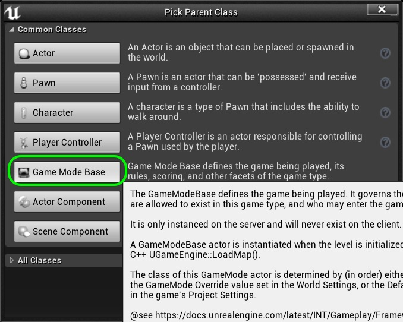  

_____ 


{:start="{{ num }}"}
{{ num }}. Call this file `BP_Card_GameModeBase`.

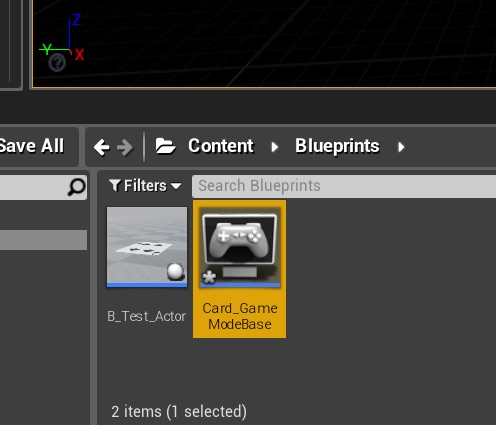  

_____ 


{:start="{{ num }}"}
{{ num }}. Now double click this blueprint and turn off the **Game Session Class** as we will not be using networking features.  Change the **Player Controller Class** to `BP_Card_PlayerController`.  Turn off the **Default Pawn Class** so that you don't control a player when playing the game.

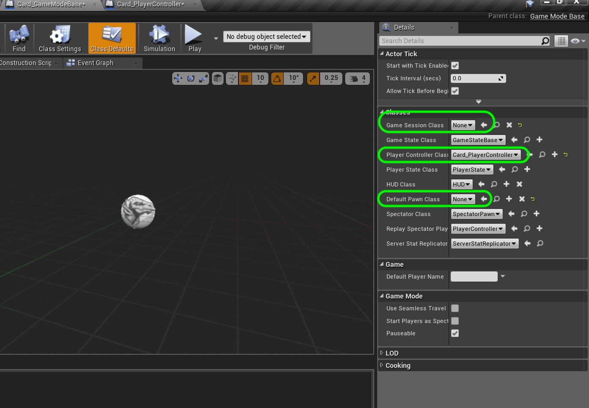  

_____ 


{:start="{{ num }}"}
{{ num }}.  Now we are not done.  This Game Mode still won't launch until we set it.  Press the **Settings** button and select **World Settings**.

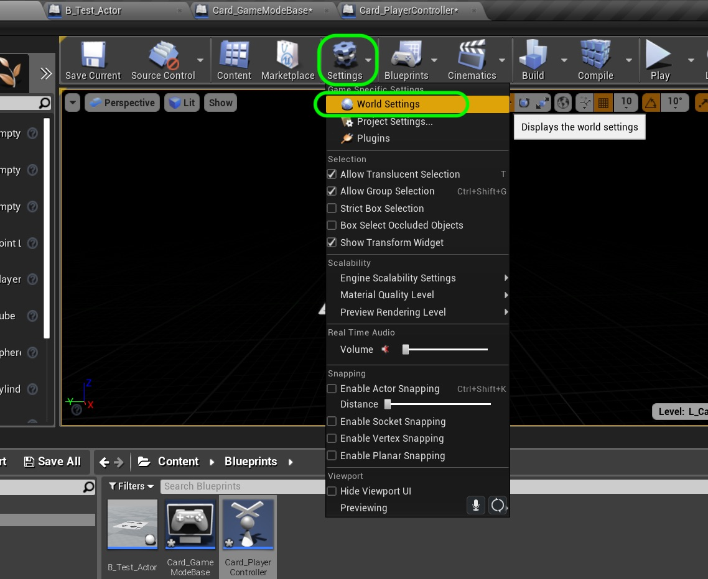  

_____ 


{:start="{{ num }}"}
{{ num }}. Now the **World Settings** tab appears to the right behind the **Details** panel.  Change the **GameMode Override** to `BP_Card_GameModeBase`.

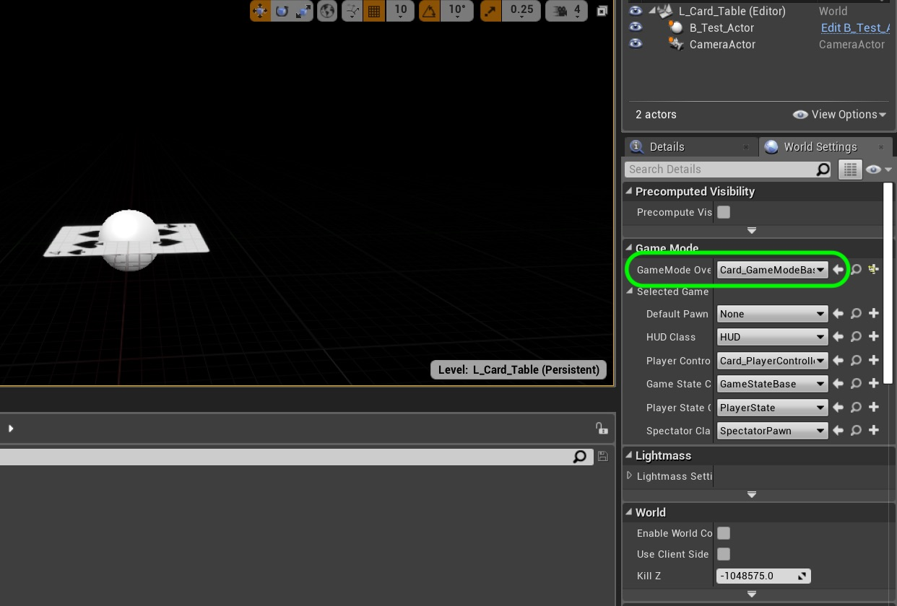  

_____ 

### Make Camera Default
Now Unreal expects a camera to be attached to a player whether the game is 2-d or 3-d.  Now our little game here is a card game, so there is no player as you are just controlling a cursor.  There is a way of telling the engine that this camera is the one we want to use.  .  Now whenever you create a new level the game creates a special blueprint.  It is called a **Level Blueprint**.  This special blueprint allows us to access objects in the game scene.  

_____ 



{:start="{{ num }}"}
{{ num }}. Press the **Blueprints** button then select **Open Level Blueprint**:

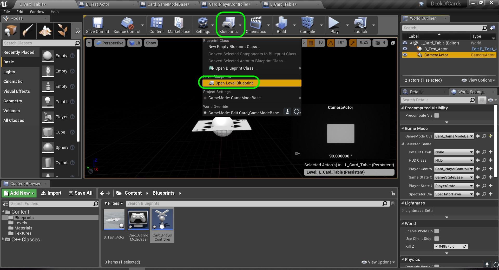  

_____ 


{:start="{{ num }}"}
{{ num }}. Select in the game level the camera actor.

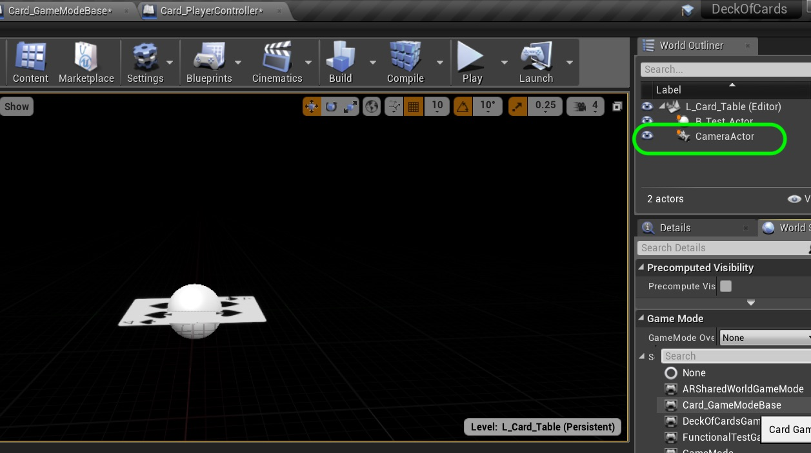  

_____ 


{:start="{{ num }}"}
{{ num }}. Now go back to the **Level Blueprint** and right click on the graph.  You will notice that it adds to the top a **Create a Reference to CameraActor**.  Press this to add this node.

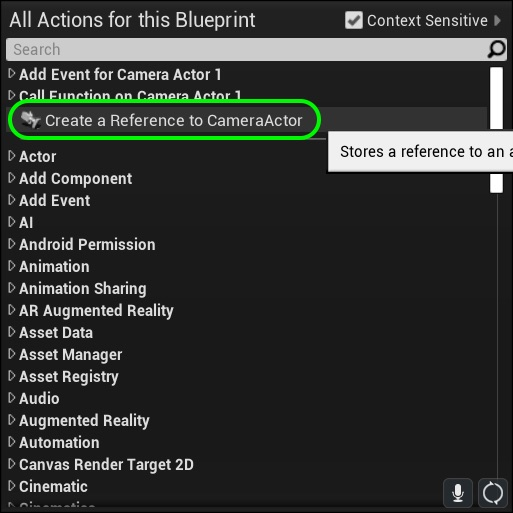  

_____ 


{:start="{{ num }}"}
{{ num }}. Now again press the right mouse button on the empty graph and select a **Get Player Controller** node.

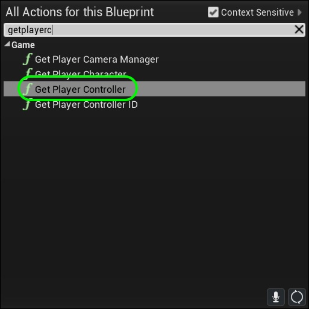  

_____ 


{:start="{{ num }}"}
{{ num }}. So your level blueprint should look like this:

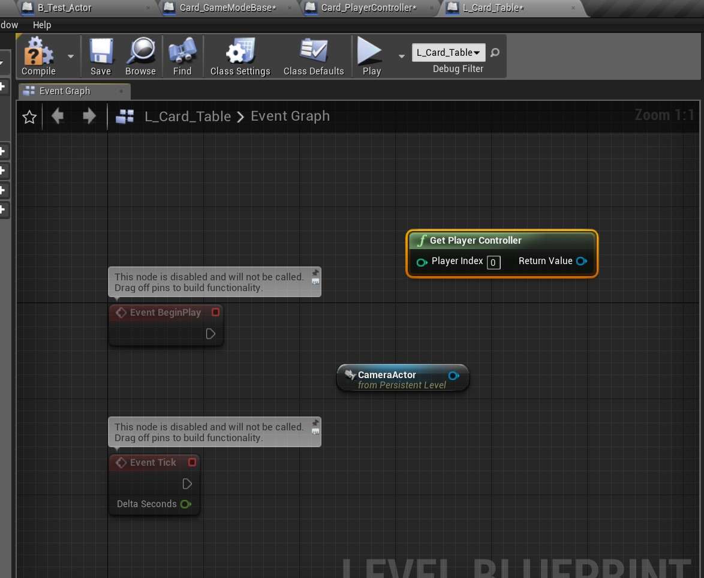  

_____ 


{:start="{{ num }}"}
{{ num }}. Add a **Set View Target With Blend** node and plug the **Player Controller** into the target and plug in the **Camer Actor** to the **New View Target** input node.  Then connect the execution pin from **EventBeginPlay** to the **Set View Target** node.  Add a comment that describes what we are doing.

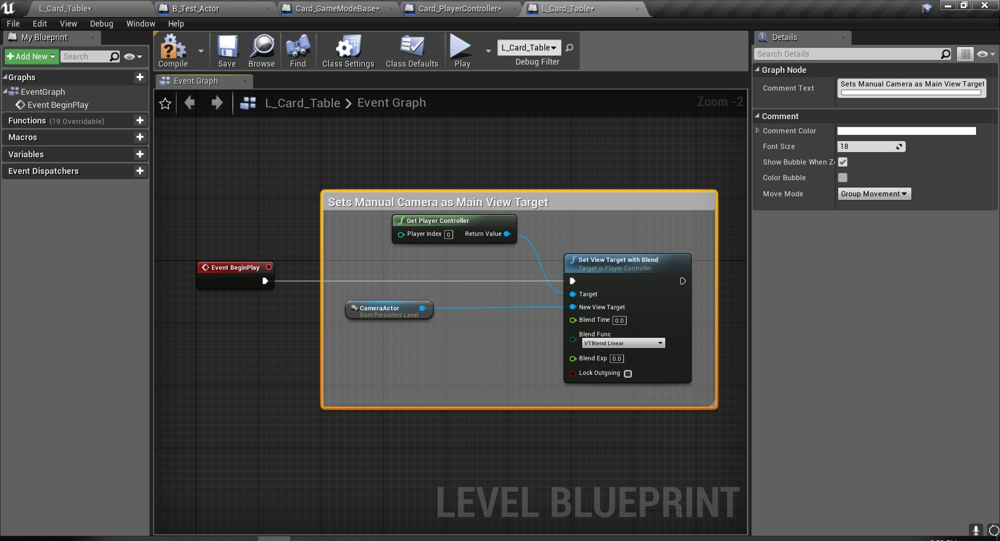  

_____ 


{:start="{{ num }}"}
{{ num }}. Run the game and now it selects the camera you set.  You can't control a player, and it is pretty much set up so we can begin.

  

_____ 


{:start="{{ num }}"}
{{ num }}. Next up we will get a blueprint to mimic our C++ class.

_____ 

  

[Home](../index.html)&nbsp;&nbsp;&nbsp; [Continue ->](CPP-UE4-Deck-Of-Cards-2.html)
   
   
   

