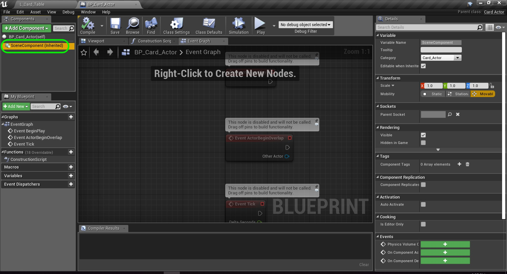

# UE4 Deck of Cards Page 2
_____ 

## Index
_____ 

* Part I - Test in Blueprints
1. [Getting Set-Up](CPP-UE4-Deck-Of-Cards-1.html#getting-set-up)
2. [Add Test Blueprint](CPP-UE4-Deck-Of-Cards-1.html#add-test-blueprint)
3. [Configure Project](CPP-UE4-Deck-Of-Cards-1.html#configure-project)
4. [Make Camera Default](CPP-UE4-Deck-Of-Cards-1.html#make-camera-default)
5. [Mimic Our Final C++ Class](CPP-UE4-Deck-Of-Cards-2.html#mimic-our-final-c++-class)

* Part II - C++ Card Class
1. [Basic Card C++ Class](CPP-UE4-Deck-Of-Cards-2.html#basic-card-c++-class)
2. [Dynamically Switch Cards](CPP-UE4-Deck-Of-Cards-3.html#dynamically-switch-cards)

_____ 

## Mimic Our Final C++ Class
Now we can't create a C++ class that behaves like this blueprint.  I can't find a UE4 C++ Component class that mimics the **Plane** class.  Now a plane is just a rigid body model.  So we need to make a change.  Open the **BP_Test_Actor** class.

_____ 


{:start="{{ num }}"}
{{ num }}. Delete the **Card** Plane component and add a **Static Mesh** component.

  

_____ 


{:start="{{ num }}"}
{{ num }}. Click on the mesh and look for a **Plane**.  Can't find it.  It is not located in our **Content** folder.  But Unreal has a bunch of assets in the engine.  We can find it by clicking on **View Options** on the bottom right hand side and select **View Engine Content**.

  

_____ 


{:start="{{ num }}"}
{{ num }}. Now to to the **Engine Content \| Basic Shapes** folder and right click on **Plane** and select **Duplicate**.

  

_____ 


{:start="{{ num }}"}
{{ num }}. Call this new mesh `Card_Plane1`.  Then add a new folder to your Content directory called **Meshes**.  Drag this duplicate file into theis folder.

  

_____ 


{:start="{{ num }}"}
{{ num }}.  Now go back to **BP_Test_Actor** and you should now be able to select a `Card_Mesh1` as a static mesh.  Now you can select a **Material** so select the `M_Card` material.  Set the **Scale** on **Y** to `1.4` and rotate on **Z** axis by `90` degrees. This way the x and y axis line up with the card correctly. (Note in hindsight this is an error and we should have rotated the camera instead)

  

_____ 


{:start="{{ num }}"}
{{ num }}. Press compile and check it out in game.  The card is rotated correctly but it looks similar to before.

  

_____ 

## Basic Card C++ Class
Now lets mimic this blueprint in a pure C++ class.  Lets try and make the class as generic as possible so other card games could be built and we could reuse this class.

_____ 


{:start="{{ num }}"}
{{ num }}. Create a new C++ Class and inherit from the **Actor** class.  Call this `Card_Actor`.

  

_____ 


{:start="{{ num }}"}
{{ num }}. Look at the newly generated `.cpp` file.  We do not need this actor to tick.  It is optimal to turn this off.  This actor will run faster and more efficiently.

  

_____ 


{:start="{{ num }}"}
{{ num }}. Now open the `.h` file and delete the Tick declaration:

  

_____ 


{:start="{{ num }}"}
{{ num }}. Delete the **Tick** definition from the `.cpp` file.  All right we are ready to go.

  

_____ 


{:start="{{ num }}"}
{{ num }}. Now look at our test blueprint again.  Notice that the mesh is not the item at the top component list.  Blueprints by default assign a root Scene component.  It is strongly recommended that you do so.  We will start by adding a scene component.

  

_____ 


{:start="{{ num }}"}
{{ num }}. Open **Card_Actor.h** and include the `USceneComponent` which directory can be found at the bottom of [UE4's website](https://api.unrealengine.com/INT/API/Runtime/Engine/Components/USceneComponent/index.html). Here is UE4's description: "A SceneComponent has a transform and supports attachment, but has no rendering or collision capabilities. Useful as a 'dummy' component in the hierarchy to offset others." Then we create a pointer so we can access the data structure.

  

_____ 


{:start="{{ num }}"}
{{ num }}. Go back to **Card_Actor.cpp**.  In the constructor we call a template class that creates a component that attaches to an actor.  We also name the component `Card Root`.  We then need to set it as the root component.  There is only one root component in a blueprint.

  

_____ 


{:start="{{ num }}"}
{{ num }}. Go back to the main editor and right click on the **Card_Class** C++ icon and select **Create a Blueprint class based on Card_Actor**.

  

_____ 


{:start="{{ num }}"}
{{ num }}. Now name this new blueprint `BP_Card_Actor`. Move it into the blueprints folder.

  

_____ 


{:start="{{ num }}"}
{{ num }}. Open up the Blueprint and you see a root component.  It doesn't appear to carry the name of the component over to the blueprint.

  

_____ 


{:start="{{ num }}"}
{{ num }}. Include the `.h` file for the `UStaticMeshComponent.h`.  You can find the directory [here](https://api.unrealengine.com/INT/API/Runtime/Engine/Components/UStaticMeshComponent/index.html).  Then we create a pointer so we can access the data structure.

  

_____ 


{:start="{{ num }}"}
{{ num }}. Now we want to load the static mesh.  Normally this would happen in the in game menu.  Since this is a more complex actor with lots going on we will do it in code. Warning - it needs to be clear that files cannot be mored or renamed without crashing this code.  This should be done on a limited basis. Go to **Meshes \| Card_Plane1** mesh and right click on it.  Then select **Copy Reference**.

  

_____ 


{:start="{{ num }}"}
{{ num }}. If you paste it gives you more information than we need.  We don't need the **type** nor do we need the extension.

  

_____ 


{:start="{{ num }}"}
{{ num }}. Now we need a **Static Mesh Component** and we need the **Plane** static mesh to be assigned to it.  We just copied the location for it.  We create the **Static Mesh** reference in a similar way to the **Scene** Component.  The we load a pointer to a `UStaticMesh` and use the function `SetStaticMesh(mesh)`.

  

_____ 


{:start="{{ num }}"}
{{ num }}. It is always good to check out the documentation for `UStaticMeshComponent` to find out what members are public and accessible.

  

_____ 


{:start="{{ num }}"}
{{ num }}. Restart the game as we are making changes in the constructor and they will not show up on a recompile in the editor.  Run the game and you now have a second component and it has a static mesh assigned (Card_Plane),

  

_____ 


{:start="{{ num }}"}
{{ num }}. Now we are going to add a **Material** to the static mesh.  Go to the **Materials \| M_Card** in the Content Browser and right click to **Copy Reference** and find out the folder and name.  Then load it like we did the mesh then call another function `SetMaterial`.

  

_____ 


{:start="{{ num }}"}
{{ num }}. Now if you look at the [UStaticMesh](https://api.unrealengine.com/INT/API/Runtime/Engine/Components/UStaticMeshComponent/index.html) page you will not see this member function.  Look at the inheritance tree. Look at the classes it inherits from as it inherits all of its members. Go to the **UMeshComponent** class.

  

_____ 


{:start="{{ num }}"}
{{ num }}. You can now find `SetMaterial` which defines what this function does.

  

_____ 


{:start="{{ num }}"}
{{ num }}. Restart the game as we are making changes in the constructor and they will not show up on a recompile in the editor.  Now run the game and look at the **BP_Card_Actor** blueprint.  You now see that it loads the material.  But look at it.  It is square, remember we adjusted the scale of the mesh.  

  

_____ 


{:start="{{ num }}"}
{{ num }}. Now again, anything we can do in the editor has a corresponding C++ class.  In this case it is a function called **SetRelativeScale3D** that we pass it an FVector.  This comprizes of three floats that alters the scale of **X**, **Y** and **Z** respectively.

  

_____ 


{:start="{{ num }}"}
{{ num }}. Now the manual for **SetRelativeScale3D** can be found in another parent class **USceneComponent**.

  

_____ 


{:start="{{ num }}"}
{{ num }}. Restart the game as we are making changes in the constructor and they will not show up on a recompile in the editor.  Now run the game and open the blueprint.  Notice that the scale has changed and the card looks correct.

  

_____ 


{:start="{{ num }}"}
{{ num }}. Go back and replace the test bluerpint in the game scene and replace it with **BP_Card_Actor**.  Then select the **CameraActor** then Rotate on the **Z** axis by 90 degrees.

  

_____ 


{:start="{{ num }}"}
{{ num }}. Run the game and now we have receated what we did in the blueprint in C++!  Next up we will have to dynamically change the texture based on the card we want to select.

  

_____ 

  

[<- Previous](CCP-UE4-Deck-Of-Cards-1.html)&nbsp;&nbsp;&nbsp;[Home](../index.html)&nbsp;&nbsp;&nbsp; [Continue ->](CPP-UE4-Deck-Of-Cards-3.html)
   
   
   

