# UE4 Deck of Cards Page 4
_____ 

## Index
_____ 

* Part I - Test in Blueprints
1. [Getting Set-Up](CPP-UE4-Deck-Of-Cards-1.html#getting-set-up)
2. [Add Test Blueprint](CPP-UE4-Deck-Of-Cards-1.html#add-test-blueprint)
3. [Configure Project](CPP-UE4-Deck-Of-Cards-1.html#configure-project)
4. [Make Camera Default](CPP-UE4-Deck-Of-Cards-1.html#make-camera-default)
5. [Mimic Our Final C++ Class](CPP-UE4-Deck-Of-Cards-2.html#mimic-our-final-c++-class)

* Part II - C++ Card Class
1. [Basic Card C++ Class](CPP-UE4-Deck-Of-Cards-2.html#basic-card-c++-class)
2. [Dynamic Materia](CPP-UE4-Deck-Of-Cards-3.html#dynamic-material)
3. [User Selected Card Suit](CPP-UE4-Deck-Of-Cards-3.html#user-selected-card-suit)
4. [Show Back of Card](CPP-UE4-Deck-Of-Cards-4.show-back-of-card)

* Part III - Blueprint Deck Of Cards
1. [Deck of Cards](CPP-UE4-Deck-Of-Cards-4.deck-of-cards)
2. [Add Set Card Suit](CPP-UE4-Deck-Of-Cards-4.add-set-card-suit)

_____ 

## Show Back of Card
Lets finish up our card class and try it out.  I would like to have a a deck of cards with the cards facing down and facing up.  So we need the ability to flip a card over and hide the number and suit.  We will use an implentation detail in the **OnConstruction()** event.  We will use a boolean so that the user can flip the card in the editor without having to run the game.

_____ 


{:start="{{ num }}"}
{{ num }}. Now we do not want someone else to toggle the card or accidentally change the boolean that represents whether the card is face up or face down.  So we will make it private and not expose it to the editor **or** to the blueprint.  We will create a variable called `bFrontOfCard`.  A user of this class can still flip it with a function we will declare next.  Now we will create a funcation called `void FlipCard()` to allow us to flip the card over and back in the editor.

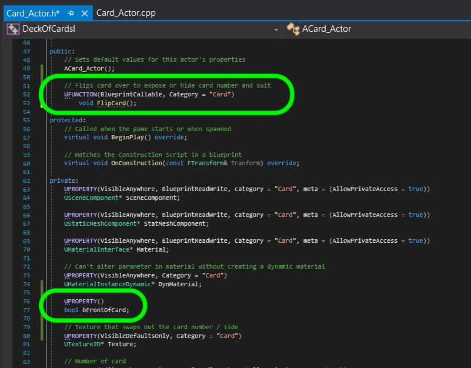  

_____ 



{:start="{{ num }}"}
{{ num }}. Now we can automatically have Visual Studio set up the definition in the .cpp file. Click on the icon next to the new function declaration and select Create definition of FlipCard in Card_Actor.cpp.   Change the truthiness of the boolean for `bFrontOfCard` then call the `SetCard()` function to reset the texture.

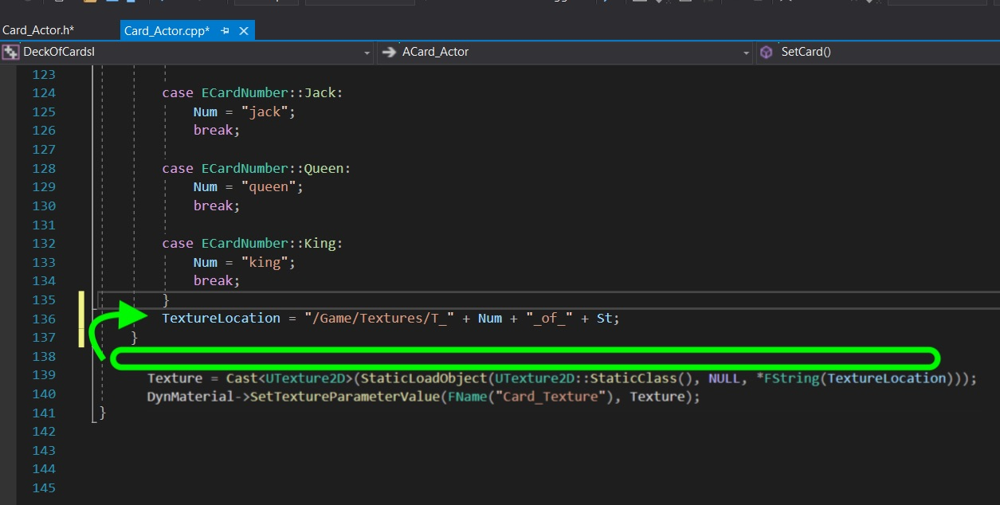  

_____ 


{:start="{{ num }}"}
{{ num }}. We need to change **SetCard()** to first check to see if the caller wants the front or back of the card.  So add an **if** statement to check if it is showing the back of the card.  If so then add the location for the back of card texture and add an `else` statement after in case you need to pick the front of card texture:

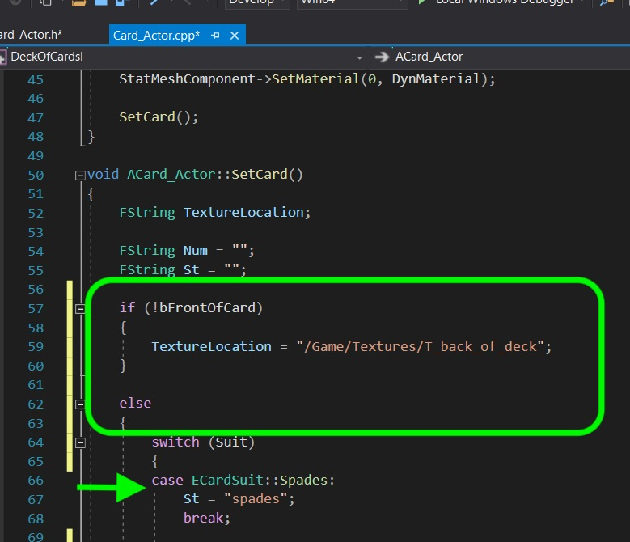  

_____ 



{:start="{{ num }}"}
{{ num }}. We need to move the `TexutureLocation` for the front of card just before the end of the `else` statement so it doesn't override the setting for the back of the card.

  

_____ 


{:start="{{ num }}"}
{{ num }}. Now lets add a boolean for debug that allows the user in the EDITOR ONLY to flip the card to see both sides.  Create a edit anywhere boolean that will call the function from the editor.  It will not be exposed to blurprints and not meant to be used during the game.

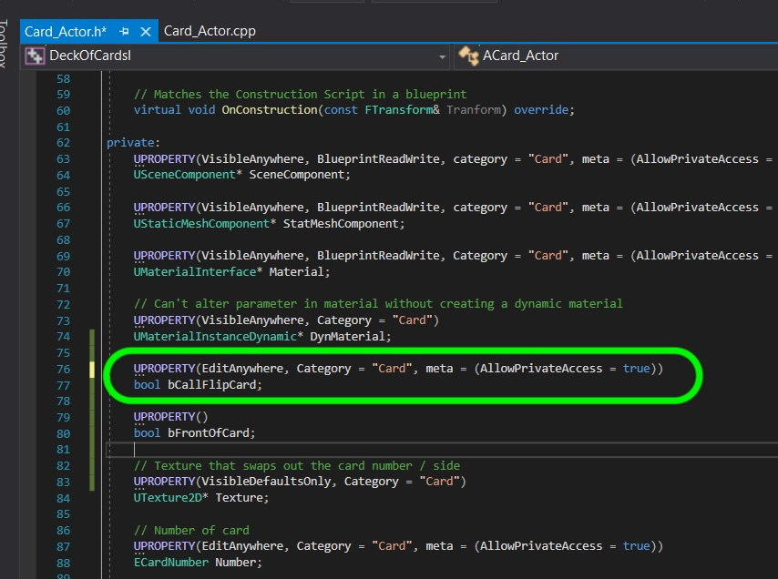  

_____ 


{:start="{{ num }}"}
{{ num }}. Lets add the boolean to the **On Construction** method and when it is true call the flip card function then set the boolean to false again.  So every time it is clicked in the editor it will call the function then go back to being false.  This is a great way to call and test functions in the editor.

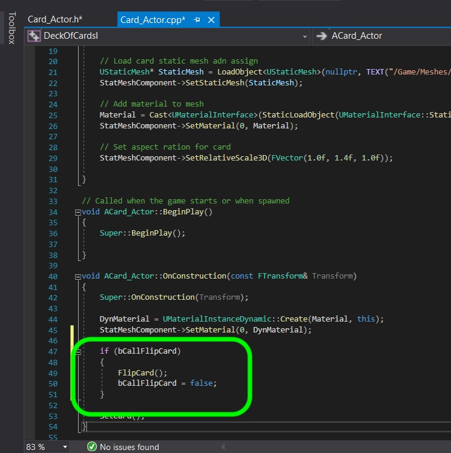  

_____ 


{:start="{{ num }}"}
{{ num }}. Now the default for booleans is false so the card should start on its back side.  Compile and click the boolean in the editor and the card should flip sides. 

  

_____ 

## Deck of Cards
Now we have a starting point for a working class that we can use in a game.  Lets create a class that is a deck of cards that
handles the individual card actors. Let's open the game in UE4.

_____ 



{:start="{{ num }}"}
{{ num }}. Let's take a look at the **BP_Card** class to see what it looks as a blueprint.  We will be adding user interaction within the blueprint later on.

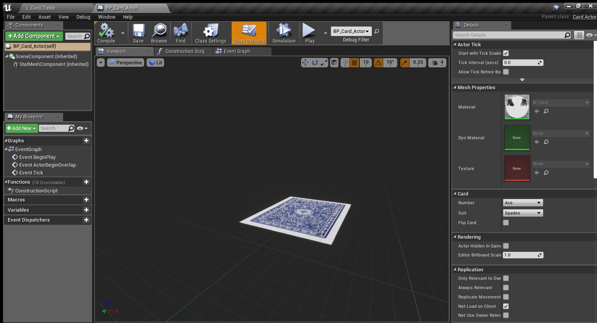  

_____ 


{:start="{{ num }}"}
{{ num }}. Create a new **Actor Blueprint** and add it to the **Blueprints** folder and call it `BP_Deck_Of_Cards`.

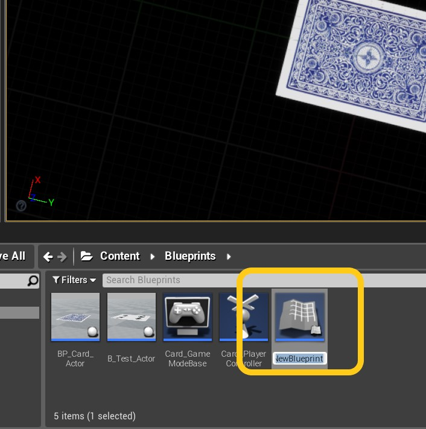  

_____ 


{:start="{{ num }}"}
{{ num }}. Open the blueprint and add a new **Variable**.  You will notice that Unreal makes the UClass Enumerators globally accessible in the editor.  Press type and put in `ECard...` and you will see the two enumerators we added to the C++ class accessible.

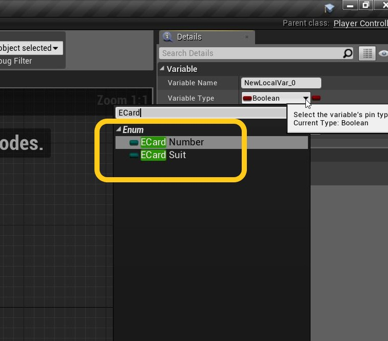  

_____ 


{:start="{{ num }}"}
{{ num }}. Name the variable `Number` and make it a type of `ECardNumber`.  We should make it **Private** by default as another object does not need access to it at this moment.  Lets put it in caterogy `Card`.

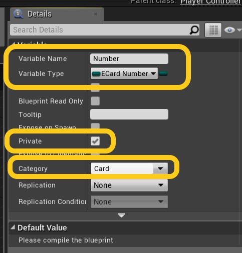  

_____ 


{:start="{{ num }}"}
{{ num }}. Create another variable called `Suit` with type `ECardSuit` and make it **Private** and of category `Card`.

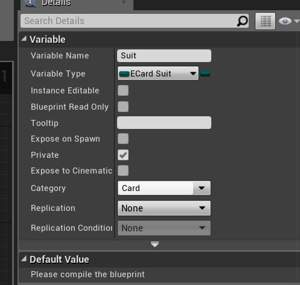  

_____ 


{:start="{{ num }}"}
{{ num }}. Open the **Event Graph** tab and add a **For Each ECardNumber** node which will go through each number in the Enumerator list.

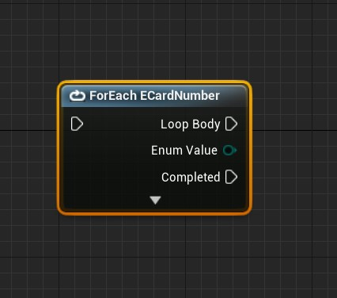  

_____ 


{:start="{{ num }}"}
{{ num }}. Connect ther exeuction pin from the **Begin Play** node to the **For Each** loop.  We need to set the variable **Number** so we can build a new card actor with it.  Drag a **Set** reference onto the open grid.

  

_____ 


{:start="{{ num }}"}
{{ num }}. We need to set the card to the latest one in the **For Each** loop and hook up the execution pins to **Begin Play** execution pin.

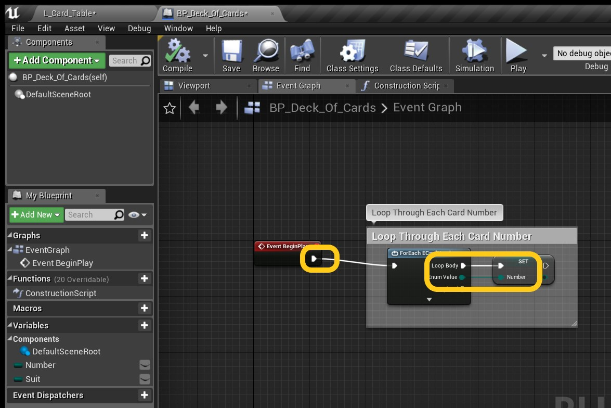  

_____ 


{:start="{{ num }}"}
{{ num }}. Now lets loop through each suit so we can create an **Actor** in the scene with each card of the 52 card deck.

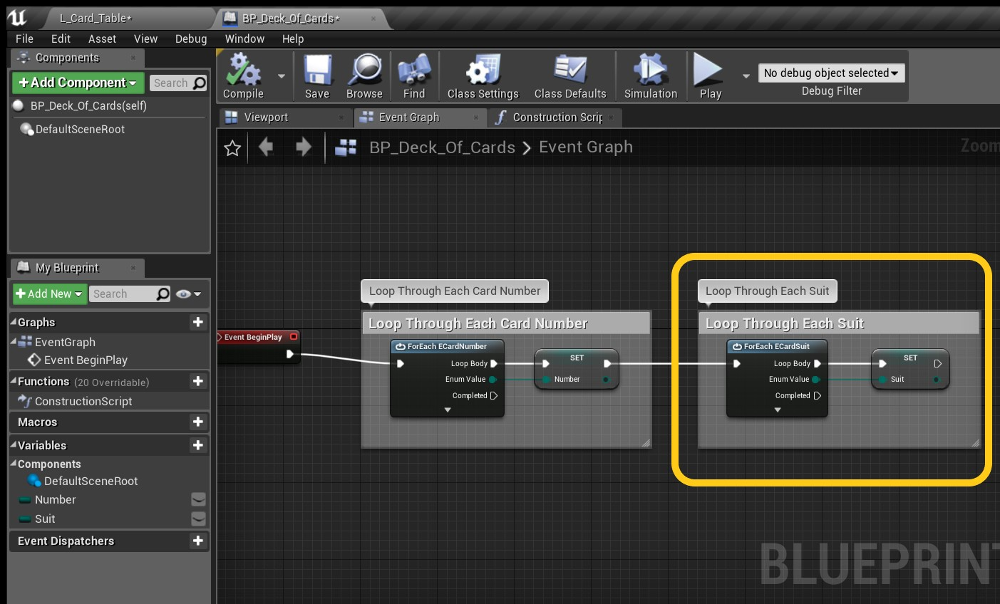  

_____ 


{:start="{{ num }}"}
{{ num }}. Now we will create a card and add it to the deck. Right click on graph and look for a **Spawn Actor of Class** node.

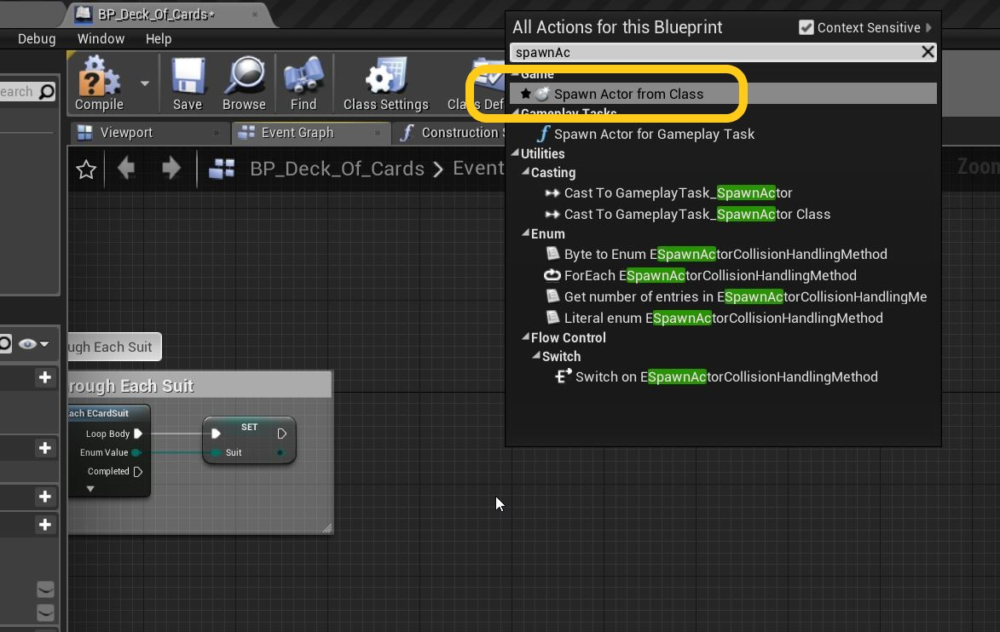  

_____ 


{:start="{{ num }}"}
{{ num }}. OK, set the class in this node to `BP_Card_Actor` and press compile.  Look at the error it wants to add a transform into the **Transform** input pin.

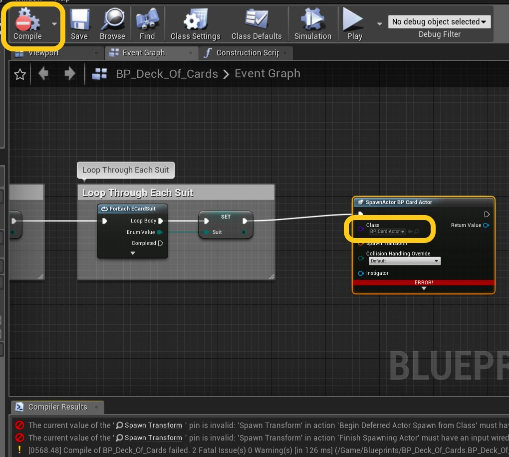  

_____ 


{:start="{{ num }}"}
{{ num }}. Right click on the graph and select a **Make Transform** node:

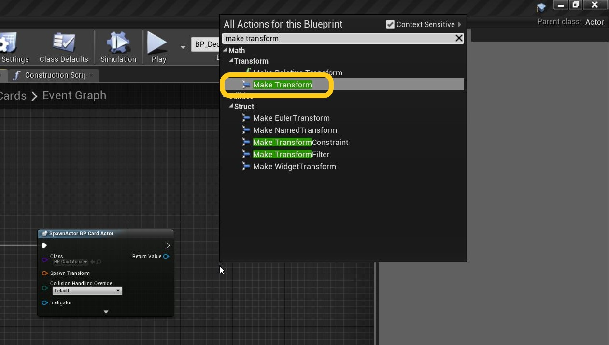  

_____ 


{:start="{{ num }}"}
{{ num }}. Leave the default settings and connect the output pin to the **Spawn Class** node.  Connect the execution pins where needed.

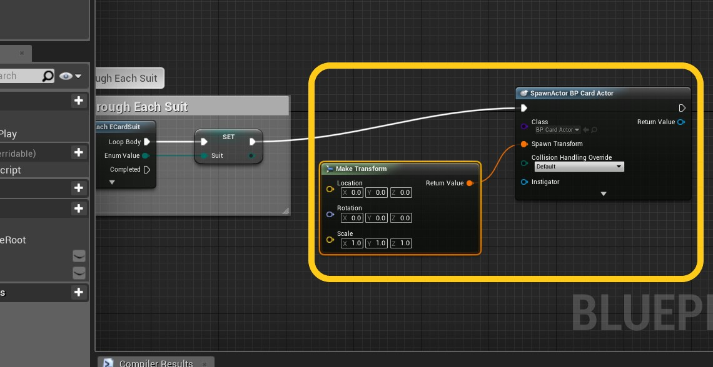  

_____ 


{:start="{{ num }}"}
{{ num }}. Go back to game level and remove the old card blueprint.  Replace it with the new **BP_Deck_Of_Cards** class.  Press run and notice that it spawns all the card classes. If the card is not vertical and is horizontal you can rotate the camera by 90 or -90 on the Z Rotation.

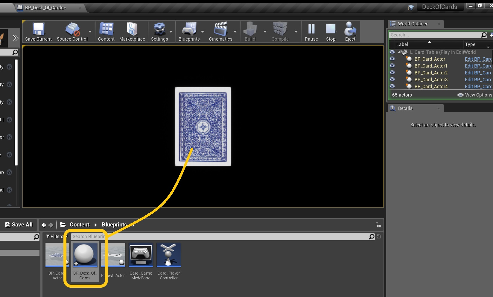  

_____ 


{:start="{{ num }}"}
{{ num }}. Scroll down and you will see the 52nd card and the deck of card actor.  Next up lets have the card flip over if you click on it with the left mouse button.

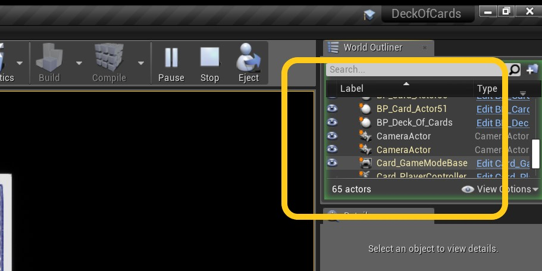  

_____ 

## Add Set Card Suit
Now we need to set each card to a unique number and suit.  Lets add this functionality to our Card C++ class.
_____ 



{:start="{{ num }}"}
{{ num }}. Now we have fifty two ace of spades.  We forgot to write a function to set the card number and suit.  Open up **Card_Actor.h** and add to the bottom a new blueprint callable unction called `SetCardNumSuit()` and pass it a number and card enumerator.

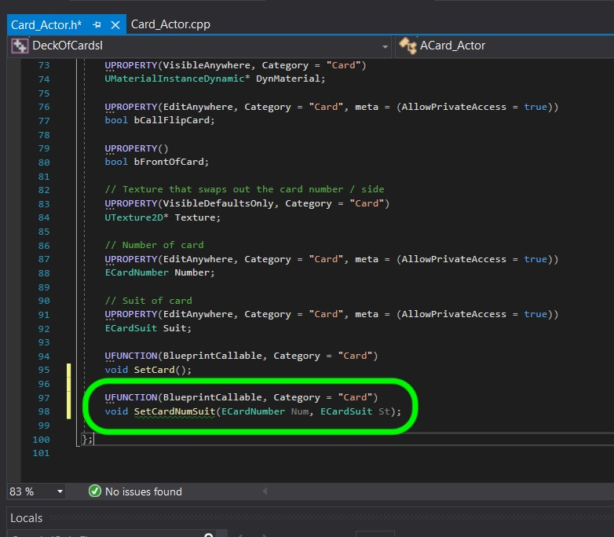  

_____ 


{:start="{{ num }}"}
{{ num }}. Now we can click on the brush icon and select **Create definition of SetCardNumbSuit in Card_Actor.cpp**.

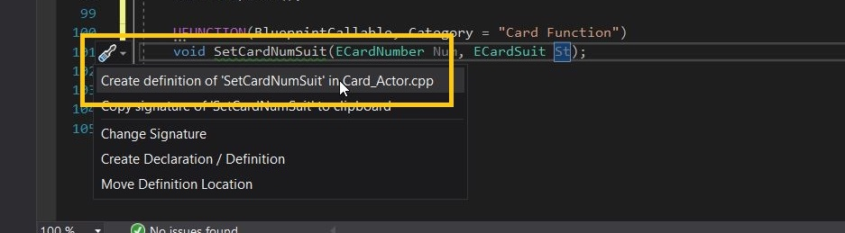  

_____ 


{:start="{{ num }}"}
{{ num }}. The function is quite simple where we set the number and suit.  Press **cntrl b** to compile the game.

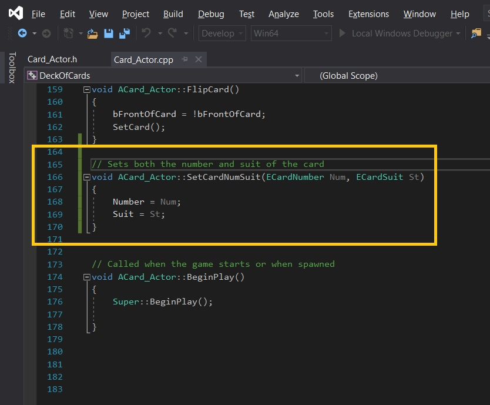  

_____ 


{:start="{{ num }}"}
{{ num }}. Now go back to the game and make sure it has compiled.  Go to the **BP_Deck_Of_Cards** blueprint and after you create the actor pull off of the return value (reference to the neew actor you just created) and select a **Set Card Num Suit** node.

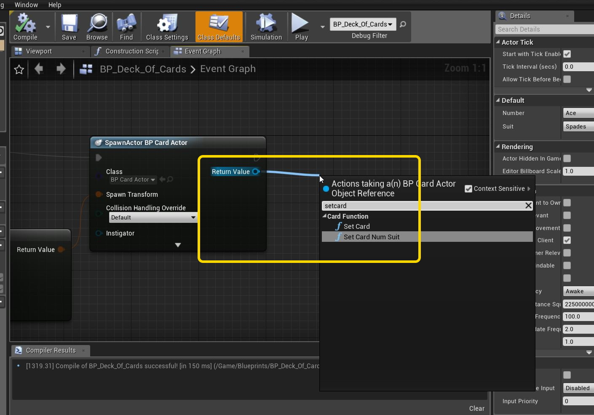  

_____ 


{:start="{{ num }}"}
{{ num }}. Drag a get reference to **Number** and drag it to the graph.

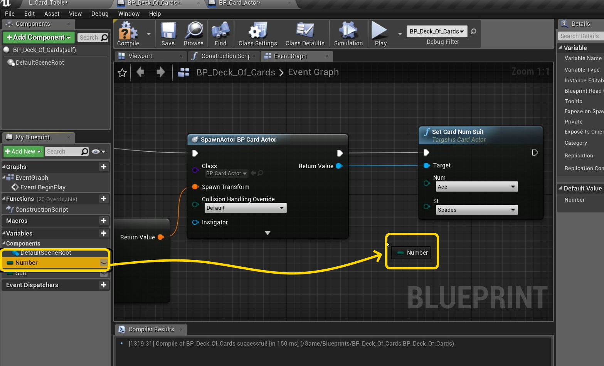  

_____ 


{:start="{{ num }}"}
{{ num }}. The repeat this for the suit and connect these two nodes to the **SetCardNumSuit**.

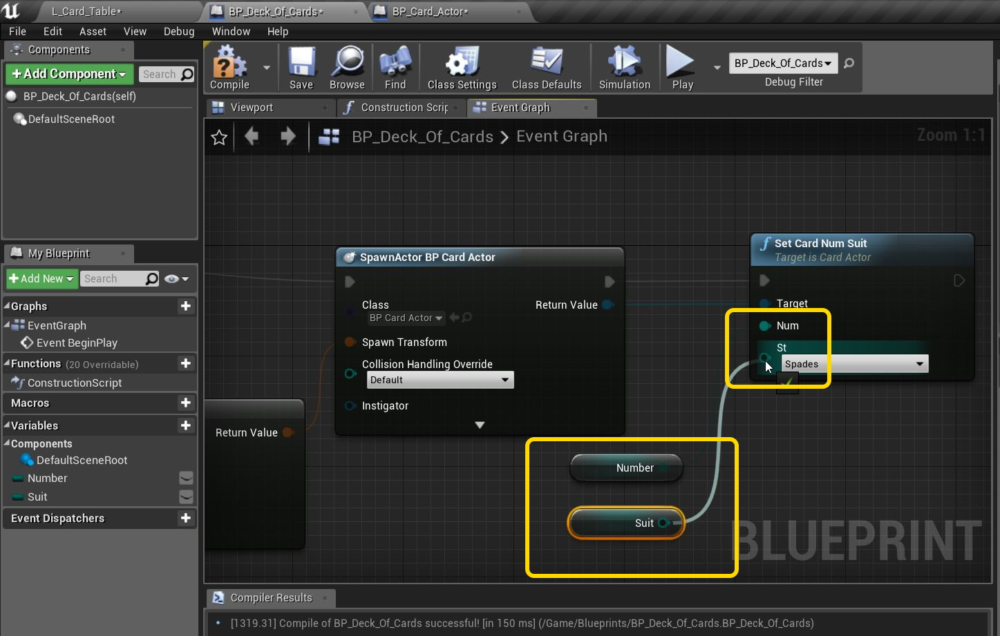  

_____ 


{:start="{{ num }}"}
{{ num }}. Now compile the blueprint and run the game.  Pick a card later in the deck and we should now have a full deck with the an individual card number. Next Up lets add interactivity to the button click and turn a card over.

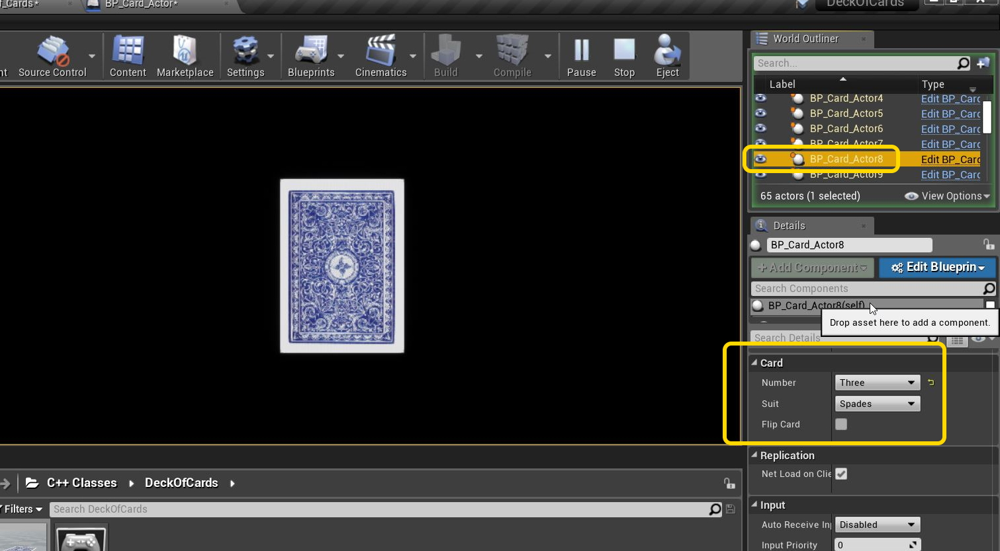  

_____ 
  

[<- Previous](CCP-UE4-Deck-Of-Cards-3.html)&nbsp;&nbsp;&nbsp;[Home](../index.html)&nbsp;&nbsp;&nbsp; [Continue ->](CPP-UE4-Deck-Of-Cards-5.html)
   
   
   

