# UE4 Deck of Cards Page 5
_____ 

## Index
_____ 

* Part I - Test in Blueprints
1. [Getting Set-Up](CPP-UE4-Deck-Of-Cards-1.html#getting-set-up)
2. [Add Test Blueprint](CPP-UE4-Deck-Of-Cards-1.html#add-test-blueprint)
3. [Configure Project](CPP-UE4-Deck-Of-Cards-1.html#configure-project)
4. [Make Camera Default](CPP-UE4-Deck-Of-Cards-1.html#make-camera-default)
5. [Mimic Our Final C++ Class](CPP-UE4-Deck-Of-Cards-2.html#mimic-our-final-c++-class)

* Part II - C++ Card Class
1. [Basic Card C++ Class](CPP-UE4-Deck-Of-Cards-2.html#basic-card-c++-class)
2. [Dynamic Materia](CPP-UE4-Deck-Of-Cards-3.html#dynamic-material)
3. [User Selected Card Suit](CPP-UE4-Deck-Of-Cards-3.html#user-selected-card-suit)
4. [Show Back of Card](CPP-UE4-Deck-Of-Cards-4.show-back-of-card)

* Part III - Blueprint Deck Of Cards
1. [Deck of Cards](CPP-UE4-Deck-Of-Cards-4.deck-of-cards)
2. [Add Set Card Suit](CPP-UE4-Deck-Of-Cards-4.add-set-card-suit)
3. [Make Card Clickakble](CPP-UE4-Deck-Of-Cards-5.make-card-clickable)
4. [Create Two Piles](CPP-UE4-Deck-Of-Cards-5.create-two-piles)

_____ 

## Make Card Clickakble
Now we have a deck of cards but can't do anything with them.  We have a deck face down but it would be nice to click on a card and have it turn the card over in a pile next to it.  

_____ 


{:start="{{ num }}"}
{{ num }}. Open up **BP_Card_Actor** blueprint and we will add this functionality in blueprints as opposed to the underlying class.  I want the class to be somewhat generic of the immplementation.  I want to simulate a class that you would hand over to a design team.  When you open a blueprint with no nodes often you don't get the normal view.  You get the data only view.  It just takes pressing **Open in Full Blueprint Editor** to get back to the programming view.

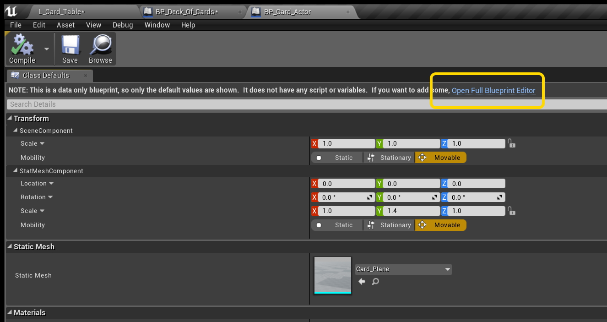  

_____ 



{:start="{{ num }}"}
{{ num }}. Now select the **Static Mesh** in the blueprint and right click on the graph.  At the top you can access events attached to the actor.  Select **Add Event for Stat Mesh Component \| Input \| Mouse Input \| Add On Clicked**.

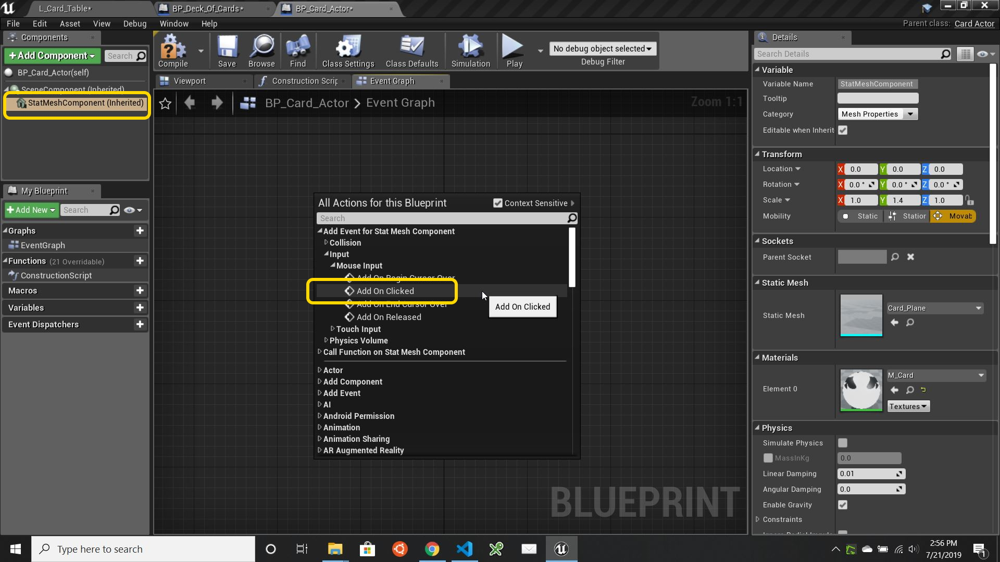  

_____ 



{:start="{{ num }}"}
{{ num }}. Add a **Print String** node and connect the execution pin.  Type a message so we can test to see that clicking on the object works.

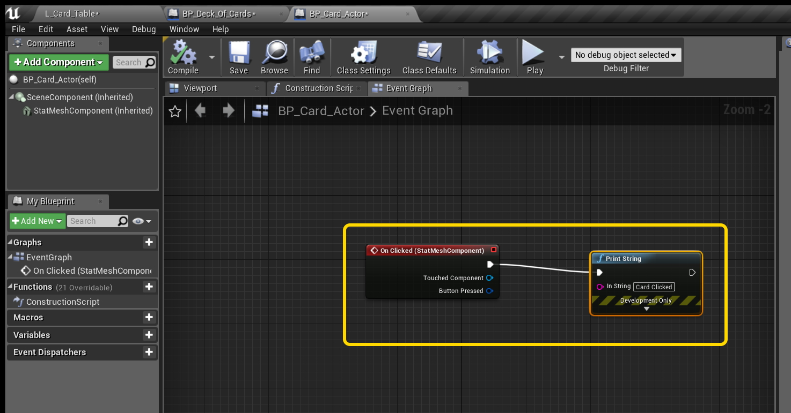  

_____ 



{:start="{{ num }}"}
{{ num }}. Run the game and click on the deck of cards.  Do we see a message appear each time you click?

  

_____ 



{:start="{{ num }}"}
{{ num }}. Now we need to shift the card over to the right.  We need to get the existing location of the card then move it in negative x to move the card.  Right click on the graph and add a **Get Actor Location** node.  Right click on the output pin and select **Split Struct Pin**

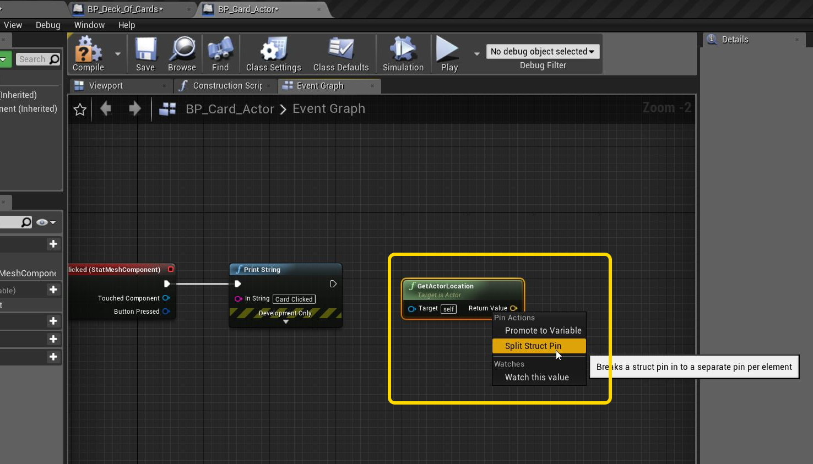  

_____ 



{:start="{{ num }}"}
{{ num }}. Pull off of the **Return Value X** output pin and select a **Float + Float** node:

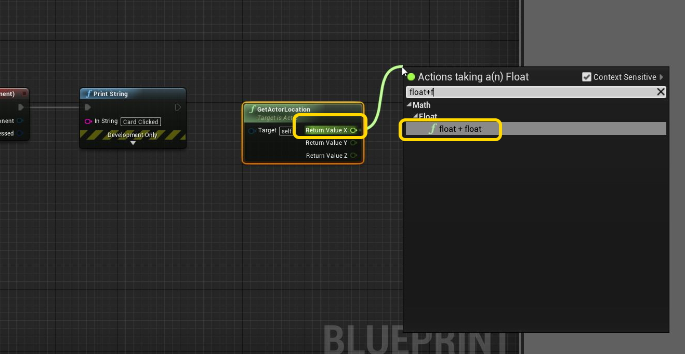  

_____ 



{:start="{{ num }}"}
{{ num }}. Set the value in the addition node to `-30` and add a **Set Actor Location** node to reposition the card with.

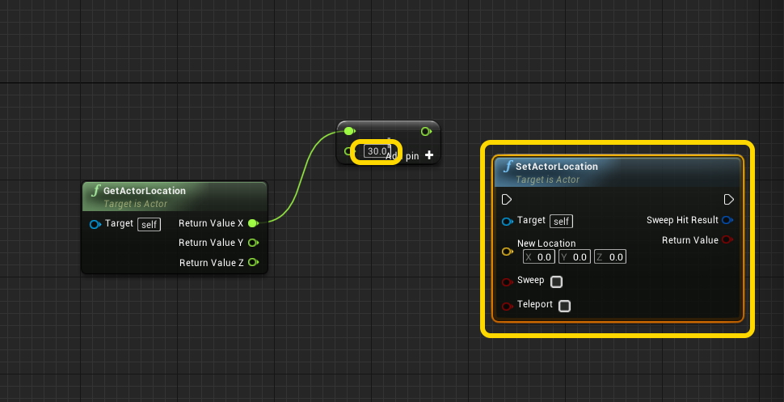  

_____ 



{:start="{{ num }}"}
{{ num }}. Split the struct pin on the **Set Actor Location New Location** pin.

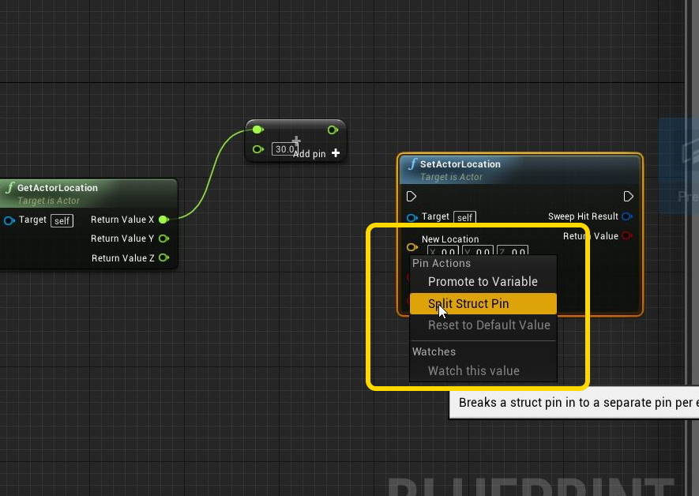  

_____ 



{:start="{{ num }}"}
{{ num }}. Connect the **X Y Z** pins in **Set Actor Location** and add a **Flip Card** function call to the function we wrote in the C++ class.  This will move the card `-30` pixels to the right and flip the card. Then delete the **Print String** node and connect the execution pin from **On Clicked** node to **SetActorLocation** to **Flip Card** nodes.

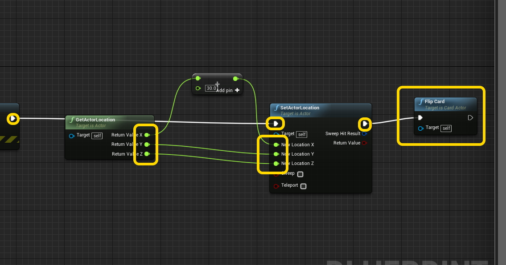  

_____ 



{:start="{{ num }}"}
{{ num }}. Now compile and run and click on the top card.  Notice that it turns over, but it doesn't really go far enough.  Also when I move the deck over to the left in the editor it goes back to the center when running the game.  Lets fix this and adjust the distance the card goes in.

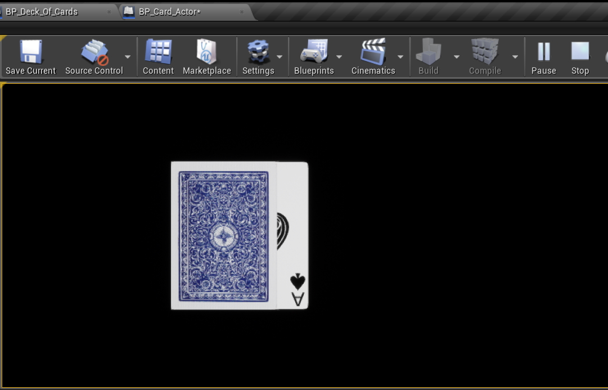  

_____ 



{:start="{{ num }}"}
{{ num }}. Open up **BP_Deck_Of_Cards** and add a **Get Actor Location** node and send the output into the **Make Transform Location** pin.  This way it will remember the location you placed the deck on the table and leave it alone.

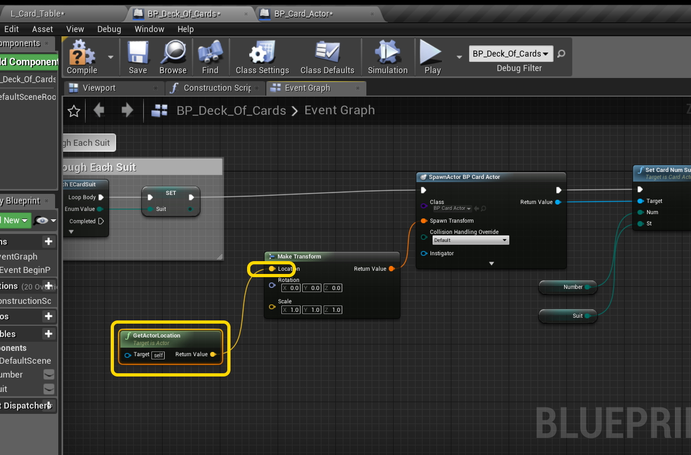  

_____ 



{:start="{{ num }}"}
{{ num }}. Open up **BP_Card_Actor** and this time try moving the card `-120` on the **X** axis.

  

_____ 



{:start="{{ num }}"}
{{ num }}. Compile and run the game.  Click on the cards.  There are a few obvious issues. The cards just keep moving to the right.  We should only have one card up pile.  The other thing is that the engine is sorting the cards in **Z** even though they are all set to `0.0f`.  But it is rembering that the one placed their first gets higher priority and it remebers that setting when switching piles.  Lets fix this.

  

_____ 

## Create Two Piles
OK, now lets create two piles with the one on the left face down and the one on the right face up.  Clicking on each deck will switch the card between the two piles.

_____ 



{:start="{{ num }}"}
{{ num }}. Now the deck object should keep track of which pile each card is in. Open up **BP_Deck_Of_Cards** and create 2 **integer** variables that tracks the number that card is on the pile.  Name them `Card1Pile` and `Card2Pile`, make them **private**.  The **Category** is set to `Pile` and we need to set **Card1Pile** to `0` and **Card2Pile** to `-1`. If a number is greater or equal to zero then it is on that pile. Since the cards all start on pile 1 we will leave them at 0 for now and adjust them in the **Begin Play** event.

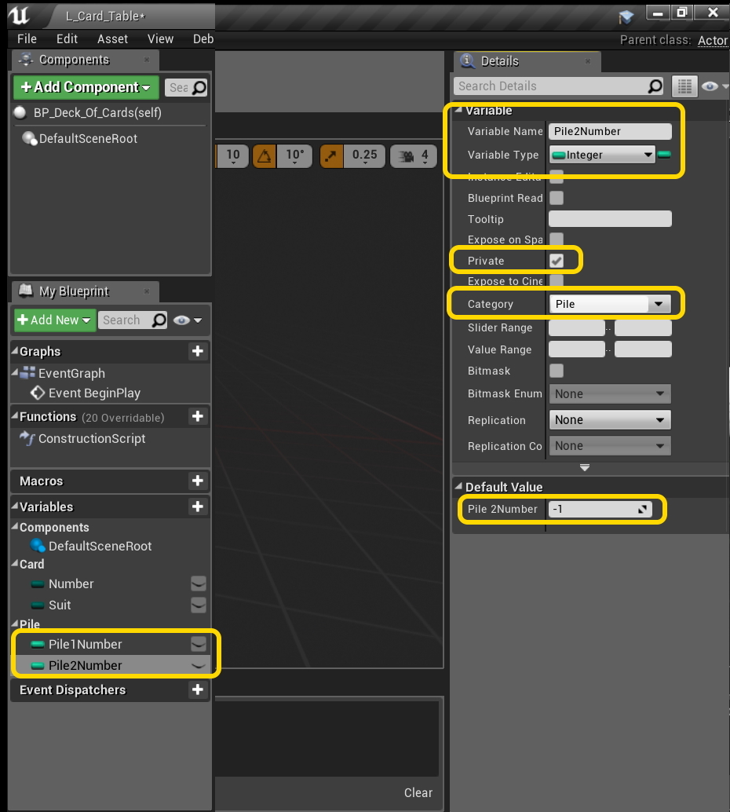  

_____ 



{:start="{{ num }}"}
{{ num }}. Lets make a small change.  Now we want to have each card on a different level on the **Z** axis.  Since the camera is orhtographic it will present no scale issues with the art (there is no depth so the objects don't scale relative to the camera).  So lets use the varibles we just created to not only indicate what number on the pile it is, but use it to set the Z value.  The highest value is the top of the deck and 0 is the bottomm (-1 is that it is NOT in the pile). Disconnect the pin from **Get Actor Location** and right click on the **Return Value** and select **Split Struct Pin**. Then reconnect the **X** and **Y** pins and plug the new **Pile Number** variable into **Z**.

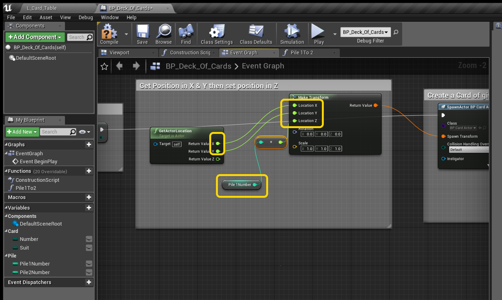  

_____ 



{:start="{{ num }}"}
{{ num }}. Now we will move the control of the card from the card blueprint to the deck blueprint.  Create a new **Function** and call it `Pile1To2` and add an input with **Object Reference** to the specific instance of thee **BP_Card_Actor**.  We don't want a class reference as we want to access a specific instance of that deck as there could be more than one deck at play in the game.

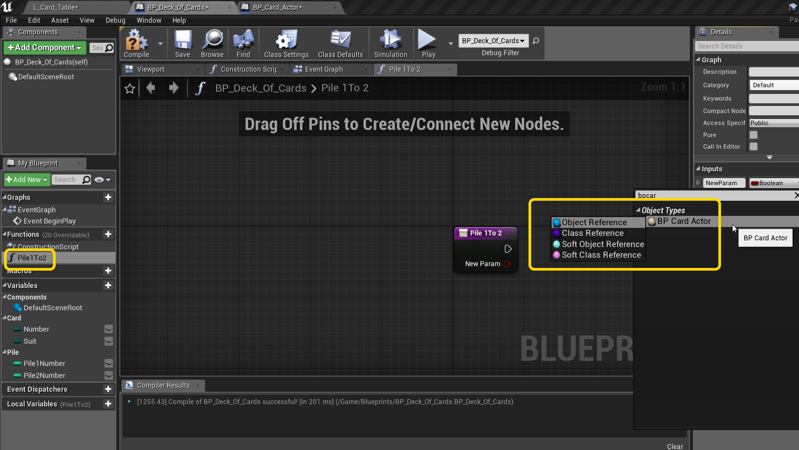  

_____ 



{:start="{{ num }}"}
{{ num }}. Open up **BP_Card_Actor** and shift select all the nodes and copy and delete these nodes as we will move them to the function in the deck:

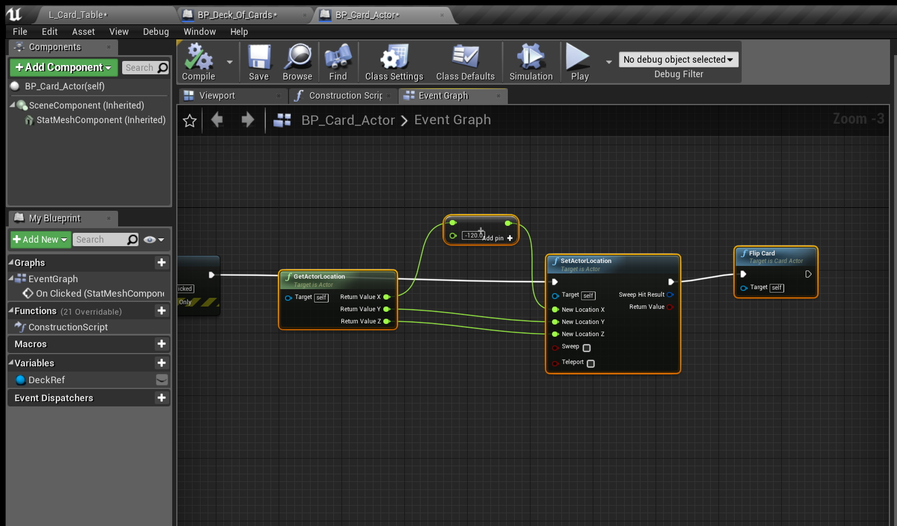  

_____ 



{:start="{{ num }}"}
{{ num }}. Paste the nodes into the **Pile1To2** function and connect thee execution pin.  Now the target is the card and not the deck so connect the **CardRef** input pin to the **Get Actor Location**, **Set Actor Location** and **Flip Card** function.

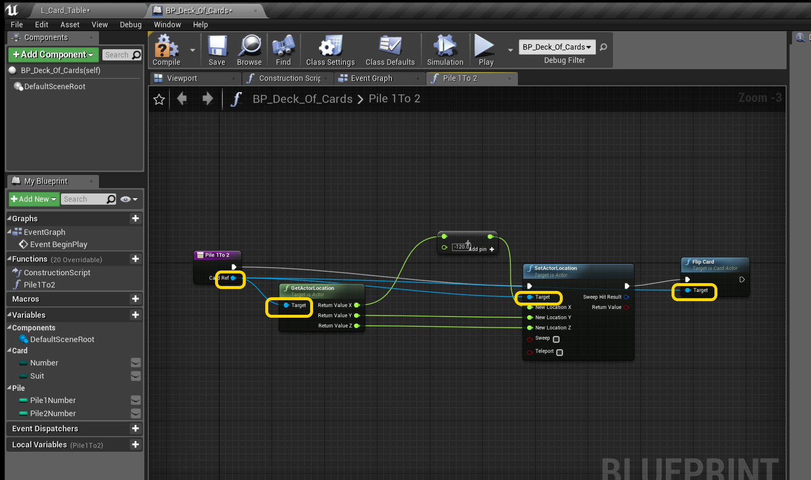  

_____ 



{:start="{{ num }}"}
{{ num }}. Now drag a a **Get Pile 2 Number** and plug it into the **Z** axis so that the top of the deck is sorted on top.

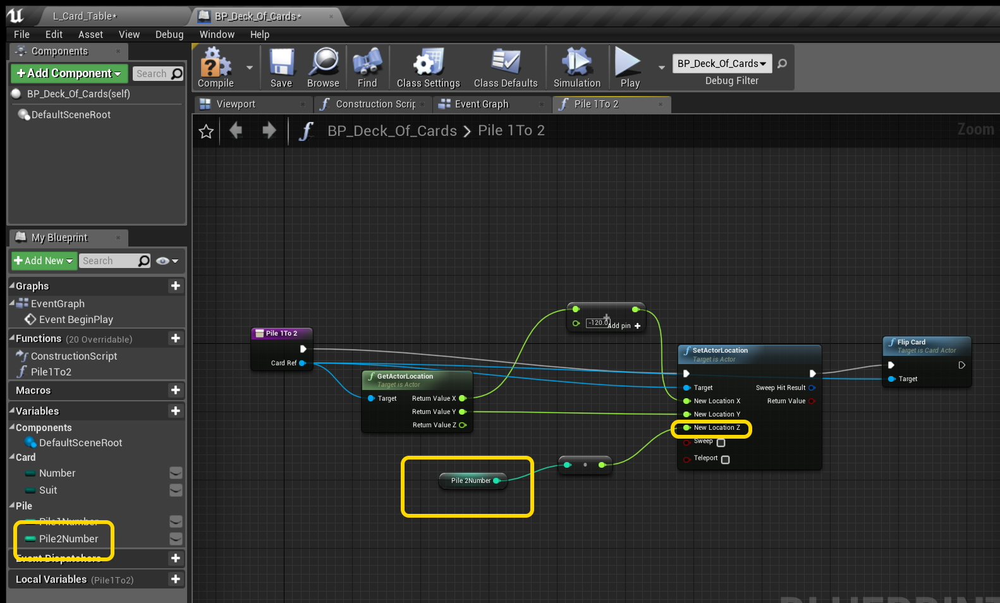  

_____ 



{:start="{{ num }}"}
{{ num }}. Now when a card goes from deck 1 to deck 2 we need to subtract a number from pile 1 and add a number to pile 2.

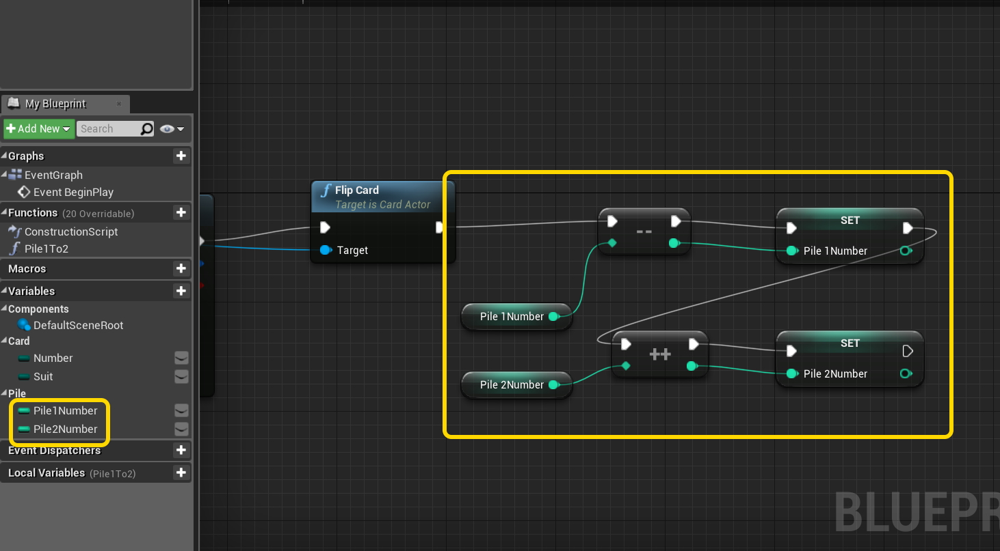  

_____ 



{:start="{{ num }}"}
{{ num }}. Now the card will need to communicate to the deck.  How will it get access to it?  We will open up **BP_Card_Actor** and add a new **Variable** reference to the deck of type **Object Reference** of a **BP Deck Of Cards**. 

  

_____ 



{:start="{{ num }}"}
{{ num }}. Now on the event graph, drag a reference of the variable **Deck Ref** to the graph.  Then pull off the pin and call the **Pile1To2** function.  Add a **Self** reference to the **Card Ref** pin so that the deck's function can manipulate the card. Connect the execution pin from **OnClicked** node to **Pile1To2** node.

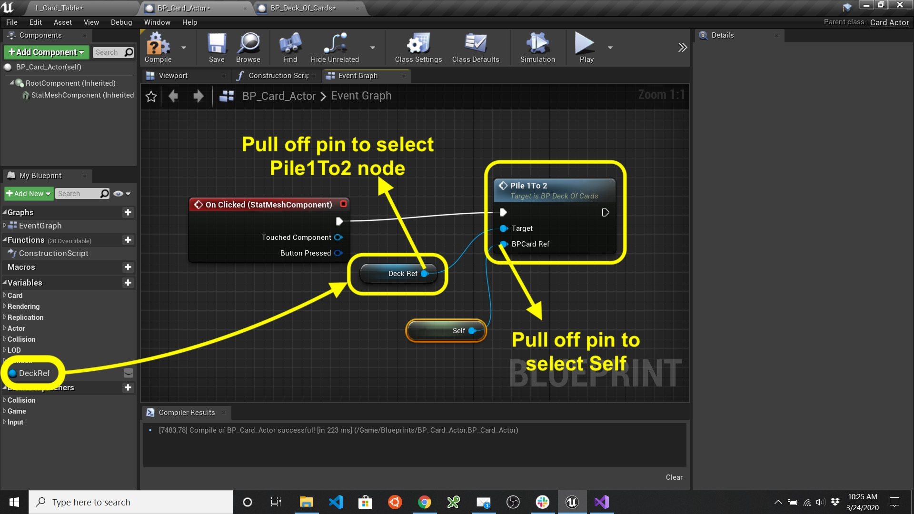  

_____ 



{:start="{{ num }}"}
{{ num }}. Now go back to **BP_Deck_Of_Cards** and add a **Self** reference to pass to the deck of cards so it can access the **Deck**'s public members.

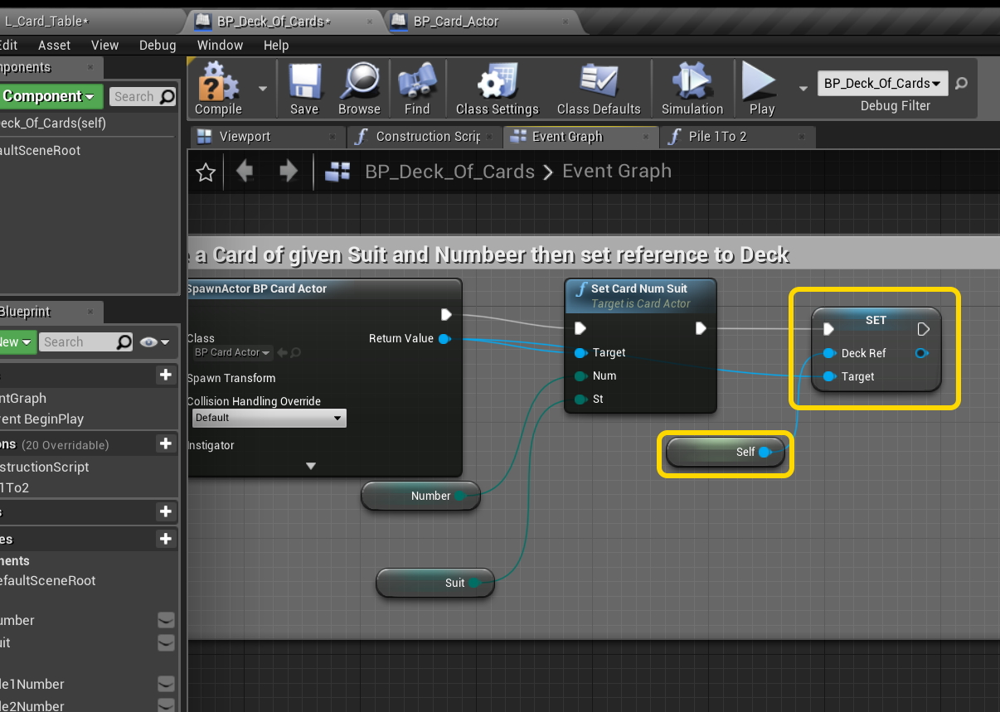  

_____ 



{:start="{{ num }}"}
{{ num }}. Now also increment the **Pile 1 Number** after the card iis spawned to put each subsequent card on the pile.

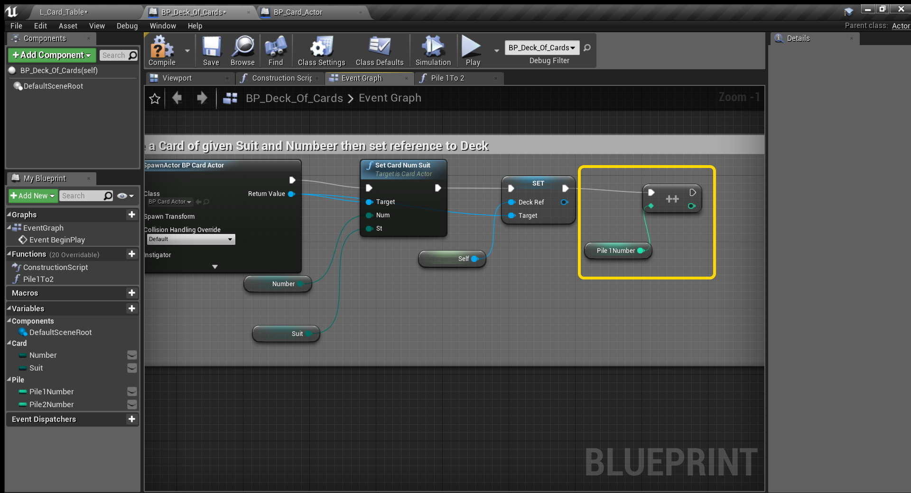  

_____ 



{:start="{{ num }}"}
{{ num }}. Compile the game and run it.  Now click on the pile and we start with the last dealt card and it goes from kings to aces in reverse order.  But you can still keep moving cards right.  Look at the Z position to make sure that it is changing as you expect (the lowest number at the bottom of the deck and the highest at the top). In the next page lets finish up our two pile exercise.

  

_____ 

  

[<- Previous](CCP-UE4-Deck-Of-Cards-4.html)&nbsp;&nbsp;&nbsp;[Home](../index.html)&nbsp;&nbsp;&nbsp; [Continue ->](CPP-UE4-Deck-Of-Cards-6.html)
   
   
   

