# Cards II Page 1
_____ 

## Index
_____ 

* Part I - Refactor Basic CPP Class
1. [Refactor Basic Class](CPP-Cards-II-1.html#refactor-basic-class)
2. [Add a Namespace](CPP-Cards-II-1.html#add-a-namespace)
3. [Structs and Classes](CPP-Cards-II-1.html#structs-and-classes)
4. [Static Members of a Class](CPP-Cards-II-1.html#static-members-of-a-class)
5. [Equal & Not Equal Operators](CPP-Cards-II-1.html#equal--not-equal-operators)

* Part II - Creation and Destruction CPP
1. [Detructor](CPP-Cards-II-2.html#detructor)
2. [Stack and Heap](CPP-Cards-II-2.html#stack-and-heap)
3. [More on Pointers](CPP-Cards-II-2.html#more-on-pointers)

* Part III - More on Type CPP
1. [More Const](CPP-Cards-II-3.html#more-const)
2. [Auto](CPP-Cards-II-3.html#auto)
3. [Decltype](CPP-Cards-II-4.html#decltype)

* Part IV - Applying to UE4
1. [Setting up Project and New Level](CPP-Cards-II-5.html#setting-up-project-and-new-level)
2. [Namespaces](CPP-Cards-II-5.html#namespaces)
3. [Equality in UE4 Card Class](CPP-Cards-II-5.html#equality-in-ue4-card-class)
4. [UStructs](CPP-Cards-II-6.html#ustructs)
5. [Static Members](CPP-Cards-II-7.html#static-members)
6. [Destructor](CPP-Cards-II-7.html#destructor)

_____ 

## Refactor Basic Class
Now we are going to take off where we left with our previous C++ Visual Studio project **Basic Class**.  In it we had the **Card Class** and **Main** all in the same page.  Lets recreate this project and separte the **Card** class into its own **.h** and **.cpp**.

_____ 



{:start="{{ num }}"}
{{ num }}. Create a new C++ Windows Console Application **project** in Visual Studio nand pick a directory to save it in.  Call the project `ExtendingVSCardClass` then press the **Create Projects** button. 

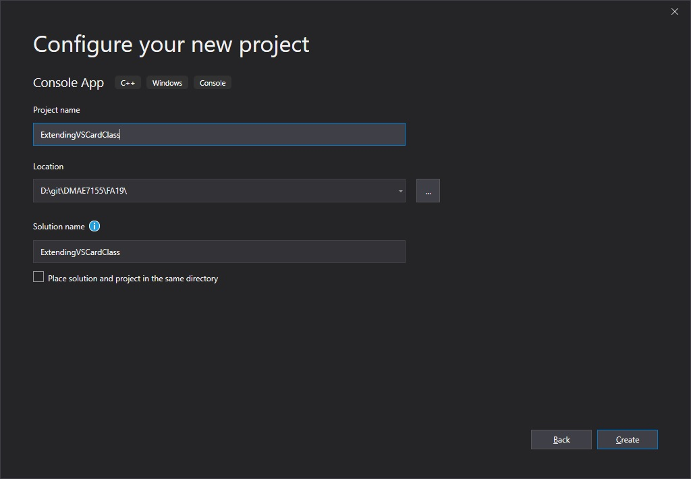  

_____ 



{:start="{{ num }}"}
{{ num }}. We will take what we have done previously in **Basic Class** project and move it over.  So in your new **ExtendingVSCardClass** project and press **Project \| Add Class** and add a **.h** and **.cpp** called `Card`. Press the **OK** button:

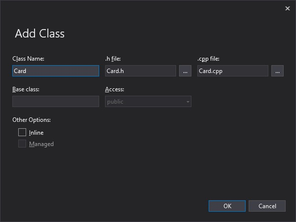  

_____ 



{:start="{{ num }}"}
{{ num }}. VS should stub in an empty **class.h** and **class.cpp**. You **.h** should look like this:

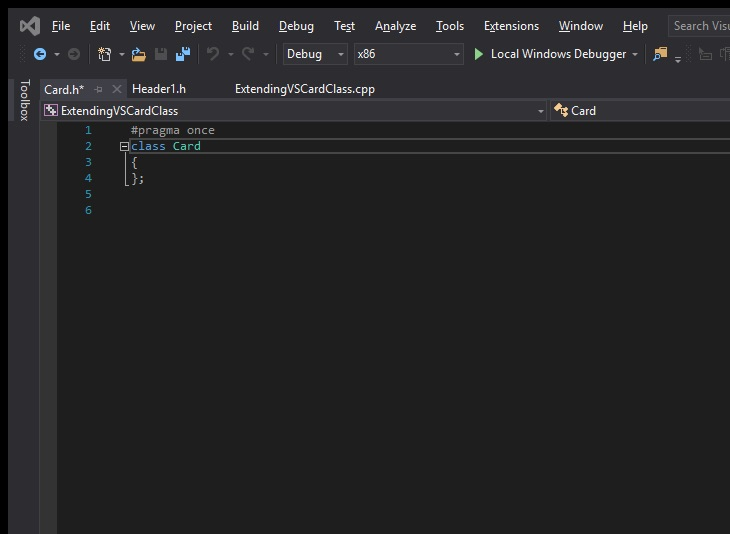  

_____ 


{:start="{{ num }}"}
{{ num }}. Now go and open **BasicClass.cpp** (from the **FunctionsTeamplatesClasses** project) and cut and paste the **Card** class declaration and paste it into **Card.h** like so:

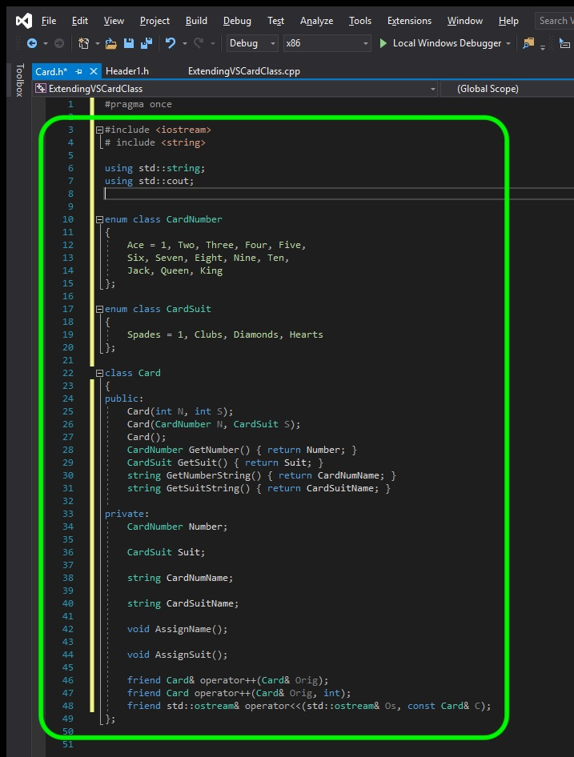  

_____ 


{:start="{{ num }}"}
{{ num }}. Now copy and paste all the class definitions to the **Card.cpp** file.  Leave the **Main** function to put in the project main cpp.

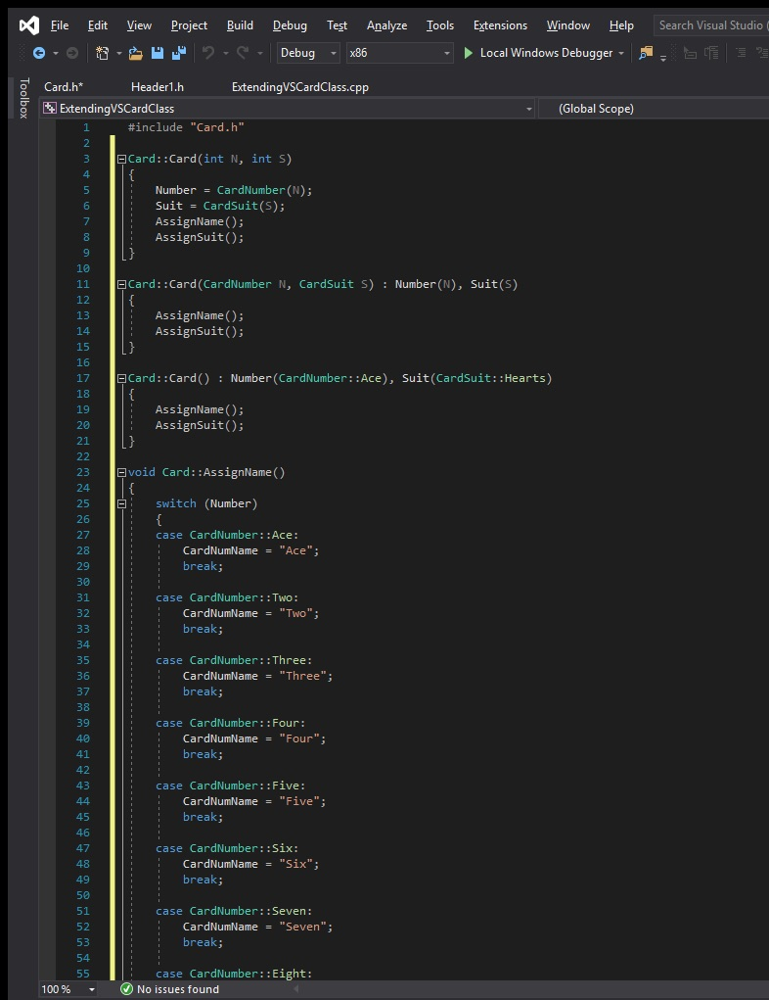  

_____ 


{:start="{{ num }}"}
{{ num }}. Now copy **Main.cpp** content to **ExtendingVSCardClass.cpp**.  Also at the top add a reference to the new card class by adding `#include "Card.h"` and then for cout add `using std::cout;`.

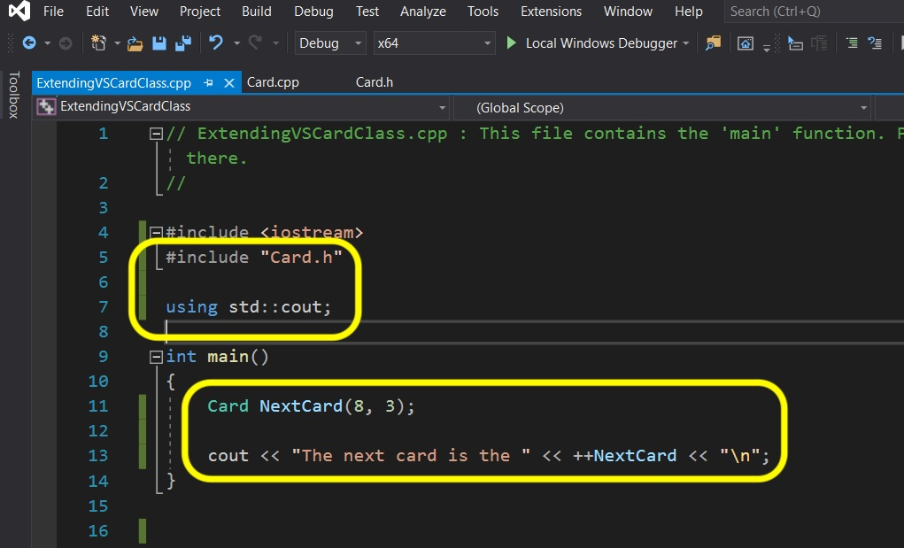  

_____ 



{:start="{{ num }}"}
{{ num }}. Compile and run and it should look EXACTLY like the **Basic Class** project did when we left off.

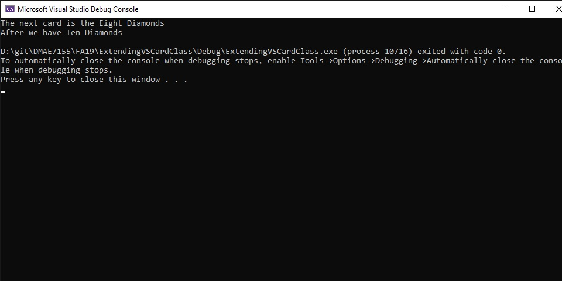  

_____ 

## Add a Namespace
Now it is always a good idea when creating a class to add its own [namespace](https://en.cppreference.com/w/cpp/language/namespace).  Namespace is a method for preventing conflicts in large projects.  UE4 is a large project and there are thousands of classes and names to contend with.  The chances of reusing a name they have already used is great.

_____ 



{:start="{{ num }}"}
{{ num }}. Lets add a **Namespace** to the project.  Why use a namespace on a new class in such a small project?  This class is generic enough that I might want to reuse it on multiple projects. **Cards** is a fairly generic name, and it is quite possible I might try and use it where there is another class called **Cards**.  By giving it a namespace it is less likely that I will have a collision (use the same name of a class and member where the compiler will pick one of the two (or not compile).    Lets wrap the entire **.h** with the namespace `Deck`.  Now compile and we break the entire **.cpp** as it is lo longer in the same global namespace.

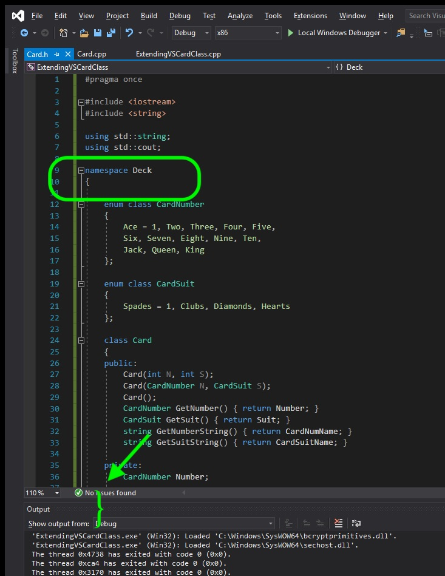  

_____ 


{:start="{{ num }}"}
{{ num }}. Open **Card.cpp** and put all the definitions within the `Deck` namespace.

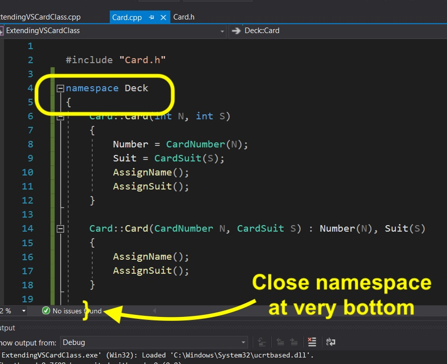  

_____ 


{:start="{{ num }}"}
{{ num }}. Try compiling and go back to the ExtendingVSCardClass.cpp tab.  Notice that it can't find the **Card** class.  

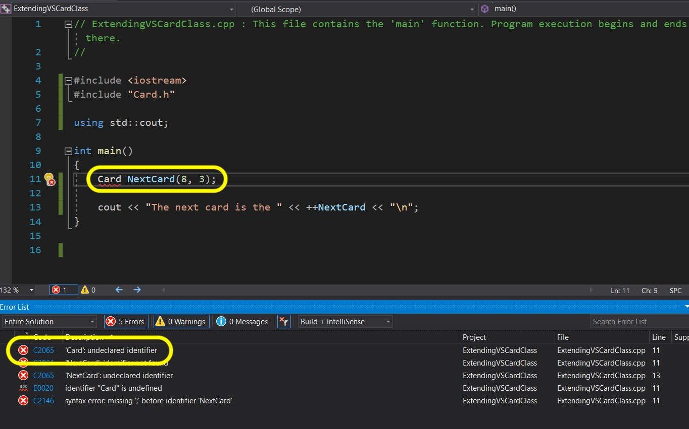  

_____ 


{:start="{{ num }}"}
{{ num }}. Now instead of wrapping the entire main function in a namespace we can just add `Deck::` in from of `Card` so that the compiler recognizes the class name we are trying to access. 

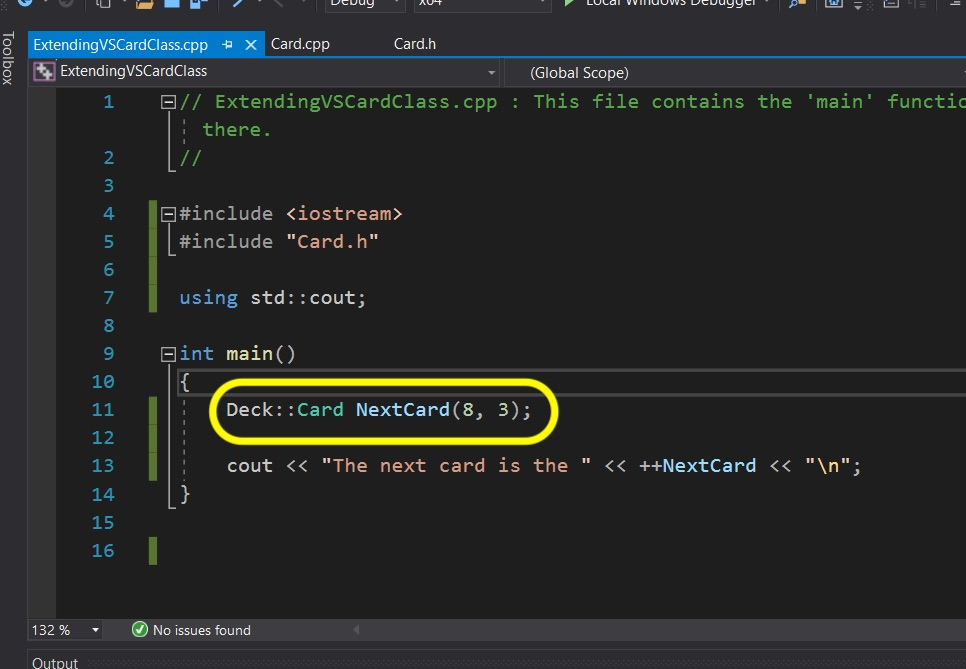  

_____ 


{:start="{{ num }}"}
{{ num }}. Now compile and fix any errors.  Run the project and you should see what we had at the end of the previous project.  We have refactored the **Card** class into its own proper **.cpp** and **.h** file.  

  

_____ 

## Structs and Classes
C++ has another data structure called a **struct**.  This is very similar to a class except that it's members are public by default.  Lets take a look to see what I mean.  Lets first look at what a class defaults to.

_____ 



{:start="{{ num }}"}
{{ num }}. Now a member in a class with no access specifiers (public, private or friend), defaults to private.  Go to the ** Card.h** and add a member called `int foo` and add it to the top of the header with no access specifier.  

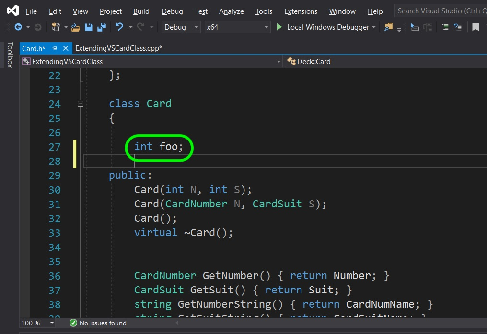  

_____ 



{:start="{{ num }}"}
{{ num }}. Now go to the **main()** function and try and access the variable.  You get a compile error. So we know that classes default members are private and NOT accessible.

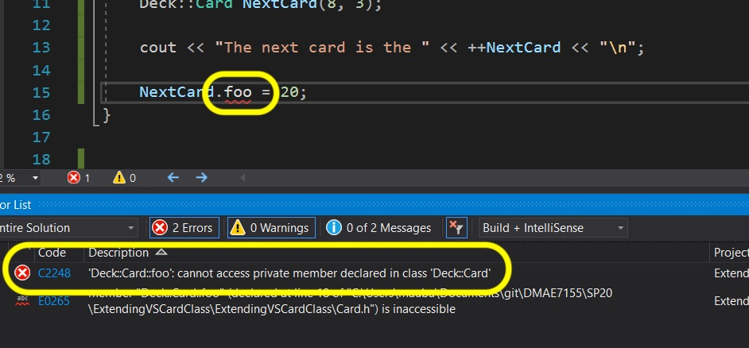  

_____ 



{:start="{{ num }}"}
{{ num }}. Delete the **Foo** variable in both the **.h** and **.cpp**.  We also have **struct** that are very much like classes.  The major difference is that it defaults to its members being public where a **class** defaults to private.  Before the **main()** function add a **Struct** called `Point` and add two members called `x` and `y`. Now in Main create an instance of this struct and try and access one of its members. Press compile and all should be fine.

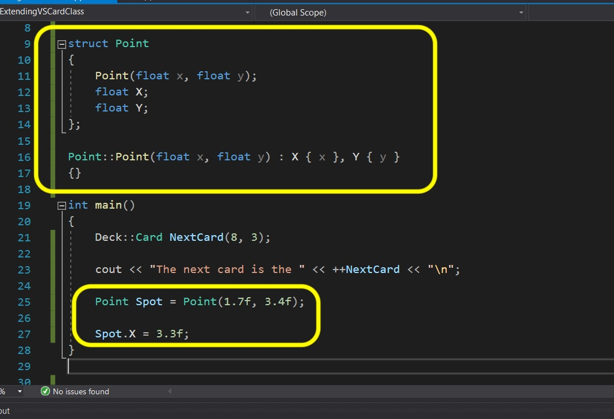  

_____ 


{:start="{{ num }}"}
{{ num }}. But we can still declare the **struct** member as private. If we do so and press compile, then we get a compile error stating that the members cannot be accessed.

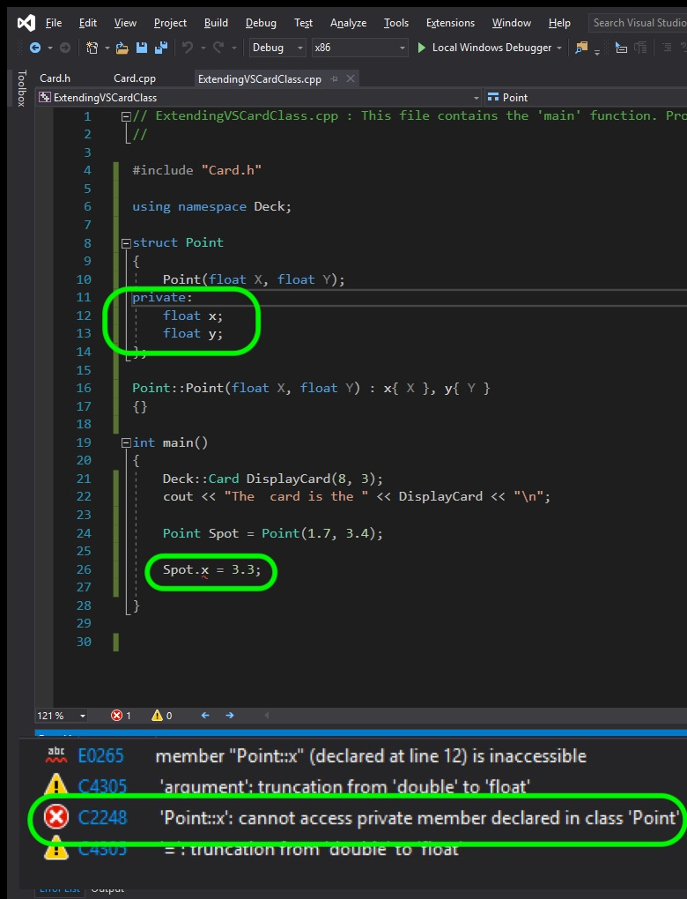  

_____ 


{:start="{{ num }}"}
{{ num }}. Comment out the structas we do not need this.  When do we use a struct and when do we use a class?  We typically use a struct when there are no invarients with the structure. An invarient is when something must be true at a given point to describe a set of values of an object.  In the **Card** class we do have an invarient.  The card numbers are limited and the card suit is limited.  In a 2-d point in a game it could be any valid **float** and there is no rule that limits what a **Point** struct can be.  It is often use for simple data strcutures in games.  In Unreal you would have used a **Struct** in their `FVector` struct (The **F** stands for floating point). That struct contains a point in 3D space with `X`, `Y` and `Z` member variables.

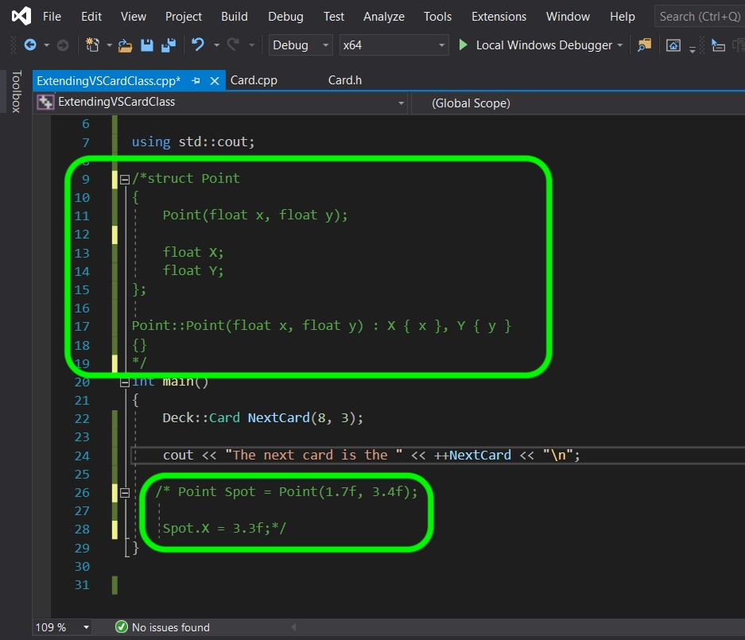  

_____ 

## Static Members of a Class
Now lets look at what a **[static](https://en.cppreference.com/w/cpp/language/static)** member of a class. 

_____ 



{:start="{{ num }}"}
{{ num }}. Lets look at a static member.  Sometimes we have a single instance of a variable (or function) that we want to be accessible to the entire class and does not instantiate with each instance of the class that is created.  A common use would be to count up how many cards exist in the current running game.  It is declared with `static` in front of the **type**.  Here we add a variable called `static int NumberOfCardsInPlay`.

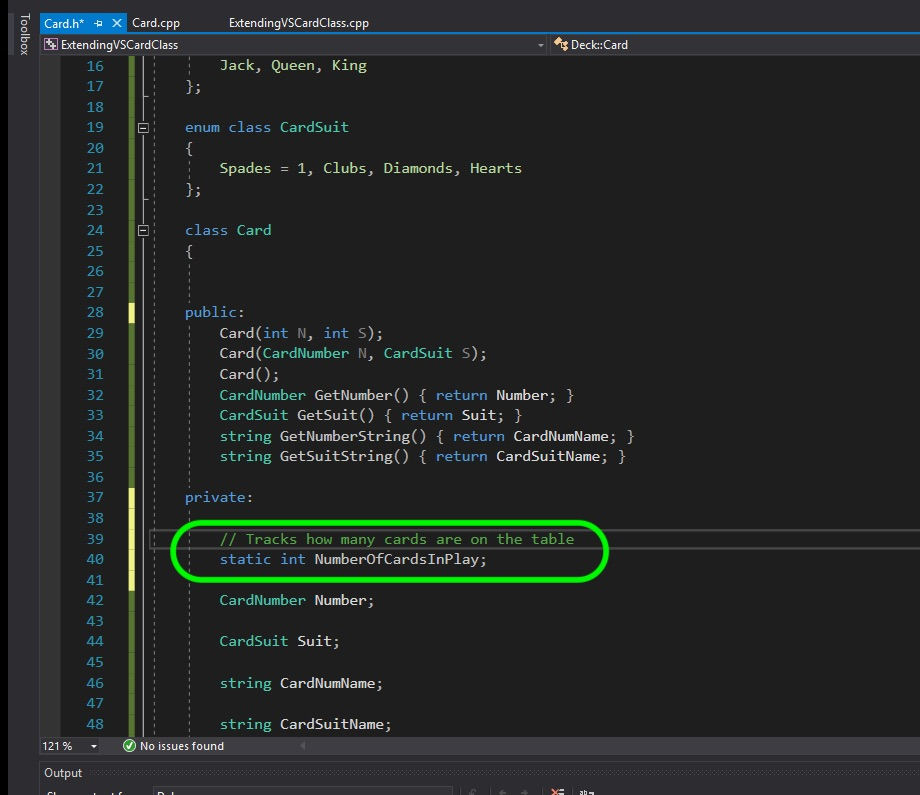  

_____ 


{:start="{{ num }}"}
{{ num }}. Before defining the static member lets show you another way of applying the Deck namespace.  We can also use `using namespace Deck;`.  Press compile and you will notice some errors.

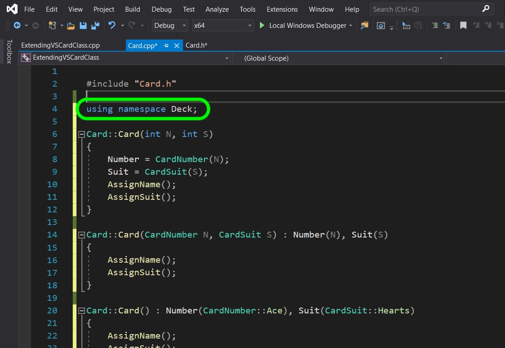  

_____ 


{:start="{{ num }}"}
{{ num }}. Now the issue is that the operator overrides can't find the class that they refer to and need the namespace appended before the **operator** in the three places we use it.

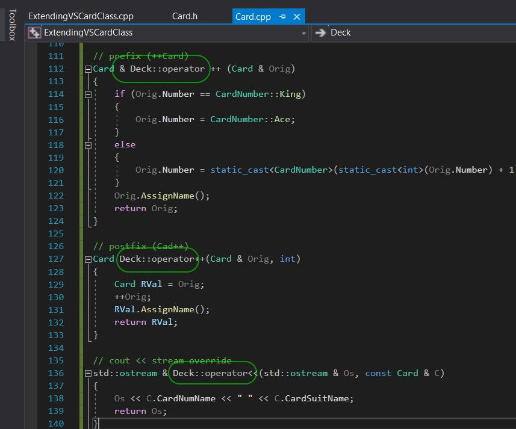  

_____ 



{:start="{{ num }}"}
{{ num }}. It is customary to define static members first. It is done on its own and in our case is `int Deck::Card::NumberOfCardsInPlay = 0;` Then you need to imcrement this static member in each constructor.  It shouldn't matter how we call the class, we should always increment the number of cards in play. Add this increment in EACH constructor override.

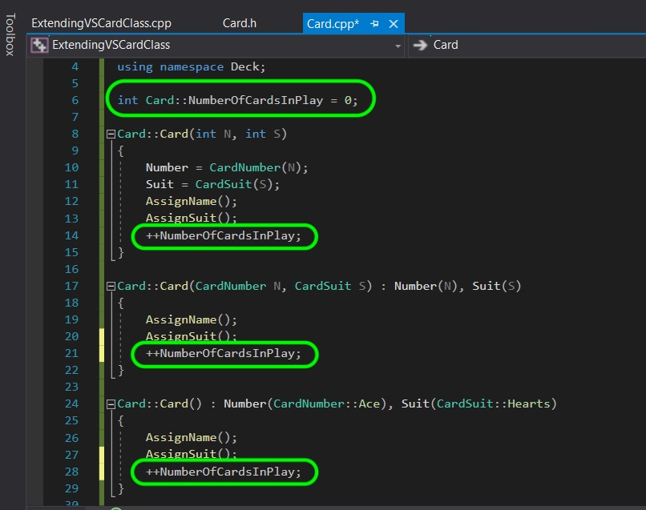  

_____ 



{:start="{{ num }}"}
{{ num }}. Now we can't access this member as it is private.  We need to create a getter for it so lets create a public function called `GetNumCardsInPlay()` and return an integer.

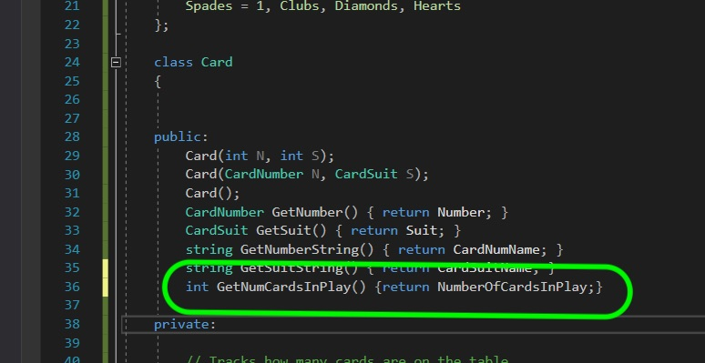  

_____ 



{:start="{{ num }}"}
{{ num }}. Go to **main()** and instantiate four cards.  Then we call the **GetNumCardsInPlay()** function to get the number of cards. Now compile and you get an error message.  Please note that when calling a class with no parameters that you do not use parenthesis ().  So instead of `Card DisplayCard1()` we use `Card DisplayCard1` instead. `Card DispalyCard1()` is not a variable but a prototype of a function called **DisplayCard1**.

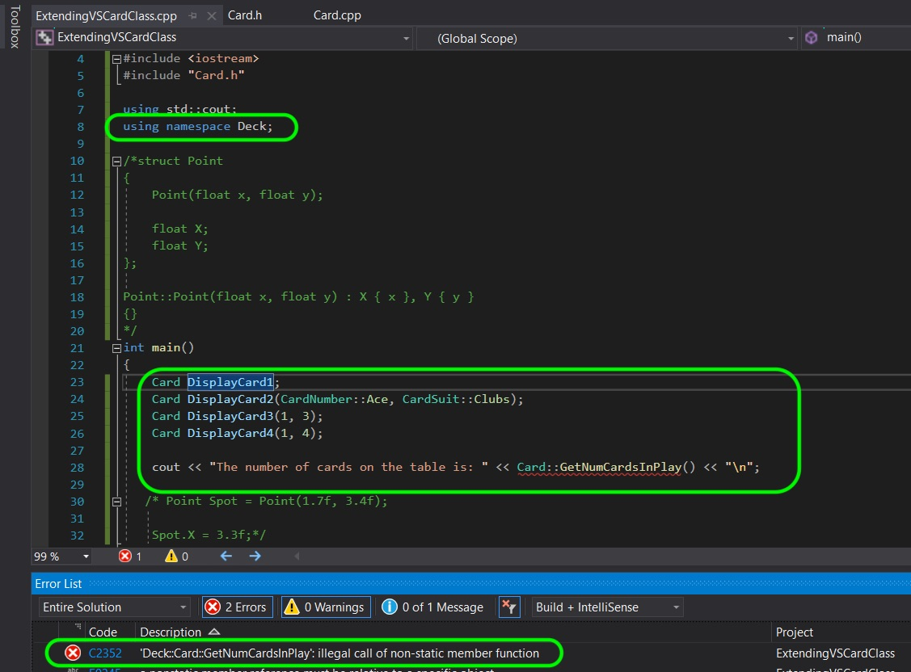  

_____ 


{:start="{{ num }}"}
{{ num }}. We cannot access a static member in a non-static function.  So go back to **Card.h** and change the function to `static int GetNumCardsInPlay()`.

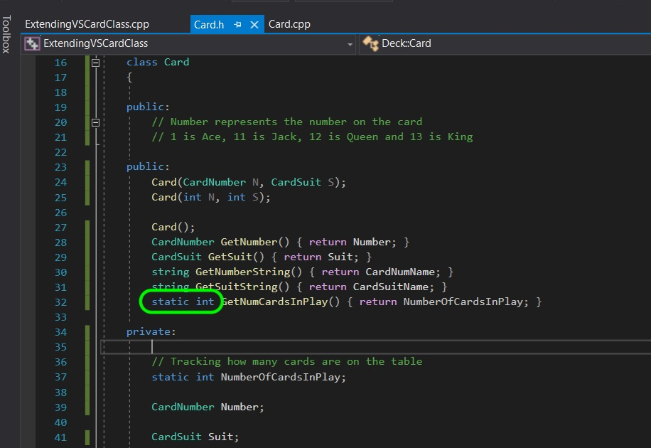  

_____ 



{:start="{{ num }}"}
{{ num }}. Compile and fix all errors then run the program.  You should see that this variable was called each time a class was created and it is correct with 4 cards in play.

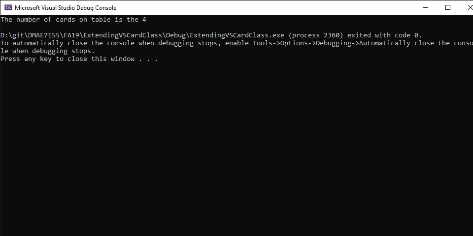  

_____ 

## Equal & Not Equal Operators
Now we have overlooked a very important issue with this class. What is we want to compare two cards and find out if they are the same suit & number?  This class does not know what its members are and what makes one card the same as the other.  For example we could have two cards with different designs on the back, but they have the same number and suit.  It is up to us to determine what makes a **Card** same or different.

_____ 


{:start="{{ num }}"}
{{ num }}. We will start by ensuring that we have two classes that are the same. 
Now lets make a copy.  But what happens when we check to see if two variables are the same and we find out that it won't compile as `==` is not found for the **Card** class. The compiler doesn't know what a card class is so it has no way of determining of one object is the same as another.

  

_____ 


{:start="{{ num }}"}
{{ num }}. Go to **Card.h** and add another declaration for the `operator ==` and make it a friend so the operator can access this private member.  Remember a friend class allows another type the ability to read your members set to **friend**.

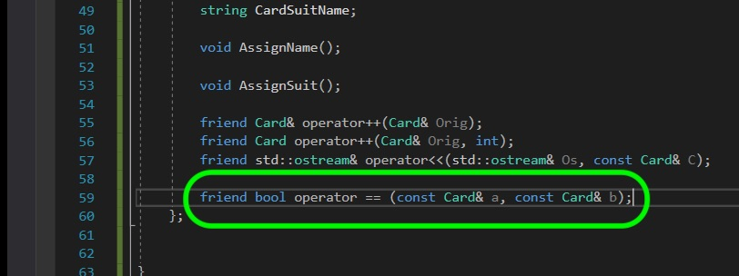  

_____ 


{:start="{{ num }}"}
{{ num }}. Now in the definition we are looking to see if both the **Number** and the **Suit** are the same.  We we check both values and return whether they are both the same.

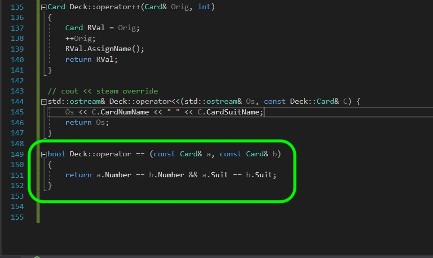  

_____ 


{:start="{{ num }}"}
{{ num }}. Comnpile and fix all the errors.  Run the game and you will see that the comparison operator works. Remember a true boolean will be `1`.

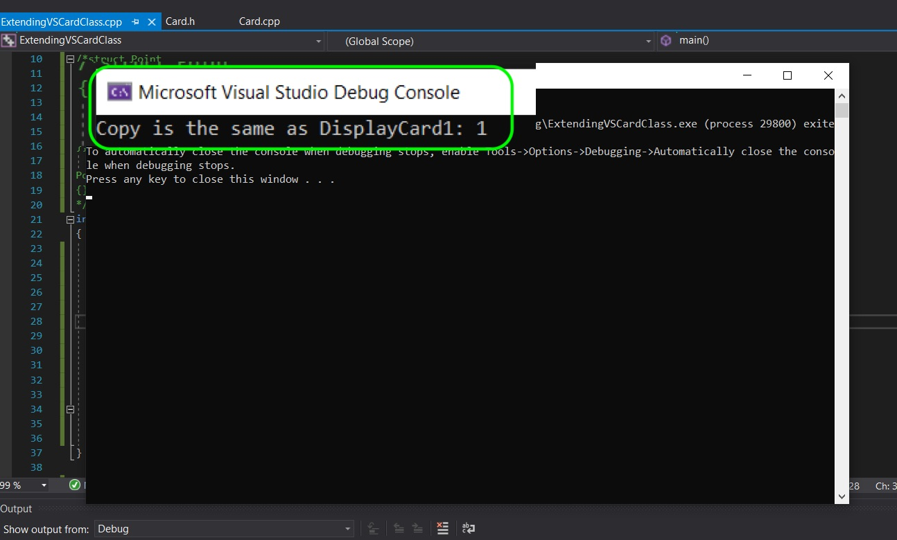  

_____ 


{:start="{{ num }}"}
{{ num }}. Now we need to declare the `!=` operator as well.  Lets declare it in **Card.h**.

  

_____ 


{:start="{{ num }}"}
{{ num }}. We define it in **Card.cpp** and all we do is call the `==` operator and invert the boolean with a `!`.

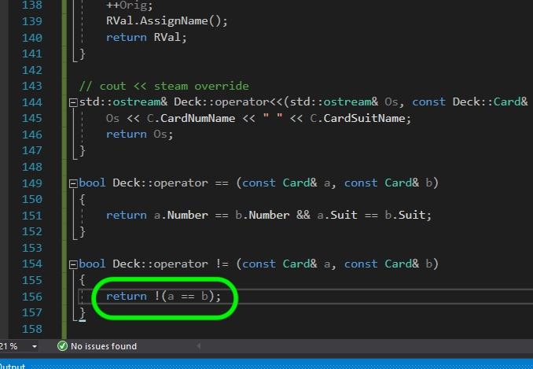  

_____ 


{:start="{{ num }}"}
{{ num }}. Now lets alter the **main()** function and test the `!=` symbol and make sure it works.

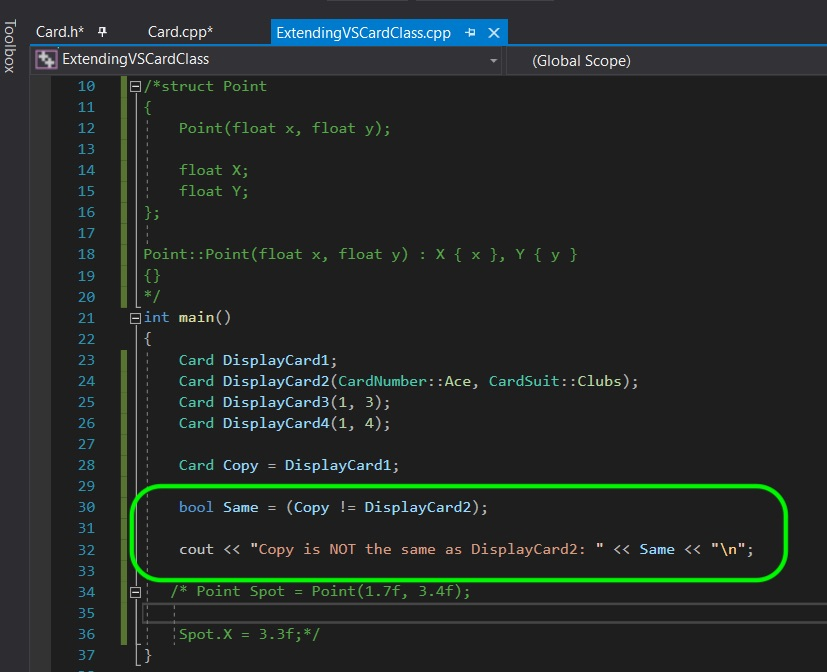  

_____ 


{:start="{{ num }}"}
{{ num }}. Compile and run the game to test it out.  Seems to work fine.  Remember a true boolean will be `1`.

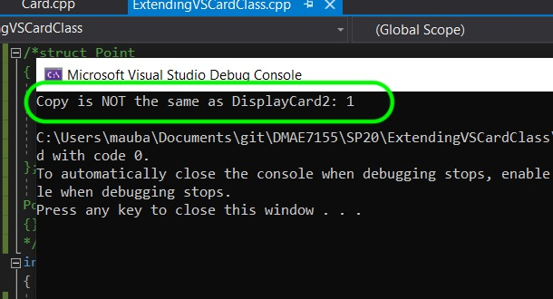  

_____ 

  

[Home](../index.html)&nbsp;&nbsp;&nbsp; [Continue ->](CPP-Cards-II-2.html)
   
   
   

