# Cards II Page 2
_____ 

## Index
_____ 

* Part I - Refactor Basic CPP Class
1. [Refactor Basic Class](CPP-Cards-II-1.html#refactor-basic-class)
2. [Add a Namespace](CPP-Cards-II-1.html#add-a-namespace)
3. [Structs and Classes](CPP-Cards-II-1.html#structs-and-classes)
4. [Static Members of a Class](CPP-Cards-II-1.html#static-members-of-a-class)
5. [Equal & Not Equal Operators](CPP-Cards-II-1.html#equal--not-equal-operators)

* Part II - Creation and Destruction CPP
1. [Detructor](CPP-Cards-II-2.html#detructor)
2. [Stack and Heap](CPP-Cards-II-2.html#stack-and-heap)
3. [More on Pointers](CPP-Cards-II-2.html#more-on-pointers)

* Part III - More on Type CPP
1. [More Const](CPP-Cards-II-3.html#more-const)
2. [Auto](CPP-Cards-II-3.html#auto)
3. [Decltype](CPP-Cards-II-4.html#decltype)

* Part IV - Applying to UE4
1. [Setting up Project and New Level](CPP-Cards-II-5.html#setting-up-project-and-new-level)
2. [Namespaces](CPP-Cards-II-5.html#namespaces)
3. [Equality in UE4 Card Class](CPP-Cards-II-5.html#equality-in-ue4-card-class)
4. [UStructs](CPP-Cards-II-6.html#ustructs)
5. [Static Members](CPP-Cards-II-7.html#static-members)
6. [Destructor](CPP-Cards-II-7.html#destructor)

_____ 

## Detructor
A [destructor](https://en.cppreference.com/w/cpp/language/destructor) is a special function that is called when the object is no longer in scope and is destroyed. The purpose is for any functionality that is required like adapting to the change or freeing up resources.

_____ 


{:start="{{ num }}"}
{{ num }}. Now what happens when a card is no longer is scope and is not in memory?  We have a problem, our static member will still show 4 cards.  There is a special function that is run when the class is destroyed.  It is the destructor special function for the class.  It is defined with the name of the class preceded by the `~` symbol.  This is the very last function to run before the object is de-allocated. It has the `virtual` keyword that we will get into later.

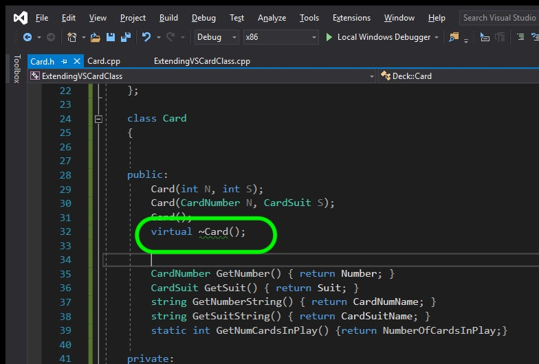  

_____ 


{:start="{{ num }}"}
{{ num }}. Now in the destructor definition all we need to do is subtract a card from the deck.

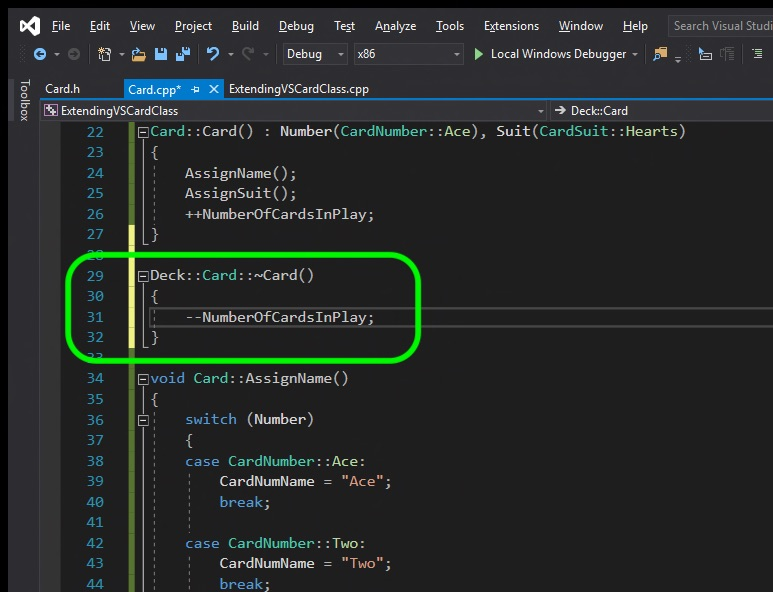  

_____ 


{:start="{{ num }}"}
{{ num }}. All we need to do is to put curly braces `{}` around two of the cards and they will go out of scope and the destructor will run after **line 26** when those two objects go out of scope.

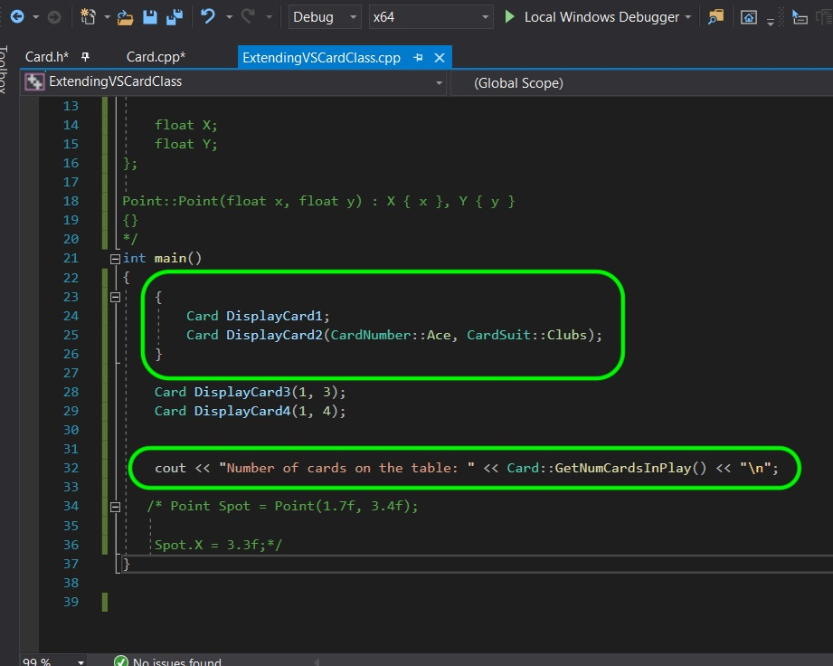  

_____ 


{:start="{{ num }}"}
{{ num }}. Compile and fix all errors.  Run the program and you will see that the destructor ran on **DisplayCard1** and **DisplayCard2** when they went out of scope (the memory is freed up when they go out of scope).  It subtracts `1` twicevand it is now only `2` cards left on the table (in memory).

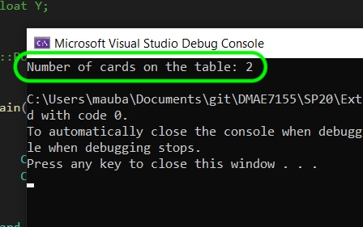  

_____ 

## Stack and Heap
We have been up to now using the same part of memory to store information.  What if we have an object that once constructed creates data that we want to use when a function returns?  Lets talk quickly about the [heap and the stack](https://www.learncpp.com/cpp-tutorial/79-the-stack-and-the-heap/).  What the call stack does is keep track of all variables and functions that are still in scope and keeps tracks of all of the function's parameters and local variables. A stack is a last-in, first-out structure with the last item pushed being and the first item to pop off. We don't need to worry about erasing memory as the next item that gets pushed onto the stack will use the memory used by the last item that is popped off.  The heap (also referred to as free store) is used for dynamic memory allocation.  This is useful for large amounts of data (like player animation, audio, models from a level).  In c++ this is done with the operator `new`. This allocates memory but it is up to you to free it.  **New** returns a pointer.  When operator `delete` is called the memory is returned to the heap and can be used again.

_____ 


{:start="{{ num }}"}
{{ num }}. Now lets create two cards and put them on the heap.  To do this we need to use the `new` expression and store the pointer to the part of memory in the heap.  It will NOT be deleted when it goes out of scope.

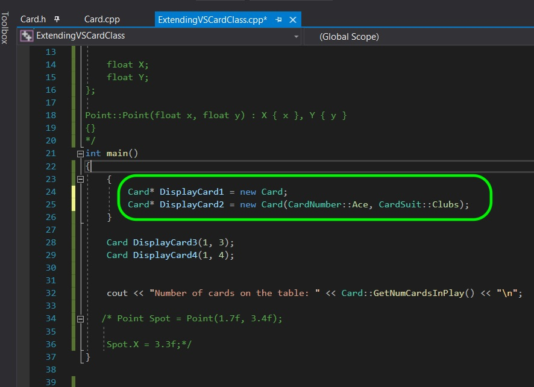  

_____ 


{:start="{{ num }}"}
{{ num }}. Compile and run and notice that even though those cards to out of scope they are still in the heap and their destructors have not run.

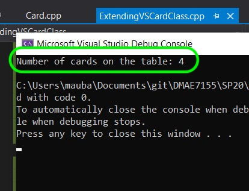  

_____ 


{:start="{{ num }}"}
{{ num }}. Now add a `delete` operator to free up this memory.  We now have a memory leak.  The variable that stored the pointer to the heap is now out of scope.  So we have the memory allocated and no way of freeing it up.  This is a common source of errors and in Unreal we want to use their garbage collection as much as we can. We need to be very careful that when we use `new` that it will delete no matter what happens next.

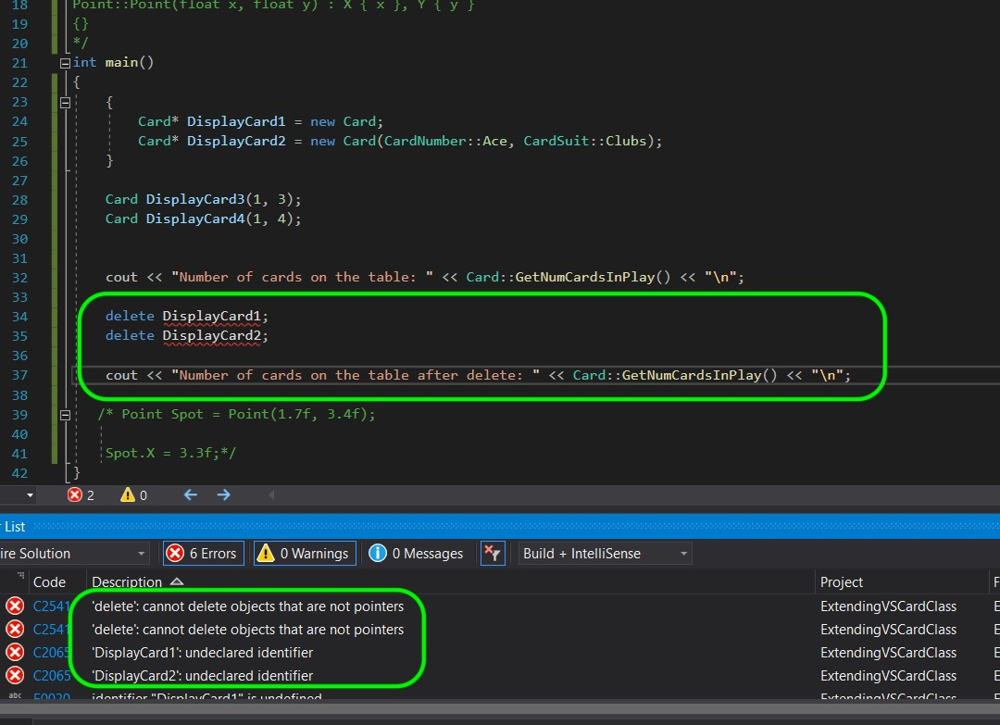  

_____ 



{:start="{{ num }}"}
{{ num }}. OK, lets put the pointer back in scope.  Now we can delete the two cards on the heap and and double check that the destructor ran.  It is far more common that we would initialize the heap in the constructor and free up the memory in the destructor, this is not a practical example.

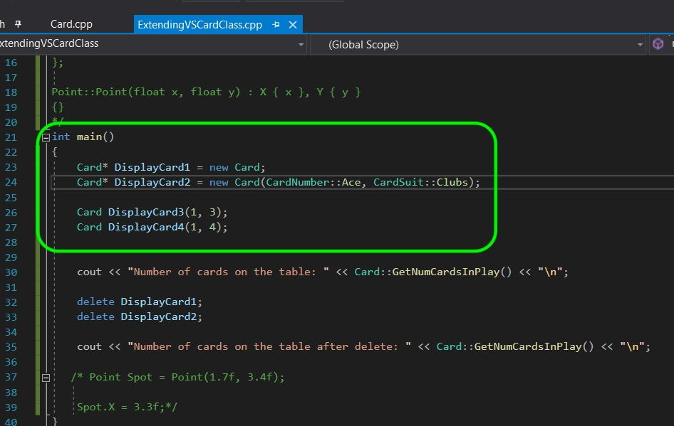  

_____ 



{:start="{{ num }}"}
{{ num }}. Now compile, fix any errors and see that the `delete` command destroys the object and frees up memory in the freestore.

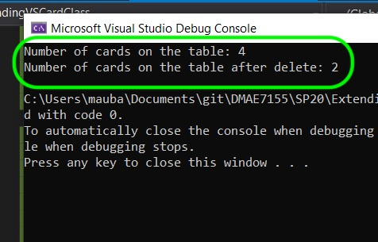  

_____ 
## More on Pointers
Let's take a deeper dive on pointers now that we can see that they are used to store memory in free store.  They are also very dangerous as they can create hard to track down memory leaks and nullptr errors.  Lets go...

_____ 



{:start="{{ num }}"}
{{ num }}. Now lets add a new project.  Right click on the VS Solution and right click and select **Add \| New Project...**.

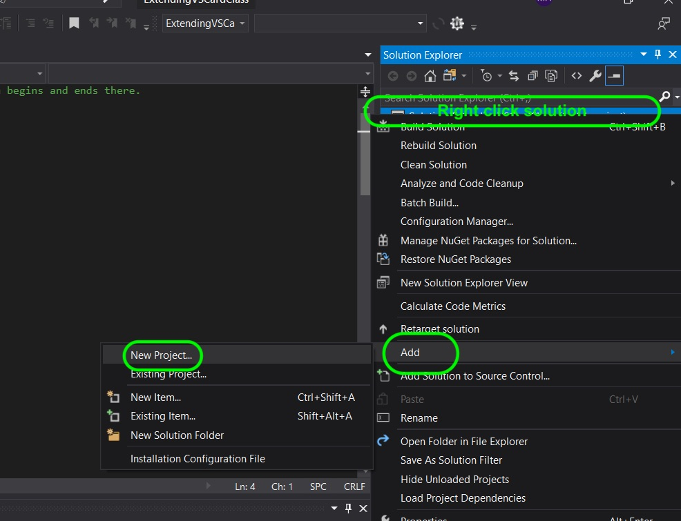  

_____ 



{:start="{{ num }}"}
{{ num }}. Call the project `Pointer-Const-ConstExpr` and then press the **Create** button.

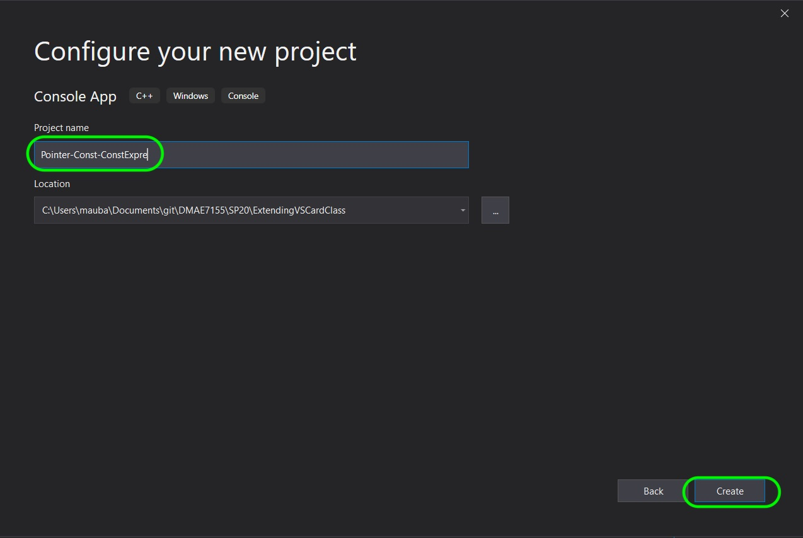  

_____ 



{:start="{{ num }}"}
{{ num }}. Right click on the new project in the **Solution Explorer** and select **Set as StartUp Project**.

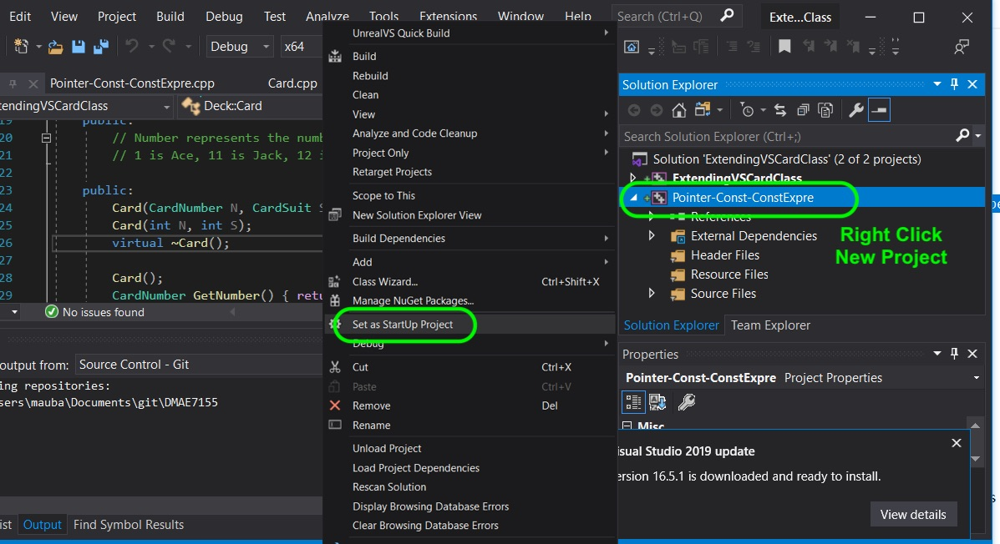  

_____ 



{:start="{{ num }}"}
{{ num }}. We do not need to assign the pointer right away.  We can instead set it to `0` which does not point to any memory and is essentially a null pointer (does not point to memory - initialized but addresses no object in memory).

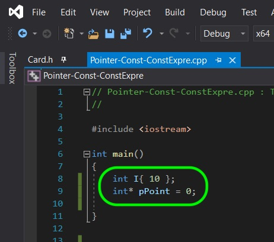  

_____ 



{:start="{{ num }}"}
{{ num }}. Try and dereference this null pointer that does not point to memory.  You will see that you have a runtime crash that says this pointer is a nullptr. To recover from a runtime error you can press the red **Stop** button to quit the program.

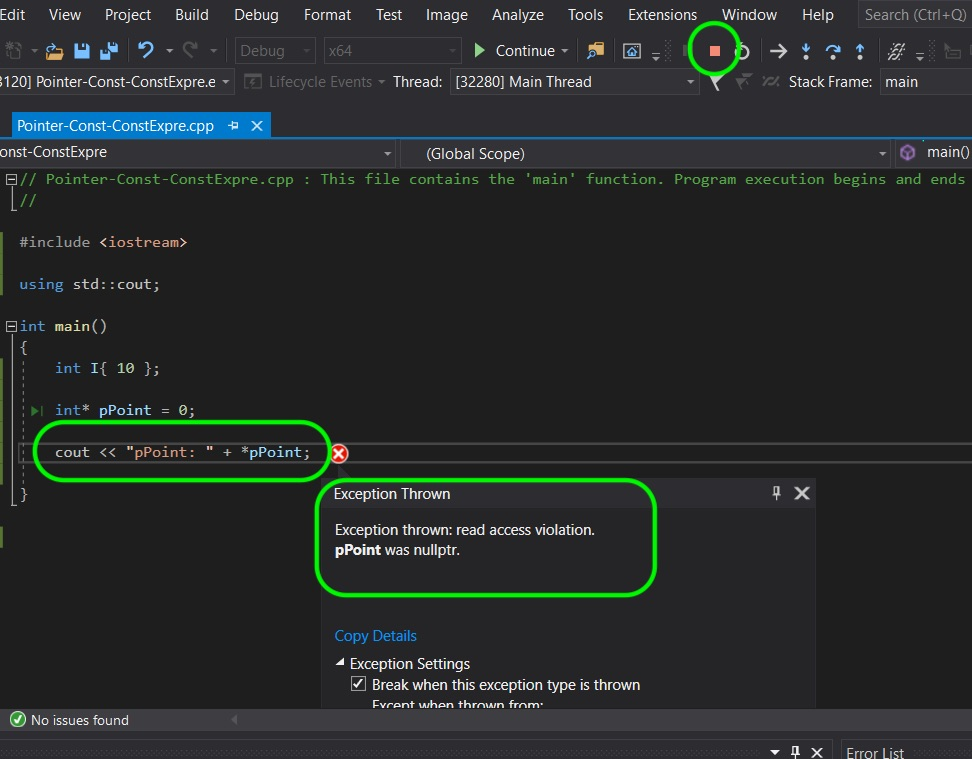  

_____ 



{:start="{{ num }}"}
{{ num }}. We can also use a macro NULL to initialize a pointer without giving it an object to point to.

  

_____ 



{:start="{{ num }}"}
{{ num }}. In C++11 they introduced `nullptr` a literal of special type.  NULL is sometimes defined as `#define NULL 0` and other times is defined as `#define NULL nulltpr`.  0 in some cases is a integral constant expression that evaultes to `0`.

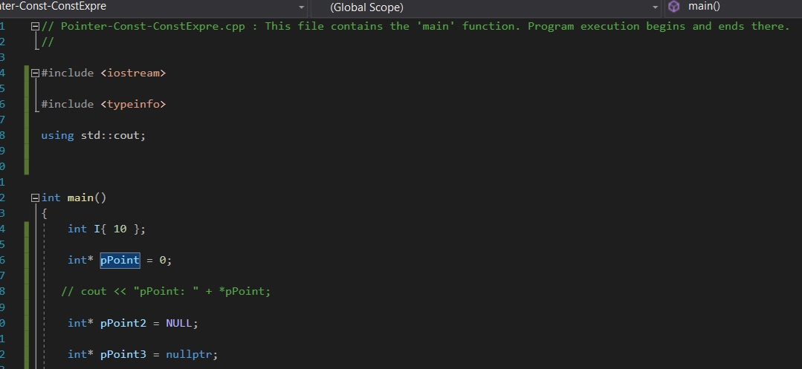  

_____ 



{:start="{{ num }}"}
{{ num }}. In this particular project lets see if these produce different types.  Lets add the `<typeinfo>` header and use `typeid(foo).name()` to find out type.  In my case they are all of type nullptr but this is not guaranteed in all environments.  It is best to use nullptr by default sot here is no potential ambiguity of type.

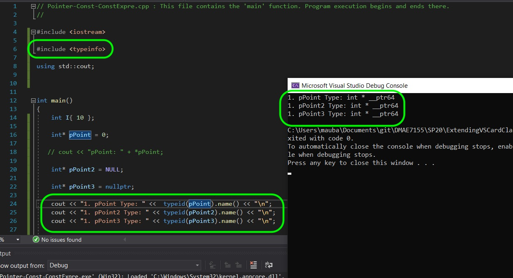  

_____ 



{:start="{{ num }}"}
{{ num }}. Now you can assign a valid memory reference to an existing integer.  Lets assign the address of `I` to `pPoint3` then derefence it.

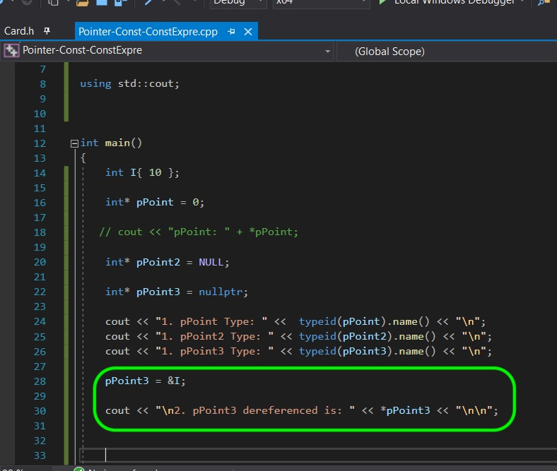  

_____ 



{:start="{{ num }}"}
{{ num }}. Compile and fix your errors and we should now see the the value of `I`.

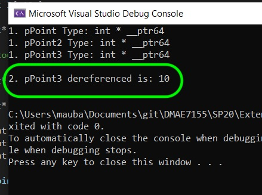  

_____ 



{:start="{{ num }}"}
{{ num }}.  Now maybe we only want to assign `pPoint3` if it is a `nullptr` and not if it has a valid memory address.  A `nullptr` resolves to false so we can use it in an if statement like so.  This will only assign the address of `I` if the pointer is not pointing to a valid memory address.

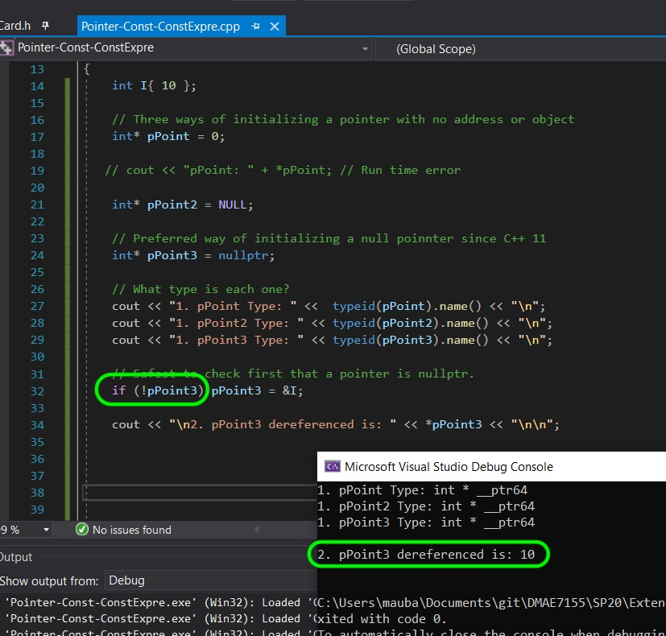  

_____ 



{:start="{{ num }}"}
{{ num }}. There is another type of pointer called a void pointer where you decide the type at runtime.  So you use `void *` to indicate this type of pointer.  It also means that the pointer can be reassigned to another type.  In the below example it starts as a reference to a **double**, then becomes a reference to an **int**.  But when you try and dereference the void pointer the program doesn't know the size of the memory address as the type is mutable.  So it gives you a compile error.

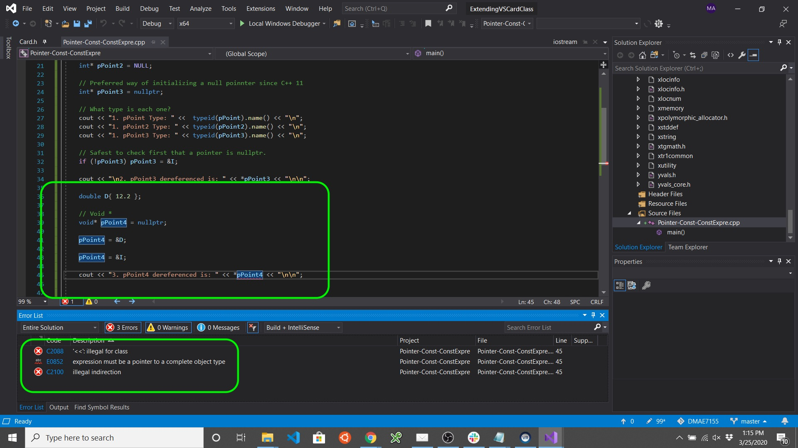  

_____ 



{:start="{{ num }}"}
{{ num }}. So you need to tell it what type of pointer this **void \*** is dereferencing.

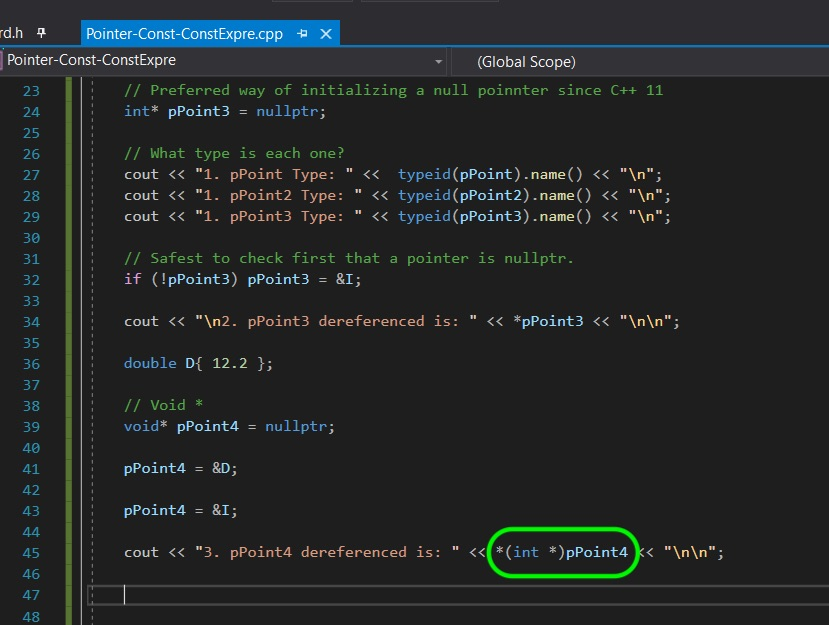  

_____ 



{:start="{{ num }}"}
{{ num }}. Compile and fix all errors.  Run it and you can see that it dereferenced it as an **int\***.

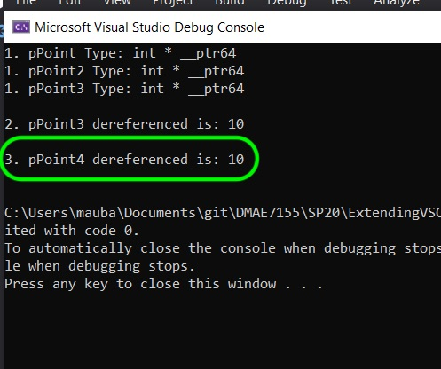  

_____ 



{:start="{{ num }}"}
{{ num }}. We can assign a **void /*** ti any type.  Below we do the same thing to a **double** but make a change to the dereference. So if you run it, the pointer dereferences correctly.

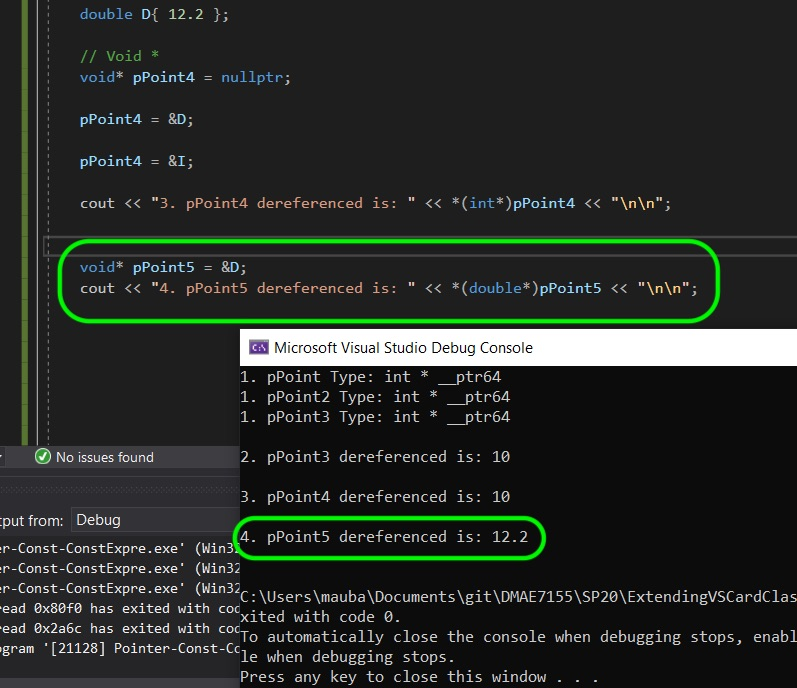  

_____ 



{:start="{{ num }}"}
{{ num }}. You have to be very careful because if you get the type wrong then it will interpret the reference value incorrectly.  It will try and read a double size of memory as an integer and you will get an invalid result but it will run.  Imagine the potential bugs!

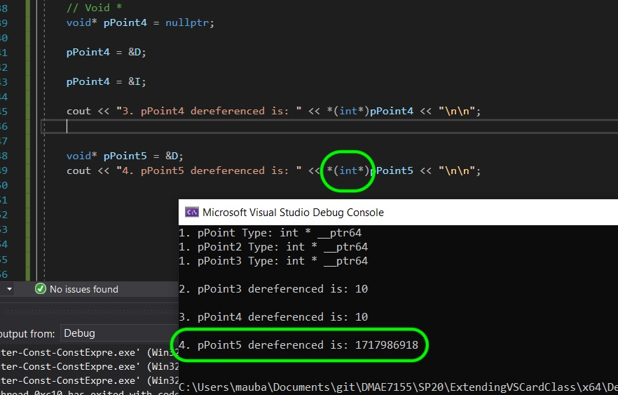  

_____ 



{:start="{{ num }}"}
{{ num }}. You can also have a pointer point to another pointer.  So you can point an `int **` pointer to pointer to an `int *` pointer.  So in this example we have a regular pointer to an **int** and a pointer to an **int** pointer.  To dereference the original **int** you need to double derefence this pointer with two `**`.  Run the below example on your own. Notice the original pointer shows a memory location of the original int, the pointer to pointer shows the memory location of the pointer (yours will be different but both these values HAVE to be different).  The final double dereference shows the original **int**.

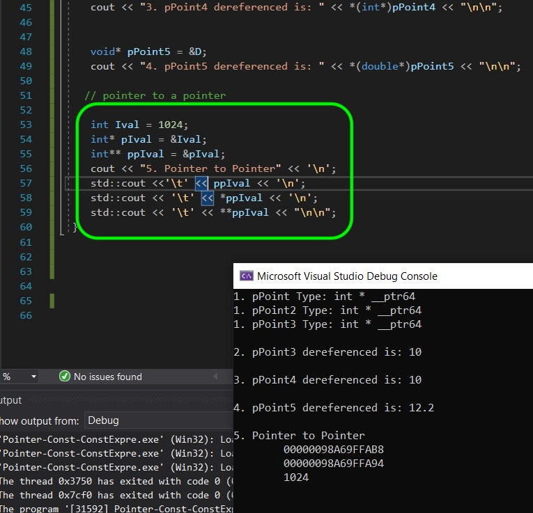  

_____ 



{:start="{{ num }}"}
{{ num }}. Now you can have a reference to a pointer as well.  This reference alias holds the pointer to the object it is pointing to.  So we need to dereference the underlying pointer to see the original **int**.  Type the below and look:

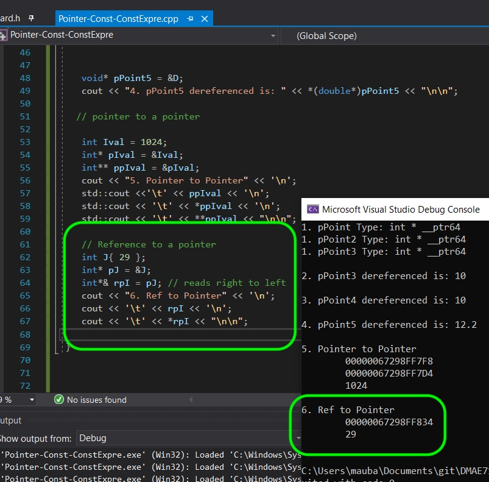  

_____ 


{:start="{{ num }}"}
{{ num }}. You cannot have a reference to a reference.  A reference is not an object so it cannot have an associated reference.  Next up we will look at `const` a bit more.

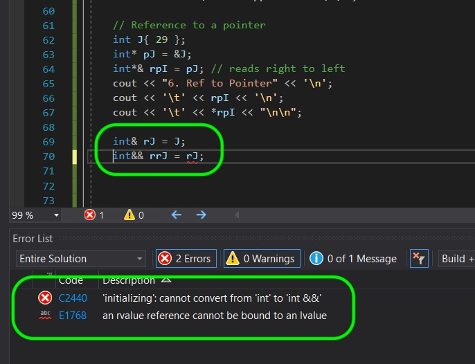  

_____ 

  

[<- Previous](CPP-Cards-II-1.html)&nbsp;&nbsp;&nbsp;[Home](../index.html)&nbsp;&nbsp;&nbsp; [Continue ->](CPP-Cards-II-3.html)
   
   
   

