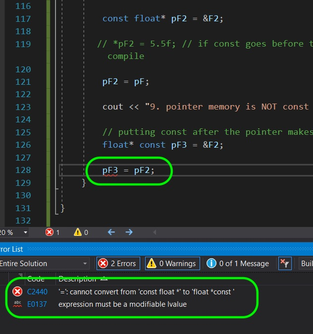
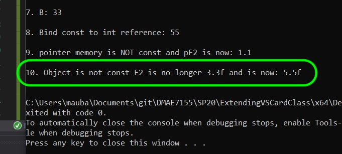

# Cards II Page 3
_____ 

## Index
_____ 

* Part I - Refactor Basic CPP Class
1. [Refactor Basic Class](CPP-Cards-II-1.html#refactor-basic-class)
2. [Add a Namespace](CPP-Cards-II-1.html#add-a-namespace)
3. [Structs and Classes](CPP-Cards-II-1.html#structs-and-classes)
4. [Static Members of a Class](CPP-Cards-II-1.html#static-members-of-a-class)
5. [Equal & Not Equal Operators](CPP-Cards-II-1.html#equal--not-equal-operators)

* Part II - Creation and Destruction CPP
1. [Detructor](CPP-Cards-II-2.html#detructor)
2. [Stack and Heap](CPP-Cards-II-2.html#stack-and-heap)
3. [More on Pointers](CPP-Cards-II-2.html#more-on-pointers)

* Part III - More on Type CPP
1. [More Const](CPP-Cards-II-3.html#more-const)
2. [Auto](CPP-Cards-II-3.html#auto)
3. [Decltype](CPP-Cards-II-4.html#decltype)

* Part IV - Applying to UE4
1. [Setting up Project and New Level](CPP-Cards-II-5.html#setting-up-project-and-new-level)
2. [Namespaces](CPP-Cards-II-5.html#namespaces)
3. [Equality in UE4 Card Class](CPP-Cards-II-5.html#equality-in-ue4-card-class)
4. [UStructs](CPP-Cards-II-6.html#ustructs)
5. [Static Members](CPP-Cards-II-7.html#static-members)
6. [Destructor](CPP-Cards-II-7.html#destructor)
_____ 

## More Const
Our default posture should be to ask yourself if this variable needs to be const or not.  Making a variable that is not supposed to change non-mutable is important.  So if you were to define Pi you would want it to be a const of `3.141592653589793`. Const gets tricky when we start using it on references and pointers and requires a bit more clarification. 

_____ 


{:start="{{ num }}"}
{{ num }}. Now comment out that final failed attempt of a reference to a reference and put all the previous work within curly braces `{ ... }` so that it goes out of scope and open up a new scope to look at more on **const**.

  

_____ 


{:start="{{ num }}"}
{{ num }}. Lets create a `const int` which will create an unmutable **integer**. You get two error messages.  The second is that an expression must be modifiable lvalue.  It is not.  But the previous lines says that **++ needs 1-value**.  You might have noticed that **lvalues** and **rvalues** come up a lot in error messages.  To oversimplify an lvalue is an expression that can be on the left side of an assignment and an rvalue can be on the right side of an assignment.  So an lvalue represents an object that occupies a location in memory.  So when we have `const int` this is creates a unmutable `lvalue`.

  

_____ 


{:start="{{ num }}"}
{{ num }}. To give you an example lets flip an lvalue and rvalue and see what happens. In this case it says that the **left operand must be a modifialbe lvalue**.  `4` is an prvalue (pure rvalue) of type integer.

  

_____ 


{:start="{{ num }}"}
{{ num }}. The `const` initializer does not copy over.  So if we make a copy of a const integer then this copy is a mutable lvalue.  Try the below:

  

_____ 


{:start="{{ num }}"}
{{ num }}. When using a const you need to assign the value and cannot leave it undefined.  Notice the error mentions `extern`.  This allows you to share a variable accross multiple files and is best to avoid to keep type safety.

  

_____ 


{:start="{{ num }}"}
{{ num }}. Comment out the un-initialized assignment and lets look at a `const int&` reference.  If we make a reference **const** then the object it is aliasing cannot be modified.  When we attempt we get an error. We see the **expression must be a modifiable lvalue** error.

  

_____ 


{:start="{{ num }}"}
{{ num }}. But the const reference means we can't affect the object through the reference but if the object it is pointing to in not const you can alter the original variable.  Lets try it and you can see that it compiles.

  

_____ 


{:start="{{ num }}"}
{{ num }}. Now a pure rvalue of type integer of say the number `55` is a constant.  So if we have a reference, it needs to be a const reference.  Remove const from the below and see what error you get.  But this is a valid assignment.

  

_____ 


{:start="{{ num }}"}
{{ num }}. Again, lets look at another example where we try and take a const rvalue and assign it to a const lvalue and non-const lvalue.  You get a compile error.

  

_____ 


{:start="{{ num }}"}
{{ num }}. This also applies to pointers. If we assign a **const float** then the pointer to that float HAS to be **const** as well.  Try assigning a non-const pointer and you get a compile error like below: 

  

_____ 


{:start="{{ num }}"}
{{ num }}. So if we have a non const variable the pointer to it can be const or not.  If we put const before the type then the object it is pointing to is constant.  That means that if we try and dereference the pointer and change it you will get a compiler error.

  

_____ 


{:start="{{ num }}"}
{{ num }}. Now the pointer's memory though is not constant in this case.  It is still mutable.  That means we can change what object this pointer is pointing to.  So we can change the object from `F2` with value of `3.3` to `F` with a value of  `1.1`.

  

_____ 


{:start="{{ num }}"}
{{ num }}. Compile, fix any errors and run the project.  You will see that we have succesfully reassigned what object this **const float** is pointing to.  We still can't dereference the pointer the know as the object that it is pointing to will keep its const-ness.

  

_____ 


{:start="{{ num }}"}
{{ num }}. So with pointers you can see there is the pointer and the object is pointing to that can be const.  To make the pointer (or memory address it is holdihng) const you place it after the pointer like **type \* const**.

  

_____ 


{:start="{{ num }}"}
{{ num }}. So in this case we cannot reassign the object this pointer `pF3` is pointing to.

  

_____ 


{:start="{{ num }}"}
{{ num }}. Now you can see since `F2` was **non-const** and the pointer to the object is not **const** so we can change the underlying value.  

  

_____ 


{:start="{{ num }}"}
{{ num }}. Compile and run and see that we have changed the underlying value of `F2`.

  

_____ 


{:start="{{ num }}"}
{{ num }}. We can make a pointer both const for the memory AND for the object it is pointing to.  In this case we have `const type * const` before the variable name making both constant.  Below we try changing the pointer unsucessfully.

  

_____ 


{:start="{{ num }}"}
{{ num }}. Even though `F2` is not const `pF4` that points to an object is const so you can't dereference and change the object.  You will get a compile error.  This is the only way to make a pointer completely const.

  

_____ 


{:start="{{ num }}"}
{{ num }}. The pointer is called a **top-level const** (type* const) and the object it is pointing to is considered a **low-level const** (const type*).  When we copy an object the **top-level consts** are ignored but the **low-level const** is never ignored. Below we were able to copy `const float* const pF4` into `pF6` even though **pF6** is missing the **top-level const**.  It should compile.

  

_____ 



{:start="{{ num }}"}
{{ num }}. Now if we try and copy into `pF7` that is missing its **low-level const** gives a compiler error.

  

_____ 


{:start="{{ num }}"}
{{ num }}. Comment out the line so that the project can compile again!

  

_____ 

## Auto
Sometimes, we might know the type of the object we are pointing to.  C++ has a keyword `auto` that will deduce the type for us.  Lets take a look

_____ 


{:start="{{ num }}"}
{{ num }}. We can deduce type at runtime.  Sometimes we don't know the exact type of the object we are trying to access.  The `auto` keyword lets the initializer determine the type.  So if we add two **integers** together the resulting variable would derive to **int**.  

  

_____ 


{:start="{{ num }}"}
{{ num }}. Prove it by running the program and seeing what type is derived by `auto`:

  

_____ 


{:start="{{ num }}"}
{{ num }}. Be careful when you are mixing types. It is not immediately obvious to what type it will resolve to with the `auto` keyword.  Try and guess what type `S` will be?

  

_____ 


{:start="{{ num }}"}
{{ num }}. Did you guess that this value is with **int** and 2 **floats** resolved to a float?  Well it did...

  

_____ 


{:start="{{ num }}"}
{{ num }}. The `auto` keyword ignores **top-level const**. Lets look at an example of what a const pointer const type looks like.

  

_____ 


{:start="{{ num }}"}
{{ num }}. When we look at the type it only shows us the **low-level const**.

  

_____ 


{:start="{{ num }}"}
{{ num }}. But notice that the **top-level** const holds as you can't reassign the pointer to another object of the same type.

  

_____ 


{:start="{{ num }}"}
{{ num }}. Now lets look at what happens with `auto`.  It does not copy the **top-level** const.  Lets let `auto pJ = pI` and see what happens.

  

_____ 


{:start="{{ num }}"}
{{ num }}. When you run it, it looks the same as before without showing the **top-level** const.

  

_____ 


{:start="{{ num }}"}
{{ num }}. Now we can reassign the pointer to another object as **auto** did not in fact copy the **top-level const**.

  

_____ 


{:start="{{ num }}"}
{{ num }}. We can also force `auto` to a **low-level const**.  If we declare `const auto` then that variable will be const regardless of the type on the right hand side of the `=` sign.  Now we have an `int K` that is not const.  But if we assign it to `const auto L` lets see if it is const?

  

_____ 


{:start="{{ num }}"}
{{ num }}. Run it, and you see that the type is deduced to **int**. [In all cases, cv-qualifiers are ignored by typeid](https://en.cppreference.com/w/cpp/language/typeid#Explanation).  This means that the constness of literals will not be shown. On the next page we will prove that it is const.

  

_____ 

  

[<- Previous](CPP-Cards-II-2.html)&nbsp;&nbsp;&nbsp;[Home](../index.html)&nbsp;&nbsp;&nbsp; [Continue ->](CPP-Cards-II-4.html)
   
   
   

