# Cards II Page 4
_____ 

## Index
_____ 

* Part I - Refactor Basic CPP Class
1. [Refactor Basic Class](CPP-Cards-II-1.html#refactor-basic-class)
2. [Add a Namespace](CPP-Cards-II-1.html#add-a-namespace)
3. [Structs and Classes](CPP-Cards-II-1.html#structs-and-classes)
4. [Static Members of a Class](CPP-Cards-II-1.html#static-members-of-a-class)
5. [Equal & Not Equal Operators](CPP-Cards-II-1.html#equal--not-equal-operators)

* Part II - Creation and Destruction CPP
1. [Detructor](CPP-Cards-II-2.html#detructor)
2. [Stack and Heap](CPP-Cards-II-2.html#stack-and-heap)
3. [More on Pointers](CPP-Cards-II-2.html#more-on-pointers)

* Part III - More on Type CPP
1. [More Const](CPP-Cards-II-3.html#more-const)
2. [Auto](CPP-Cards-II-3.html#auto)
3. [Decltype](CPP-Cards-II-4.html#decltype)

* Part IV - Applying to UE4
1. [Setting up Project and New Level](CPP-Cards-II-5.html#setting-up-project-and-new-level)
2. [Namespaces](CPP-Cards-II-5.html#namespaces)
3. [Equality in UE4 Card Class](CPP-Cards-II-5.html#equality-in-ue4-card-class)
4. [UStructs](CPP-Cards-II-6.html#ustructs)
5. [Static Members](CPP-Cards-II-7.html#static-members)
6. [Destructor](CPP-Cards-II-7.html#destructor)

_____ 

## Auto Continued
_____ 


{:start="{{ num }}"}
{{ num }}. Now try and change `L` and you will see that `const auto` forced the consteness on `L`.  You get a compile error.

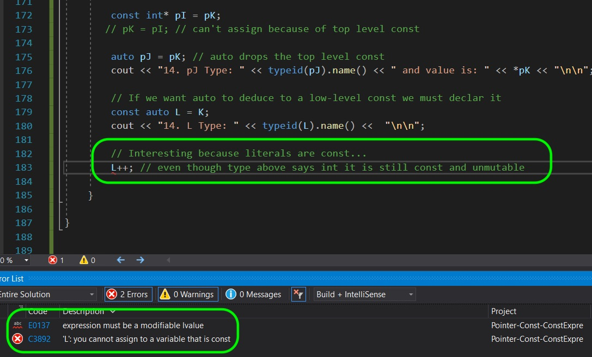  

_____ 


{:start="{{ num }}"}
{{ num }}. Now literal expressions on the right hand side are **const expressions**. We know their value at compile time and would apply to build in types (5, 1.2f, 'f').  

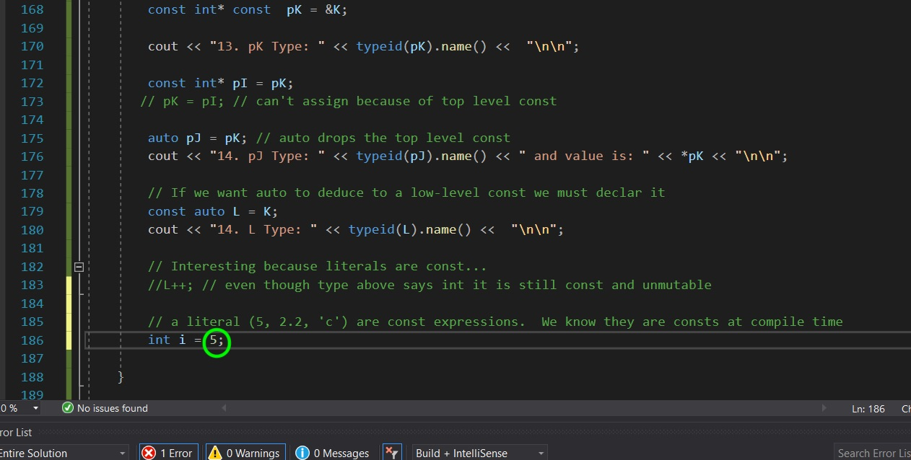  

_____ 


{:start="{{ num }}"}
{{ num }}. Lets just send the literal expression to `typeid`.

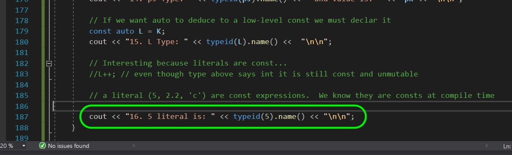  

_____ 


{:start="{{ num }}"}
{{ num }}. Run it and as before you will not see the constness of the integer using `typeid` as previously mentioned.

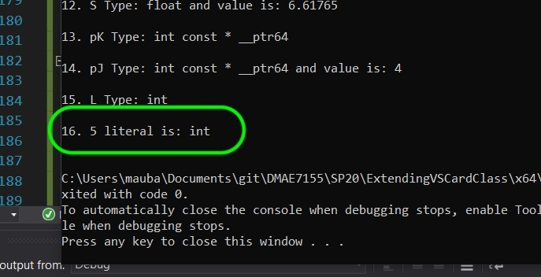  

_____ 


{:start="{{ num }}"}
{{ num }}. You can also force an `auto` to be a reference instead of a unique copy.  If you declare `auto&` before the variable name it will make it a reference to the type of the object that is derived. Try making a reference to `J` and use `auto` to derive the type.

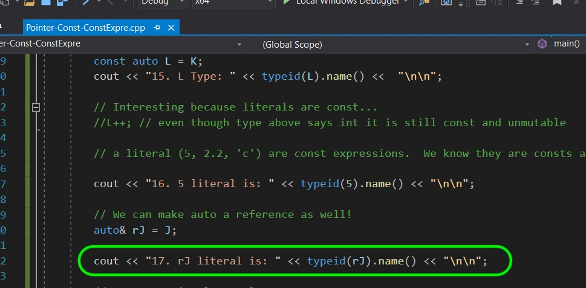  

_____ 


{:start="{{ num }}"}
{{ num }}. For a reference **typeid** returns the type of the object it is refering to, so you don't know that this variable is an alias with this method.

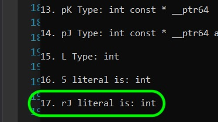  

_____ 


{:start="{{ num }}"}
{{ num }}. Prove that `rJ` is a reference.  Lets change the value to `30`.  This should change the underlying value of **int J** from `10` to `30` through reference **rJ**. 

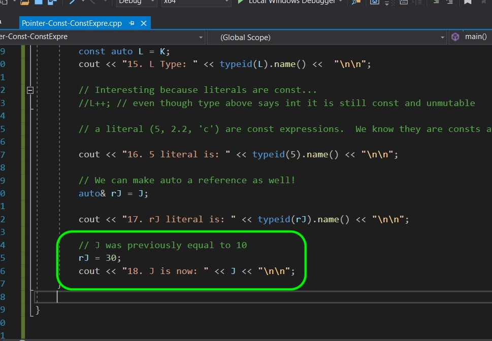  

_____ 


{:start="{{ num }}"}
{{ num }}. Run the project and you will see that the reference worked as the original value of `J` has changed through the reference whose type was derived through `auto`.

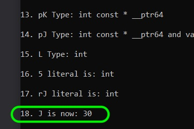  

_____ 


{:start="{{ num }}"}
{{ num }}. You can also do the same thing with pointers.  We can force the auto to be a pointer to that type by using `auto *`.

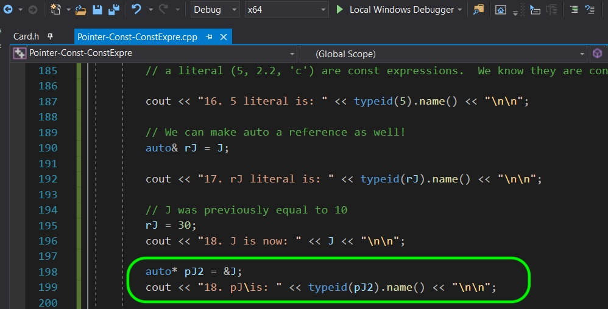  

_____ 


{:start="{{ num }}"}
{{ num }}. Run the project and you will see that it is a **int \* __ptr64**.  Please remember that this is going to change if we were on a different platform.  It might be on a 32 bit machine and thus a different type.

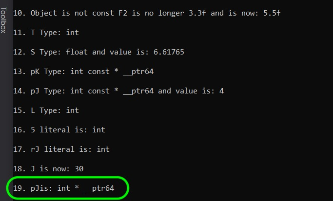  

_____ 


{:start="{{ num }}"}
{{ num }}. Lets triple check and dereference `pJ2` and set it to `50`.  Then output the original value of `J` again.

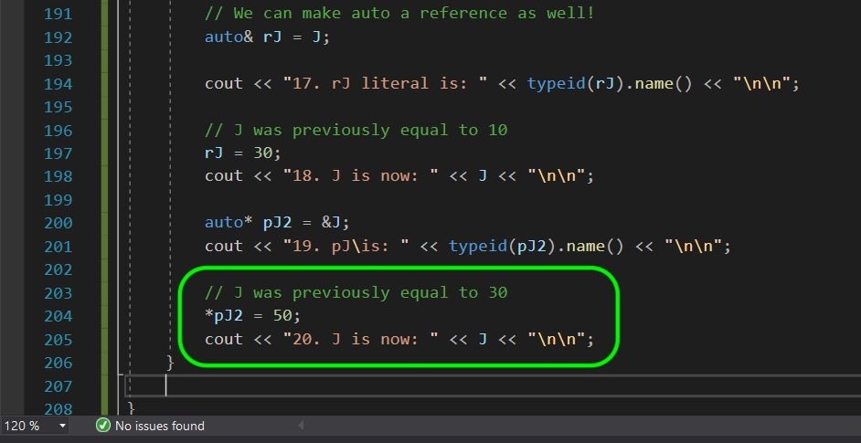  

_____ 


{:start="{{ num }}"}
{{ num }}. Run the game and notice that `J` was changed through the dereferenced point to `50`.

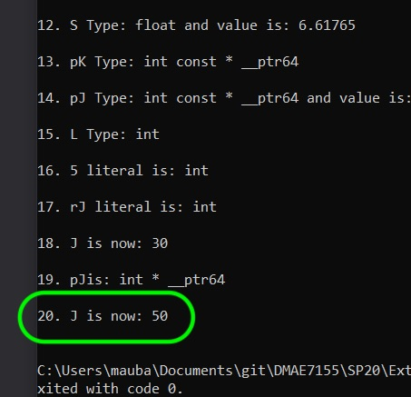  

_____ 
## Decltype
We have another way of deriving type.  We have `decltype()` that returns the type of what is passed to it.  Lets look at a few examples. 

_____ 



{:start="{{ num }}"}
{{ num }}. `decltype(type)` derives the type to what is passed within parenthesis.  In this case it derices from `K` a **const int**.  

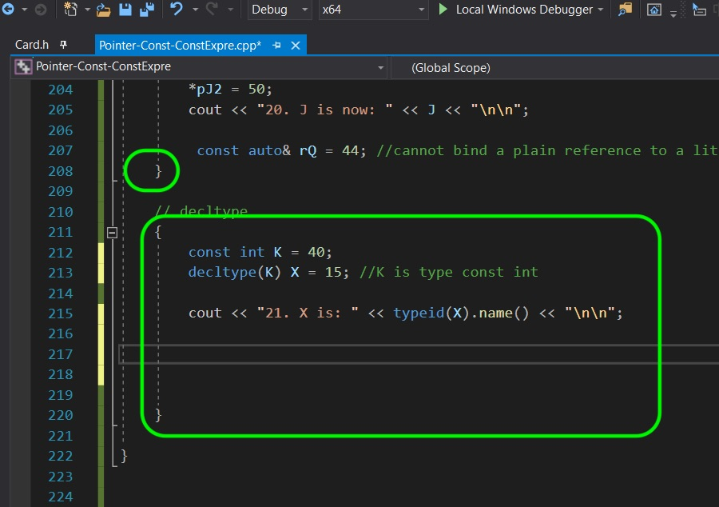  

_____ 


{:start="{{ num }}"}
{{ num }}. The type is derived by `decltype()` and is the same as `K` an **integer**. Again we can't see the const-ness.

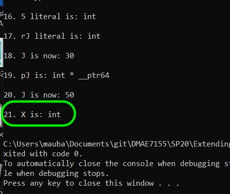  

_____ 


{:start="{{ num }}"}
{{ num }}. So to test whether the const got carried by the **decltype()** lets try and increment this new variable.  We get a compiler error saying that it is const.

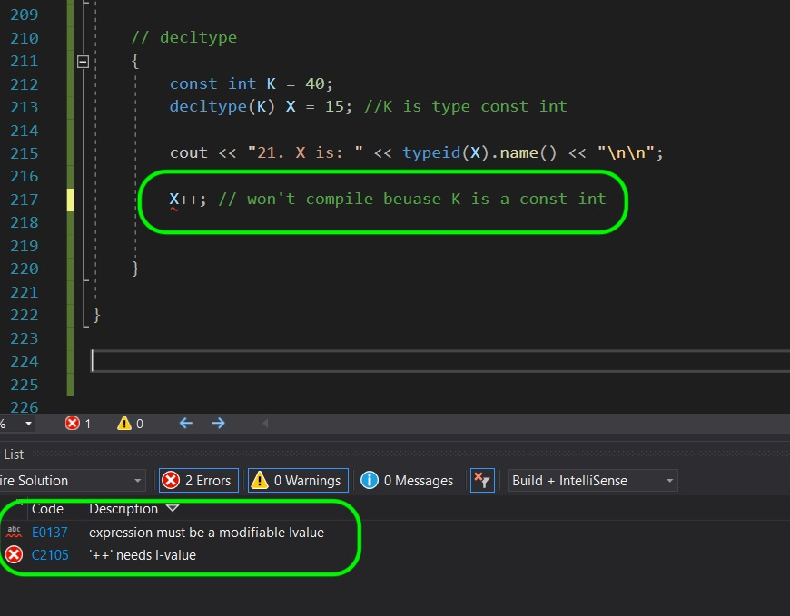  

_____ 


{:start="{{ num }}"}
{{ num }}. Now we can also pass a literal expression and have **decltype()** derive the type.  So in this case we pass a float literal to **decltype()**.  To make it trickier, we are passing it an integer.

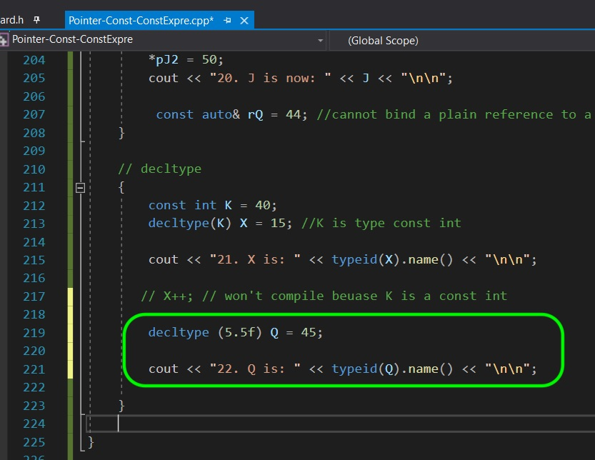  

_____ 


{:start="{{ num }}"}
{{ num }}. So sure enough it did derive the type as a **float**.

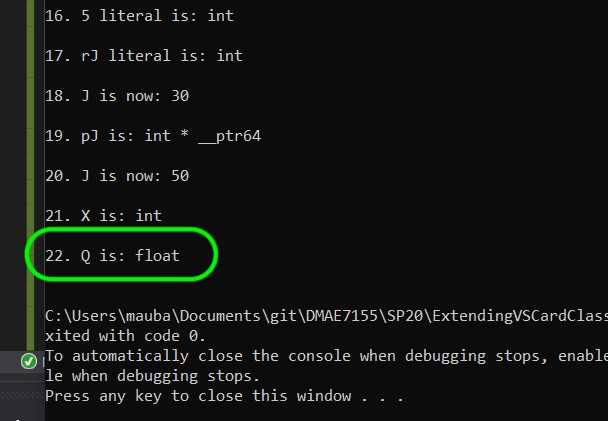  

_____ 


{:start="{{ num }}"}
{{ num }}. Now you can also use **decltype** to derive the return type of a function.  Lets create a simple function to see it in practice that returns a **char**.

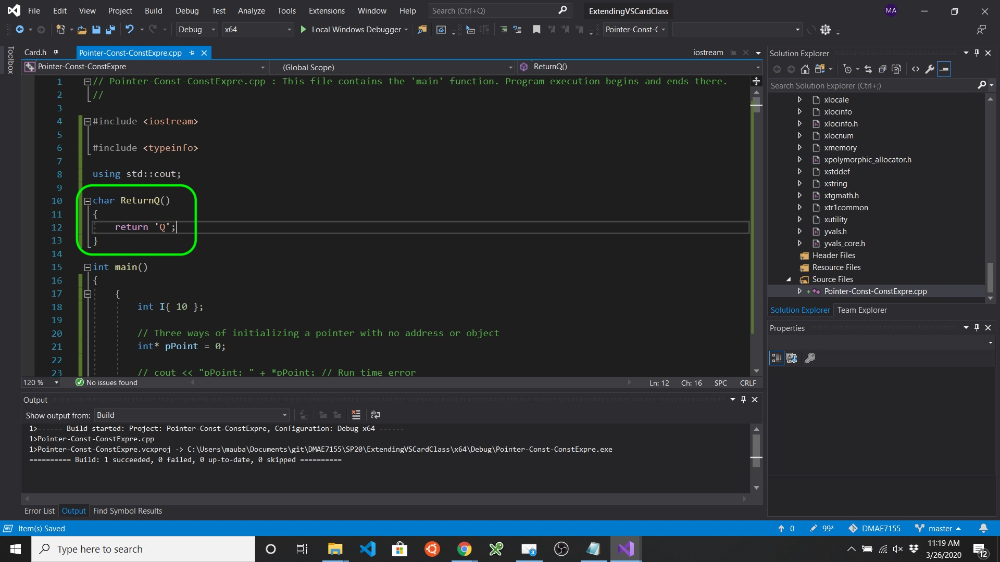  

_____ 


{:start="{{ num }}"}
{{ num }}. So now we are determining the type of `Ch` with the return type of the function `ReturnQ()`.

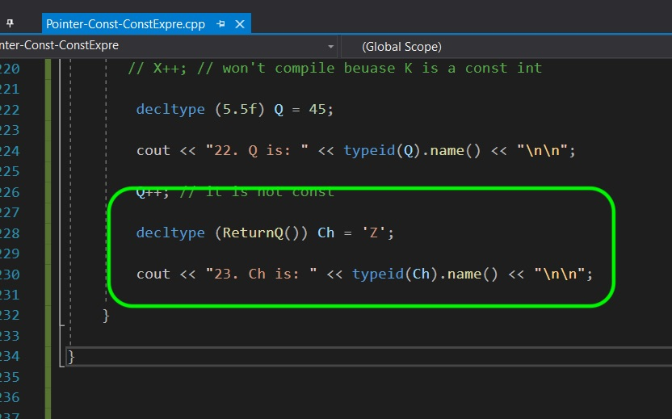  

_____ 


{:start="{{ num }}"}
{{ num }}. Now when you run it you see that it correctly derived the type **char** from the return of the function. Next up we will apply these concepts in Unreal engine in our small card class.

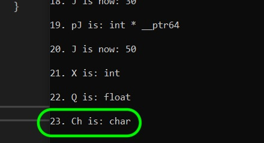  

_____ 

  

[<- Previous](CPP-Cards-II-3.html)&nbsp;&nbsp;&nbsp;[Home](../index.html)&nbsp;&nbsp;&nbsp; [Continue ->](CPP-Cards-II-5.html)
   
   
   

