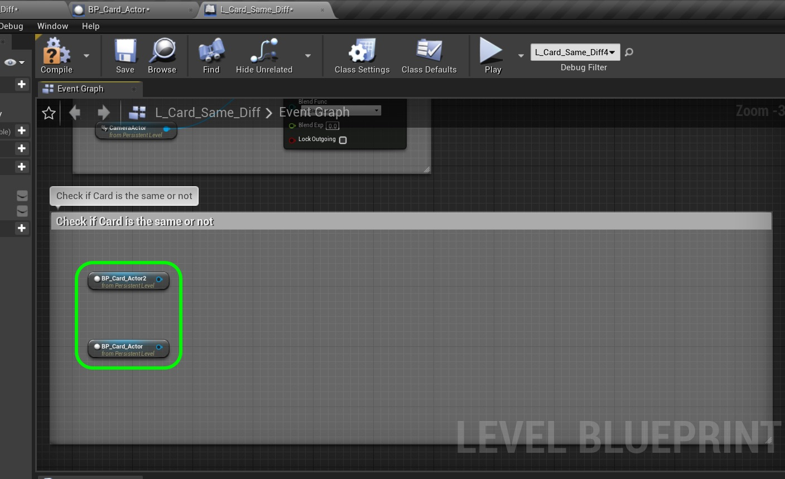
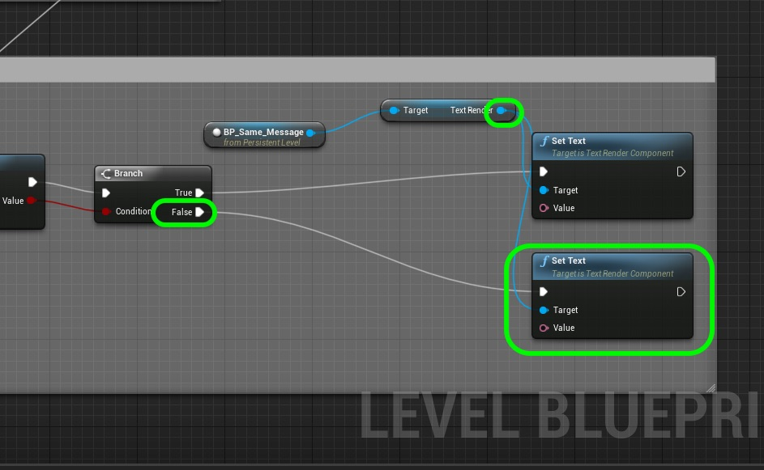

# CPP Cards II  Page 6
_____ 

## Index
_____ 

* Part I - Refactor Basic Class
1. [Refactor Basic Class](CPP-Cards-II-1.html#refactor-basic-class)
2. [Add a Namespace](CPP-Cards-II-1.html#add-a-namespace)
3. [Structs and Classes](CPP-Cards-II-1.html#structs-and-classes)
4. [Static Members of a Class](CPP-Cards-II-1.html#static-members-of-a-class)
5. [Equal & Not Equal Operators](CPP-Cards-II-1.html#equal--not-equal-operators)

* Part II - Creation and Destruction
1. [Detructor](CPP-Cards-II-2.html#detructor)
2. [Stack and Heap](CPP-Cards-II-2.html#stack-and-heap)
3. [More on Pointers](CPP-Cards-II-2.html#more-on-pointers)

* Part III - More on Type
1. [More Const](CPP-Cards-II-3.html#more-const)
2. [Auto](CPP-Cards-II-3.html#auto)
3. [Decltype](CPP-Cards-II-4.html#decltype)

* Part IV - Applying to UE4
1. [Setting up Project and New Level](CPP-Cards-II-5.html#setting-up-project-and-new-level)
2. [Namespaces](CPP-Cards-II-5.html#namespaces)
3. [Equality in UE4 Card Class](CPP-Cards-II-5.html#equality-in-ue4-card-class)
4. [UStructs](CPP-Cards-II-6.html#ustructs)
5. [Static Members](CPP-Cards-II-7.html#static-members)
6. [Destructor](CPP-Cards-II-7.html#destructor)

_____ 

## Equality in UE4 Card Class Continued
Lets dive into C++.  Please note that I had to add a method as I was not able to get a blueprint to use the C++ comparison operator.  All I could do is find out if the classes were the same or the objects were identical (self).  I could not figure out a way to trigger the comparison operator in a blueprint and found not reference online.

_____ 



{:start="{{ num }}"}
{{ num }}. Open up **Card_Actor.h** in **Visual Studio** and add to the bottom of the class. Some documentation suggests that you have to make it INLINE and use the UE4 FORCEINLINE macro.  This means that you define the overloaded operator inside the .h. Otherwise this is identical to how we implemented it in our pure C++ Card class.

  

_____ 



{:start="{{ num }}"}
{{ num }}. Now we want the user to call this function outside the instance of an object.  Since this is not comparing self with other and is comparing two others we wnat to be able to call this outside an instance of the object.  In fact, we will be calling it within the level blueprint.  By making the function static we can call it within any blueprint without having to be inside the BP_Card_Actor.  Also we will use pointers so that we can compare two objects to see if they are the same (use the operator override we just wrote) we will make both the object it is pointing to and the pointer **const**.  This tells the user of this method that we are not changing anything within this function.

  

_____ 



{:start="{{ num }}"}
{{ num }}. Now lets define this new function in **Card_Actor.cpp**. We simply return a comparison of the two classes.

  

_____ 


{:start="{{ num }}"}
{{ num }}. Go back to the game and select the first card in the **World Outliner**.

  

_____ 


{:start="{{ num }}"}
{{ num }}. Now open the **Blueprint \| Open Level Blueprint** right click on the **Event Graph** and select **Create a Reference to BP_Card_Actor**.

  

_____ 


{:start="{{ num }}"}
{{ num }}. Repeat this process for the second card and you should in the blueprint have two references, one for each card.  Add a comment box with some room to add more nodes.  Add the comment **Check if Card is the same or not**.

  

_____ 


{:start="{{ num }}"}
{{ num }}. Now since the **SameCard()** method is static you do not have to pull of either actor pin to call it.  You can just right click on the graph and type **Same Card** to pick the node.

  

_____ 


{:start="{{ num }}"}
{{ num }}. Connect the execution pin from the **Set View Target with Blend** node to **Same Card**.  Connect the two card reference pins to the input A & B pins to the method.

  

_____ 


{:start="{{ num }}"}
{{ num }}. Add a **Branch** (C++ if) node and attach it to the output of the **Same Card**. 

  

_____ 


{:start="{{ num }}"}
{{ num }}. Now we need access to the BP_Same_Message blueprint to change the text.  Go to the editor and in the **World Outliner** select **BP_Same_Message**.  Go back to the level blueprint and right click on the **Event Graph** and right click in an open area and select **Create a Reference to BP_Same_Message**.

  

_____ 


{:start="{{ num }}"}
{{ num }}. Pull from the **BP_Same_Message** pin and look for **Set Text(Text Render)** to alter the text in the component.

  

_____ 


{:start="{{ num }}"}
{{ num }}. Connect the execution pin of **Set Text** from the **True** branch.

  

_____ 


{:start="{{ num }}"}
{{ num }}. Pull off of the **TextRender** node and select another **Set Text** node and connect it to the **False** branch.

  

_____ 


{:start="{{ num }}"}
{{ num }}. Create a new **Text** Variable and call it `DiffText`.  Make it **Private**, give it a **Tooltip** of `Different Message` and a **Category** of `Message` and **Default Diff Text** of `The two cards are different`.

  

_____ 


{:start="{{ num }}"}
{{ num }}. Create a new **Text** Variable and call it `SameText`.  Make it **Private**, give it a **Tooltip** of `Same Message` and a **Category** of `Message` and **Default Diff Text** of `The two cards are the same`.

  

_____ 


{:start="{{ num }}"}
{{ num }}. Run the game and make sure that the message is correct.  It should be true if the cards are both face up or face down (or one of each).  They should be false if either only the number or suit is the same.  Check every combination to make sure this check works.

  

_____ 

## UStructs
In Unreal we have access to UStructs so that a struct can be recognized by Unreal and used in Blueprints.  Even tough not necessary we can create a card struct that contains both enumerators.  Lets do this to show how we can use UStructs in Unreal.

_____ 



{:start="{{ num }}"}
{{ num }}. Open **CardActor.h** and add after the enumerators but before the class the following new **USTRUCT**.  As with most data structures in Unreal we will use their Macro and make it accessible in blueprints (**BlueprintType**).  It will not compile unless the struct name starts with an **F** typedef.  We call the parent structures code with the **GENERATED_BODY()** Macro. We then assign two UPROPERTY's just like we do in a class (structs are practically the same).  Since a struct defaults to **public** we don't need to specifiy the keyword. This struct will consst of two enumerators an **ECardNumber** and **ECardSuit**. 

  

_____ 


{:start="{{ num }}"}
{{ num }}. Now **delete** the **Number** and **Suit** property and replace it with a single **FCard** struct property.

  

_____ 


{:start="{{ num }}"}
{{ num }}. Go down in the **.h** file to the comparison operator.  We no longer access them directly, we get to the variable through the struct.

  

_____ 


{:start="{{ num }}"}
{{ num }}. Now open the **Card_Actor.cpp** and look for the **SetCard()** definition.  You need to access **Suit** through the **FCard Card** struct.

  

_____ 


{:start="{{ num }}"}
{{ num }}. Do the same thing for the number.

  

_____ 


{:start="{{ num }}"}
{{ num }}. Now the final thing we have to fix before it will compile is the **SetCardNumSuit** method.  We need to replace the direct variables to go through the **struct**.

  

_____ 


{:start="{{ num }}"}
{{ num }}. Now go back into the game and make sure it still works.  You should notice no difference.

  

_____ 


{:start="{{ num }}"}
{{ num }}. Now since this was such a fundamental change we should load up the **L_Card_Table** level and make sure it still works as well!

  

_____ 


{:start="{{ num }}"}
{{ num }}. Lets double check that this struct can be accessed in a blueprint.  Open up **BP_Card_Actor** in Unreal and click on the eyball next to the **Add New +** button.  Select **Show Inherited Variables** so you can get access to the variables you have allowed access from the C++ class.

  

_____ 


{:start="{{ num }}"}
{{ num }}. I believe we made all of our editable cards **Card** category.  So click on it to reveal all the variables in that category.

  

_____ 


{:start="{{ num }}"}
{{ num }}. Drag **Card** variable onto the graph and select **Set Card**.

  

_____ 


{:start="{{ num }}"}
{{ num }}. Right click on the **Card** pin and select **Split Struct Pin**.  

  

_____ 


{:start="{{ num }}"}
{{ num }}. You will then see our default card struct has split into its two data members.  It is available to use in blueprints.

  

_____ 


{:start="{{ num }}"}
{{ num }}. Delete this node as we do not need to do anything with it.  Also for future reference you now can access this struct type in a variable.  You can go to the structure section and type *Card** - you can drop the **F** as the blueprints do not show these. Next up we will look at more on static members as well as constructors and destructors.

  

_____ 

  

[<- Previous](CPP-Cards-II-5.html)&nbsp;&nbsp;&nbsp;[Home](../index.html)&nbsp;&nbsp;&nbsp; [Continue ->](CPP-Cards-II-7.html)
   
   
   

