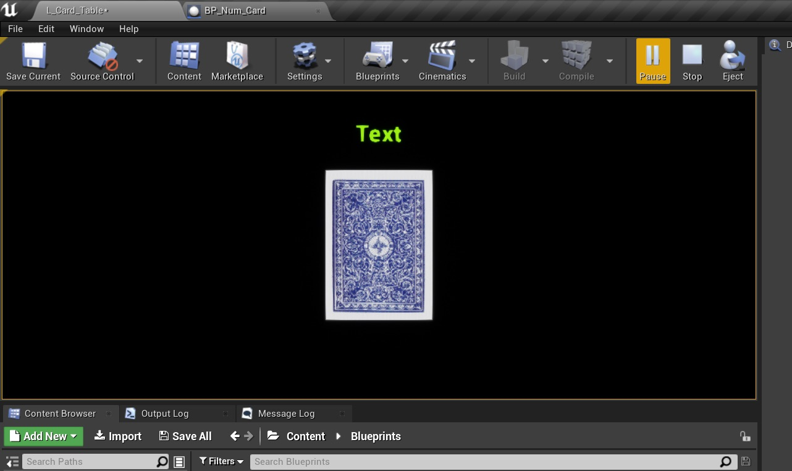

# CPP Cards II  Page 7
_____ 

## Index
_____ 

* Part I - Refactor Basic Class
1. [Refactor Basic Class](CPP-Cards-II-1.html#refactor-basic-class)
2. [Add a Namespace](CPP-Cards-II-1.html#add-a-namespace)
3. [Structs and Classes](CPP-Cards-II-1.html#structs-and-classes)
4. [Static Members of a Class](CPP-Cards-II-1.html#static-members-of-a-class)
5. [Equal & Not Equal Operators](CPP-Cards-II-1.html#equal--not-equal-operators)

* Part II - Creation and Destruction
1. [Detructor](CPP-Cards-II-2.html#detructor)
2. [Stack and Heap](CPP-Cards-II-2.html#stack-and-heap)
3. [More on Pointers](CPP-Cards-II-2.html#more-on-pointers)

* Part III - More on Type
1. [More Const](CPP-Cards-II-3.html#more-const)
2. [Auto](CPP-Cards-II-3.html#auto)
3. [Decltype](CPP-Cards-II-4.html#decltype)

* Part IV - Applying to UE4
1. [Setting up Project and New Level](CPP-Cards-II-5.html#setting-up-project-and-new-level)
2. [Namespaces](CPP-Cards-II-5.html#namespaces)
3. [Equality in UE4 Card Class](CPP-Cards-II-5.html#equality-in-ue4-card-class)
4. [UStructs](CPP-Cards-II-6.html#ustructs)
5. [Static Members](CPP-Cards-II-7.html#static-members)
6. [Destructor](CPP-Cards-II-7.html#destructor)

_____ 

## Static Members
We have created a static **UFUNCTION** with no issues, but Unreal does not allow us to use static **UPROPERTIES** so we will find a work around on how to use them. Lets recreate what we did in the C++ Card class with a `static int NumbersOfCardsInPlay`.

_____ 



{:start="{{ num }}"}
{{ num }}. Open up **Card_Actor.h** and add to the top of **private:** a **static int32**.  We will try and make it a **UPROPERTY** so we can use it in blueprints.

  

_____ 



{:start="{{ num }}"}
{{ num }}. Now go to the editor and press the **Compile** button.  You will get an error with a message and essentially you cannot make a static member with a **UPROPERTY**.  

  

_____ 



{:start="{{ num }}"}
{{ num }}. Remove the UPROPERTY() macro in the **Card_Actor.h**.

  

_____ 



{:start="{{ num }}"}
{{ num }}. Go back to the editor and press **Compile**.  You will notice that you no longer have errors.  This way we can still use static members we will just have to write a static **UFUNCTION** as a getter.

  

_____ 



{:start="{{ num }}"}
{{ num }}. Now open **Card_Actor.cpp** and add to the very top the default value of `0` for **NumCardsInPlay**. Now in the class constructor `ACard_Actor::ACard_Actor()` increment this value by one every time it is called.

  

_____ 


{:start="{{ num }}"}
{{ num }}. Now lets add a **UFUNCTION** that returns our static variable.  Please note that a static function can only include static members. We will make it **BlueprintCallable** so you can access this value in a blueprint.

  

_____ 


{:start="{{ num }}"}
{{ num }}. Add a new **BluePrint Class** and select **Actor**.  Name this new blueprint `BP_Num_Card`.

  

_____ 


{:start="{{ num }}"}
{{ num }}. Press the **Add Component** button and add a **TextRender** component. Change the **Materials** to **UnlitText**, the color to something bright, and the **Horizontal Alignment** to **Center**.

  

_____ 


{:start="{{ num }}"}
{{ num }}. Save your work in the current level.  Change levels to **L_Card_Table** as we will use this level to show how many cards we have on the table.  Drag a copy of **BP_Num_Card** into the level and rotate it into position to where the text is pointing the camera.

  

_____ 


{:start="{{ num }}"}
{{ num }}. Go back and forth until you get the text on top of the card in the room like so.

  

_____ 


{:start="{{ num }}"}
{{ num }}. Now open up **BP_Num_Card** and in the **Event Graph** right click and search for the static function we added.  If you don't find it press the **Compile** button to make sure the editor knows this function is there. To find it type in **GetNumCardsInPlay**.

  

_____ 


{:start="{{ num }}"}
{{ num }}. Attach the execution pin with **Event Begin Play** and add a **Append String** node to the graph.

  

_____ 


{:start="{{ num }}"}
{{ num }}. Plug the output of **Get Num Cards in Play** into the top of the **Append** node. That will give us the number of cards then in the **B** node type in `on table`.  Notice there is a space before **on** so that there is a space between the number and on.

  

_____ 


{:start="{{ num }}"}
{{ num }}. Drag a **Get TextRender** node onto the graph and then pull from the pin and select **Set Text**.

  

_____ 


{:start="{{ num }}"}
{{ num }}. Connect the **Return Value** pin of the **Append** node to the **Value** input pin of the **Set Text** node. Connect the execution pin to **SetText** node from **GetNumCardsInPlay** node. 

  

_____ 


{:start="{{ num }}"}
{{ num }}. Compile the game and run.  Now the thing to understand is that when you boot up the editor it runs the constructor on all the classes in the level.  So if we keep stopping and starting the number just keeps going up.  This is because the static member keeps the memory and does not get garbage collected.  So even though each time there are only 52 cards on the table, that variable keeps getting added to.

  

_____ 

## Destructor
Now this number can be fixed by implementing the destructor so when a class is destroyed that it will deduct a number from the `static int NumbersOfCardsInPlay`.

_____ 



{:start="{{ num }}"}
{{ num }}. Now go to **Projetc Settings** and put the **Editor Startup Map** back to **L_Card_Table**.

  

_____ 


{:start="{{ num }}"}
{{ num }}. Go back to **Card_Actor.h** and after the constructor add a **Destructor** `virtual ~ACardActor();`.

  

_____ 


{:start="{{ num }}"}
{{ num }}. Go to the **Card_Actor.cpp** and define the destructor where all we do is decrement **NumCardsInPlay**.

  

_____ 


{:start="{{ num }}"}
{{ num }}. Run the  destroygame and you can see the destructor is run.  Strangely I have 56 cards showing up when I know I am dealing 52 cards.  Lets put a pin in this and will address this later.  I want to first destroy a card in game and see their garbage collection running.

  

_____ 


{:start="{{ num }}"}
{{ num }}. Lets add the ability to right click and remove cards from the table.  This will show us when the destructor runs and how Unreal is doing its garbage collection.  Open up **BP_PlayerController** and open **Click Event Keys**.  Press the **+** button and add a **Right Mouse Button**.

  

_____ 


{:start="{{ num }}"}
{{ num }}. Reopen **BP_Num_Card** and add a new Function called `UpdateText`.

  

_____ 


{:start="{{ num }}"}
{{ num }}. Go to the **Event Graph** and lets move all the nodes to the function.  Select all nodes except for **Begin Play** and copy and cut all the nodes.

  

_____ 


{:start="{{ num }}"}
{{ num }}. Got to the **Update Text** function and paste the nodes there.  Connect the execution node to the function node.

  

_____ 


{:start="{{ num }}"}
{{ num }}. Go back to the **Event Graph** and add to the **Begin Play** a call to the new function **Update Text**.

  

_____ 


{:start="{{ num }}"}
{{ num }}. We need some way of accessing this function in the **BP_Num_Card** function from the card when it is right clicked.  Open up **BP_Deck_Of_Cards** and add a new Variable called `NumCardTextRef` and make it type **BP_Num_Card** object reference (the blue ball).

  

_____ 


{:start="{{ num }}"}
{{ num }}. Do the same thing in **BP_Card_Actor** and add a **BP_Num_Card** object reference Variable called `NumCardTextRef`.

  

_____ 


{:start="{{ num }}"}
{{ num }}. Go back to **BP_Deck_Of_Cards** and add a **Get All Actors of Class** node.  This node should not be used in an update loop as it is expensive but is fine once at the begining of the game. Set the class to `BP_Num_Card` class. This will search for all instances of this class in the level (which there is only one).

  

_____ 


{:start="{{ num }}"}
{{ num }}. Now connect the execution pin to **Get All Actors Of Class).  Pull off of the array exit pin and select a **Get** node.  This will get us access into the array.  Since there is only one item we will access item `0` which is defult.  Then add a **Set New Card Text Ref** node and attafch it to the **Get** node.

  

_____ 


{:start="{{ num }}"}
{{ num }}. Pull off of the **Create Actor** node and select **Set Num Card Text Ref** in each card to give it a reference.

  

_____ 


{:start="{{ num }}"}
{{ num }}. Connect the **Set New Card Textz Ref** to the **Set** node. Now all cards have access to the text blueprint and can call its function.  We will do that on the next page.

  

_____ 

  

[<- Previous](CPP-Cards-II-6.html)&nbsp;&nbsp;&nbsp;[Home](../index.html)&nbsp;&nbsp;&nbsp; [Continue ->](CPP-Cards-II-8.html)
   
   
   

