# CPP Cards II  Page 8
_____ 

## Index
_____ 

* Part I - Refactor Basic Class
1. [Refactor Basic Class](CPP-Cards-II-1.html#refactor-basic-class)
2. [Add a Namespace](CPP-Cards-II-1.html#add-a-namespace)
3. [Structs and Classes](CPP-Cards-II-1.html#structs-and-classes)
4. [Static Members of a Class](CPP-Cards-II-1.html#static-members-of-a-class)
5. [Equal & Not Equal Operators](CPP-Cards-II-1.html#equal--not-equal-operators)

* Part II - Creation and Destruction
1. [Detructor](CPP-Cards-II-2.html#detructor)
2. [Stack and Heap](CPP-Cards-II-2.html#stack-and-heap)
3. [More on Pointers](CPP-Cards-II-2.html#more-on-pointers)

* Part III - More on Type
1. [More Const](CPP-Cards-II-3.html#more-const)
2. [Auto](CPP-Cards-II-3.html#auto)
3. [Decltype](CPP-Cards-II-4.html#decltype)

* Part IV - Applying to UE4
1. [Setting up Project and New Level](CPP-Cards-II-5.html#setting-up-project-and-new-level)
2. [Namespaces](CPP-Cards-II-5.html#namespaces)
3. [Equality in UE4 Card Class](CPP-Cards-II-5.html#equality-in-ue4-card-class)
4. [UStructs](CPP-Cards-II-6.html#ustructs)
5. [Static Members](CPP-Cards-II-7.html#static-members)
6. [Destructor](CPP-Cards-II-7.html#destructor)

_____ 

## Destructor Continued

_____ 



{:start="{{ num }}"}
{{ num }}. When the mouse button is pressed in **BP_Card_Actor** we want to call this function we created to update the text in the display. Drag a **Get New Card Text Ref** and pull of the pin and add the **Update Text** function node.

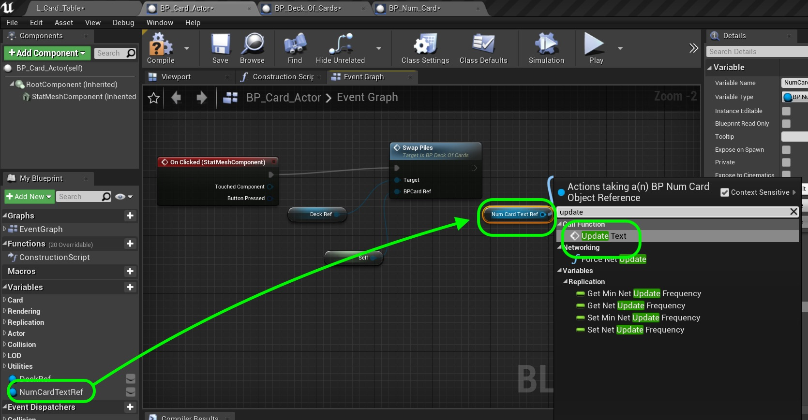  

_____ 



{:start="{{ num }}"}
{{ num }}. Connect the execution pin.  Now we need to differentiate between a left button and right button press next.

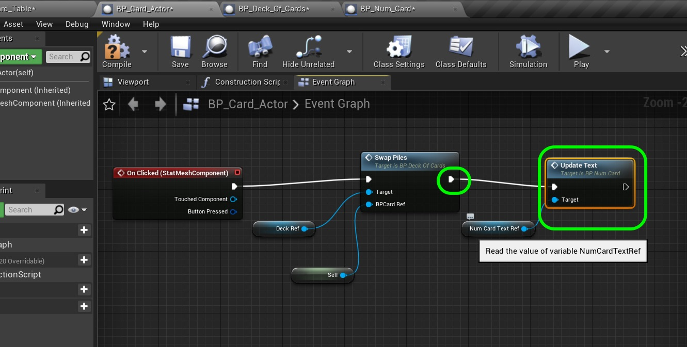  

_____ 



{:start="{{ num }}"}
{{ num }}. The **Button Pressed** node on the **On Clicked** event holds a structure of enumerators with which key was pressed.  Pull off of this pin and enter **==** to find **Equal(Key)**. 

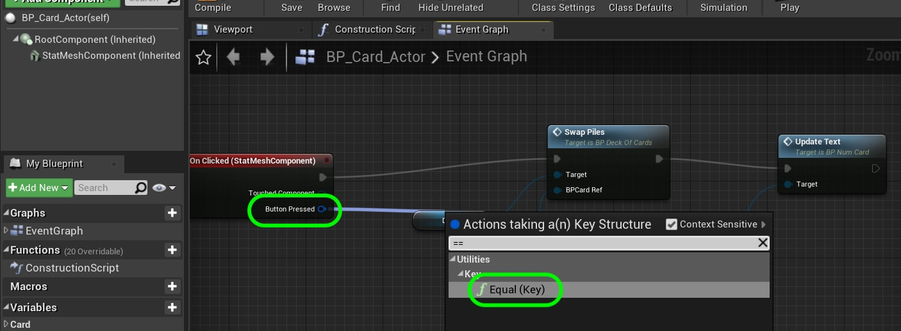  

_____ 



{:start="{{ num }}"}
{{ num }}. Now in the drop down menu select the **Mouse \| Left Mouse Button** variable.

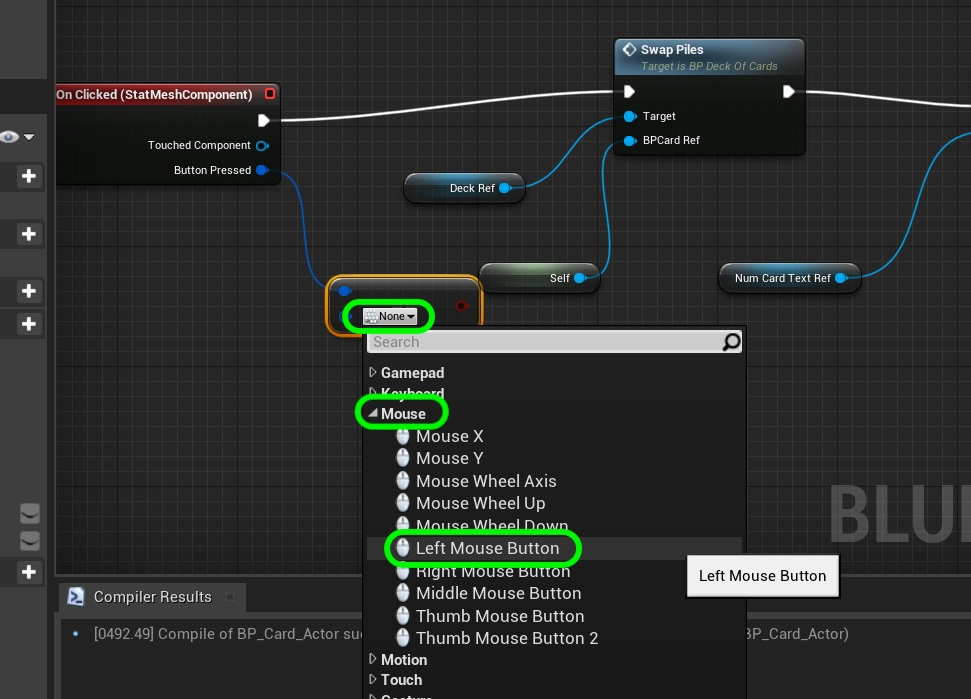  

_____ 



{:start="{{ num }}"}
{{ num }}. Pull off of the **==** node and select a **Branch.  Send the **True** execution node to **Swap Piles**. This gets us back to where we were before but only when the left mouse button is pressed.  

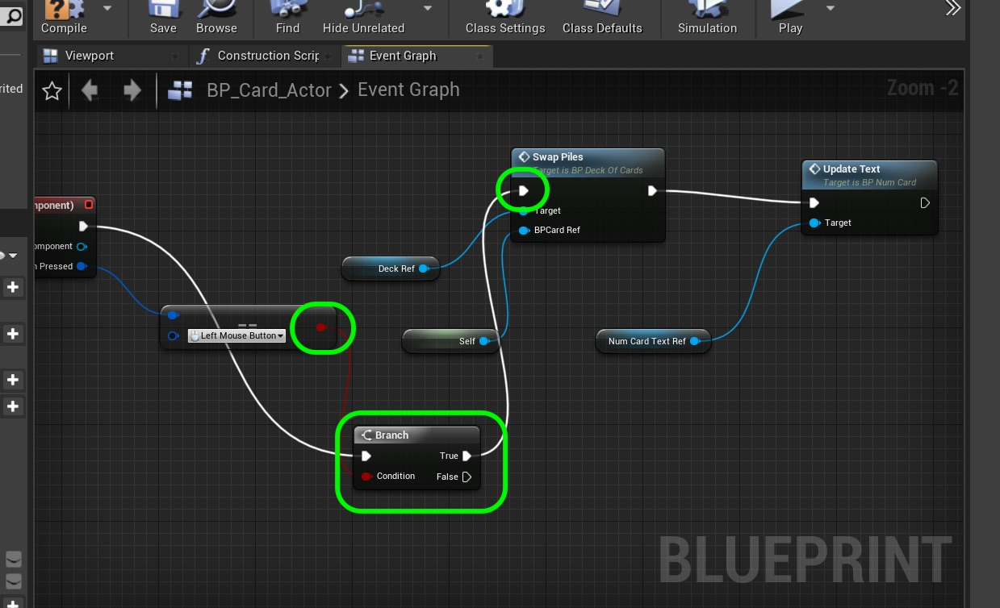  

_____ 



{:start="{{ num }}"}
{{ num }}. If the left mouse button fails add another **Branch** coming from the **False** execution pin and check to see if the **Right Mouse Button** is pressed.  If so then go to **Destroy Actor** wich cues the object for deletion.  UE4 handles the garbage collection and we will get a sense of it shortly.  At the very end update the text so it displays the new number of cards on the table.

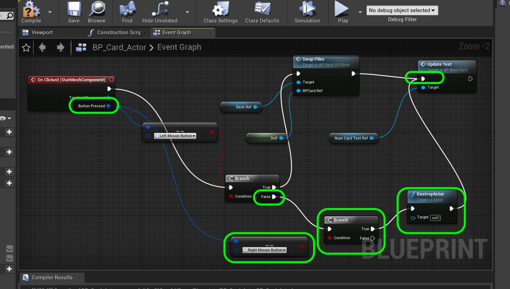  

_____ 



{:start="{{ num }}"}
{{ num }}. Now compile and run the game.  You will notice that the destructor takes a LONG time to run.  The engine handles deleting the objects and doing its own garbage collection.  We can see that this is not a good place to adjust our number of cards as the card is no longer on the play surface and is gone from the game - but still in free store memory.

  

_____ 



{:start="{{ num }}"}
{{ num }}. Lets look at the [actor lifecycle](https://docs.unrealengine.com/en-US/Programming/UnrealArchitecture/Actors/ActorLifecycle/index.html) in UE4.  We have used the **On Construction** for updating where there is a change in the editor, there is **Begin Play** for when the play button is pressed, there is the **Tick** that runs every frame when the actor is in the scene.  Then when the actor is destroyed there is an **End Play** event.  Lets put the subtration of the card in play here.

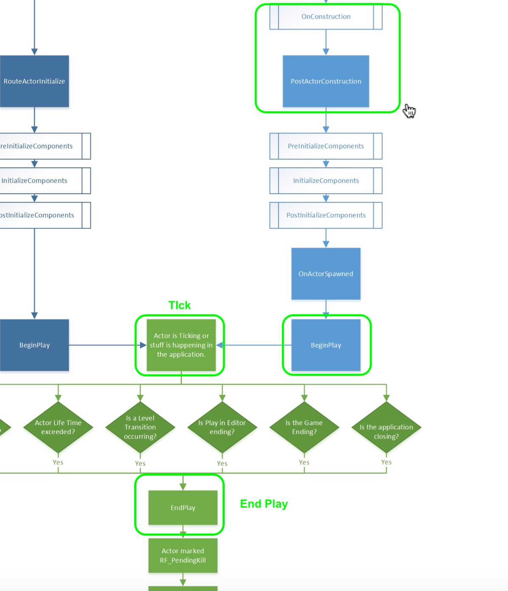  

_____ 



{:start="{{ num }}"}
{{ num }}. Go back to **Card_Actor.h** and delete the destructor `virtual ~ACard_Actor()`.

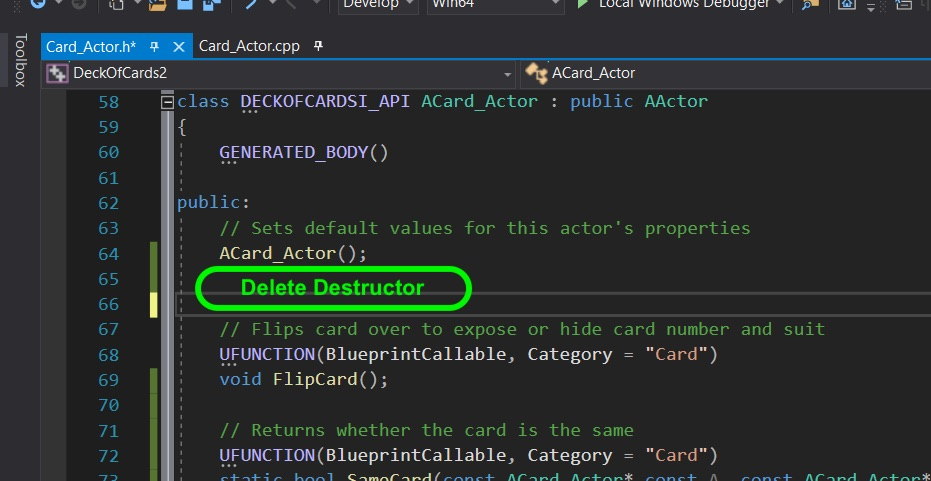  

_____ 



{:start="{{ num }}"}
{{ num }}. Go to **Card_Actor.cpp** and delete the destructor definition.

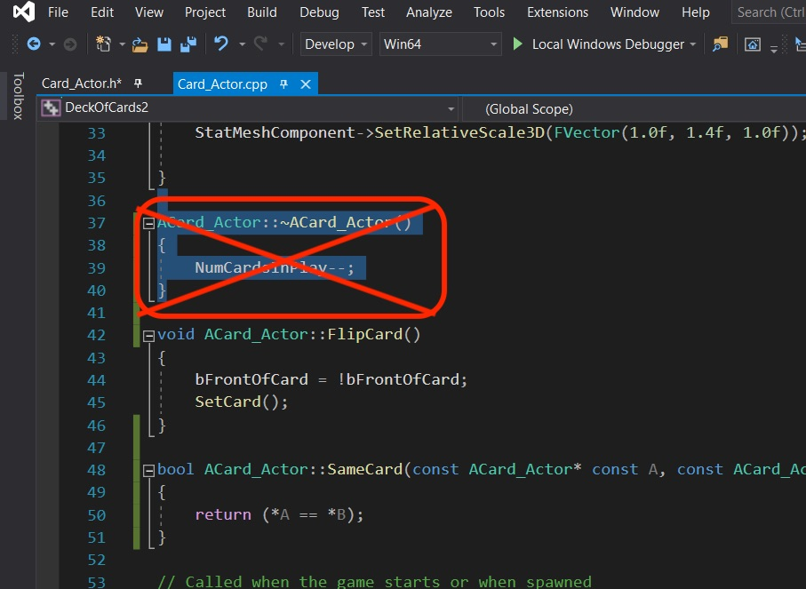  

_____ 



{:start="{{ num }}"}
{{ num }}. Go back to the **Card_Actor.h** and add a protected **End Play** event.

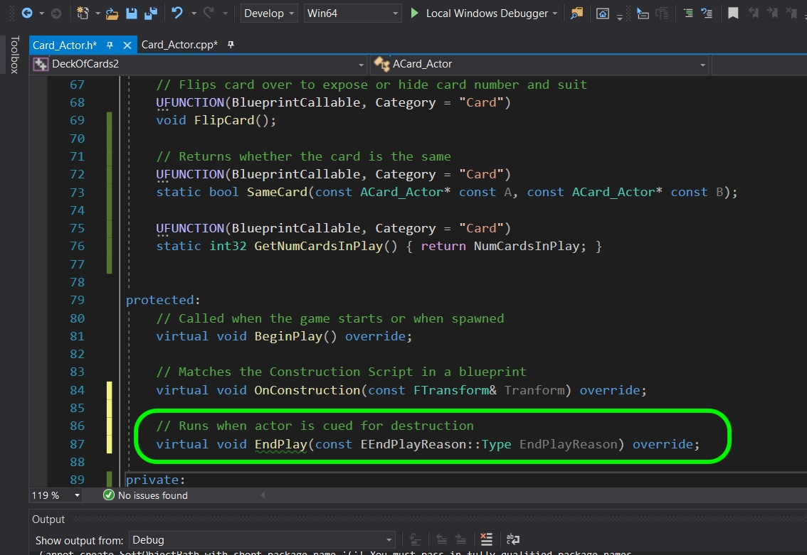  

_____ 



{:start="{{ num }}"}
{{ num }}. Now go to the cpp and define the **End Play** override.  All we do is call the **SUPER** and decrement from `numcardsinplay`.

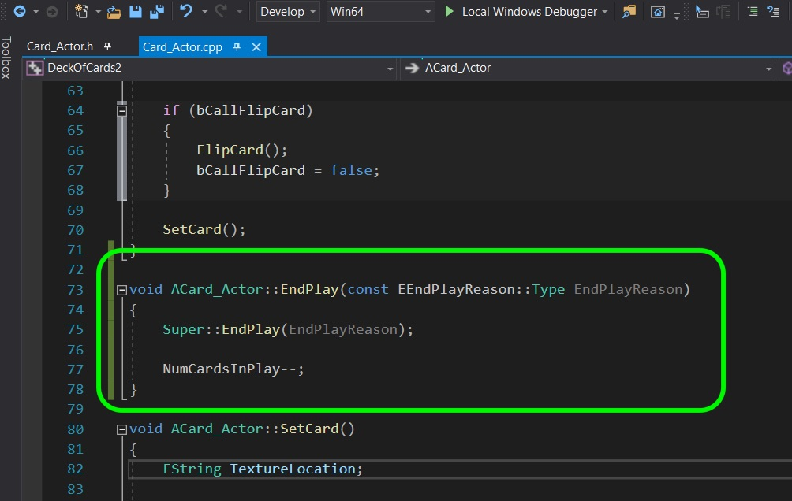  

_____ 



{:start="{{ num }}"}
{{ num }}. Run the game and destroy cards.  Now you will notice that as soon as it disappears from teh game surface the number goes down.  The only remaining issue is that we are having a similar problem with the constructor.  It is not representing the actual number of cards that we have constructed and used in game.  

  

_____ 



{:start="{{ num }}"}
{{ num }}. Go back to **Card_Actor.cpp** and delete the decrement of `NumCardsInPlay`.

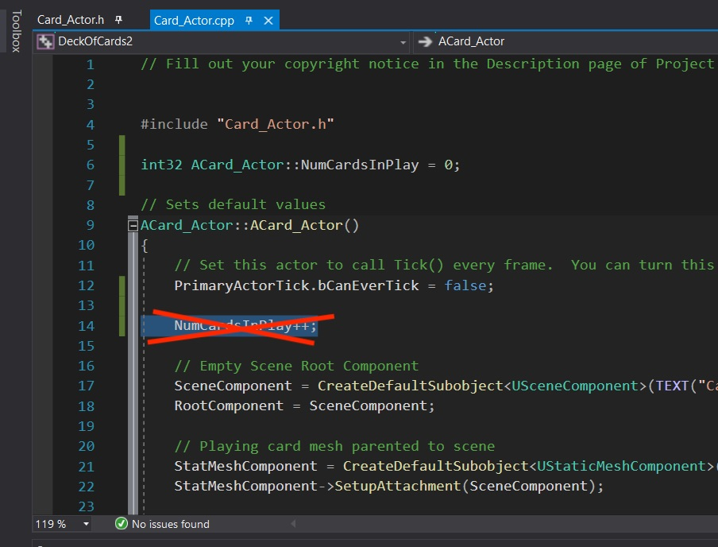  

_____ 



{:start="{{ num }}"}
{{ num }}. Instead move it to **Begin Play**.

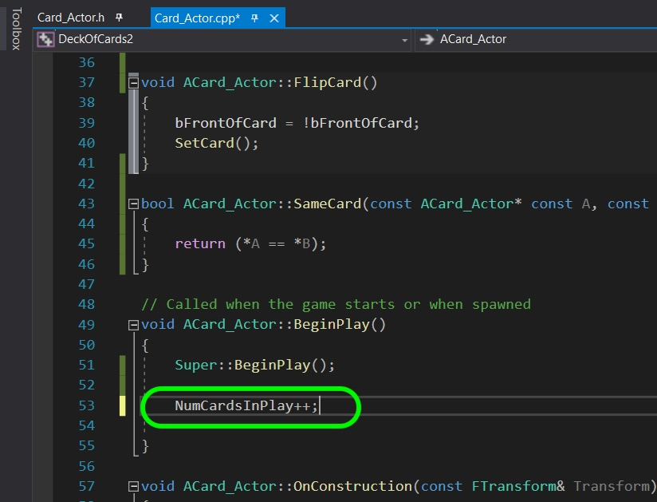  

_____ 



{:start="{{ num }}"}
{{ num }}. Now no matter how much you run the game it will always start with 52 cards which is exaclty what we want! That's it for this walk through - good job.

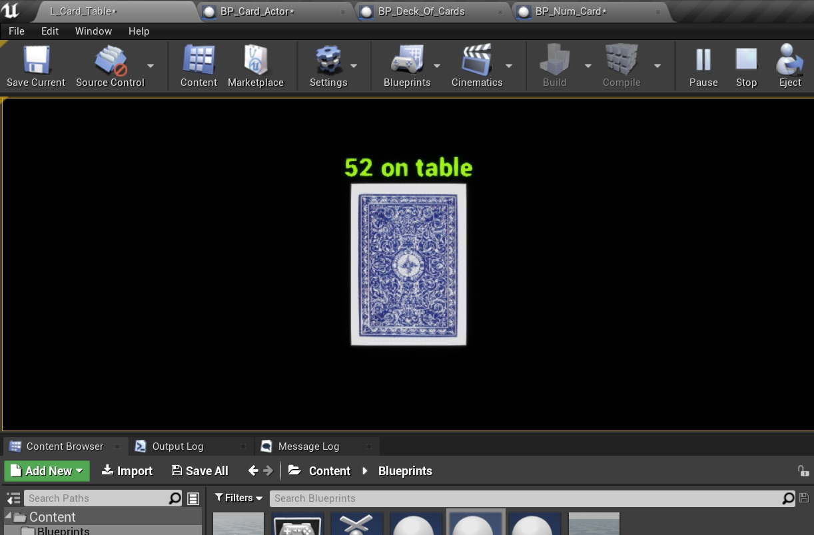  

_____ 

  

[<- Previous](CPP-Cards-II-7.html)&nbsp;&nbsp;&nbsp;[Home](../index.html)&nbsp;&nbsp;&nbsp;
   
   
   

